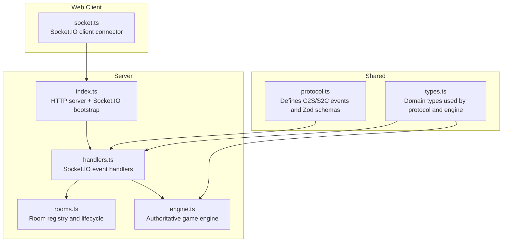
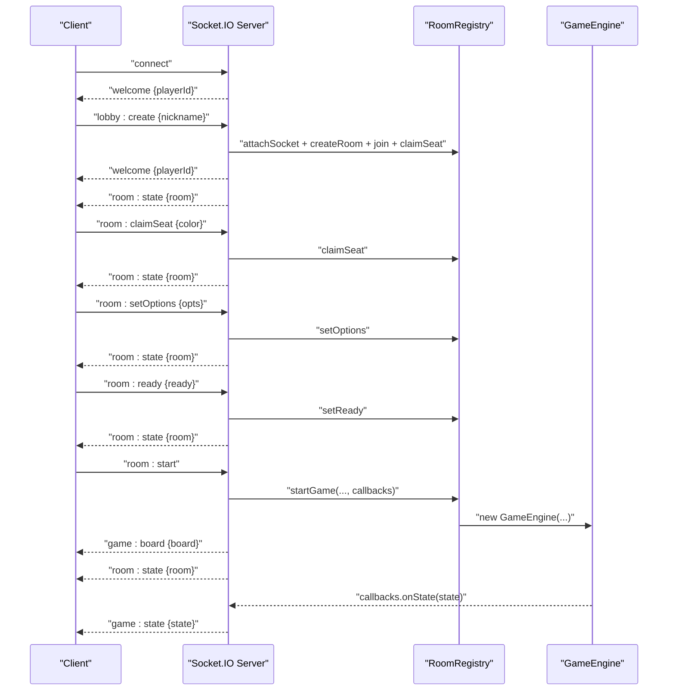
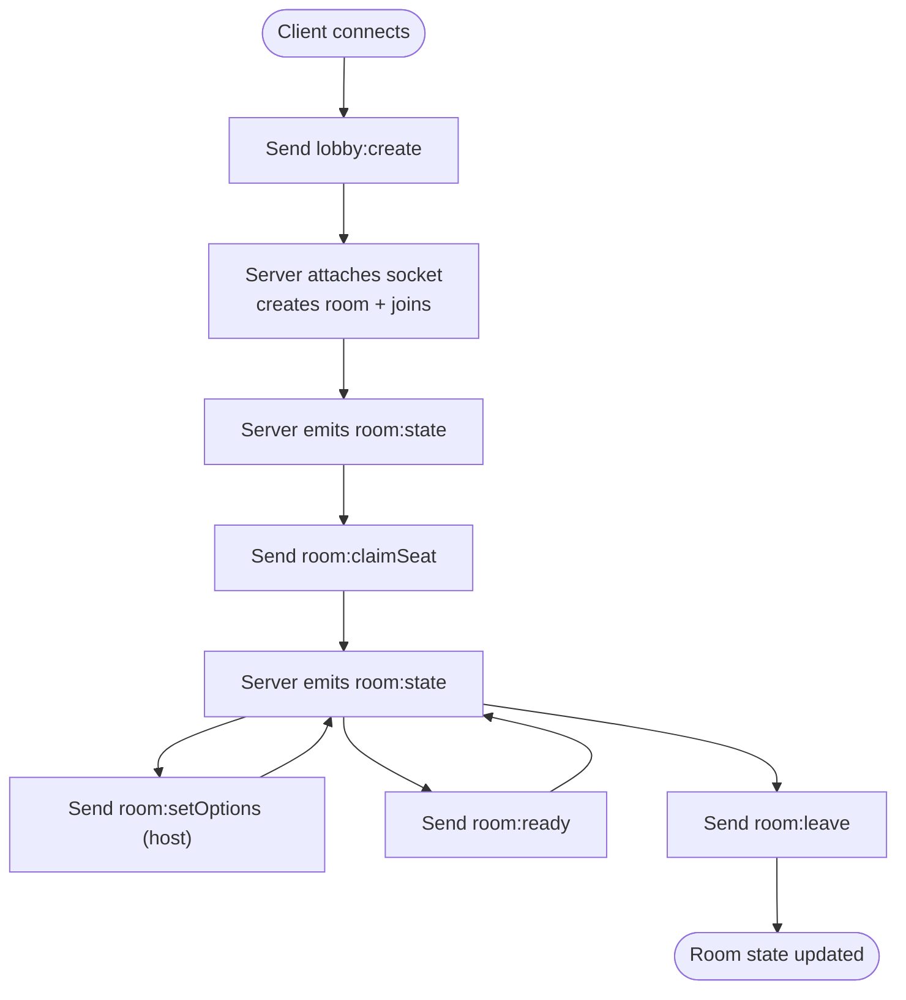
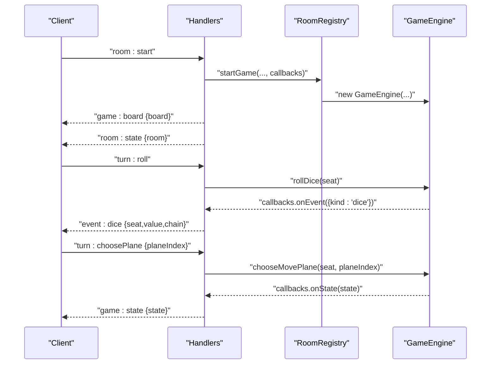
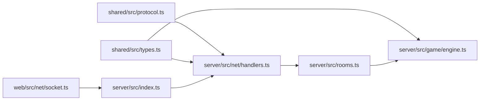

# API Reference

<cite>
**Referenced Files in This Document**
- [protocol.ts](file://shared/src/protocol.ts)
- [types.ts](file://shared/src/types.ts)
- [handlers.ts](file://server/src/net/handlers.ts)
- [rooms.ts](file://server/src/rooms.ts)
- [engine.ts](file://server/src/game/engine.ts)
- [socket.ts](file://web/src/net/socket.ts)
- [index.ts](file://server/src/index.ts)
- [README.md](file://README.md)
</cite>

## Table of Contents
1. [Introduction](#introduction)
2. [Project Structure](#project-structure)
3. [Core Components](#core-components)
4. [Architecture Overview](#architecture-overview)
5. [Detailed Component Analysis](#detailed-component-analysis)
6. [Dependency Analysis](#dependency-analysis)
7. [Performance Considerations](#performance-considerations)
8. [Troubleshooting Guide](#troubleshooting-guide)
9. [Conclusion](#conclusion)
10. [Appendices](#appendices)

## Introduction
This document defines the Socket.IO protocol for 导弹飞行棋 (Air Defense Combat Flying Chess). It covers all WebSocket events, message formats validated by Zod, expected responses, error conditions, and typical client-server interaction sequences. It also documents authentication and authorization patterns, security considerations, and operational guidance for high-concurrency deployments.

## Project Structure
The protocol is defined in a shared package and consumed by both server and client.

**Diagram sources**
- [protocol.ts:1-97](file://shared/src/protocol.ts#L1-L97)
- [types.ts:1-186](file://shared/src/types.ts#L1-L186)
- [handlers.ts:1-230](file://server/src/net/handlers.ts#L1-L230)
- [rooms.ts:1-211](file://server/src/rooms.ts#L1-L211)
- [engine.ts:1-920](file://server/src/game/engine.ts#L1-L920)
- [socket.ts:1-11](file://web/src/net/socket.ts#L1-L11)
- [index.ts:1-95](file://server/src/index.ts#L1-L95)

**Section sources**
- [README.md:1-122](file://README.md#L1-L122)
- [protocol.ts:1-97](file://shared/src/protocol.ts#L1-L97)
- [types.ts:1-186](file://shared/src/types.ts#L1-L186)
- [handlers.ts:1-230](file://server/src/net/handlers.ts#L1-L230)
- [rooms.ts:1-211](file://server/src/rooms.ts#L1-L211)
- [engine.ts:1-920](file://server/src/game/engine.ts#L1-L920)
- [socket.ts:1-11](file://web/src/net/socket.ts#L1-L11)
- [index.ts:1-95](file://server/src/index.ts#L1-L95)

## Core Components
- Protocol definitions and Zod schemas for all C2S and S2C events.
- Room registry managing lobby and game lifecycle.
- Authoritative game engine enforcing turn-based state transitions.
- Socket.IO server binding handlers and broadcasting state.

Key responsibilities:
- Protocol: event names, payload shapes, and validation rules.
- Handlers: parse payloads, enforce authorization, delegate to engine/rooms, emit S2C events.
- Rooms: seat assignment, readiness, options, and room state broadcasting.
- Engine: authoritative state machine, prompts, combat, Q&A, and win conditions.

**Section sources**
- [protocol.ts:4-97](file://shared/src/protocol.ts#L4-L97)
- [handlers.ts:15-230](file://server/src/net/handlers.ts#L15-L230)
- [rooms.ts:39-211](file://server/src/rooms.ts#L39-L211)
- [engine.ts:76-920](file://server/src/game/engine.ts#L76-L920)

## Architecture Overview
High-level flow:
- Clients connect via Socket.IO and receive a welcome with a player ID.
- Clients create/join rooms, claim seats, set options, and toggle ready.
- Host starts the game; server initializes engine and broadcasts board snapshot and state.
- During gameplay, clients send turn actions; server validates and emits state updates and events.

**Diagram sources**
- [handlers.ts:15-90](file://server/src/net/handlers.ts#L15-L90)
- [rooms.ts:78-151](file://server/src/rooms.ts#L78-L151)
- [engine.ts:99-114](file://server/src/game/engine.ts#L99-L114)

## Detailed Component Analysis

### Protocol and Message Formats
All events and payloads are defined in the shared protocol and validated with Zod.

- Client-to-Server (C2S) events:
  - lobby:create { nickname }
  - lobby:join { roomId, nickname }
  - room:leave
  - room:setOptions { takeoffNumbers[], turnTimeoutMs, victory, timeLimitMs?, fillBots }
  - room:ready { ready: boolean }
  - room:claimSeat { color }
  - room:start
  - turn:roll {}
  - turn:chooseTakeoff { planeIndex }
  - turn:choosePlane { planeIndex }
  - card:play { cardId, targetColor?, targetPlaneIndex?, targetRadarIndex? }
  - combat:respond { combatId, choice, data? }
  - qa:answer { questionId, answerIndex }
  - chat:say { message }

- Server-to-Client (S2C) events:
  - welcome { playerId }
  - room:state { room }
  - game:state { state }
  - game:board { board }
  - prompt { kind, seat, ... }
  - event:dice { seat, value, chain }
  - event:cardDrawn { seat, cardType, cardKind? }
  - event:log { line }
  - chat { from, nickname, message, ts }
  - error { code, message }

Validation schemas:
- C2S payloads validated with Zod before processing.
- S2C payloads typed via interfaces exported from the shared package.

Security and privacy:
- Card-drawn details are sent privately to the seat that drew the card; others receive a generic log notice.
- Player identity is attached to sockets; room state excludes sensitive details.

**Section sources**
- [protocol.ts:6-97](file://shared/src/protocol.ts#L6-L97)
- [types.ts:168-186](file://shared/src/types.ts#L168-L186)
- [handlers.ts:19-154](file://server/src/net/handlers.ts#L19-L154)

### Authentication and Authorization
- Authentication: None. The server attaches a player record to the connecting socket and assigns a stable player ID. Subsequent events rely on the socket’s association.
- Authorization:
  - Room options can only be set by the host.
  - Starting the game requires the host and all seated players to be ready (host may bypass readiness).
  - Combat responses and Q&A answers are restricted to the prompted seat.
  - Card plays require ownership of the card in hand and valid targeting.

Operational note:
- The server detaches socket records on disconnect to support reconnection while keeping room state consistent.

**Section sources**
- [rooms.ts:132-151](file://server/src/rooms.ts#L132-L151)
- [engine.ts:435-522](file://server/src/game/engine.ts#L435-L522)
- [handlers.ts:166-174](file://server/src/net/handlers.ts#L166-L174)

### Room Management Events
- Create room:
  - Client sends lobby:create with nickname.
  - Server creates a room, joins the creator, claims red seat, and emits room:state.
- Join room:
  - Client sends lobby:join with roomId and nickname.
  - Server attaches socket, joins room, and emits room:state.
- Claim seat:
  - Client sends room:claimSeat with color; seat is assigned if available.
- Set options:
  - Host sends room:setOptions; validated and applied.
- Toggle ready:
  - Client sends room:ready; toggles seat readiness.
- Leave room:
  - Client sends room:leave; server removes player and emits room:state.

**Diagram sources**
- [handlers.ts:19-52](file://server/src/net/handlers.ts#L19-L52)
- [rooms.ts:106-130](file://server/src/rooms.ts#L106-L130)

**Section sources**
- [handlers.ts:19-63](file://server/src/net/handlers.ts#L19-L63)
- [rooms.ts:106-130](file://server/src/rooms.ts#L106-L130)

### Game Action Events
- Start game:
  - Host sends room:start; server validates readiness and starts engine, emits board and initial state.
- Turn actions:
  - roll: turn:roll initiates a turn; server emits event:dice and sets prompts.
  - chooseTakeoff: selects a hangar plane to take off.
  - choosePlane: selects a plane to move.
- Card play:
  - card:play supports targeting for ARM and cruise; engine enforces legality.
- Combat response:
  - combat:respond resolves pending combat prompts.
- Q&A answer:
  - qa:answer resolves library prompts and applies reward/punishment.
- Chat:
  - chat:say broadcasts chat to the room.

**Diagram sources**
- [handlers.ts:76-96](file://server/src/net/handlers.ts#L76-L96)
- [engine.ts:207-255](file://server/src/game/engine.ts#L207-L255)
- [engine.ts:275-297](file://server/src/game/engine.ts#L275-L297)

**Section sources**
- [handlers.ts:91-142](file://server/src/net/handlers.ts#L91-L142)
- [engine.ts:207-297](file://server/src/game/engine.ts#L207-L297)

### State Synchronization Messages
- game:state: authoritative snapshot emitted after every state change.
- room:state: room-wide state broadcast after room mutations.
- game:board: board snapshot emitted once at game start.
- event:dice, event:cardDrawn, event:log: ephemeral notifications.
- prompt: indicates the current prompt the engine expects.

Privacy:
- event:cardDrawn delivers concrete card details only to the seat that drew it; others receive a generic log.

**Section sources**
- [handlers.ts:191-225](file://server/src/net/handlers.ts#L191-L225)
- [engine.ts:175-178](file://server/src/game/engine.ts#L175-L178)

### Error Conditions and Responses
- BAD_PAYLOAD: Client sent malformed payload; server responds with error { code, message }.
- NO_PLAYER / NO_ROOM: Client not associated with a player or room not found.
- CANT_START: Start conditions not met (too few players or not all ready).
- Engine errors: logged and committed; client receives latest state snapshot reflecting the error.

**Section sources**
- [handlers.ts:227-229](file://server/src/net/handlers.ts#L227-L229)
- [rooms.ts:140-151](file://server/src/rooms.ts#L140-L151)
- [engine.ts:915-918](file://server/src/game/engine.ts#L915-L918)

### Practical Examples and Debugging
- Typical lobby flow:
  - Create room, claim seat, set options, ready up, start game.
- Typical turn flow:
  - roll → chooseTakeoff or choosePlane → resolve events → next turn.
- Debugging tips:
  - Observe game:state snapshots to confirm expected transitions.
  - Use event:log entries to trace decisions and outcomes.
  - Verify prompt kinds to ensure client is responding to the correct prompt.

**Section sources**
- [handlers.ts:19-90](file://server/src/net/handlers.ts#L19-L90)
- [engine.ts:170-178](file://server/src/game/engine.ts#L170-L178)

## Dependency Analysis

**Diagram sources**
- [protocol.ts:1-97](file://shared/src/protocol.ts#L1-L97)
- [types.ts:1-186](file://shared/src/types.ts#L1-L186)
- [handlers.ts:1-230](file://server/src/net/handlers.ts#L1-L230)
- [rooms.ts:1-211](file://server/src/rooms.ts#L1-L211)
- [engine.ts:1-920](file://server/src/game/engine.ts#L1-L920)
- [index.ts:1-95](file://server/src/index.ts#L1-L95)
- [socket.ts:1-11](file://web/src/net/socket.ts#L1-L11)

**Section sources**
- [protocol.ts:1-97](file://shared/src/protocol.ts#L1-L97)
- [handlers.ts:1-230](file://server/src/net/handlers.ts#L1-L230)
- [rooms.ts:1-211](file://server/src/rooms.ts#L1-L211)
- [engine.ts:1-920](file://server/src/game/engine.ts#L1-L920)
- [index.ts:1-95](file://server/src/index.ts#L1-L95)
- [socket.ts:1-11](file://web/src/net/socket.ts#L1-L11)

## Performance Considerations
- Connection handling:
  - The server uses CORS with wildcard origin and supports WebSocket and polling transports.
- Rate limiting:
  - No explicit rate limiting is implemented in the server code. Consider adding per-socket or per-room rate limits for frequent actions (e.g., chat, ready toggles).
- Concurrency:
  - The authoritative engine serializes state transitions; ensure clients debounce rapid actions to avoid redundant requests.
- Memory:
  - Room garbage collection occurs when rooms are empty and not in-game.
- Network:
  - Use structuredClone for state snapshots to avoid mutation leaks.
- Recommendations:
  - Add middleware to cap message sizes and throttle chat.
  - Consider sticky sessions for horizontal scaling if moving beyond a single process.

**Section sources**
- [index.ts:82-84](file://server/src/index.ts#L82-L84)
- [rooms.ts:165-169](file://server/src/rooms.ts#L165-L169)
- [engine.ts:175-178](file://server/src/game/engine.ts#L175-L178)

## Troubleshooting Guide
- Client does not receive room:state:
  - Ensure the client joined a room and the socket is in the room namespace.
- Start game fails:
  - Verify host and seated players meet readiness criteria.
- Turn actions rejected:
  - Confirm the client is acting in the correct phase and seat.
- Card-play errors:
  - Ensure the card exists in hand and targeting is valid.
- Disconnections:
  - On disconnect, the server keeps the player record and updates room state for connection indicators.

**Section sources**
- [handlers.ts:156-174](file://server/src/net/handlers.ts#L156-L174)
- [rooms.ts:140-151](file://server/src/rooms.ts#L140-L151)
- [engine.ts:721-760](file://server/src/game/engine.ts#L721-L760)

## Conclusion
The 导弹飞行棋 Socket.IO protocol provides a clear, Zod-validated contract for client-server communication. With authoritative state management, privacy-aware event delivery, and a robust room lifecycle, it supports scalable multiplayer gameplay. For production deployments, consider adding rate limiting and transport tuning to optimize throughput under load.

## Appendices

### Event Catalog

- C2S: lobby:create
  - Payload: { nickname: string }
  - Expected S2C: welcome, room:state
  - Errors: BAD_PAYLOAD

- C2S: lobby:join
  - Payload: { roomId: string, nickname: string }
  - Expected S2C: welcome, room:state
  - Errors: BAD_PAYLOAD, NO_ROOM

- C2S: room:leave
  - Payload: none
  - Expected S2C: room:state
  - Errors: none (best-effort)

- C2S: room:setOptions
  - Payload: { takeoffNumbers[], turnTimeoutMs, victory, timeLimitMs?, fillBots }
  - Expected S2C: room:state
  - Errors: BAD_PAYLOAD, NO_ROOM

- C2S: room:ready
  - Payload: { ready: boolean }
  - Expected S2C: room:state
  - Errors: none

- C2S: room:claimSeat
  - Payload: { color: enum }
  - Expected S2C: room:state
  - Errors: BAD_PAYLOAD, NO_ROOM

- C2S: room:start
  - Payload: none
  - Expected S2C: game:board, room:state, game:state
  - Errors: CANT_START

- C2S: turn:roll
  - Payload: {}
  - Expected S2C: event:dice, game:state
  - Errors: none

- C2S: turn:chooseTakeoff
  - Payload: { planeIndex: number }
  - Expected S2C: game:state
  - Errors: none

- C2S: turn:choosePlane
  - Payload: { planeIndex: number }
  - Expected S2C: game:state
  - Errors: none

- C2S: card:play
  - Payload: { cardId: string, targetColor?, targetPlaneIndex?, targetRadarIndex? }
  - Expected S2C: game:state
  - Errors: none

- C2S: combat:respond
  - Payload: { combatId: string, choice: string, data? }
  - Expected S2C: game:state
  - Errors: none

- C2S: qa:answer
  - Payload: { questionId: string, answerIndex: number }
  - Expected S2C: game:state
  - Errors: none

- C2S: chat:say
  - Payload: { message: string }
  - Expected S2C: chat
  - Errors: BAD_PAYLOAD

- S2C: welcome
  - Payload: { playerId: string }

- S2C: room:state
  - Payload: { room: RoomPublic | null }

- S2C: game:state
  - Payload: { state: GameState | null }

- S2C: game:board
  - Payload: { board: BoardSnapshot }

- S2C: prompt
  - Payload: union of prompt variants

- S2C: event:dice
  - Payload: { seat, value, chain }

- S2C: event:cardDrawn
  - Payload: { seat, cardType, cardKind? }

- S2C: event:log
  - Payload: { line }

- S2C: chat
  - Payload: { from, nickname, message, ts }

- S2C: error
  - Payload: { code, message }

**Section sources**
- [protocol.ts:6-97](file://shared/src/protocol.ts#L6-L97)
- [types.ts:168-186](file://shared/src/types.ts#L168-L186)
- [handlers.ts:19-154](file://server/src/net/handlers.ts#L19-L154)