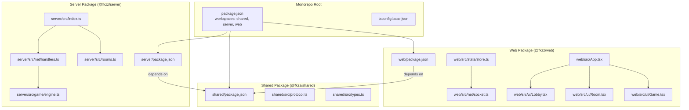
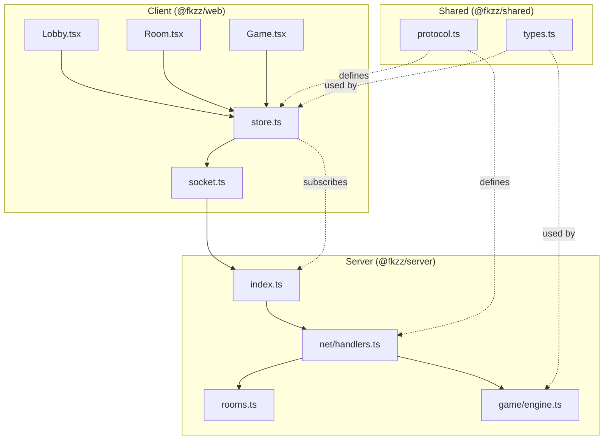
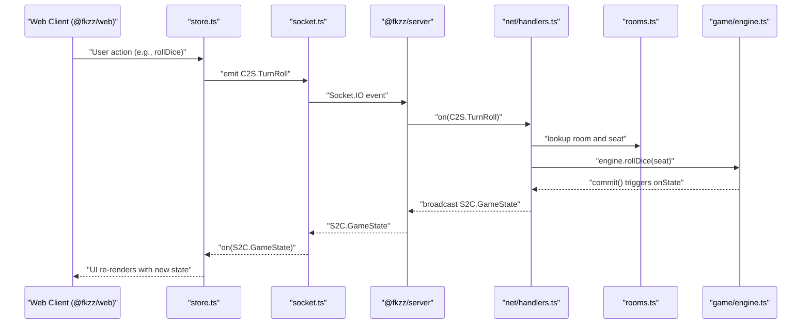
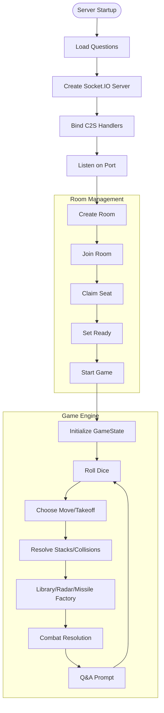
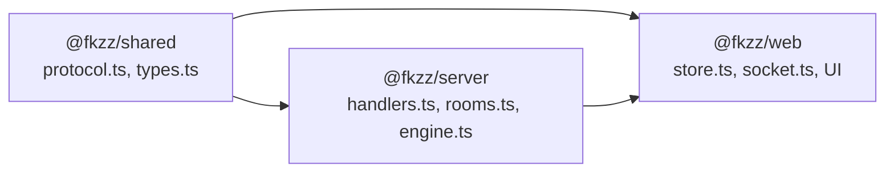
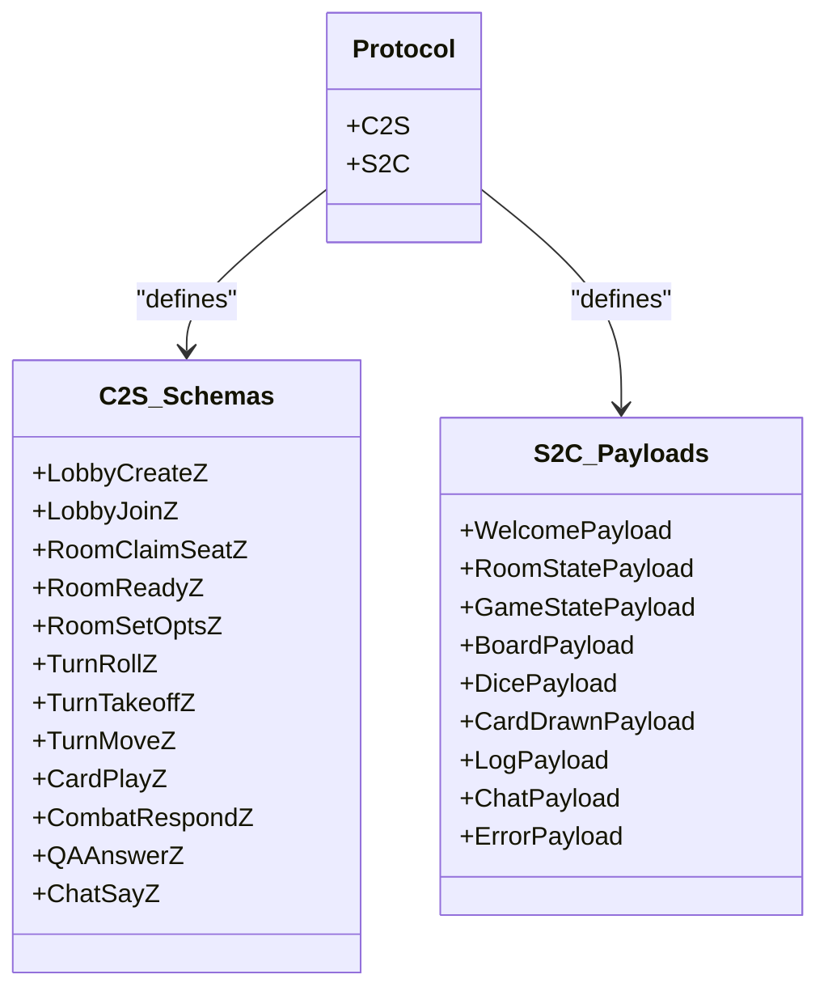
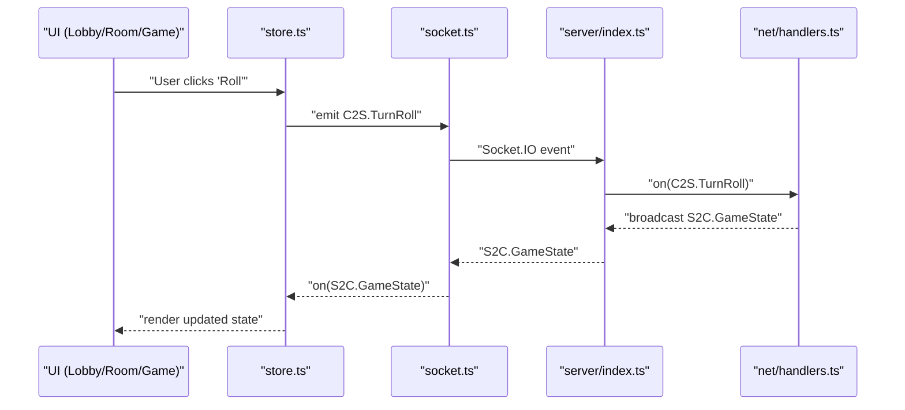
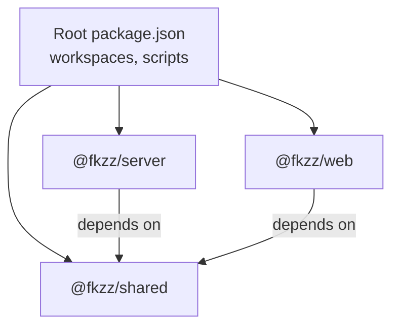

# Architecture Overview

<cite>
**Referenced Files in This Document**
- [README.md](file://README.md)
- [package.json](file://package.json)
- [tsconfig.base.json](file://tsconfig.base.json)
- [shared/src/protocol.ts](file://shared/src/protocol.ts)
- [shared/src/types.ts](file://shared/src/types.ts)
- [server/src/index.ts](file://server/src/index.ts)
- [server/src/net/handlers.ts](file://server/src/net/handlers.ts)
- [server/src/rooms.ts](file://server/src/rooms.ts)
- [server/src/game/engine.ts](file://server/src/game/engine.ts)
- [web/src/net/socket.ts](file://web/src/net/socket.ts)
- [web/src/state/store.ts](file://web/src/state/store.ts)
- [web/src/App.tsx](file://web/src/App.tsx)
- [web/src/ui/Lobby.tsx](file://web/src/ui/Lobby.tsx)
- [web/src/ui/Room.tsx](file://web/src/ui/Room.tsx)
- [web/src/ui/Game.tsx](file://web/src/ui/Game.tsx)
- [shared/package.json](file://shared/package.json)
- [server/package.json](file://server/package.json)
- [web/package.json](file://web/package.json)
</cite>

## Table of Contents
1. [Introduction](#introduction)
2. [Project Structure](#project-structure)
3. [Core Components](#core-components)
4. [Architecture Overview](#architecture-overview)
5. [Detailed Component Analysis](#detailed-component-analysis)
6. [Dependency Analysis](#dependency-analysis)
7. [Performance Considerations](#performance-considerations)
8. [Troubleshooting Guide](#troubleshooting-guide)
9. [Conclusion](#conclusion)

## Introduction
This document describes the architecture of the 导弹飞行棋 (Air Defense Combat Flying Chess) system. It explains how the React web client communicates with the Node.js Socket.IO server, how the authoritative server enforces game rules, and how the shared TypeScript protocol layer ensures type-safe, maintainable communication across packages. The system follows a monorepo layout with three packages: @fkzz/shared (protocol and types), @fkzz/server (Socket.IO server and game engine), and @fkzz/web (React client).

## Project Structure
The repository is organized as a monorepo with workspaces for shared, server, and web packages. The shared package defines the protocol constants and domain types used by both client and server. The server hosts the Socket.IO server, manages rooms, and runs the authoritative game engine. The web package is a React application that connects to the server via Socket.IO and renders the UI.

**Diagram sources**
- [package.json:1-17](file://package.json#L1-L17)
- [tsconfig.base.json:1-17](file://tsconfig.base.json#L1-L17)
- [shared/package.json:1-24](file://shared/package.json#L1-L24)
- [server/package.json:1-23](file://server/package.json#L1-L23)
- [web/package.json:1-27](file://web/package.json#L1-L27)
- [server/src/index.ts:1-95](file://server/src/index.ts#L1-L95)
- [server/src/rooms.ts:1-211](file://server/src/rooms.ts#L1-L211)
- [server/src/net/handlers.ts:1-230](file://server/src/net/handlers.ts#L1-L230)
- [server/src/game/engine.ts:1-800](file://server/src/game/engine.ts#L1-L800)
- [shared/src/protocol.ts:1-97](file://shared/src/protocol.ts#L1-L97)
- [shared/src/types.ts:1-186](file://shared/src/types.ts#L1-L186)
- [web/src/net/socket.ts:1-11](file://web/src/net/socket.ts#L1-L11)
- [web/src/state/store.ts:1-164](file://web/src/state/store.ts#L1-L164)
- [web/src/App.tsx:1-19](file://web/src/App.tsx#L1-L19)
- [web/src/ui/Lobby.tsx:1-44](file://web/src/ui/Lobby.tsx#L1-L44)
- [web/src/ui/Room.tsx:1-62](file://web/src/ui/Room.tsx#L1-L62)
- [web/src/ui/Game.tsx:1-34](file://web/src/ui/Game.tsx#L1-L34)

**Section sources**
- [package.json:1-17](file://package.json#L1-L17)
- [tsconfig.base.json:1-17](file://tsconfig.base.json#L1-L17)

## Core Components
- Shared Protocol and Types (@fkzz/shared):
  - Defines the canonical Socket.IO event names (C2S/S2C) and Zod schemas for payload validation.
  - Provides domain types (GameState, BoardSnapshot, PlayerPublic, etc.) used by both client and server.
- Server (@fkzz/server):
  - Socket.IO server entrypoint serving static assets in production and handling real-time events.
  - RoomRegistry managing lobbies and per-room state.
  - Event handlers binding C2S messages to authoritative GameEngine operations.
  - GameEngine implementing turn-based rules, combat, card mechanics, and prompts.
- Web Client (@fkzz/web):
  - Socket.IO client wrapper for connection management.
  - Zustand store subscribing to S2C events and emitting C2S actions.
  - UI components rendering lobby, room, and game screens, driven by shared types.

**Section sources**
- [shared/src/protocol.ts:1-97](file://shared/src/protocol.ts#L1-L97)
- [shared/src/types.ts:1-186](file://shared/src/types.ts#L1-L186)
- [server/src/index.ts:1-95](file://server/src/index.ts#L1-L95)
- [server/src/rooms.ts:1-211](file://server/src/rooms.ts#L1-L211)
- [server/src/net/handlers.ts:1-230](file://server/src/net/handlers.ts#L1-L230)
- [server/src/game/engine.ts:1-800](file://server/src/game/engine.ts#L1-L800)
- [web/src/net/socket.ts:1-11](file://web/src/net/socket.ts#L1-L11)
- [web/src/state/store.ts:1-164](file://web/src/state/store.ts#L1-L164)

## Architecture Overview
The system uses a classic authoritative server model:
- Clients connect via Socket.IO and receive periodic state updates (S2C).
- Clients send intent events (C2S) such as rolling dice, moving planes, playing cards, and responding to prompts.
- The server validates inputs using Zod schemas, executes authoritative game logic, and emits normalized state and event payloads.
- The React client renders the UI and remains synchronized to the server’s authoritative state.

**Diagram sources**
- [web/src/ui/Lobby.tsx:1-44](file://web/src/ui/Lobby.tsx#L1-L44)
- [web/src/ui/Room.tsx:1-62](file://web/src/ui/Room.tsx#L1-L62)
- [web/src/ui/Game.tsx:1-34](file://web/src/ui/Game.tsx#L1-L34)
- [web/src/state/store.ts:1-164](file://web/src/state/store.ts#L1-L164)
- [web/src/net/socket.ts:1-11](file://web/src/net/socket.ts#L1-L11)
- [server/src/index.ts:1-95](file://server/src/index.ts#L1-L95)
- [server/src/rooms.ts:1-211](file://server/src/rooms.ts#L1-L211)
- [server/src/net/handlers.ts:1-230](file://server/src/net/handlers.ts#L1-L230)
- [server/src/game/engine.ts:1-800](file://server/src/game/engine.ts#L1-L800)
- [shared/src/protocol.ts:1-97](file://shared/src/protocol.ts#L1-L97)
- [shared/src/types.ts:1-186](file://shared/src/types.ts#L1-L186)

## Detailed Component Analysis

### Real-Time Communication Pattern (Socket.IO)
- Event Names and Payloads:
  - Client-to-server (C2S) events include lobby actions, room options/ready/claim/start, turn actions (roll, takeoff, move), card play, combat response, QA answer, and chat.
  - Server-to-client (S2C) events include welcome, room state, game state, board snapshot, dice/card drawn/log, chat, and errors.
- Validation:
  - Handlers parse and validate payloads using Zod schemas before invoking server logic.
- Delivery:
  - Room-wide broadcasts use Socket.IO rooms; targeted events (e.g., card drawn) are sent only to the affected seat.

**Diagram sources**
- [server/src/net/handlers.ts:91-96](file://server/src/net/handlers.ts#L91-L96)
- [server/src/game/engine.ts:207-255](file://server/src/game/engine.ts#L207-L255)
- [web/src/state/store.ts:124-126](file://web/src/state/store.ts#L124-L126)

**Section sources**
- [shared/src/protocol.ts:4-21](file://shared/src/protocol.ts#L4-L21)
- [shared/src/protocol.ts:67-82](file://shared/src/protocol.ts#L67-L82)
- [server/src/net/handlers.ts:19-29](file://server/src/net/handlers.ts#L19-L29)
- [server/src/net/handlers.ts:91-96](file://server/src/net/handlers.ts#L91-L96)
- [web/src/state/store.ts:124-126](file://web/src/state/store.ts#L124-L126)

### Authoritative Server Architecture
- Room Lifecycle:
  - RoomRegistry tracks players, seats, and game engines. It supports creation, joining, claiming seats, readiness, and starting games.
- Game Engine:
  - Implements turn progression, dice rolling, takeoff/move logic, collisions, special cells (missile factory, radar factory, library), card mechanics, combat resolution, and Q&A prompts.
  - Emits callbacks for state snapshots and events to the network layer.
- Event Handlers:
  - Bind C2S intents to engine operations, enforce turn/phasing constraints, and broadcast normalized S2C updates.

**Diagram sources**
- [server/src/index.ts:18-94](file://server/src/index.ts#L18-L94)
- [server/src/rooms.ts:78-151](file://server/src/rooms.ts#L78-L151)
- [server/src/game/engine.ts:122-148](file://server/src/game/engine.ts#L122-L148)
- [server/src/game/engine.ts:207-255](file://server/src/game/engine.ts#L207-L255)
- [server/src/game/engine.ts:275-343](file://server/src/game/engine.ts#L275-L343)
- [server/src/game/engine.ts:531-566](file://server/src/game/engine.ts#L531-L566)
- [server/src/game/engine.ts:416-528](file://server/src/game/engine.ts#L416-L528)
- [server/src/game/engine.ts:568-584](file://server/src/game/engine.ts#L568-L584)

**Section sources**
- [server/src/rooms.ts:1-211](file://server/src/rooms.ts#L1-L211)
- [server/src/game/engine.ts:1-800](file://server/src/game/engine.ts#L1-L800)

### Monorepo Structure and Separation of Concerns
- @fkzz/shared:
  - Houses protocol constants (C2S/S2C) and Zod schemas for payload validation.
  - Provides shared domain types (GameState, BoardSnapshot, PlayerPublic, etc.) ensuring type consistency across packages.
- @fkzz/server:
  - Contains Socket.IO server bootstrap, room management, and event handlers.
  - Owns the authoritative GameEngine and delegates network callbacks to emit S2C events.
- @fkzz/web:
  - Implements the React UI, Zustand store for state, and Socket.IO client wrapper.
  - Uses shared types and protocol constants to remain decoupled from server internals.

**Diagram sources**
- [shared/src/protocol.ts:1-97](file://shared/src/protocol.ts#L1-L97)
- [shared/src/types.ts:1-186](file://shared/src/types.ts#L1-L186)
- [server/src/net/handlers.ts:1-230](file://server/src/net/handlers.ts#L1-L230)
- [server/src/rooms.ts:1-211](file://server/src/rooms.ts#L1-L211)
- [server/src/game/engine.ts:1-800](file://server/src/game/engine.ts#L1-L800)
- [web/src/state/store.ts:1-164](file://web/src/state/store.ts#L1-L164)
- [web/src/net/socket.ts:1-11](file://web/src/net/socket.ts#L1-L11)

**Section sources**
- [shared/package.json:1-24](file://shared/package.json#L1-L24)
- [server/package.json:1-23](file://server/package.json#L1-L23)
- [web/package.json:1-27](file://web/package.json#L1-L27)

### Type-Safe Protocol Layer
- Event Names and Payloads:
  - C2S and S2C event name enums ensure consistent event identifiers across client and server.
  - Zod schemas define strict payload shapes validated in handlers and emitted by the store.
- Benefits:
  - Compile-time safety for event names and payload structures.
  - Clear separation between intent (C2S) and notifications (S2C).
  - Easier refactoring and reduced runtime errors.

**Diagram sources**
- [shared/src/protocol.ts:4-21](file://shared/src/protocol.ts#L4-L21)
- [shared/src/protocol.ts:25-65](file://shared/src/protocol.ts#L25-L65)
- [shared/src/protocol.ts:67-97](file://shared/src/protocol.ts#L67-L97)

**Section sources**
- [shared/src/protocol.ts:1-97](file://shared/src/protocol.ts#L1-L97)

### Client-Server Data Flows
- Connection and Navigation:
  - The client initializes a Socket.IO connection and listens for S2C events to update UI screens (lobby, room, game).
- Actions and Responses:
  - The store emits C2S events for user actions and updates local state upon receiving S2C responses.
- Example: Rolling the dice
  - The client emits C2S.TurnRoll.
  - The server validates, advances the engine, and emits S2C.GameState and S2C.EventDice.
  - The client updates the UI accordingly.

**Diagram sources**
- [web/src/state/store.ts:124-126](file://web/src/state/store.ts#L124-L126)
- [server/src/net/handlers.ts:91-96](file://server/src/net/handlers.ts#L91-L96)
- [server/src/index.ts:92-94](file://server/src/index.ts#L92-L94)

**Section sources**
- [web/src/state/store.ts:63-87](file://web/src/state/store.ts#L63-L87)
- [web/src/net/socket.ts:5-10](file://web/src/net/socket.ts#L5-L10)
- [server/src/net/handlers.ts:15-29](file://server/src/net/handlers.ts#L15-L29)

## Dependency Analysis
- Internal Dependencies:
  - @fkzz/server depends on @fkzz/shared for protocol and types.
  - @fkzz/web depends on @fkzz/shared for protocol and types.
- External Dependencies:
  - Socket.IO (server and client), Zod (validation), nanoid (IDs), Zustand (state), React (UI).
- Build and Dev Scripts:
  - Root package orchestrates concurrent dev servers and builds for all packages.

**Diagram sources**
- [package.json:6-10](file://package.json#L6-L10)
- [shared/package.json:12-12](file://shared/package.json#L12-L12)
- [server/package.json:11-15](file://server/package.json#L11-L15)
- [web/package.json:11-17](file://web/package.json#L11-L17)

**Section sources**
- [package.json:1-17](file://package.json#L1-L17)
- [server/package.json:1-23](file://server/package.json#L1-L23)
- [web/package.json:1-27](file://web/package.json#L1-L27)
- [shared/package.json:1-24](file://shared/package.json#L1-L24)

## Performance Considerations
- Network Efficiency:
  - Use targeted S2C.EventCard delivery to the affected seat to minimize payload size.
  - Batch UI updates in the store to reduce re-renders.
- Server Scalability:
  - Keep per-room state in memory; consider persistence and scaling strategies if extending to multiple processes.
- Client Responsiveness:
  - Debounce or throttle frequent UI interactions (e.g., chat) before emitting C2S events.
- Validation Overhead:
  - Zod parsing occurs on every C2S event; ensure payloads remain compact and avoid unnecessary nested structures.

## Troubleshooting Guide
- Common Issues:
  - Bad Payload: Server responds with S2C.Error containing code and message; check Zod schema mismatches.
  - Not Your Turn: Engine returns errors for out-of-turn actions; ensure UI disables controls when not the local seat’s turn.
  - No Active Game: Handlers ignore actions when no engine exists; ensure the room has started.
- Diagnostics:
  - Inspect lastError in the store and server logs for validation failures.
  - Verify room state transitions (lobby → room → game) align with S2C.RoomState and S2C.GameState.

**Section sources**
- [server/src/net/handlers.ts:227-229](file://server/src/net/handlers.ts#L227-L229)
- [server/src/game/engine.ts:207-209](file://server/src/game/engine.ts#L207-L209)
- [web/src/state/store.ts:87-87](file://web/src/state/store.ts#L87-L87)

## Conclusion
The 导弹飞行棋 system cleanly separates concerns across a shared protocol layer, an authoritative server, and a React client. Socket.IO enables real-time, bidirectional communication with strong typing enforced by Zod schemas. The monorepo structure promotes reuse and maintainability while keeping the client and server tightly coupled through shared types and protocol definitions.