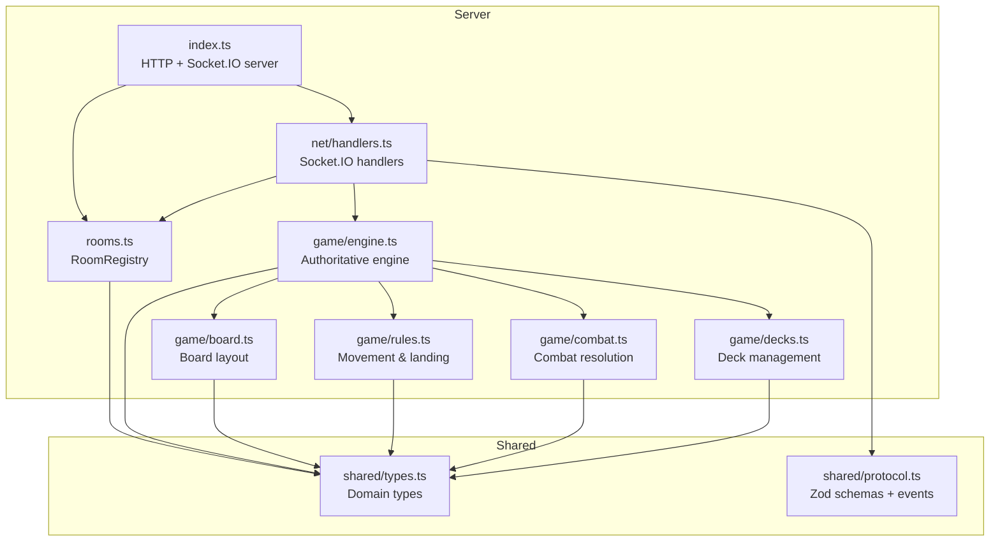
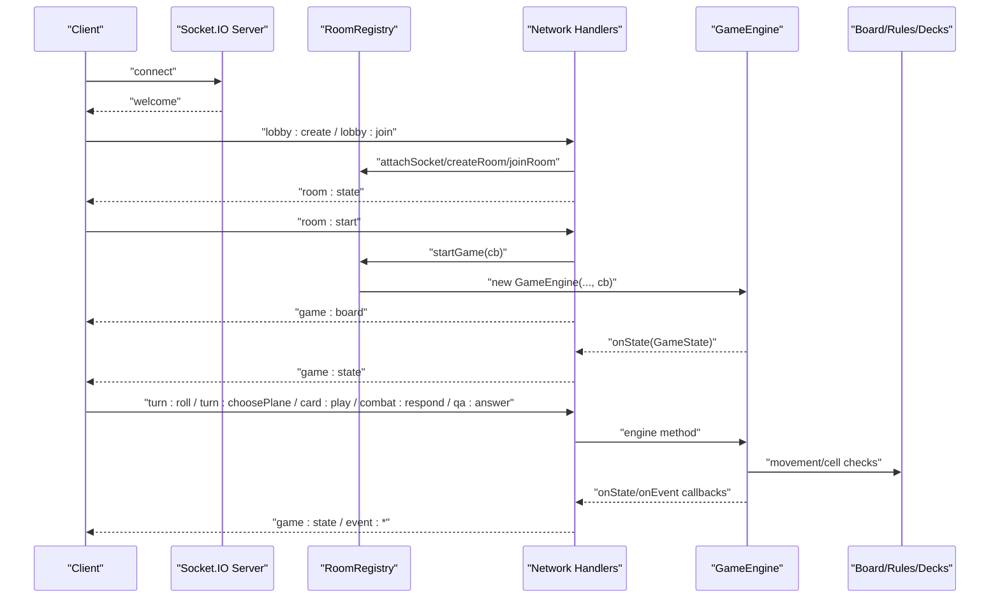
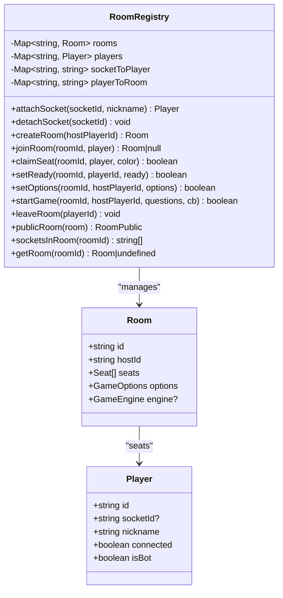
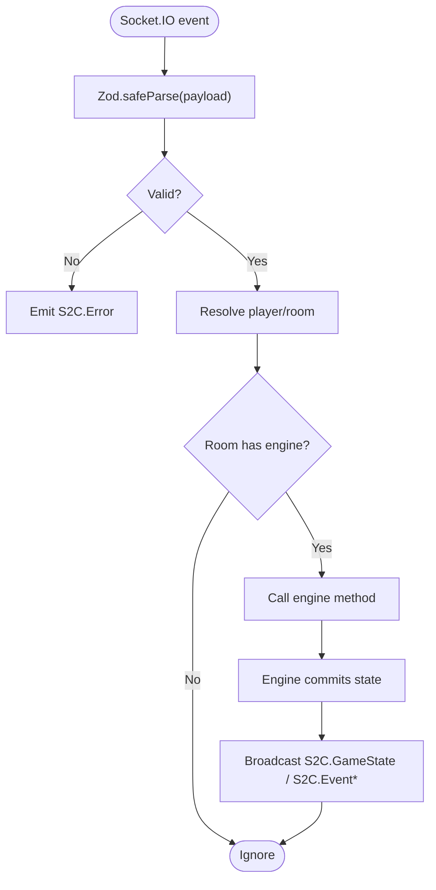
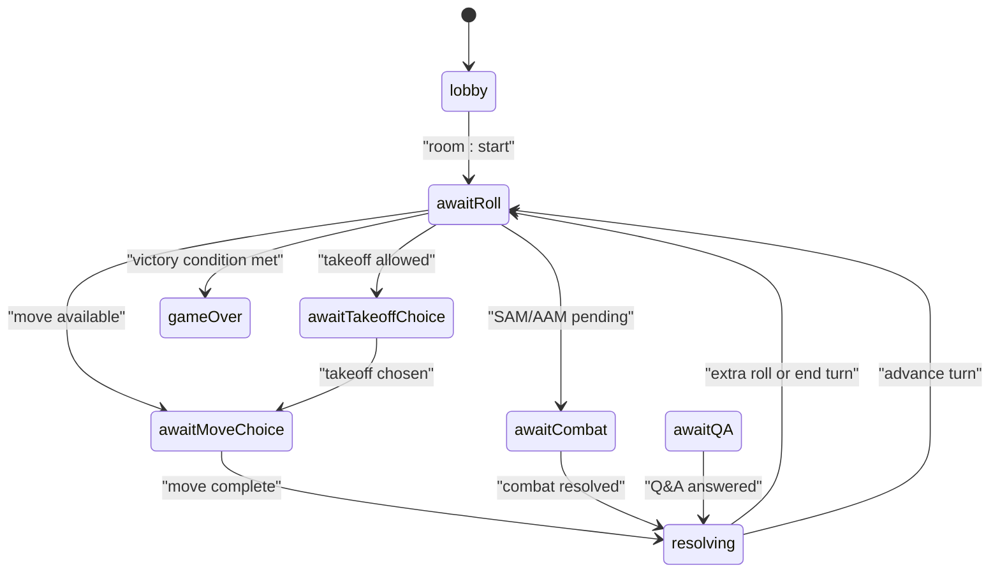
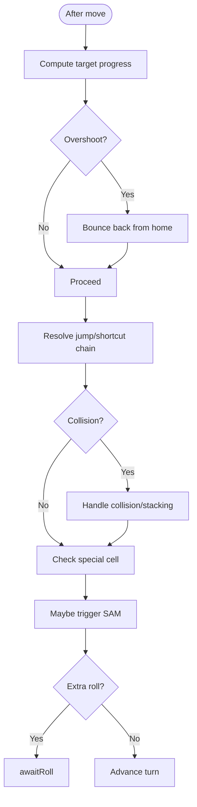
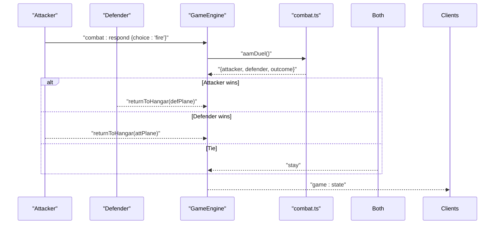
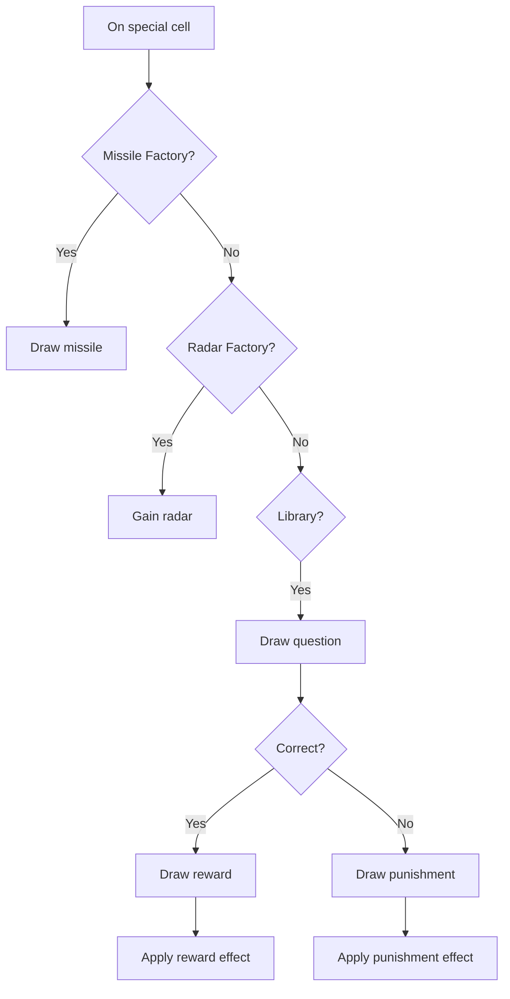
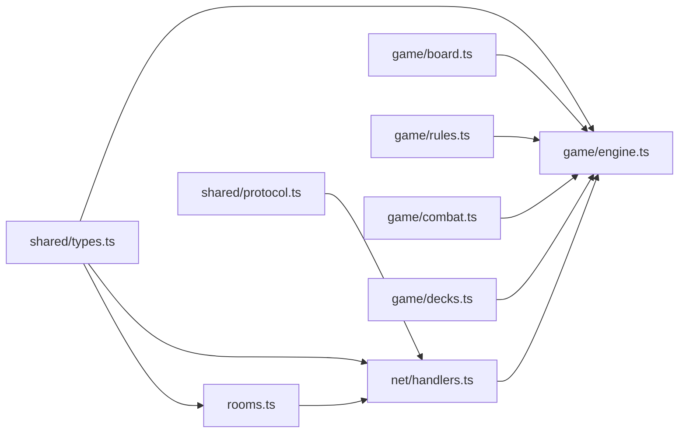

# Backend System

<cite>
**Referenced Files in This Document**
- [index.ts](file://server/src/index.ts)
- [rooms.ts](file://server/src/rooms.ts)
- [handlers.ts](file://server/src/net/handlers.ts)
- [engine.ts](file://server/src/game/engine.ts)
- [board.ts](file://server/src/game/board.ts)
- [rules.ts](file://server/src/game/rules.ts)
- [combat.ts](file://server/src/game/combat.ts)
- [decks.ts](file://server/src/game/decks.ts)
- [types.ts](file://shared/src/types.ts)
- [protocol.ts](file://shared/src/protocol.ts)
- [README.md](file://README.md)
</cite>

## Table of Contents
1. [Introduction](#introduction)
2. [Project Structure](#project-structure)
3. [Core Components](#core-components)
4. [Architecture Overview](#architecture-overview)
5. [Detailed Component Analysis](#detailed-component-analysis)
6. [Dependency Analysis](#dependency-analysis)
7. [Performance Considerations](#performance-considerations)
8. [Troubleshooting Guide](#troubleshooting-guide)
9. [Conclusion](#conclusion)

## Introduction
This document describes the backend system for the 导弹飞行棋 (Air Defense Combat Flying Chess) server. It covers the Socket.IO server architecture, the authoritative game engine state machine, room management, and network event handling. It explains how the server enforces the authoritative server pattern, documents complex game mechanics (flight rules, combat resolution, deck management, special cell interactions), and details payload validation, error handling, and real-time state broadcasting. It also outlines the relationships among the game engine, room registry, and network handlers, and addresses performance, state serialization, and security considerations.

## Project Structure
The server is organized into distinct layers:
- Entry point initializes HTTP server, Socket.IO, and binds network handlers.
- Room registry manages lobby and game lifecycle, seat assignments, and room visibility.
- Network handlers translate client events into engine operations and broadcast state.
- Game engine encapsulates the authoritative state machine, rules, combat, and deck management.
- Shared types and protocol define the cross-language contract for messages and payloads.

**Diagram sources**
- [index.ts:1-95](file://server/src/index.ts#L1-L95)
- [rooms.ts:1-211](file://server/src/rooms.ts#L1-L211)
- [handlers.ts:1-230](file://server/src/net/handlers.ts#L1-L230)
- [engine.ts:1-920](file://server/src/game/engine.ts#L1-L920)
- [board.ts:1-257](file://server/src/game/board.ts#L1-L257)
- [rules.ts:1-198](file://server/src/game/rules.ts#L1-L198)
- [combat.ts:1-33](file://server/src/game/combat.ts#L1-L33)
- [decks.ts:1-101](file://server/src/game/decks.ts#L1-L101)
- [types.ts:1-186](file://shared/src/types.ts#L1-L186)
- [protocol.ts:1-97](file://shared/src/protocol.ts#L1-L97)

**Section sources**
- [README.md:1-122](file://README.md#L1-L122)
- [index.ts:1-95](file://server/src/index.ts#L1-L95)
- [protocol.ts:1-97](file://shared/src/protocol.ts#L1-L97)

## Core Components
- Socket.IO server and HTTP static serving: Initializes the HTTP server, serves the built web client in production, and runs Socket.IO with CORS.
- Room registry: Manages player sessions, room creation/joining, seat claiming, readiness, options, and game start. It also exposes a public room view and socket lists for broadcasting.
- Network handlers: Bind Socket.IO events to room and engine operations, enforce payload validation with Zod, and broadcast state and events.
- Game engine: Implements the authoritative state machine with phases, prompts, turns, movement, collisions, special cells, combat, Q&A, and victory conditions. It uses deterministic RNG and structured cloning for state snapshots.
- Board, rules, combat, decks: Pure utilities and models for board layout, movement/landing, combat resolution, and deck shuffling/drawing.

**Section sources**
- [index.ts:14-95](file://server/src/index.ts#L14-L95)
- [rooms.ts:39-211](file://server/src/rooms.ts#L39-L211)
- [handlers.ts:15-230](file://server/src/net/handlers.ts#L15-L230)
- [engine.ts:76-920](file://server/src/game/engine.ts#L76-L920)
- [board.ts:107-235](file://server/src/game/board.ts#L107-L235)
- [rules.ts:34-198](file://server/src/game/rules.ts#L34-L198)
- [combat.ts:7-33](file://server/src/game/combat.ts#L7-L33)
- [decks.ts:18-101](file://server/src/game/decks.ts#L18-L101)

## Architecture Overview
The server follows an authoritative model: clients send actions; the server validates and updates state; the server broadcasts snapshots and events. The flow below maps the end-to-end process from client to engine and back.

**Diagram sources**
- [handlers.ts:15-176](file://server/src/net/handlers.ts#L15-L176)
- [rooms.ts:140-151](file://server/src/rooms.ts#L140-L151)
- [engine.ts:117-178](file://server/src/game/engine.ts#L117-L178)
- [board.ts:107-235](file://server/src/game/board.ts#L107-L235)

## Detailed Component Analysis

### Socket.IO Server and Static Serving
- Creates an HTTP server and serves the built web client from web/dist in production.
- Initializes Socket.IO with CORS and binds handlers.
- Loads Q&A questions from data/questions.json with multiple fallback paths.
- Exposes health endpoint and SPA fallback behavior.

**Section sources**
- [index.ts:43-95](file://server/src/index.ts#L43-L95)

### Room Registry
- Tracks players, sockets, and rooms with in-memory maps.
- Supports attaching/detaching sockets, creating/joining rooms, claiming seats, toggling readiness, setting options, starting games, and leaving rooms.
- Provides a public room view and socket lists for broadcasting.
- Generates room IDs and cleans up empty rooms.

**Diagram sources**
- [rooms.ts:39-211](file://server/src/rooms.ts#L39-L211)

**Section sources**
- [rooms.ts:39-211](file://server/src/rooms.ts#L39-L211)

### Network Handlers and Zod Validation
- Binds Socket.IO events to room and engine operations.
- Validates payloads with Zod schemas and emits errors for malformed requests.
- Enforces that the player is in a room and that the room has an engine before allowing game actions.
- Broadcasts room state and delegates engine callbacks to emit game state, events, and logs.

**Diagram sources**
- [handlers.ts:19-176](file://server/src/net/handlers.ts#L19-L176)
- [protocol.ts:25-65](file://shared/src/protocol.ts#L25-L65)

**Section sources**
- [handlers.ts:15-230](file://server/src/net/handlers.ts#L15-L230)
- [protocol.ts:1-97](file://shared/src/protocol.ts#L1-L97)

### Game Engine State Machine
- Authoritative state machine with phases: lobby, awaitRoll, awaitTakeoffChoice, awaitMoveChoice, resolving, awaitCardActions, awaitCombat, awaitQA, gameOver.
- Maintains turn order, dice chain, prompts, logs, and deck counts.
- Uses structuredClone for state snapshots to prevent accidental mutation.
- Implements turn lifecycle, takeoff/move logic, collision and stacking, special cells (missile factory, radar factory, library), combat (AAM, SAM, ARM, cruise), Q&A, and victory conditions.

**Diagram sources**
- [engine.ts:136-148](file://server/src/game/engine.ts#L136-L148)
- [engine.ts:181-204](file://server/src/game/engine.ts#L181-L204)
- [engine.ts:883-912](file://server/src/game/engine.ts#L883-L912)

**Section sources**
- [engine.ts:76-920](file://server/src/game/engine.ts#L76-L920)

### Flight Rules and Movement
- Movement computes target progress, clamps overshoot with bounce-back, and resolves landing.
- Jump/shortcut chain applies same-color jumps and shortcuts with blocking rules and chaining semantics.
- Landing strip and home detection are handled with path indexing.

**Diagram sources**
- [rules.ts:34-198](file://server/src/game/rules.ts#L34-L198)
- [engine.ts:299-343](file://server/src/game/engine.ts#L299-L343)

**Section sources**
- [rules.ts:34-198](file://server/src/game/rules.ts#L34-L198)
- [engine.ts:299-343](file://server/src/game/engine.ts#L299-L343)

### Combat Resolution Algorithms
- AAM duel: both players roll d6; ties resolved by additional rounds; defender can counter with AAM.
- ARM: 5/6 success to destroy one of the target’s radars.
- Cruise: automatic hit on takeoff; 4/5/6 success on landing strip; pierces landing strip immunity.
- SAM: auto-prompt when enemy enters radar zone; defender can spend SAM to return attacking plane.

**Diagram sources**
- [engine.ts:435-522](file://server/src/game/engine.ts#L435-L522)
- [combat.ts:14-20](file://server/src/game/combat.ts#L14-L20)

**Section sources**
- [engine.ts:415-522](file://server/src/game/engine.ts#L415-L522)
- [combat.ts:14-32](file://server/src/game/combat.ts#L14-L32)

### Deck Management and Special Cell Interactions
- Decks are shuffled and support draw/discard with refill when empty.
- Special cells:
  - Missile factory: draw a random missile.
  - Radar factory: gain a radar.
  - Library: draw a question; correct answer draws a reward, wrong answer draws a punishment.
- Rewards/Punishments include immediate effects and held cards.

**Diagram sources**
- [engine.ts:531-584](file://server/src/game/engine.ts#L531-L584)
- [decks.ts:18-101](file://server/src/game/decks.ts#L18-L101)

**Section sources**
- [engine.ts:531-684](file://server/src/game/engine.ts#L531-L684)
- [decks.ts:52-101](file://server/src/game/decks.ts#L52-L101)

### Board Layout and Path Utilities
- Builds a 52-cell ring with color-specific quadrants, same-color jump cells, shortcut entries/exits, landing strips, and home cells.
- Computes radar zones by radar count and provides helpers for ring indexing and path traversal.

**Section sources**
- [board.ts:107-257](file://server/src/game/board.ts#L107-L257)

## Dependency Analysis
- The server depends on shared types and protocol for cross-layer contracts.
- The engine depends on board, rules, combat, and decks for state transitions.
- Handlers depend on RoomRegistry and EngineCallbacks to orchestrate actions and broadcasts.
- The registry depends on shared types for public views and options.

**Diagram sources**
- [protocol.ts:1-97](file://shared/src/protocol.ts#L1-L97)
- [types.ts:1-186](file://shared/src/types.ts#L1-L186)
- [handlers.ts:1-230](file://server/src/net/handlers.ts#L1-L230)
- [rooms.ts:1-211](file://server/src/rooms.ts#L1-L211)
- [engine.ts:1-920](file://server/src/game/engine.ts#L1-L920)
- [board.ts:1-257](file://server/src/game/board.ts#L1-L257)
- [rules.ts:1-198](file://server/src/game/rules.ts#L1-L198)
- [combat.ts:1-33](file://server/src/game/combat.ts#L1-L33)
- [decks.ts:1-101](file://server/src/game/decks.ts#L1-L101)

**Section sources**
- [handlers.ts:1-230](file://server/src/net/handlers.ts#L1-L230)
- [rooms.ts:1-211](file://server/src/rooms.ts#L1-L211)
- [engine.ts:1-920](file://server/src/game/engine.ts#L1-L920)

## Performance Considerations
- State serialization: The engine clones state snapshots using structuredClone to prevent accidental mutations and ensure deterministic broadcasts.
- Deck refill: Decks reshuffle discard piles when empty, minimizing repeated allocations by reusing arrays.
- Logging: Logs are capped to a fixed size to bound memory growth.
- Broadcasting: Handlers broadcast only to the room, reducing unnecessary traffic.
- RNG: Uses crypto.randomInt for server-side deterministic randomness, avoiding client-side entropy.

[No sources needed since this section provides general guidance]

## Troubleshooting Guide
- Bad payloads: Handlers validate with Zod and emit S2C.Error with a code and message. Verify client payloads match shared schemas.
- Not your turn or invalid phase: Engine logs and commits errors; clients should ignore out-of-phase actions.
- No room or player: Handlers guard against missing contexts and ignore silently.
- Disconnections: Detach socket records while keeping player presence for UI; broadcast room state to reflect connection indicators.

**Section sources**
- [handlers.ts:227-230](file://server/src/net/handlers.ts#L227-L230)
- [engine.ts:915-918](file://server/src/game/engine.ts#L915-L918)
- [handlers.ts:166-175](file://server/src/net/handlers.ts#L166-L175)

## Conclusion
The 导弹飞行棋 server implements a robust, authoritative backend with clear separation of concerns. The Socket.IO server integrates with a room registry and a powerful game engine that models complex flight mechanics, combat, and deck interactions. Zod-based validation ensures payload integrity, while structured cloning and targeted broadcasts maintain correctness and performance. The system is designed for scalability and maintainability, with explicit error handling and security through server-side RNG and authoritative state.