# Combat System

<cite>
**Referenced Files in This Document**
- [combat.ts](file://server/src/game/combat.ts)
- [decks.ts](file://server/src/game/decks.ts)
- [engine.ts](file://server/src/game/engine.ts)
- [rules.ts](file://server/src/game/rules.ts)
- [board.ts](file://server/src/game/board.ts)
- [types.ts](file://shared/src/types.ts)
- [protocol.ts](file://shared/src/protocol.ts)
- [store.ts](file://web/src/state/store.ts)
- [CombatModal.tsx](file://web/src/ui/CombatModal.tsx)
- [socket.ts](file://web/src/net/socket.ts)
</cite>

## Table of Contents
1. [Introduction](#introduction)
2. [Project Structure](#project-structure)
3. [Core Components](#core-components)
4. [Architecture Overview](#architecture-overview)
5. [Detailed Component Analysis](#detailed-component-analysis)
6. [Dependency Analysis](#dependency-analysis)
7. [Performance Considerations](#performance-considerations)
8. [Troubleshooting Guide](#troubleshooting-guide)
9. [Conclusion](#conclusion)

## Introduction
This document describes the 导弹飞行棋 tactical combat resolution system. It covers the card-based combat mechanics, missile deck management, randomization algorithms, and the integration with the game engine’s state machine. It explains how Air-to-Air Missiles (AAM) duels, Surface-to-Air Missile (SAM) auto-prompt system, Anti-Radar Missiles (ARM), and cruise missile attacks are resolved. It also documents shield mechanics, defensive positioning, and how combat events trigger state updates across the server and client.

## Project Structure
The combat system spans several modules:
- Server-side game logic: engine orchestrates turns, resolves moves, detects collisions, triggers SAM, and manages combat prompts.
- Randomization and combat resolution: pure helpers for dice and combat outcomes.
- Decks: build and manage missile, radar, reward, and punishment decks with shuffling and discard handling.
- Board and rules: movement helpers, landing detection, and SAM radar zone computation.
- Shared types and protocol: define game state, prompts, and client-server messages.
- Web client: receives state updates, renders prompts, and sends user choices.

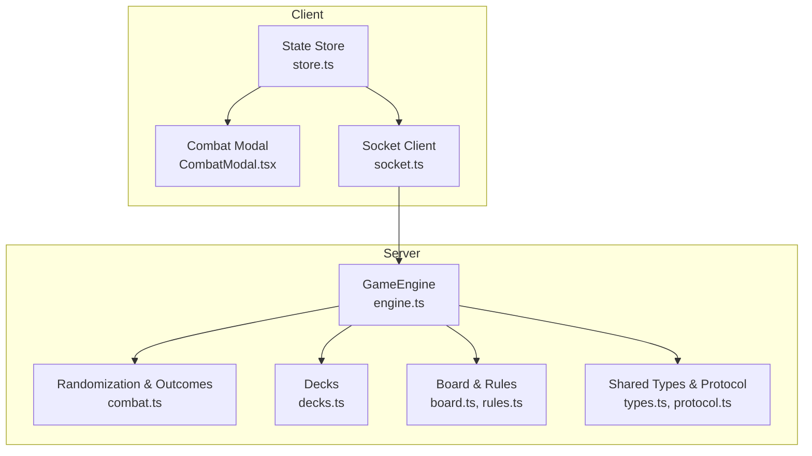

**Diagram sources**
- [engine.ts:1-920](file://server/src/game/engine.ts#L1-L920)
- [combat.ts:1-33](file://server/src/game/combat.ts#L1-L33)
- [decks.ts:1-101](file://server/src/game/decks.ts#L1-L101)
- [board.ts:1-297](file://server/src/game/board.ts#L1-L297)
- [rules.ts:1-198](file://server/src/game/rules.ts#L1-L198)
- [types.ts:1-186](file://shared/src/types.ts#L1-L186)
- [protocol.ts:1-97](file://shared/src/protocol.ts#L1-L97)
- [store.ts:1-164](file://web/src/state/store.ts#L1-L164)
- [CombatModal.tsx:1-32](file://web/src/ui/CombatModal.tsx#L1-L32)
- [socket.ts:1-11](file://web/src/net/socket.ts#L1-L11)

**Section sources**
- [engine.ts:1-920](file://server/src/game/engine.ts#L1-L920)
- [combat.ts:1-33](file://server/src/game/combat.ts#L1-L33)
- [decks.ts:1-101](file://server/src/game/decks.ts#L1-L101)
- [board.ts:1-297](file://server/src/game/board.ts#L1-L297)
- [rules.ts:1-198](file://server/src/game/rules.ts#L1-L198)
- [types.ts:1-186](file://shared/src/types.ts#L1-L186)
- [protocol.ts:1-97](file://shared/src/protocol.ts#L1-L97)
- [store.ts:1-164](file://web/src/state/store.ts#L1-L164)
- [CombatModal.tsx:1-32](file://web/src/ui/CombatModal.tsx#L1-L32)
- [socket.ts:1-11](file://web/src/net/socket.ts#L1-L11)

## Core Components
- Randomization and combat outcomes:
  - D6 roll generator.
  - AAM duel resolution: attacker vs defender roll with win/tie outcomes.
  - ARM success threshold: 5 or 6.
  - Cruise vs landing strip success threshold: 4, 5, or 6.
- Deck management:
  - Mixed missile factory deck with counts per kind.
  - Separate radar, reward, punishment, and question decks with shuffling and discard handling.
  - Handled as generic decks with draw/discard semantics.
- Movement and collision:
  - Movement helpers for forward/backward steps and landing detection.
  - Collision handling with perching on stacks under specific conditions.
- SAM auto-prompt:
  - Detects when a moving plane enters an enemy radar zone and offers SAM launch.
- Cruise targeting:
  - Auto-hit on takeoff; landing strip shot with success threshold.
- Shield mechanics:
  - Single-use shield reduces incoming SAM or cruise hits to nullify damage.

**Section sources**
- [combat.ts:1-33](file://server/src/game/combat.ts#L1-L33)
- [decks.ts:1-101](file://server/src/game/decks.ts#L1-L101)
- [rules.ts:1-198](file://server/src/game/rules.ts#L1-L198)
- [engine.ts:415-528](file://server/src/game/engine.ts#L415-L528)
- [engine.ts:810-837](file://server/src/game/engine.ts#L810-L837)
- [engine.ts:777-808](file://server/src/game/engine.ts#L777-L808)

## Architecture Overview
The combat system is driven by the authoritative GameEngine. It advances through phases, detects collisions and SAM triggers, and opens combat prompts. The client receives state snapshots and renders prompts. Choices are sent back to the server, which resolves outcomes and advances the state machine.

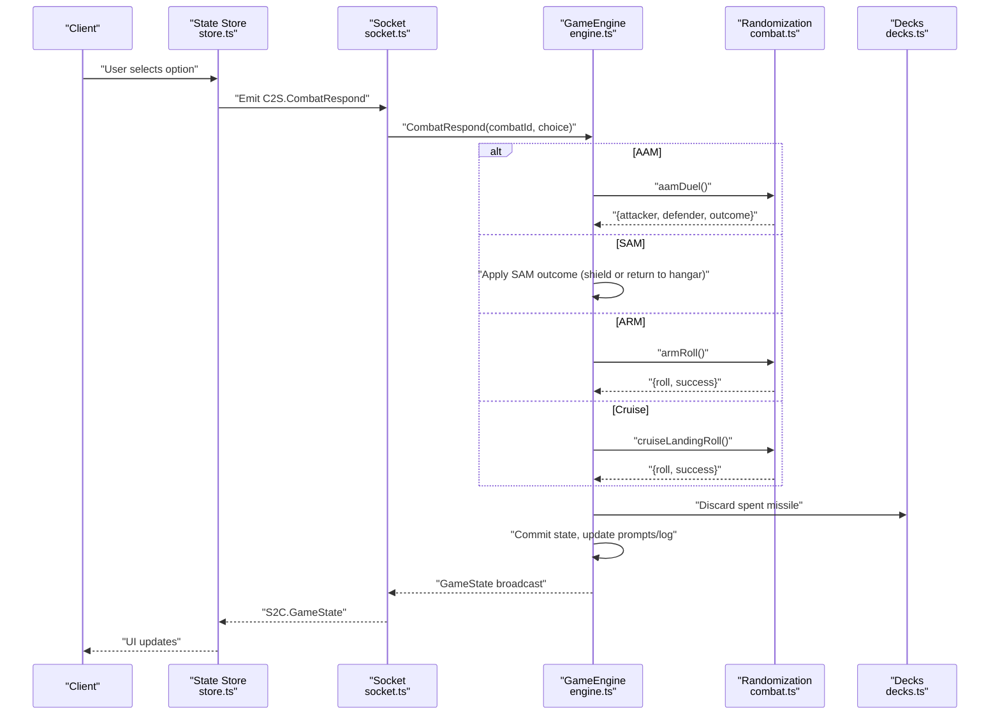

**Diagram sources**
- [engine.ts:435-528](file://server/src/game/engine.ts#L435-L528)
- [combat.ts:14-32](file://server/src/game/combat.ts#L14-L32)
- [decks.ts:27-36](file://server/src/game/decks.ts#L27-L36)
- [protocol.ts:55-60](file://shared/src/protocol.ts#L55-L60)
- [store.ts:133-135](file://web/src/state/store.ts#L133-L135)

## Detailed Component Analysis

### AAM Duel Mechanics
- Resolution:
  - Both attacker and defender roll a D6.
  - Outcomes: attackerWins, defenderWins, tie.
- Player choice:
  - During collision, the attacking player is prompted to fire AAM or skip.
  - If skipped, collision applies (both planes return to hangar).
  - If fired:
    - Attacker wins: defender plane returns to hangar.
    - Defender wins: defender can counter with their AAM; if defender wins the counter, attacker returns to hangar; otherwise tie allows attacker to remain.
- Complexity:
  - Pure deterministic function with O(1) time and constant memory.
- Edge cases:
  - Tie results in both planes staying; attacker continues their turn.

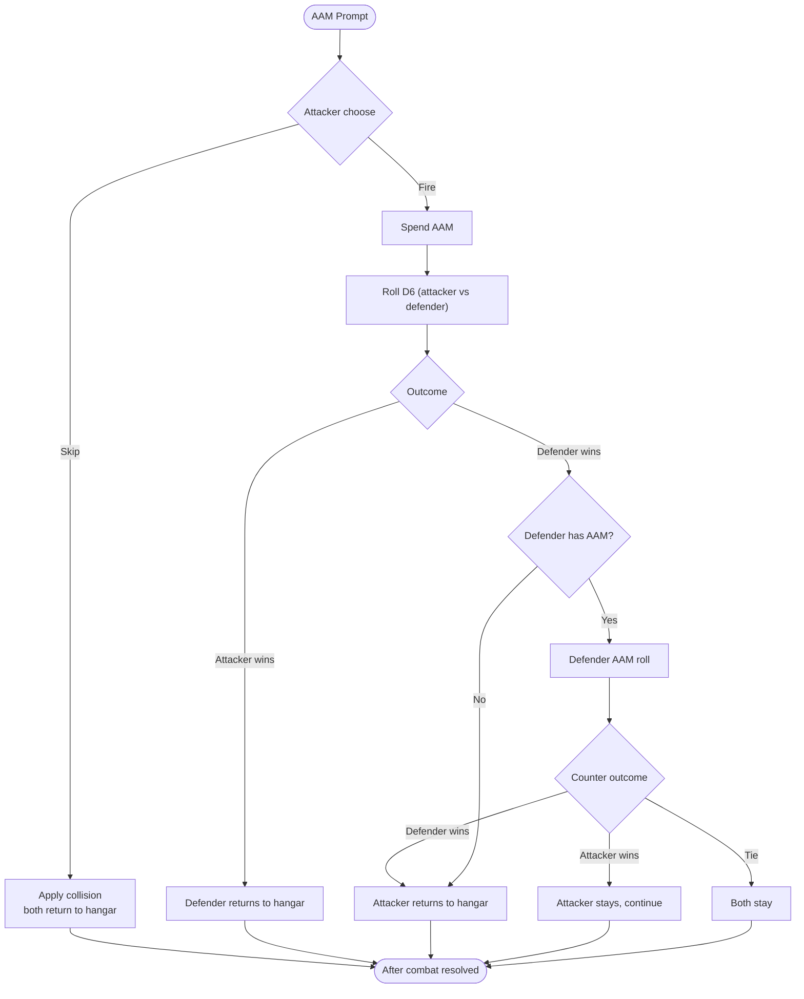

**Diagram sources**
- [engine.ts:416-498](file://server/src/game/engine.ts#L416-L498)
- [combat.ts:14-20](file://server/src/game/combat.ts#L14-L20)

**Section sources**
- [engine.ts:416-498](file://server/src/game/engine.ts#L416-L498)
- [combat.ts:14-20](file://server/src/game/combat.ts#L14-L20)

### SAM Auto-Prompt System
- Detection:
  - After movement, if the plane is not in landing strip and passes through an enemy radar zone (based on radar count), the defender is prompted to launch SAM.
- Prompt:
  - Defender chooses fire or skip.
  - If fired and successful, the target plane returns to hangar; if shield is active, SAM is negated.
- Complexity:
  - O(1) per defender; scanning up to 4 players and checking radar zone membership.

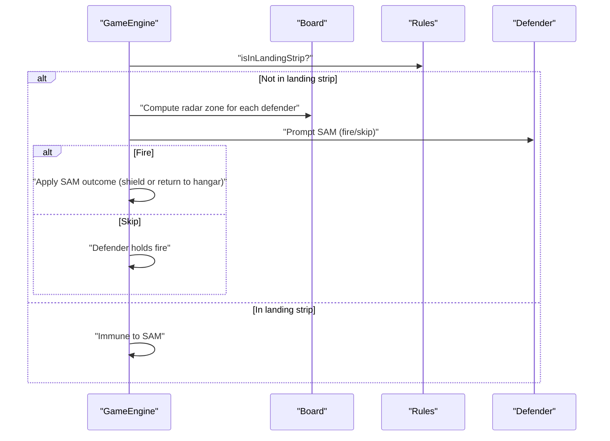

**Diagram sources**
- [engine.ts:811-837](file://server/src/game/engine.ts#L811-L837)
- [board.ts:289-297](file://server/src/game/board.ts#L289-L297)
- [rules.ts:71-84](file://server/src/game/rules.ts#L71-L84)

**Section sources**
- [engine.ts:811-837](file://server/src/game/engine.ts#L811-L837)
- [board.ts:289-297](file://server/src/game/board.ts#L289-L297)
- [rules.ts:71-84](file://server/src/game/rules.ts#L71-L84)

### ARM Targeting
- Target requirement:
  - Must target an enemy player who has at least one radar.
- Resolution:
  - ARM roll success on 5 or 6.
  - If successful, the defender loses one radar; otherwise miss.
- Complexity:
  - O(1) roll and O(1) state update.

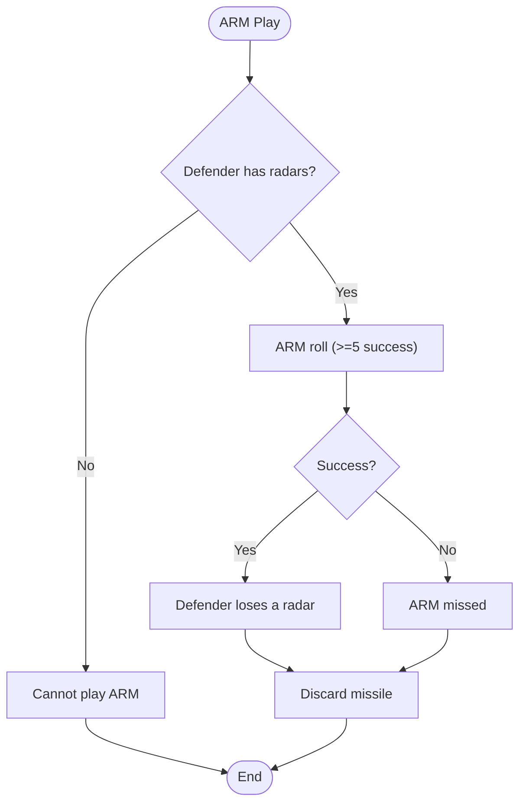

**Diagram sources**
- [engine.ts:762-775](file://server/src/game/engine.ts#L762-L775)
- [combat.ts:22-26](file://server/src/game/combat.ts#L22-L26)

**Section sources**
- [engine.ts:762-775](file://server/src/game/engine.ts#L762-L775)
- [combat.ts:22-26](file://server/src/game/combat.ts#L22-L26)

### Cruise Missile Attack Resolution
- Targeting:
  - Can only target enemy planes on takeoff or in landing strip.
  - If on takeoff, auto-hit; if on landing strip, success on 4, 5, or 6.
- Shield:
  - If the defender has an active shield, the cruise is negated and the missile is discarded.
- Complexity:
  - O(1) checks and roll.

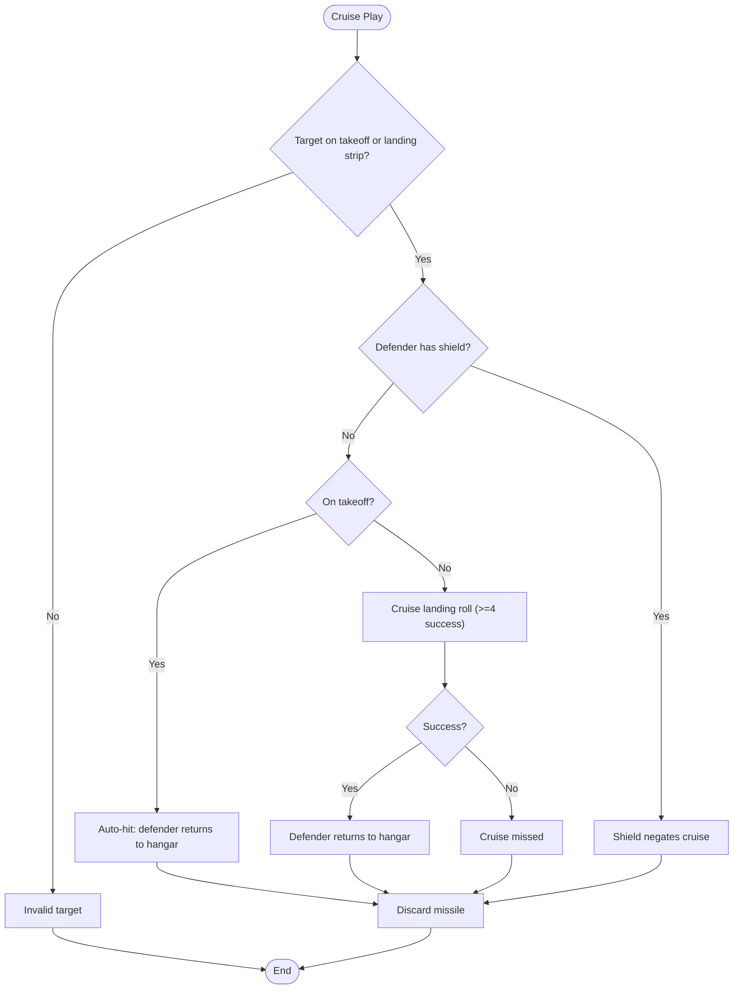

**Diagram sources**
- [engine.ts:777-808](file://server/src/game/engine.ts#L777-L808)
- [combat.ts:28-32](file://server/src/game/combat.ts#L28-L32)
- [rules.ts:71-84](file://server/src/game/rules.ts#L71-L84)

**Section sources**
- [engine.ts:777-808](file://server/src/game/engine.ts#L777-L808)
- [combat.ts:28-32](file://server/src/game/combat.ts#L28-L32)
- [rules.ts:71-84](file://server/src/game/rules.ts#L71-L84)

### Card-Based Combat System and Deck Management
- Deck composition:
  - Missile factory deck: 20 AAM, 20 SAM, 4 ARM, 4 cruise.
  - Radar deck: 28 radars.
  - Reward and punishment decks: counts per card kind.
  - Question deck: rows provided by room setup.
- Shuffling and draw:
  - Fisher-Yates shuffle for decks.
  - Draw returns null when empty; if discard pile is non-empty, it is reshuffled into the draw pile.
- Hand state:
  - Players carry missiles, radars, held rewards/punishments, shield, and skip rounds.
- Complexity:
  - Deck operations are O(n) for shuffle and O(1) for draw/discard.

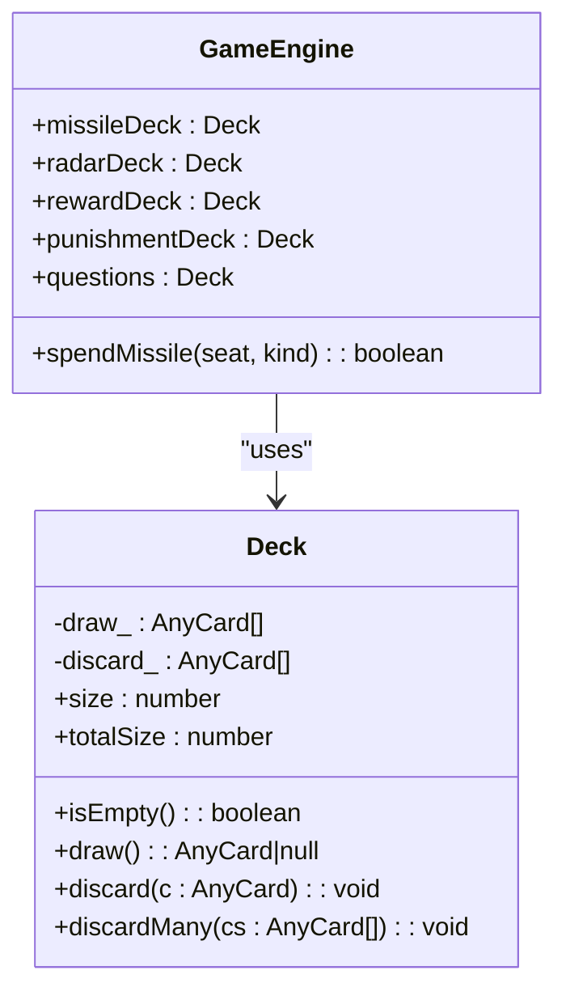

**Diagram sources**
- [decks.ts:18-37](file://server/src/game/decks.ts#L18-L37)
- [engine.ts:76-82](file://server/src/game/engine.ts#L76-L82)

**Section sources**
- [decks.ts:18-101](file://server/src/game/decks.ts#L18-L101)
- [engine.ts:76-82](file://server/src/game/engine.ts#L76-L82)

### Randomization Algorithms
- D6 roll:
  - Uses secure random integer in [1, 6].
- AAM duel:
  - Attacker and defender each roll; compare outcomes.
- ARM and cruise:
  - Threshold-based success checks.

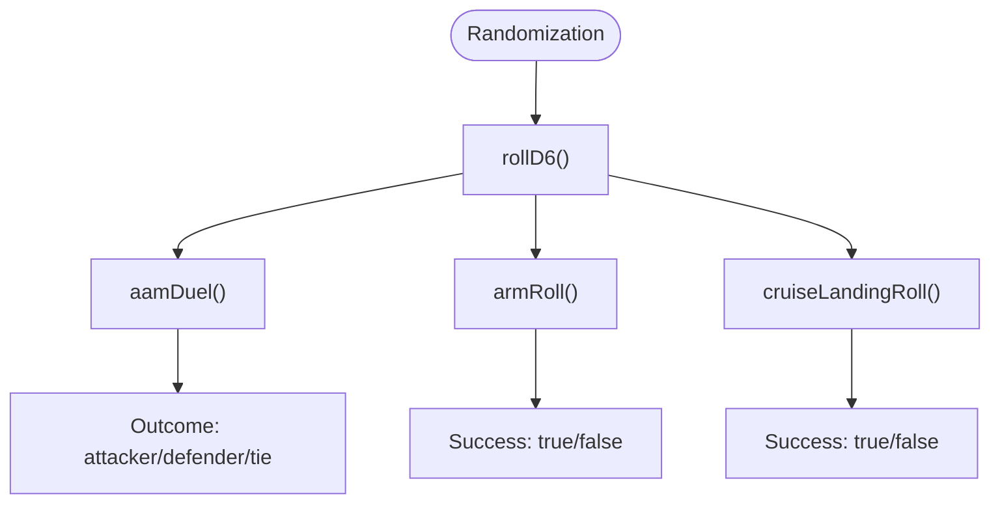

**Diagram sources**
- [combat.ts:7-32](file://server/src/game/combat.ts#L7-L32)

**Section sources**
- [combat.ts:7-32](file://server/src/game/combat.ts#L7-L32)

### Shield Mechanics and Defensive Positioning
- Shield activation:
  - Active shield reduces one incoming SAM or cruise hit to null.
  - Shield is single-use and cleared after activation.
- Defensive positioning:
  - Landing strips are immune to SAM.
  - ARM requires a radar-bearing target; SAM effectiveness scales with radar count via radar zone size.

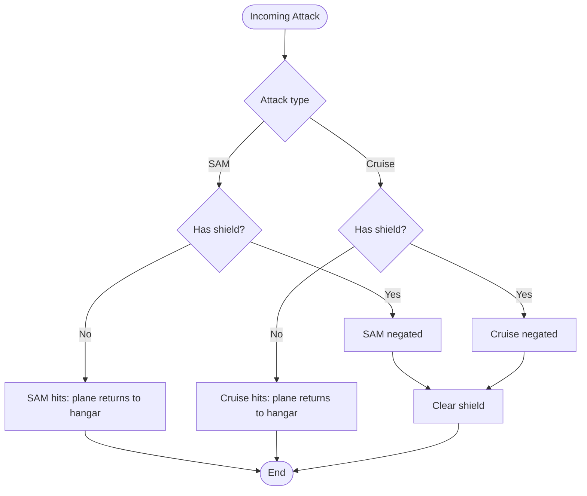

**Diagram sources**
- [engine.ts:506-512](file://server/src/game/engine.ts#L506-L512)
- [engine.ts:780-786](file://server/src/game/engine.ts#L780-L786)
- [board.ts:289-297](file://server/src/game/board.ts#L289-L297)

**Section sources**
- [engine.ts:506-512](file://server/src/game/engine.ts#L506-L512)
- [engine.ts:780-786](file://server/src/game/engine.ts#L780-L786)
- [board.ts:289-297](file://server/src/game/board.ts#L289-L297)

### Integration with Game Engine State Machine
- Phases:
  - awaitRoll, awaitTakeoffChoice, awaitMoveChoice, resolving, awaitCardActions, awaitCombat, awaitQA, gameOver.
- Combat prompts:
  - Engine sets phase to awaitCombat and pushes a combat prompt with options fire/skip.
- State updates:
  - After combat, engine clears prompts, logs outcomes, and advances turn or resolves immediately depending on pending bonuses or sixes.

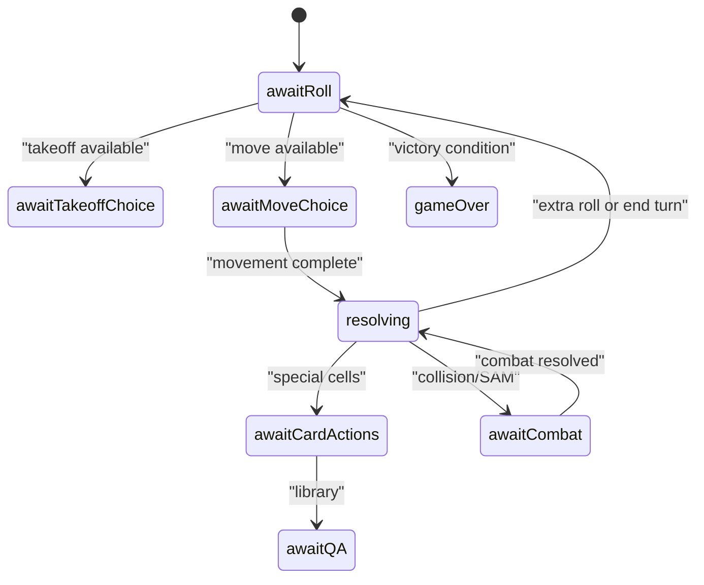

**Diagram sources**
- [engine.ts:180-204](file://server/src/game/engine.ts#L180-L204)
- [engine.ts:427-433](file://server/src/game/engine.ts#L427-L433)
- [engine.ts:861-880](file://server/src/game/engine.ts#L861-L880)

**Section sources**
- [engine.ts:180-204](file://server/src/game/engine.ts#L180-L204)
- [engine.ts:427-433](file://server/src/game/engine.ts#L427-L433)
- [engine.ts:861-880](file://server/src/game/engine.ts#L861-L880)

### Player Choice Handling and Automated Scenarios
- Client-side:
  - The store emits C2S.CombatRespond with combatId and choice.
  - The modal presents options and triggers the store action.
- Server-side:
  - Engine validates prompt ownership and choice, resolves outcomes, discards spent missiles, logs, and commits state.
- Automated scenarios:
  - SAM auto-prompt when entering radar zone.
  - ARM and cruise auto-success thresholds; cruise auto-hit on takeoff.

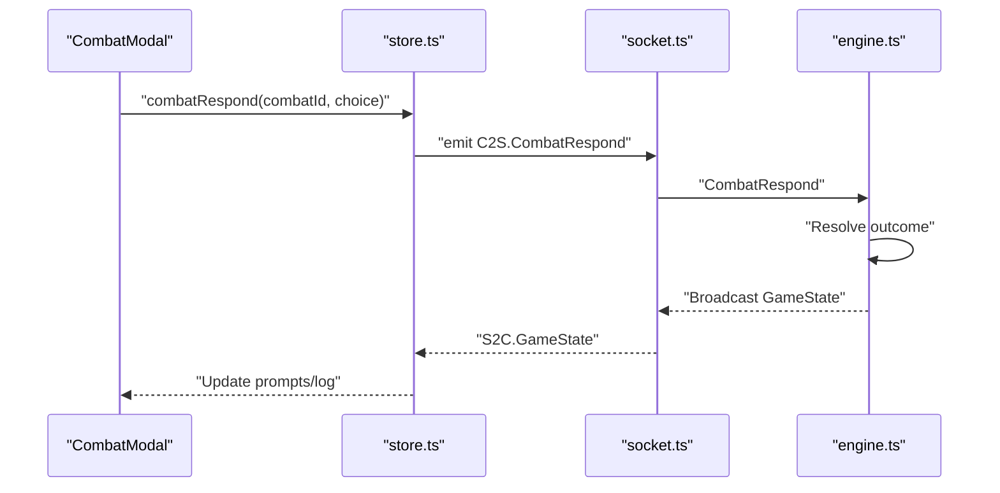

**Diagram sources**
- [CombatModal.tsx:9-26](file://web/src/ui/CombatModal.tsx#L9-L26)
- [store.ts:133-135](file://web/src/state/store.ts#L133-L135)
- [protocol.ts:55-60](file://shared/src/protocol.ts#L55-L60)
- [engine.ts:435-528](file://server/src/game/engine.ts#L435-L528)

**Section sources**
- [CombatModal.tsx:9-26](file://web/src/ui/CombatModal.tsx#L9-L26)
- [store.ts:133-135](file://web/src/state/store.ts#L133-L135)
- [protocol.ts:55-60](file://shared/src/protocol.ts#L55-L60)
- [engine.ts:435-528](file://server/src/game/engine.ts#L435-L528)

## Dependency Analysis
- Engine depends on:
  - Randomization helpers for combat outcomes.
  - Decks for missile/radar/reward/punishment management.
  - Board and rules for movement, collision, and SAM radar zone computation.
- Client depends on:
  - Shared types and protocol for typed messages.
  - Socket client for real-time updates.

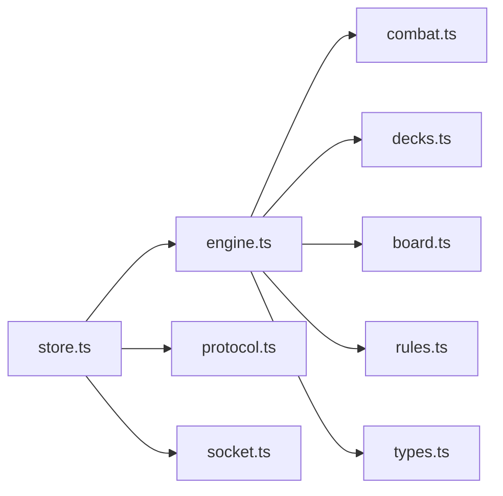

**Diagram sources**
- [engine.ts:25-36](file://server/src/game/engine.ts#L25-L36)
- [combat.ts:5](file://server/src/game/combat.ts#L5)
- [decks.ts:3](file://server/src/game/decks.ts#L3)
- [board.ts:22-25](file://server/src/game/board.ts#L22-L25)
- [rules.ts:3-4](file://server/src/game/rules.ts#L3-L4)
- [types.ts:3](file://shared/src/types.ts#L3)
- [protocol.ts:2](file://shared/src/protocol.ts#L2)
- [store.ts:8](file://web/src/state/store.ts#L8)
- [socket.ts:1](file://web/src/net/socket.ts#L1)

**Section sources**
- [engine.ts:25-36](file://server/src/game/engine.ts#L25-L36)
- [combat.ts:5](file://server/src/game/combat.ts#L5)
- [decks.ts:3](file://server/src/game/decks.ts#L3)
- [board.ts:22-25](file://server/src/game/board.ts#L22-L25)
- [rules.ts:3-4](file://server/src/game/rules.ts#L3-L4)
- [types.ts:3](file://shared/src/types.ts#L3)
- [protocol.ts:2](file://shared/src/protocol.ts#L2)
- [store.ts:8](file://web/src/state/store.ts#L8)
- [socket.ts:1](file://web/src/net/socket.ts#L1)

## Performance Considerations
- Combat resolution:
  - All outcomes are O(1) with minimal allocations.
- Deck operations:
  - Shuffle is O(n); draw/discard are O(1). Reshuffle occurs only when draw pile empties.
- Movement and collision:
  - Jump/shortcut chain resolution is O(1) per step; landing detection is O(1).
- State broadcasting:
  - Commit writes a shallow clone of state; log is capped to reduce memory growth.
- Network:
  - Client subscribes to state updates; batching occurs via socket transport.

[No sources needed since this section provides general guidance]

## Troubleshooting Guide
- Common errors:
  - Attempting AAM without missiles in hand.
  - Choosing invalid targets for ARM or cruise.
  - Responding to combat prompts out of turn or with invalid combatId.
- Symptoms:
  - Engine logs “engine error” and commits unchanged state.
- Resolution:
  - Verify hand state and available missiles.
  - Ensure prompts are presented to the correct seat.
  - Confirm client emitted correct combatId and choice.

**Section sources**
- [engine.ts:435-528](file://server/src/game/engine.ts#L435-L528)
- [engine.ts:915-918](file://server/src/game/engine.ts#L915-L918)

## Conclusion
The 导弹飞行棋 combat system combines deterministic movement with probabilistic outcomes. The GameEngine orchestrates state transitions, while pure helpers encapsulate randomness. Decks provide balanced missile and support cards, and the UI integrates seamlessly with the state machine via typed events. The result is a responsive, fair, and extensible combat framework suitable for competitive play.