# Game Engine

<cite>
**Referenced Files in This Document**
- [engine.ts](file://server/src/game/engine.ts)
- [rules.ts](file://server/src/game/rules.ts)
- [board.ts](file://server/src/game/board.ts)
- [decks.ts](file://server/src/game/decks.ts)
- [combat.ts](file://server/src/game/combat.ts)
- [rooms.ts](file://server/src/rooms.ts)
- [handlers.ts](file://server/src/net/handlers.ts)
- [index.ts](file://server/src/index.ts)
- [types.ts](file://shared/src/types.ts)
- [protocol.ts](file://shared/src/protocol.ts)
</cite>

## Table of Contents
1. [Introduction](#introduction)
2. [Project Structure](#project-structure)
3. [Core Components](#core-components)
4. [Architecture Overview](#architecture-overview)
5. [Detailed Component Analysis](#detailed-component-analysis)
6. [Dependency Analysis](#dependency-analysis)
7. [Performance Considerations](#performance-considerations)
8. [Troubleshooting Guide](#troubleshooting-guide)
9. [Conclusion](#conclusion)

## Introduction
This document describes the authoritative game state management system for the 导弹飞行棋 (Defensive Combat Flying Chess) game. It explains the state machine design, game phase transitions, authoritative server pattern, complex game mechanics (dice rolling, plane movement, collision detection, jump chain calculations), rule enforcement, validation logic, state mutation patterns, and the relationship between the game engine and room management. It also documents the Zod-based validation integration, error handling strategies, state serialization for real-time updates, and performance considerations for concurrent game scenarios.

## Project Structure
The server is organized into distinct layers:
- Game engine: authoritative state machine and rule enforcement
- Networking: Socket.IO handlers and Zod-based payload validation
- Room management: lobby and game lifecycle coordination
- Shared types and protocol: cross-language type safety and event contracts

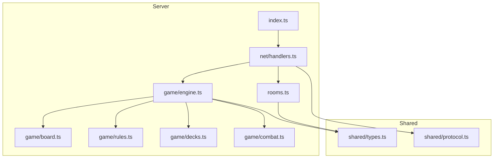

**Diagram sources**
- [index.ts:1-95](file://server/src/index.ts#L1-L95)
- [handlers.ts:1-230](file://server/src/net/handlers.ts#L1-L230)
- [rooms.ts:1-211](file://server/src/rooms.ts#L1-L211)
- [engine.ts:1-920](file://server/src/game/engine.ts#L1-L920)
- [board.ts:1-297](file://server/src/game/board.ts#L1-L297)
- [rules.ts:1-198](file://server/src/game/rules.ts#L1-L198)
- [decks.ts:1-101](file://server/src/game/decks.ts#L1-L101)
- [combat.ts:1-33](file://server/src/game/combat.ts#L1-L33)
- [types.ts:1-186](file://shared/src/types.ts#L1-L186)
- [protocol.ts:1-97](file://shared/src/protocol.ts#L1-L97)

**Section sources**
- [index.ts:1-95](file://server/src/index.ts#L1-L95)
- [handlers.ts:1-230](file://server/src/net/handlers.ts#L1-L230)
- [rooms.ts:1-211](file://server/src/rooms.ts#L1-L211)
- [engine.ts:1-920](file://server/src/game/engine.ts#L1-L920)

## Core Components
- GameEngine: authoritative state machine controlling turns, moves, combat, QA, and victory conditions
- RoomRegistry: manages lobby, seating, readiness, and game lifecycle
- Net handlers: bind client events to engine actions with Zod validation
- Board builder and movement rules: pure functions for path progression, landing, and jump chains
- Decks: shuffled card stacks for missiles, radars, rewards, punishments, and questions
- Combat helpers: deterministic random outcomes for duels and missile rolls

Key responsibilities:
- Enforce turn-based authority: only the engine mutates state; handlers dispatch validated intents
- Broadcast structured state snapshots and per-event updates to clients
- Maintain game balance via deck counts, skip rounds, and special cell triggers

**Section sources**
- [engine.ts:76-114](file://server/src/game/engine.ts#L76-L114)
- [rooms.ts:39-151](file://server/src/rooms.ts#L39-L151)
- [handlers.ts:15-175](file://server/src/net/handlers.ts#L15-L175)
- [board.ts:147-275](file://server/src/game/board.ts#L147-L275)
- [rules.ts:34-183](file://server/src/game/rules.ts#L34-L183)
- [decks.ts:18-37](file://server/src/game/decks.ts#L18-L37)
- [combat.ts:7-32](file://server/src/game/combat.ts#L7-L32)

## Architecture Overview
The authoritative server pattern ensures that all state mutations occur on the server. Clients send validated commands; the engine computes the new state and emits snapshots and events.

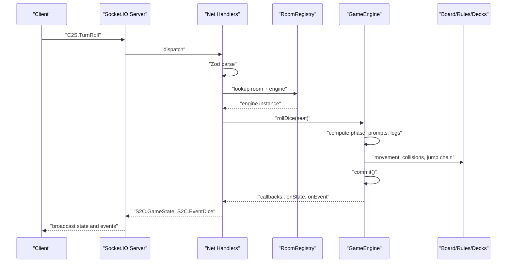

**Diagram sources**
- [handlers.ts:91-96](file://server/src/net/handlers.ts#L91-L96)
- [engine.ts:207-255](file://server/src/game/engine.ts#L207-L255)
- [board.ts:147-275](file://server/src/game/board.ts#L147-L275)
- [rules.ts:34-183](file://server/src/game/rules.ts#L34-L183)
- [decks.ts:18-37](file://server/src/game/decks.ts#L18-L37)

## Detailed Component Analysis

### State Machine and Phases
The engine models a turn-based state machine with explicit phases. Transitions are triggered by validated client actions and internal logic.

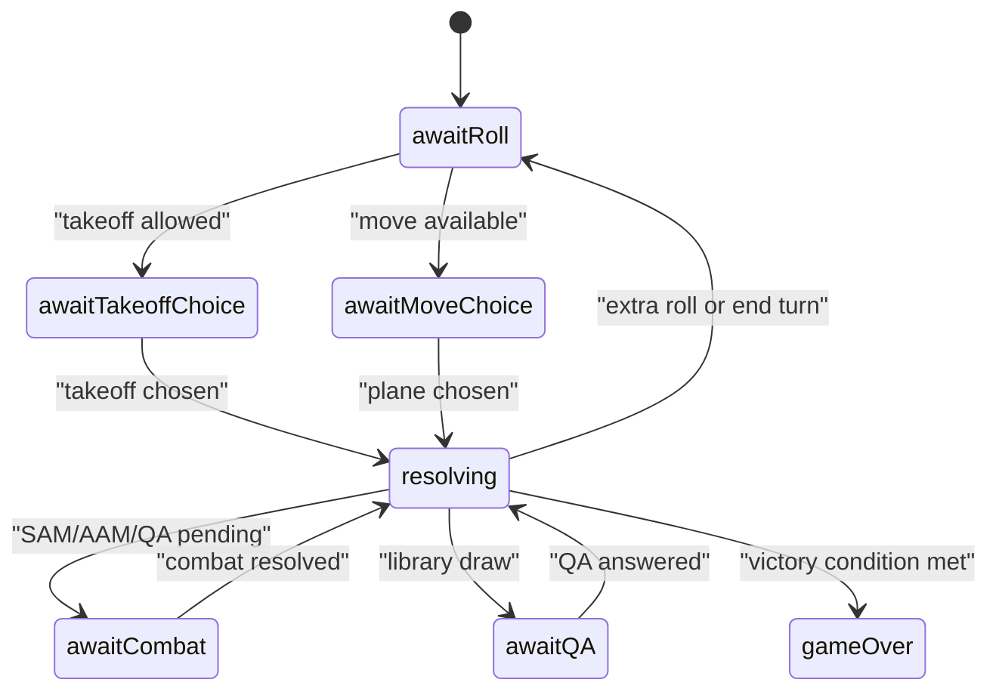

- Initial phase: awaitRoll
- Possible prompts: takeoff, move, combat, QA
- End-of-turn logic: extra roll on 6, or advance to next player
- Victory checks: two-home or timed

**Section sources**
- [engine.ts:135-147](file://server/src/game/engine.ts#L135-L147)
- [engine.ts:181-204](file://server/src/game/engine.ts#L181-L204)
- [engine.ts:882-912](file://server/src/game/engine.ts#L882-L912)
- [types.ts:129-146](file://shared/src/types.ts#L129-L146)

### Dice Rolling and Turn Lifecycle
- Roll validation: only the current player’s turn and awaitRoll phase
- Chain tracking: consecutive sixes increase chain; three sixes cancel the turn
- Decision tree: takeoff vs move availability depends on options and legal moves
- After-move: resolve landing, jump chain, collisions, special cells, SAM detection

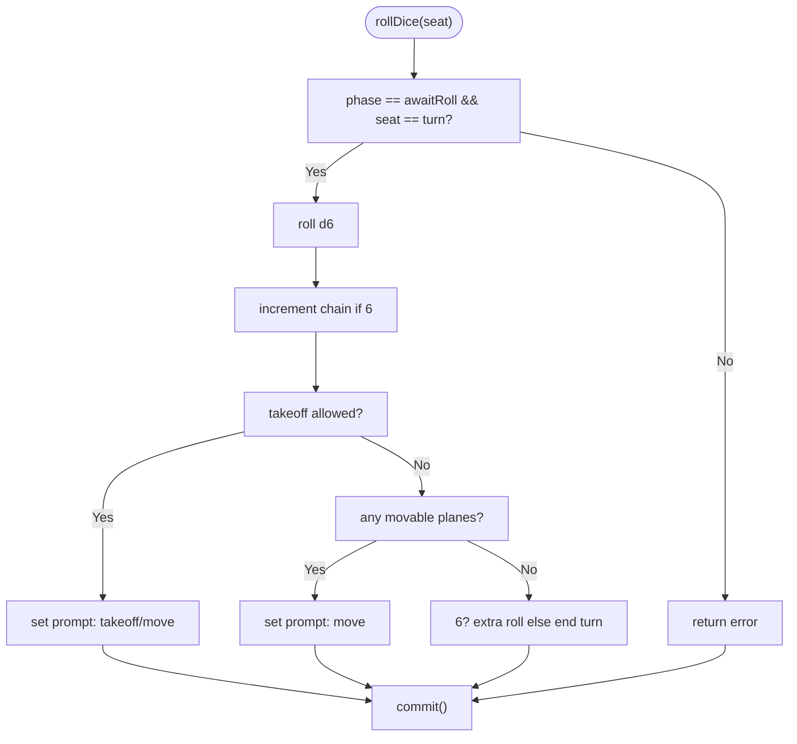

**Diagram sources**
- [engine.ts:207-255](file://server/src/game/engine.ts#L207-L255)
- [engine.ts:175-178](file://server/src/game/engine.ts#L175-L178)

**Section sources**
- [engine.ts:207-255](file://server/src/game/engine.ts#L207-L255)
- [combat.ts:7-9](file://server/src/game/combat.ts#L7-L9)

### Plane Movement, Jump Chains, and Collision Detection
Movement is computed by stepping forward along the board path, with bounce-back handling and jump chain resolution.

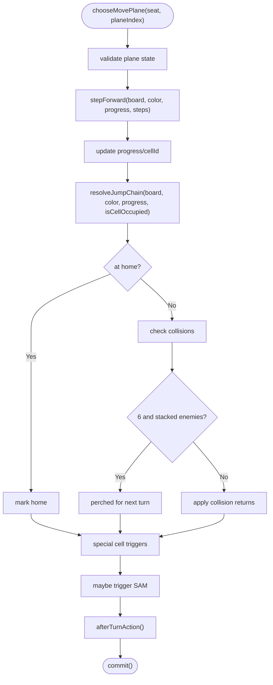

- Jump chain rules: same-color jump cells and shortcuts; chain behavior differs depending on whether the jump is from a shortcut entry
- Collision rules: perched on stacked enemies on 6; otherwise collision returns both planes
- Special cells: missile factory, radar factory, library

**Diagram sources**
- [engine.ts:275-343](file://server/src/game/engine.ts#L275-L343)
- [engine.ts:299-343](file://server/src/game/engine.ts#L299-L343)
- [rules.ts:34-60](file://server/src/game/rules.ts#L34-L60)
- [rules.ts:103-183](file://server/src/game/rules.ts#L103-L183)

**Section sources**
- [engine.ts:275-343](file://server/src/game/engine.ts#L275-L343)
- [rules.ts:34-183](file://server/src/game/rules.ts#L34-L183)

### Combat System: AAM Duels, SAM, ARM, Cruise
- AAM: Attacker may launch AAM against a defender; optional counter-attack; ties allow attacker to continue
- SAM: Defender may launch SAM if attacker enters radar zone; shield protects once
- ARM: Attacker spends ARM missile to target defender’s radar; success reduces radar count
- Cruise: Attacker targets enemy plane on takeoff or landing strip; auto-hit on takeoff, roll-based on landing

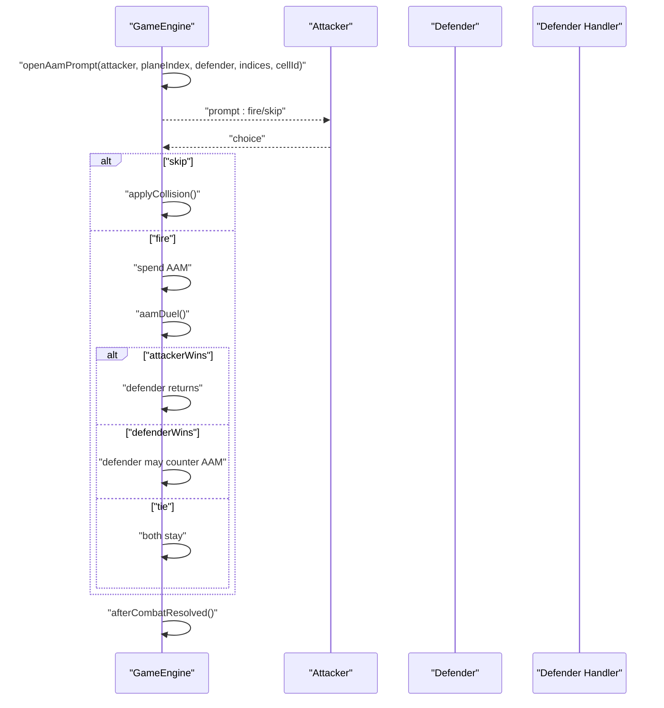

**Diagram sources**
- [engine.ts:416-528](file://server/src/game/engine.ts#L416-L528)
- [combat.ts:14-20](file://server/src/game/combat.ts#L14-L20)

**Section sources**
- [engine.ts:416-528](file://server/src/game/engine.ts#L416-L528)
- [engine.ts:811-837](file://server/src/game/engine.ts#L811-L837)
- [engine.ts:762-808](file://server/src/game/engine.ts#L762-L808)

### Library, Rewards, and Punishments
- Library draw: pose QA prompt; correctness determines reward or punishment
- Rewards: immediate effects (reroll, forward steps) or held rewards (gain missile/radar, enemy skip, shield)
- Punishments: immediate effects (backward steps, to takeoff, self skip) or held (lose missile/radar)

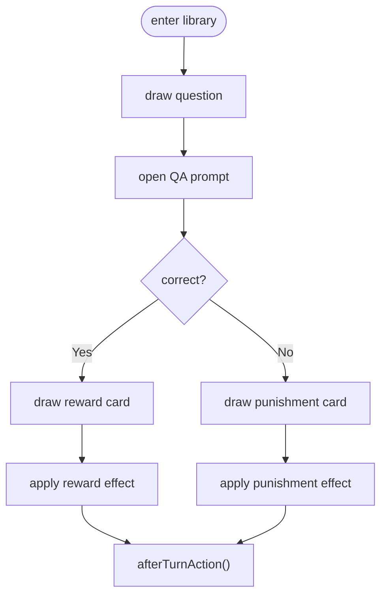

**Diagram sources**
- [engine.ts:556-584](file://server/src/game/engine.ts#L556-L584)
- [engine.ts:586-684](file://server/src/game/engine.ts#L586-L684)

**Section sources**
- [engine.ts:556-584](file://server/src/game/engine.ts#L556-L584)
- [engine.ts:586-684](file://server/src/game/engine.ts#L586-L684)

### Room Management and Game Lifecycle
RoomRegistry coordinates lobby, seating, readiness, and game start. It creates the GameEngine and wires callbacks for state broadcasting.

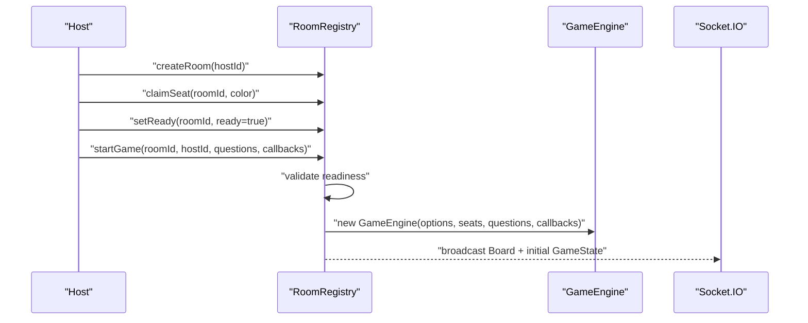

**Diagram sources**
- [rooms.ts:78-151](file://server/src/rooms.ts#L78-L151)
- [handlers.ts:81-89](file://server/src/net/handlers.ts#L81-L89)

**Section sources**
- [rooms.ts:39-151](file://server/src/rooms.ts#L39-L151)
- [handlers.ts:81-89](file://server/src/net/handlers.ts#L81-L89)

### Zod Validation and Protocol Contracts
All client-to-server messages are validated using Zod schemas before dispatch. Server-to-client events are typed and emitted consistently.

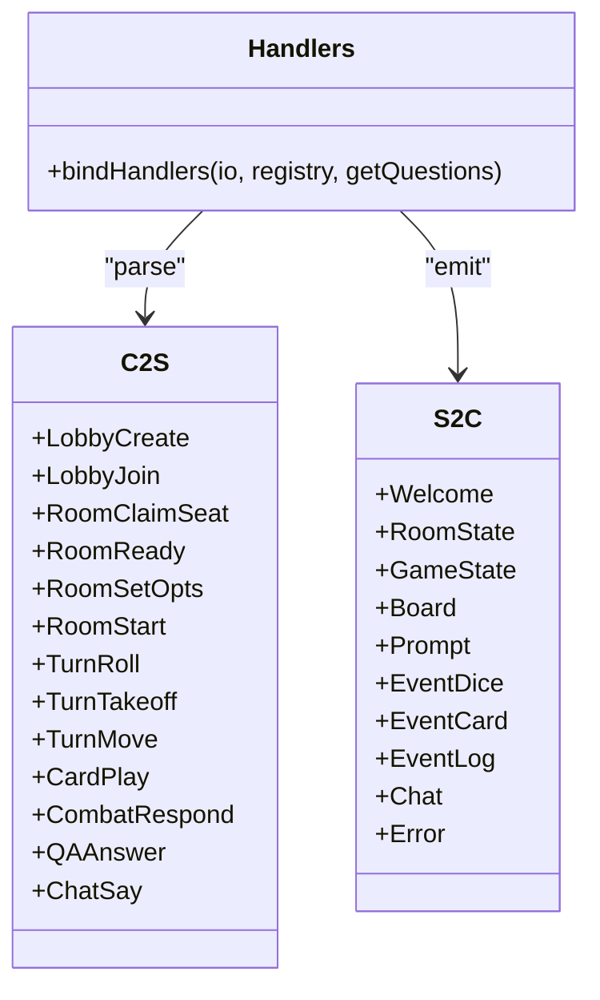

**Diagram sources**
- [protocol.ts:6-21](file://shared/src/protocol.ts#L6-L21)
- [protocol.ts:69-82](file://shared/src/protocol.ts#L69-L82)
- [handlers.ts:15-175](file://server/src/net/handlers.ts#L15-L175)

**Section sources**
- [protocol.ts:25-65](file://shared/src/protocol.ts#L25-L65)
- [handlers.ts:19-175](file://server/src/net/handlers.ts#L19-L175)

### Data Models and State Serialization
GameState and related structures define the authoritative state shape. The engine serializes state snapshots and emits compact event payloads.

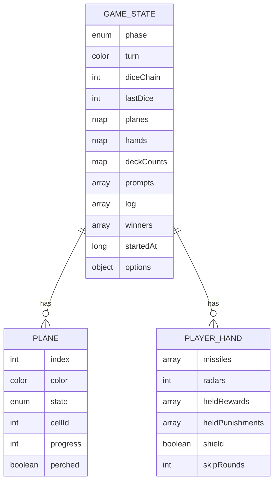

**Diagram sources**
- [types.ts:153-166](file://shared/src/types.ts#L153-L166)
- [types.ts:86-97](file://shared/src/types.ts#L86-L97)
- [types.ts:109-117](file://shared/src/types.ts#L109-L117)

**Section sources**
- [types.ts:153-166](file://shared/src/types.ts#L153-L166)
- [engine.ts:175-178](file://server/src/game/engine.ts#L175-L178)

## Dependency Analysis
The engine composes multiple modules with clear boundaries:
- Pure movement and geometry: rules.ts, board.ts
- Randomness and combat: combat.ts
- Decks and card lifecycle: decks.ts
- Networking and validation: handlers.ts, protocol.ts
- Room orchestration: rooms.ts

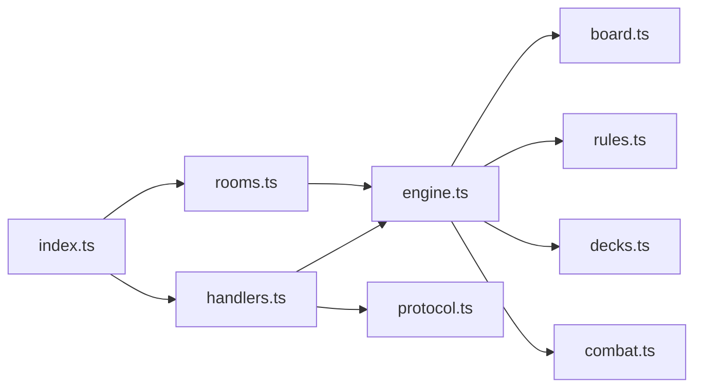

**Diagram sources**
- [engine.ts:25-36](file://server/src/game/engine.ts#L25-L36)
- [handlers.ts:3-13](file://server/src/net/handlers.ts#L3-L13)
- [rooms.ts:8](file://server/src/rooms.ts#L8)
- [index.ts:11-12](file://server/src/index.ts#L11-L12)

**Section sources**
- [engine.ts:25-36](file://server/src/game/engine.ts#L25-L36)
- [handlers.ts:3-13](file://server/src/net/handlers.ts#L3-L13)
- [rooms.ts:8](file://server/src/rooms.ts#L8)
- [index.ts:11-12](file://server/src/index.ts#L11-L12)

## Performance Considerations
- State cloning: the engine clones state before emitting to prevent accidental mutation by callbacks
- Log capping: bounded log size prevents memory growth
- Deck counts: lightweight estimates for missile kinds to reduce computation overhead
- Minimal recomputation: movement and jump chain rely on pure functions; state mutations are centralized
- Concurrency: authoritative server pattern eliminates race conditions; handlers are single-threaded per room via Socket.IO rooms

Recommendations:
- Batch event emissions for dense moments (e.g., multiple dice or card draws)
- Consider lazy evaluation of deck counts if memory becomes a concern
- Add timeouts for prompts to prevent stalled games

**Section sources**
- [engine.ts:175-178](file://server/src/game/engine.ts#L175-L178)
- [engine.ts:170-174](file://server/src/game/engine.ts#L170-L174)
- [engine.ts:165-167](file://server/src/game/engine.ts#L165-L167)

## Troubleshooting Guide
Common issues and diagnostics:
- Invalid actions: errors are logged and state is committed to notify clients
- Turn timing: only the current player can act during their turn
- Phase constraints: actions are rejected if not in the expected phase
- Deck exhaustion: handlers gracefully handle empty decks by shuffling discard piles

Error handling patterns:
- Centralized logging with capped history
- Structured error emission to clients
- Defensive checks for presence of engines and rooms

**Section sources**
- [engine.ts:915-918](file://server/src/game/engine.ts#L915-L918)
- [handlers.ts:227-229](file://server/src/net/handlers.ts#L227-L229)
- [decks.ts:27-36](file://server/src/game/decks.ts#L27-L36)

## Conclusion
The 导弹飞行棋 authoritative game engine enforces a strict turn-based state machine with robust validation, deterministic combat, and clear separation between networking, room management, and game logic. The Zod-based protocol ensures reliable client-server contracts, while the engine’s callback-driven design enables efficient real-time updates. The modular composition of movement, jump chains, and deck systems supports maintainability and performance under concurrent gameplay.