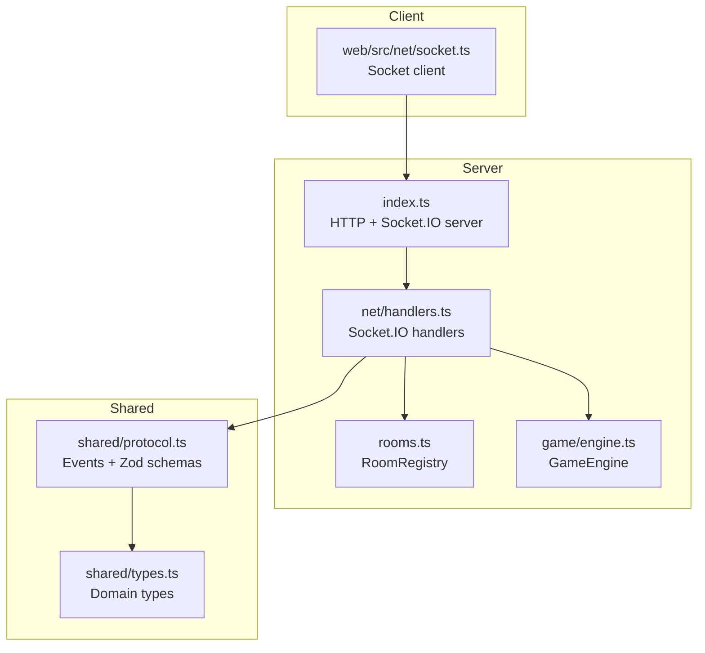
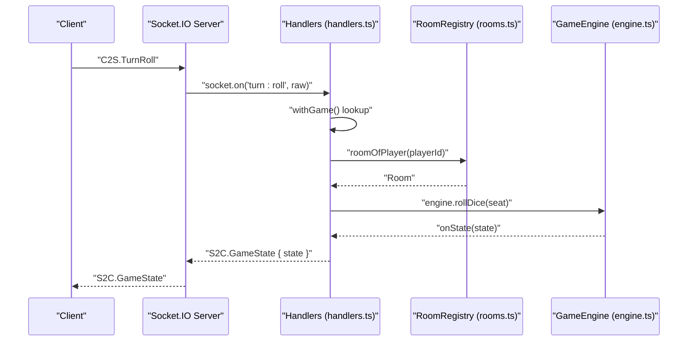
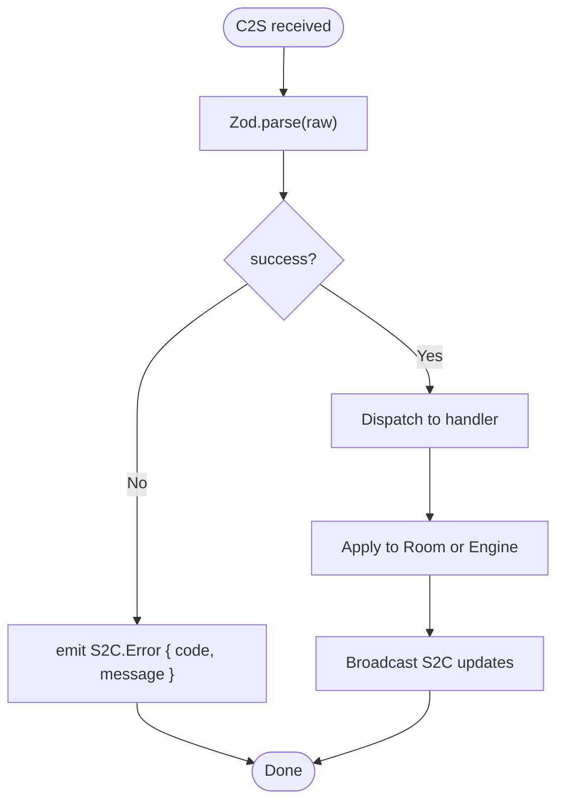
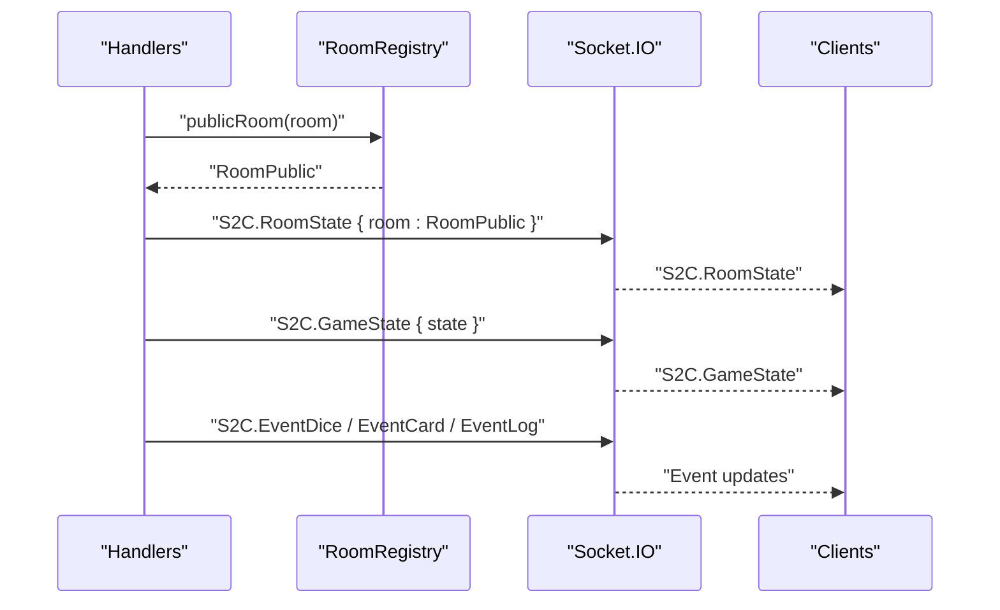
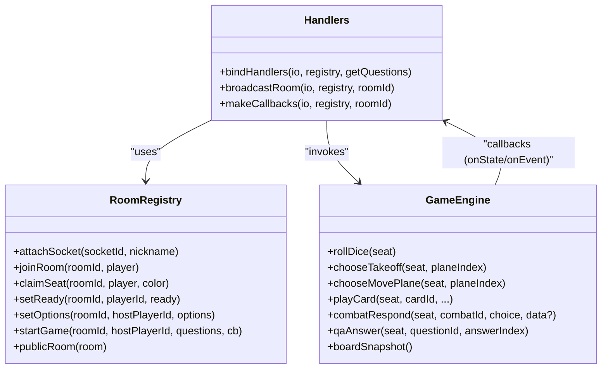
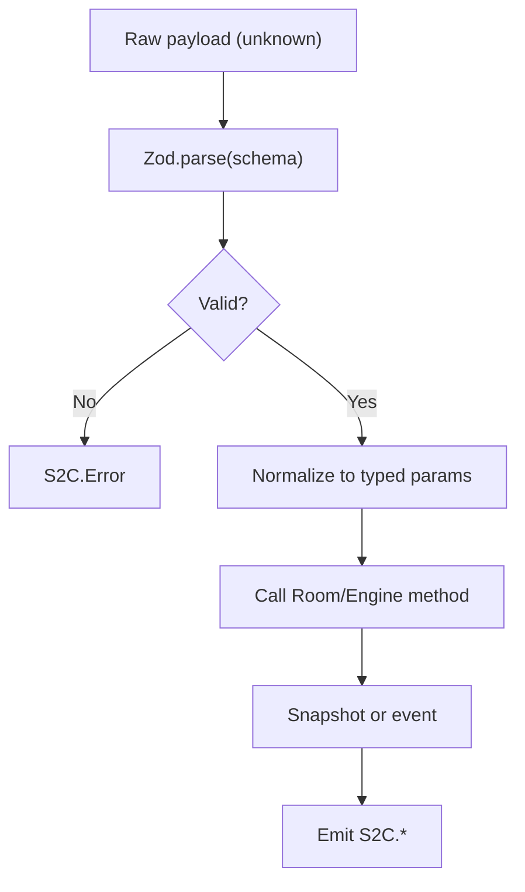
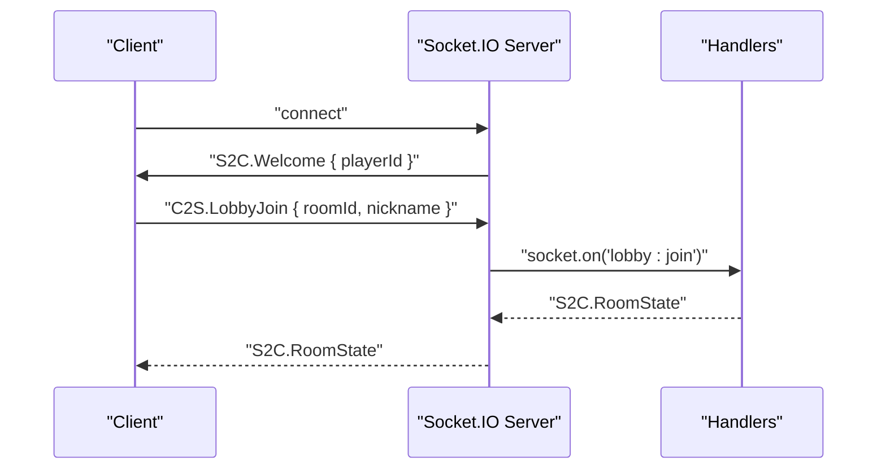
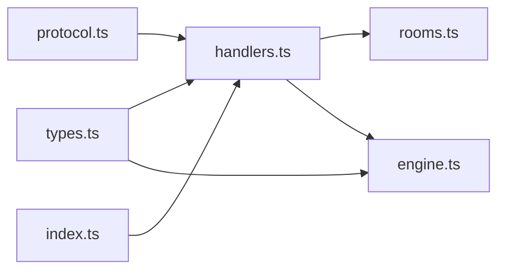

# Network Handlers

<cite>
**Referenced Files in This Document**
- [handlers.ts](file://server/src/net/handlers.ts)
- [protocol.ts](file://shared/src/protocol.ts)
- [types.ts](file://shared/src/types.ts)
- [engine.ts](file://server/src/game/engine.ts)
- [rooms.ts](file://server/src/rooms.ts)
- [index.ts](file://server/src/index.ts)
- [socket.ts](file://web/src/net/socket.ts)
</cite>

## Table of Contents
1. [Introduction](#introduction)
2. [Project Structure](#project-structure)
3. [Core Components](#core-components)
4. [Architecture Overview](#architecture-overview)
5. [Detailed Component Analysis](#detailed-component-analysis)
6. [Dependency Analysis](#dependency-analysis)
7. [Performance Considerations](#performance-considerations)
8. [Troubleshooting Guide](#troubleshooting-guide)
9. [Conclusion](#conclusion)

## Introduction
This document describes the network handlers for the 导弹飞行棋 Socket.IO event handling system. It explains how client events are routed, validated using Zod schemas, transformed into authoritative game state changes, and broadcast to connected clients. It covers the event-driven architecture, real-time state broadcasting, security measures, and debugging strategies.

## Project Structure
The network layer is implemented in the server workspace and relies on shared protocol and type definitions. The client connects via Socket.IO and interacts with the server through typed events.

**Diagram sources**
- [index.ts:1-95](file://server/src/index.ts#L1-L95)
- [handlers.ts:1-230](file://server/src/net/handlers.ts#L1-L230)
- [rooms.ts:1-211](file://server/src/rooms.ts#L1-L211)
- [engine.ts:1-920](file://server/src/game/engine.ts#L1-L920)
- [protocol.ts:1-97](file://shared/src/protocol.ts#L1-L97)
- [types.ts:1-186](file://shared/src/types.ts#L1-L186)
- [socket.ts:1-11](file://web/src/net/socket.ts#L1-L11)

**Section sources**
- [index.ts:1-95](file://server/src/index.ts#L1-L95)
- [handlers.ts:1-230](file://server/src/net/handlers.ts#L1-L230)
- [protocol.ts:1-97](file://shared/src/protocol.ts#L1-L97)
- [types.ts:1-186](file://shared/src/types.ts#L1-L186)
- [rooms.ts:1-211](file://server/src/rooms.ts#L1-L211)
- [engine.ts:1-920](file://server/src/game/engine.ts#L1-L920)
- [socket.ts:1-11](file://web/src/net/socket.ts#L1-L11)

## Core Components
- Socket.IO event handlers: bind C2S messages to room operations and engine actions.
- Zod-based payload validation: enforce strict typing and constraints for every incoming client message.
- Real-time broadcasting: push authoritative state and events to all clients in a room.
- Room lifecycle: manage player sessions, seating, readiness, and game start.
- Game engine integration: translate validated actions into state transitions and emit per-event notifications.

Key responsibilities:
- Event routing: map C2S events to appropriate handlers.
- Validation: parse and validate payloads using Zod schemas.
- Authorization: ensure actions are performed by the correct player in the correct room.
- State propagation: broadcast room state, game state, and per-event updates.

**Section sources**
- [handlers.ts:15-230](file://server/src/net/handlers.ts#L15-L230)
- [protocol.ts:25-66](file://shared/src/protocol.ts#L25-L66)
- [rooms.ts:39-151](file://server/src/rooms.ts#L39-L151)
- [engine.ts:63-74](file://server/src/game/engine.ts#L63-L74)

## Architecture Overview
The network handlers form a thin adapter between Socket.IO and the authoritative game engine. They validate payloads, resolve the player’s room, and delegate to either room operations or engine methods. Callbacks from the engine emit real-time updates to clients.

**Diagram sources**
- [handlers.ts:91-96](file://server/src/net/handlers.ts#L91-L96)
- [rooms.ts:73-76](file://server/src/rooms.ts#L73-L76)
- [engine.ts:207-255](file://server/src/game/engine.ts#L207-L255)
- [protocol.ts:6-21](file://shared/src/protocol.ts#L6-L21)
- [protocol.ts:69-82](file://shared/src/protocol.ts#L69-L82)

**Section sources**
- [handlers.ts:15-176](file://server/src/net/handlers.ts#L15-L176)
- [rooms.ts:39-151](file://server/src/rooms.ts#L39-L151)
- [engine.ts:63-919](file://server/src/game/engine.ts#L63-L919)
- [protocol.ts:6-97](file://shared/src/protocol.ts#L6-L97)

## Detailed Component Analysis

### Event Routing and Validation
- All C2S events are bound in a single connection handler.
- Each event is validated against a dedicated Zod schema before processing.
- On validation failure, the handler emits an S2C.Error event with a code and message.

Validation examples:
- LobbyCreate: validates nickname length.
- RoomClaimSeat: validates color selection.
- TurnRoll: no payload required.
- TurnMove/TurnTakeoff: validates plane index bounds.
- CardPlay: validates optional target fields and card presence.
- CombatRespond/QAAnswer: validates identifiers and indices.
- ChatSay: validates message length.

**Diagram sources**
- [handlers.ts:19-229](file://server/src/net/handlers.ts#L19-L229)
- [protocol.ts:25-66](file://shared/src/protocol.ts#L25-L66)

**Section sources**
- [handlers.ts:19-229](file://server/src/net/handlers.ts#L19-L229)
- [protocol.ts:25-66](file://shared/src/protocol.ts#L25-L66)

### Real-Time State Broadcasting
- Room state: broadcast S2C.RoomState to all players in a room after seat claims, readiness changes, or options updates.
- Game state: broadcast S2C.GameState after every authoritative state change.
- Per-event broadcasts: dice, card draws, and logs are emitted to notify clients of transient events.
- Board snapshot: sent once when a game starts.

**Diagram sources**
- [handlers.ts:191-225](file://server/src/net/handlers.ts#L191-L225)
- [rooms.ts:171-186](file://server/src/rooms.ts#L171-L186)
- [protocol.ts:69-97](file://shared/src/protocol.ts#L69-L97)

**Section sources**
- [handlers.ts:191-225](file://server/src/net/handlers.ts#L191-L225)
- [rooms.ts:171-186](file://server/src/rooms.ts#L171-L186)
- [protocol.ts:69-97](file://shared/src/protocol.ts#L69-L97)

### Relationship Between Network Handlers and Game Engine
- Handlers call engine methods after validating and resolving the current seat.
- Engine callbacks:
  - onState: push S2C.GameState snapshots.
  - onEvent: push S2C.EventDice, S2C.EventCard, S2C.EventLog.
  - onGameOver: announce end of game.
- Handlers also broadcast room state changes and initial board snapshot on game start.

**Diagram sources**
- [handlers.ts:15-225](file://server/src/net/handlers.ts#L15-L225)
- [rooms.ts:39-151](file://server/src/rooms.ts#L39-L151)
- [engine.ts:63-919](file://server/src/game/engine.ts#L63-L919)

**Section sources**
- [handlers.ts:76-89](file://server/src/net/handlers.ts#L76-L89)
- [engine.ts:63-919](file://server/src/game/engine.ts#L63-L919)

### Protocol Definitions and Payload Transformation
- C2S constants define event names.
- Zod schemas define payload shapes and constraints.
- S2C constants define server-to-client event names and payload interfaces.
- Payload transformation:
  - Handlers parse raw payloads with Zod.
  - Handlers resolve player and seat context.
  - Handlers call engine methods with normalized parameters.
  - Engine returns snapshots and emits events via callbacks.

**Diagram sources**
- [protocol.ts:6-97](file://shared/src/protocol.ts#L6-L97)
- [handlers.ts:19-229](file://server/src/net/handlers.ts#L19-L229)

**Section sources**
- [protocol.ts:6-97](file://shared/src/protocol.ts#L6-L97)
- [handlers.ts:19-229](file://server/src/net/handlers.ts#L19-L229)

### Security Measures
- Strict Zod validation for all C2S payloads prevents malformed or malicious inputs.
- Player and seat resolution ensures actions originate from the correct session and color.
- Room operations are gated by host permissions and readiness checks.
- No dynamic evaluation or reflection is used; handlers are deterministic and typed.

Mitigations demonstrated:
- Validation failures return S2C.Error with a code and message.
- Room start requires sufficient players and readiness.
- Host-only operations (e.g., setting options) are guarded by hostId checks.

**Section sources**
- [handlers.ts:19-229](file://server/src/net/handlers.ts#L19-L229)
- [rooms.ts:132-151](file://server/src/rooms.ts#L132-L151)

### Client-Server Communication Patterns
- Request-response via Socket.IO events.
- One-way broadcasts for state and events.
- Join/leave room semantics maintain connection indicators.
- Initial welcome event carries the player identifier.

**Diagram sources**
- [handlers.ts:16-41](file://server/src/net/handlers.ts#L16-L41)
- [protocol.ts:6-21](file://shared/src/protocol.ts#L6-L21)
- [protocol.ts:69-82](file://shared/src/protocol.ts#L69-L82)

**Section sources**
- [handlers.ts:16-41](file://server/src/net/handlers.ts#L16-L41)
- [protocol.ts:6-21](file://shared/src/protocol.ts#L6-L21)
- [protocol.ts:69-82](file://shared/src/protocol.ts#L69-L82)

## Dependency Analysis
- Handlers depend on:
  - Shared protocol and types for event names and payload shapes.
  - RoomRegistry for player and room resolution.
  - GameEngine for authoritative state transitions.
- Engine depends on shared types for state and domain models.
- Server entrypoint initializes Socket.IO and binds handlers.

**Diagram sources**
- [handlers.ts:3-14](file://server/src/net/handlers.ts#L3-L14)
- [protocol.ts:1-97](file://shared/src/protocol.ts#L1-L97)
- [types.ts:1-186](file://shared/src/types.ts#L1-L186)
- [rooms.ts:1-211](file://server/src/rooms.ts#L1-L211)
- [engine.ts:1-920](file://server/src/game/engine.ts#L1-L920)
- [index.ts:1-95](file://server/src/index.ts#L1-L95)

**Section sources**
- [handlers.ts:3-14](file://server/src/net/handlers.ts#L3-L14)
- [protocol.ts:1-97](file://shared/src/protocol.ts#L1-L97)
- [types.ts:1-186](file://shared/src/types.ts#L1-L186)
- [rooms.ts:1-211](file://server/src/rooms.ts#L1-L211)
- [engine.ts:1-920](file://server/src/game/engine.ts#L1-L920)
- [index.ts:1-95](file://server/src/index.ts#L1-L95)

## Performance Considerations
- Minimal CPU work in handlers: validation and dispatch only.
- Efficient broadcasting via Socket.IO rooms.
- Engine snapshots are shallow clones before emitting to avoid mutation.
- Room state broadcasts occur only on meaningful changes (seat claims, readiness, options).
- Consider adding:
  - Rate limiting per socket for noisy clients.
  - Payload size caps for chat and logs.
  - Debouncing of frequent small events.

[No sources needed since this section provides general guidance]

## Troubleshooting Guide
Common issues and strategies:
- Validation errors:
  - Symptom: S2C.Error with BAD_PAYLOAD.
  - Action: Verify client-side event payload matches shared Zod schemas.
- Unauthorized actions:
  - Symptom: Actions ignored if player or room not found.
  - Action: Ensure player is attached and joined the room before sending actions.
- Game start conditions:
  - Symptom: CANT_START when not enough players or not ready.
  - Action: Confirm at least 2 seated players and readiness flags.
- Disconnections:
  - Symptom: Room state still shows player as disconnected.
  - Action: Handlers broadcast room state on disconnect to update UI.

Debugging tips:
- Enable verbose logging in handlers for failed validations and missing contexts.
- Inspect emitted S2C events to confirm sequencing and payload correctness.
- Monitor engine logs for internal state transitions and errors.

**Section sources**
- [handlers.ts:227-229](file://server/src/net/handlers.ts#L227-L229)
- [rooms.ts:140-151](file://server/src/rooms.ts#L140-L151)
- [engine.ts:914-919](file://server/src/game/engine.ts#L914-L919)

## Conclusion
The network handlers implement a robust, event-driven Socket.IO layer with strong Zod-based validation, clear separation of concerns, and efficient real-time broadcasting. By binding C2S events to room and engine operations, the system maintains a single source of truth and delivers timely updates to clients. The architecture supports secure, scalable multiplayer gameplay with straightforward debugging and monitoring hooks.