# Room Management

<cite>
**Referenced Files in This Document**
- [rooms.ts](file://server/src/rooms.ts)
- [engine.ts](file://server/src/game/engine.ts)
- [handlers.ts](file://server/src/net/handlers.ts)
- [types.ts](file://shared/src/types.ts)
- [protocol.ts](file://shared/src/protocol.ts)
- [index.ts](file://server/src/index.ts)
- [board.ts](file://server/src/game/board.ts)
- [decks.ts](file://server/src/game/decks.ts)
- [README.md](file://README.md)
</cite>

## Table of Contents
1. [Introduction](#introduction)
2. [Project Structure](#project-structure)
3. [Core Components](#core-components)
4. [Architecture Overview](#architecture-overview)
5. [Detailed Component Analysis](#detailed-component-analysis)
6. [Dependency Analysis](#dependency-analysis)
7. [Performance Considerations](#performance-considerations)
8. [Troubleshooting Guide](#troubleshooting-guide)
9. [Conclusion](#conclusion)

## Introduction
This document describes the server-side room management system for the 导弹飞行棋 (Air Defense Combat Flying Chess) multiplayer game. It covers the room lifecycle from creation to cleanup, player registration and session management, seat assignment logic, room state synchronization, ready-state coordination, and game start triggers. It also documents room configuration options, player limits, visibility controls, the relationship between rooms and the game engine, error handling, disconnection scenarios, automatic room cleanup, and security/access control measures.

## Project Structure
The room management system spans the server’s room registry, the authoritative game engine, and the Socket.IO event handlers that connect clients to rooms and engines. Shared types and protocol definitions ensure consistent data contracts across layers.

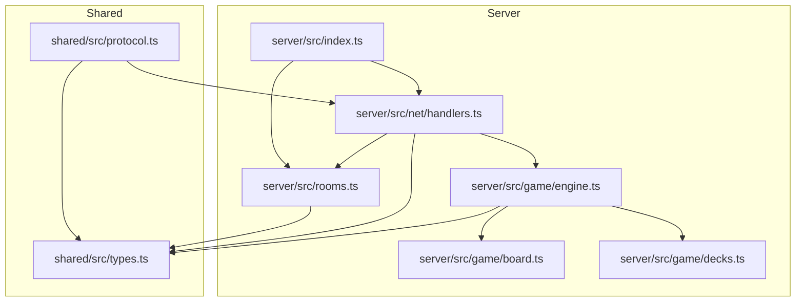

**Diagram sources**
- [index.ts:1-95](file://server/src/index.ts#L1-L95)
- [rooms.ts:1-211](file://server/src/rooms.ts#L1-L211)
- [handlers.ts:1-230](file://server/src/net/handlers.ts#L1-L230)
- [engine.ts:1-920](file://server/src/game/engine.ts#L1-L920)
- [board.ts:1-297](file://server/src/game/board.ts#L1-L297)
- [decks.ts:1-101](file://server/src/game/decks.ts#L1-L101)
- [types.ts:1-186](file://shared/src/types.ts#L1-L186)
- [protocol.ts:1-97](file://shared/src/protocol.ts#L1-L97)

**Section sources**
- [index.ts:1-95](file://server/src/index.ts#L1-L95)
- [README.md:1-122](file://README.md#L1-L122)

## Core Components
- RoomRegistry: central in-memory registry managing rooms, players, and socket-to-player mappings; handles room lifecycle, seat assignment, ready-state, options, and game initialization.
- GameEngine: authoritative state machine for the game, initialized by RoomRegistry when a room starts; emits state snapshots and events to clients.
- Socket.IO Handlers: bind client events to RoomRegistry and GameEngine operations; broadcast room and game state updates.
- Shared Types and Protocol: define room, player, game state, and event schemas; enforce payload validation.

Key responsibilities:
- Room lifecycle: create, join, claim seat, ready, set options, start game, leave, cleanup.
- Player session: attach/detach sockets, track connection state, map sockets to players.
- Seat assignment: enforce unique seat ownership, allow claiming a specific color, and vacate prior seats.
- Ready coordination: require host and all seated players to be ready before starting.
- Game start: initialize GameEngine with options, seats, and question deck; broadcast board and initial state.
- State synchronization: broadcast room state to all players in a room; emit game state and events.

**Section sources**
- [rooms.ts:39-211](file://server/src/rooms.ts#L39-L211)
- [engine.ts:76-114](file://server/src/game/engine.ts#L76-L114)
- [handlers.ts:15-176](file://server/src/net/handlers.ts#L15-L176)
- [types.ts:101-176](file://shared/src/types.ts#L101-L176)
- [protocol.ts:6-82](file://shared/src/protocol.ts#L6-L82)

## Architecture Overview
The room management architecture centers on RoomRegistry coordinating player sessions and room state, delegating authoritative gameplay to GameEngine. Socket.IO handlers translate client actions into room and engine operations, broadcasting updates to all room participants.

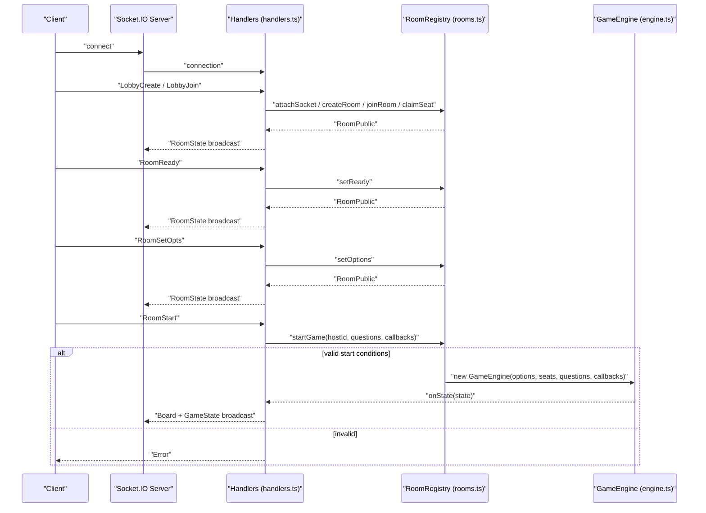

**Diagram sources**
- [handlers.ts:19-89](file://server/src/net/handlers.ts#L19-L89)
- [rooms.ts:78-151](file://server/src/rooms.ts#L78-L151)
- [engine.ts:99-114](file://server/src/game/engine.ts#L99-L114)

## Detailed Component Analysis

### RoomRegistry: Lifecycle, Sessions, Seats, Options, and Cleanup
RoomRegistry encapsulates:
- Rooms: keyed by short room ID, with fixed four seats and GameOptions.
- Players: keyed by stable player ID, tracking socket, nickname, connection state, and bot flag.
- Mappings: socket-to-player and player-to-room for quick lookups.
- Room lifecycle: create, join, claim seat, set ready, set options, start game, leave, cleanup.
- Room state exposure: publicRoom converts internal state to RoomPublic for clients.

Seat assignment logic:
- joinRoom places a player into the first empty seat; if already seated, it returns the room without changing seats.
- claimSeat assigns a player to a specific color, vacating any prior seat the player held.

Ready-state coordination:
- setReady toggles a seat’s ready flag.
- startGame requires at least two seated players and that all seated players are ready (or the host is exempt).

Room configuration:
- DEFAULT_OPTIONS defines takeoffNumbers, turnTimeoutMs, victory mode, and fillBots.
- setOptions validates host identity and updates room options.

Automatic cleanup:
- leaveRoom removes a player from their seat and clears ready flags; if no engine is running and no players remain, the room is deleted.

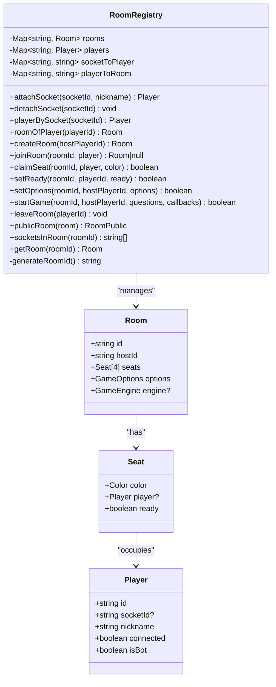

**Diagram sources**
- [rooms.ts:10-30](file://server/src/rooms.ts#L10-L30)
- [rooms.ts:39-211](file://server/src/rooms.ts#L39-L211)

**Section sources**
- [rooms.ts:39-211](file://server/src/rooms.ts#L39-L211)

### GameEngine: Initialization, State, and Events
GameEngine initializes the board, decks, and initial state, then drives the turn-based state machine. It exposes:
- Constructor: builds board, decks, and initial GameState.
- Public API: rollDice, chooseTakeoff, chooseMovePlane, playCard, combatRespond, qaAnswer.
- Callbacks: onState, onEvent, onGameOver to notify handlers.
- Snapshot: boardSnapshot for clients.

Initialization and options:
- startGame constructs GameEngine with room options, ordered seats, and question deck.
- Options influence takeoff numbers and other mechanics.

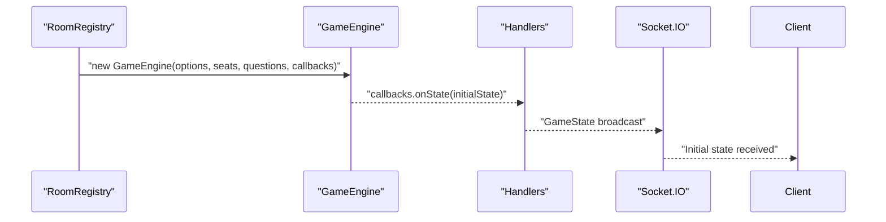

**Diagram sources**
- [rooms.ts:140-151](file://server/src/rooms.ts#L140-L151)
- [engine.ts:99-114](file://server/src/game/engine.ts#L99-L114)
- [handlers.ts:198-225](file://server/src/net/handlers.ts#L198-L225)

**Section sources**
- [engine.ts:76-114](file://server/src/game/engine.ts#L76-L114)
- [engine.ts:175-178](file://server/src/game/engine.ts#L175-L178)

### Socket.IO Handlers: Client Bindings and Broadcasts
Handlers bind client events to RoomRegistry and GameEngine operations:
- Connection: attaches socket to a player, emits Welcome with playerId.
- Lobby: create room, join room, claim seat, ready, set options.
- Game: roll, takeoff, move, play card, combat response, QA answer.
- Chat: broadcast chat messages within a room.
- Leave: remove player from room and broadcast updated state.
- Disconnect: detach socket and broadcast room state to reflect connection status.

Broadcasting:
- broadcastRoom emits RoomState to all sockets in a room.
- makeCallbacks emits GameState, dice/card/log events, and game over notifications.

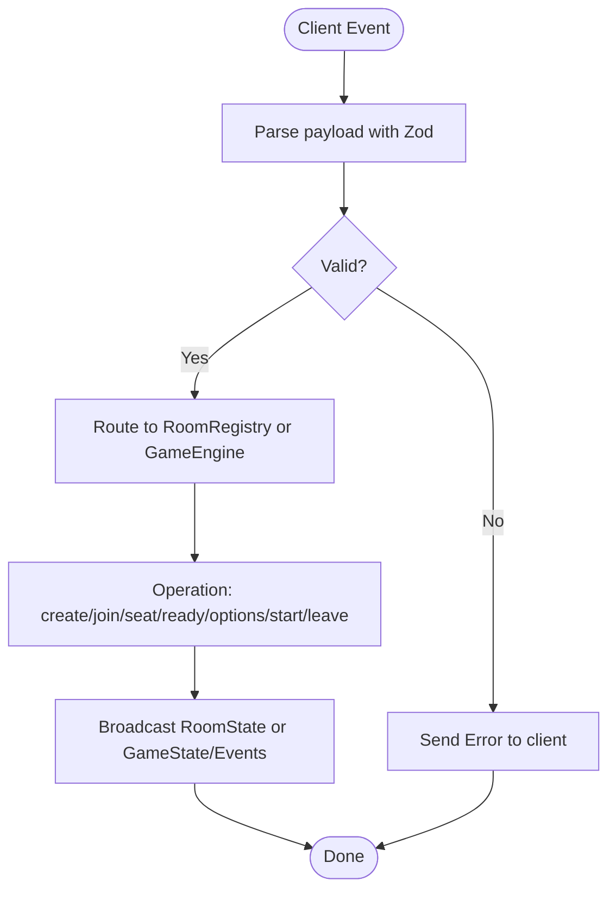

**Diagram sources**
- [handlers.ts:19-176](file://server/src/net/handlers.ts#L19-L176)
- [protocol.ts:25-65](file://shared/src/protocol.ts#L25-L65)

**Section sources**
- [handlers.ts:15-176](file://server/src/net/handlers.ts#L15-L176)
- [protocol.ts:6-82](file://shared/src/protocol.ts#L6-L82)

### Room State Synchronization and Ready Coordination
Room state synchronization:
- RoomRegistry.publicRoom produces RoomPublic for clients.
- broadcastRoom sends RoomState to all sockets in the room.
- Handlers broadcast RoomState after each relevant operation.

Ready coordination:
- setReady toggles seat.ready for a player.
- startGame checks that seated players are ready (host exempt) and that at least two players are seated.

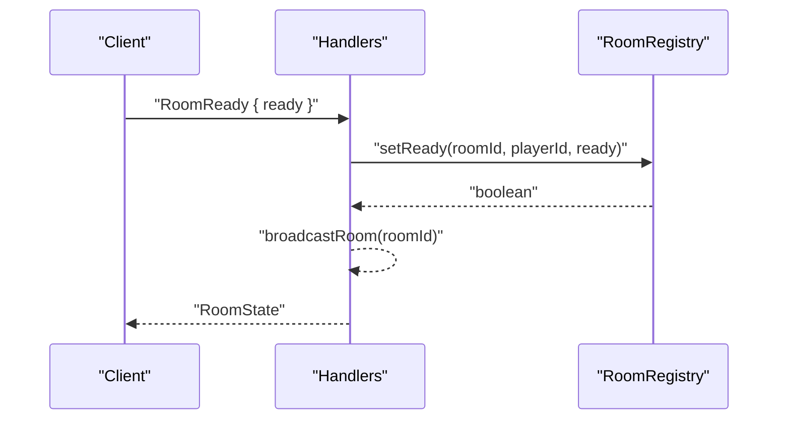

**Diagram sources**
- [handlers.ts:54-63](file://server/src/net/handlers.ts#L54-L63)
- [rooms.ts:123-130](file://server/src/rooms.ts#L123-L130)

**Section sources**
- [rooms.ts:123-130](file://server/src/rooms.ts#L123-L130)
- [handlers.ts:54-63](file://server/src/net/handlers.ts#L54-L63)

### Game Start Triggers and Engine Initialization
Game start conditions:
- Host must call RoomStart.
- At least two seated players must be present.
- All seated players must be ready (host exempt).

Engine initialization:
- startGame constructs GameEngine with options, seats, and question deck.
- Handlers emit Board and initial GameState after successful start.

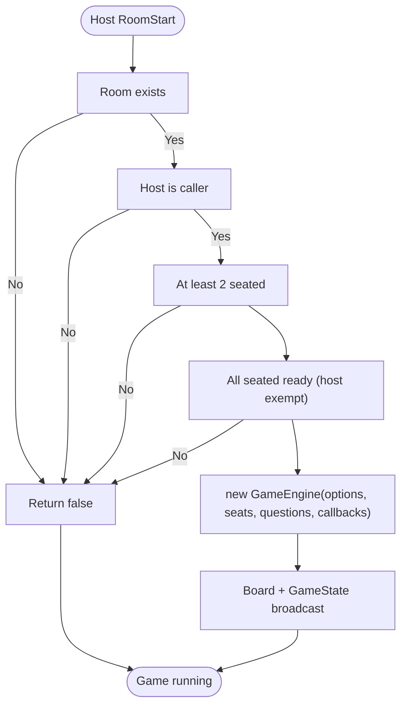

**Diagram sources**
- [rooms.ts:140-151](file://server/src/rooms.ts#L140-L151)
- [handlers.ts:76-89](file://server/src/net/handlers.ts#L76-L89)

**Section sources**
- [rooms.ts:140-151](file://server/src/rooms.ts#L140-L151)
- [handlers.ts:76-89](file://server/src/net/handlers.ts#L76-L89)

### Player Registration and Session Management
Player registration:
- attachSocket resolves or creates a Player record keyed by stable id, binds socketId, and marks connected.
- detachSocket marks a player as disconnected and removes socket mapping.
- playerBySocket retrieves a Player by socketId.
- roomOfPlayer returns the room a player is in.

Session behavior:
- On disconnect, detachSocket is called; room state is broadcast to reflect connection status.

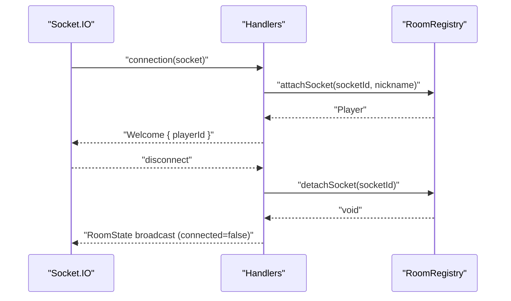

**Diagram sources**
- [handlers.ts:16-29](file://server/src/net/handlers.ts#L16-L29)
- [handlers.ts:166-174](file://server/src/net/handlers.ts#L166-L174)
- [rooms.ts:46-66](file://server/src/rooms.ts#L46-L66)

**Section sources**
- [rooms.ts:46-66](file://server/src/rooms.ts#L46-L66)
- [handlers.ts:16-29](file://server/src/net/handlers.ts#L16-L29)
- [handlers.ts:166-174](file://server/src/net/handlers.ts#L166-L174)

### Seat Assignment Logic
Seat assignment:
- joinRoom places a player into the first empty seat; if already seated, returns the room without changes.
- claimSeat assigns a player to a specific color, vacating any prior seat the player held.

Constraints:
- Each seat color is unique; only one player can occupy a given color.
- claimSeat ensures a player cannot claim a seat already occupied by another player.

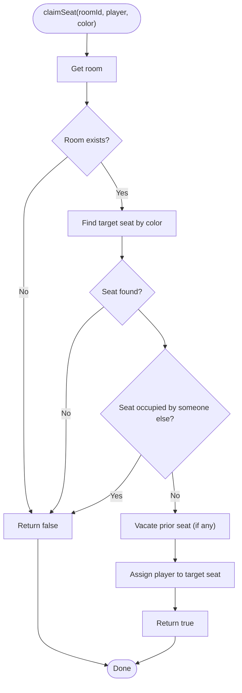

**Diagram sources**
- [rooms.ts:106-121](file://server/src/rooms.ts#L106-L121)

**Section sources**
- [rooms.ts:90-121](file://server/src/rooms.ts#L90-L121)

### Room Configuration Options, Player Limits, and Visibility Controls
Room configuration:
- DEFAULT_OPTIONS include takeoffNumbers, turnTimeoutMs, victory mode, and fillBots.
- setOptions validates host identity and updates room options.

Player limits:
- Fixed four seats per room; joinRoom places into the first empty seat.
- claimSeat enforces unique seat ownership.

Visibility:
- RoomPublic exposes room id, hostId, seats (with player info and ready flags), options, and inGame flag.
- Room state is broadcast to all sockets in the room; there is no separate “visibility” toggle.

**Section sources**
- [rooms.ts:32-37](file://server/src/rooms.ts#L32-L37)
- [rooms.ts:132-138](file://server/src/rooms.ts#L132-L138)
- [types.ts:119-125](file://shared/src/types.ts#L119-L125)
- [types.ts:170-176](file://shared/src/types.ts#L170-L176)

### Relationship Between Rooms and the Game Engine
Rooms initialize and manage game instances:
- RoomRegistry.startGame constructs GameEngine with options, seats, and question deck.
- Handlers pass EngineCallbacks to broadcast state and events.
- Once started, the room’s engine field holds the authoritative GameEngine instance.

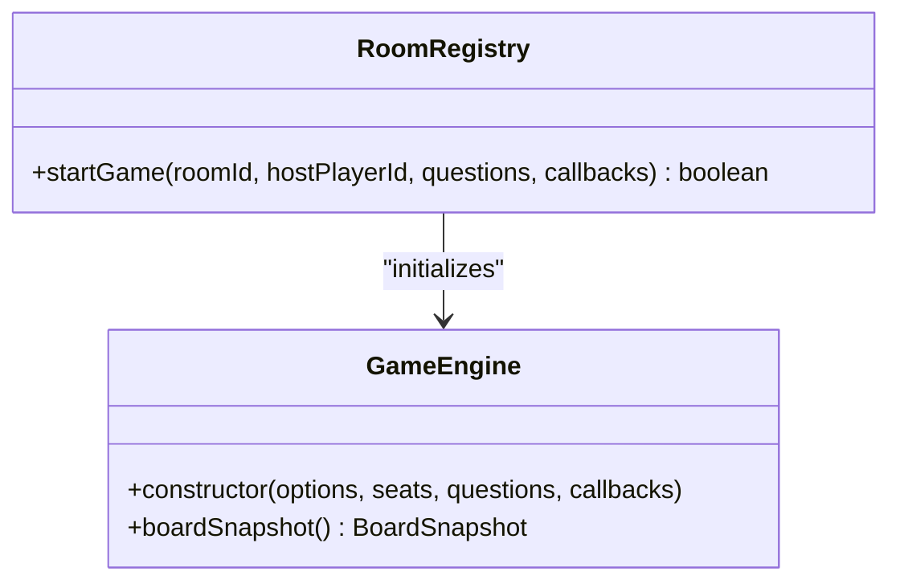

**Diagram sources**
- [rooms.ts:140-151](file://server/src/rooms.ts#L140-L151)
- [engine.ts:99-114](file://server/src/game/engine.ts#L99-L114)

**Section sources**
- [rooms.ts:140-151](file://server/src/rooms.ts#L140-L151)
- [engine.ts:99-114](file://server/src/game/engine.ts#L99-L114)

### Security Measures for Room Access Control and Player Authentication
Access control:
- setOptions requires the caller to be the room host.
- startGame requires the caller to be the room host and meets readiness conditions.
- joinRoom returns null if the room is full or does not exist.

Player authentication:
- attachSocket creates a stable player id and associates it with the connecting socket.
- There is no explicit authentication step; players are identified by socket and stable player id.

Security considerations:
- Host-only operations (set options, start game) are protected by host identity checks.
- Room state is broadcast to all sockets in the room; sensitive information is filtered via RoomPublic.

**Section sources**
- [rooms.ts:132-138](file://server/src/rooms.ts#L132-L138)
- [rooms.ts:140-151](file://server/src/rooms.ts#L140-L151)
- [handlers.ts:65-74](file://server/src/net/handlers.ts#L65-L74)
- [handlers.ts:76-89](file://server/src/net/handlers.ts#L76-L89)

## Dependency Analysis
RoomRegistry depends on shared types for room, player, and game state definitions. Handlers depend on RoomRegistry and GameEngine, and on shared protocol definitions for event names and payload schemas. The engine depends on board and deck builders.

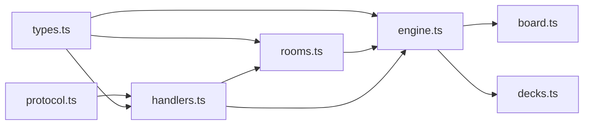

**Diagram sources**
- [protocol.ts:1-97](file://shared/src/protocol.ts#L1-L97)
- [types.ts:1-186](file://shared/src/types.ts#L1-L186)
- [handlers.ts:1-230](file://server/src/net/handlers.ts#L1-L230)
- [rooms.ts:1-211](file://server/src/rooms.ts#L1-L211)
- [engine.ts:1-920](file://server/src/game/engine.ts#L1-L920)
- [board.ts:1-297](file://server/src/game/board.ts#L1-L297)
- [decks.ts:1-101](file://server/src/game/decks.ts#L1-L101)

**Section sources**
- [protocol.ts:1-97](file://shared/src/protocol.ts#L1-L97)
- [types.ts:1-186](file://shared/src/types.ts#L1-L186)
- [handlers.ts:1-230](file://server/src/net/handlers.ts#L1-L230)
- [rooms.ts:1-211](file://server/src/rooms.ts#L1-L211)
- [engine.ts:1-920](file://server/src/game/engine.ts#L1-L920)

## Performance Considerations
- RoomRegistry uses in-memory maps for O(1) lookups of rooms, players, and mappings.
- Broadcasting room state to all sockets in a room is efficient; targeted card draw events are sent only to the affected seat.
- GameEngine clones state snapshots via structuredClone before emitting to clients, ensuring immutability and preventing accidental mutation.
- Automatic room cleanup prevents memory leaks by deleting empty rooms without an active engine.

[No sources needed since this section provides general guidance]

## Troubleshooting Guide
Common issues and resolutions:
- Room not found or full: joinRoom returns null; client should display an error and prompt to retry or create a new room.
- Player not in room: operations requiring a room context return early if no room is found.
- Host-only operations failing: ensure the caller is the room host for setOptions and startGame.
- Start game conditions not met: ensure at least two seated players and that all seated players are ready (host exempt).
- Disconnection handling: on disconnect, detachSocket updates connection status; room state is broadcast to reflect the change.

Error handling:
- Handlers send standardized Error payloads with code and message for malformed requests or invalid operations.
- startGame returns false when preconditions are not met; client receives an error indicating the need for two or more ready players.

**Section sources**
- [handlers.ts:31-41](file://server/src/net/handlers.ts#L31-L41)
- [handlers.ts:76-89](file://server/src/net/handlers.ts#L76-L89)
- [handlers.ts:227-229](file://server/src/net/handlers.ts#L227-L229)
- [rooms.ts:140-151](file://server/src/rooms.ts#L140-L151)

## Conclusion
The 导弹飞行棋 server implements a robust room management system centered on RoomRegistry, which orchestrates player sessions, seat assignments, ready-state coordination, and room configuration. Room state is synchronized to all participants, while the authoritative GameEngine manages gameplay deterministically. Handlers bind client actions to room and engine operations, broadcasting updates and enforcing access control. The system supports automatic room cleanup, graceful disconnection handling, and clear error signaling, providing a solid foundation for multiplayer gameplay.