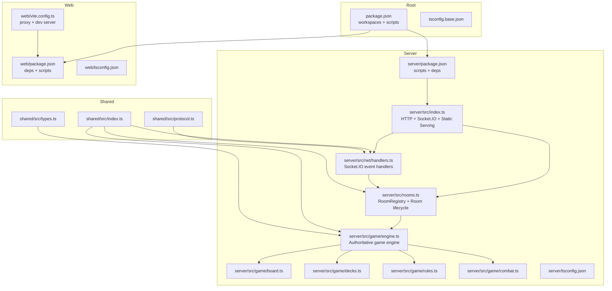
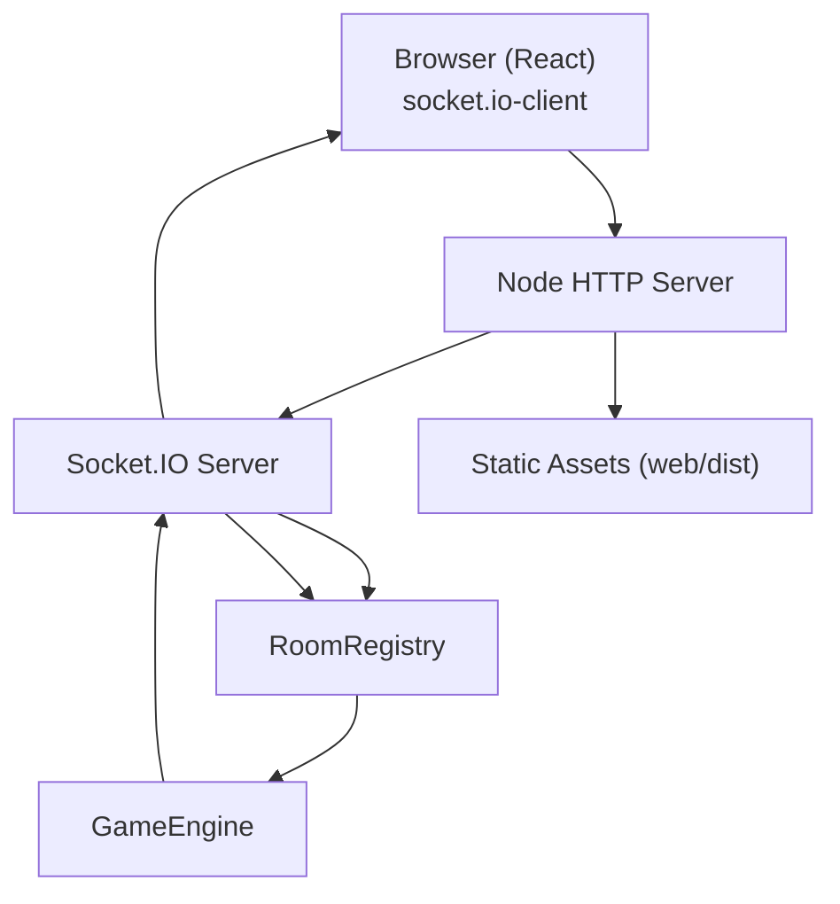
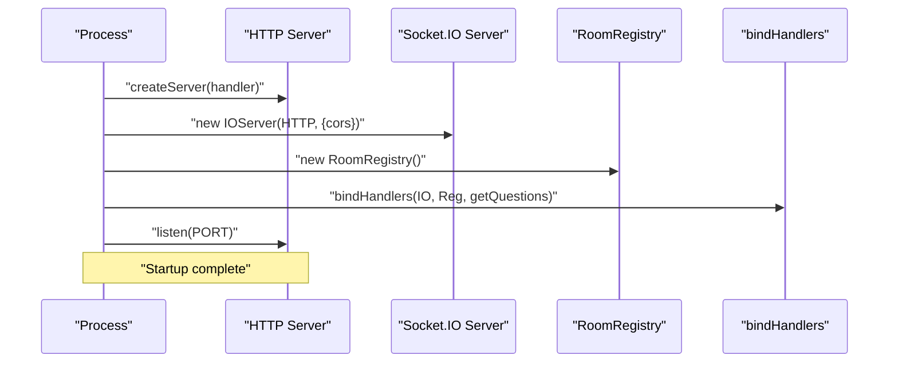
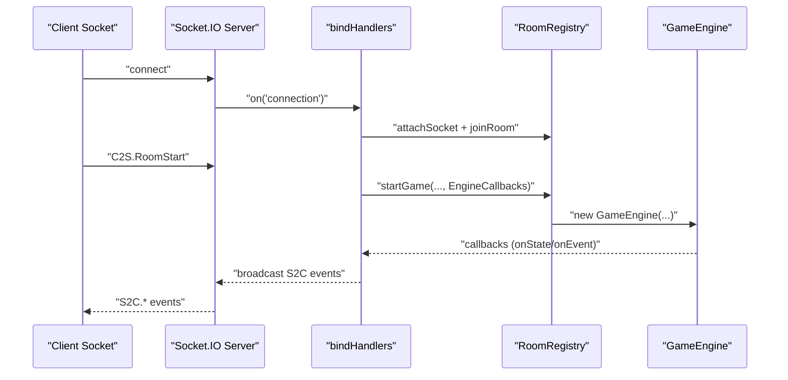
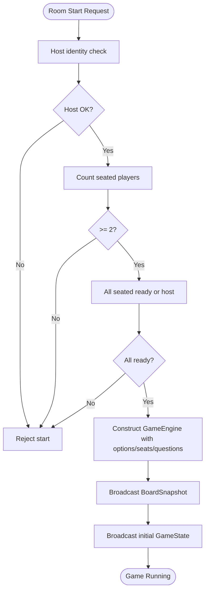
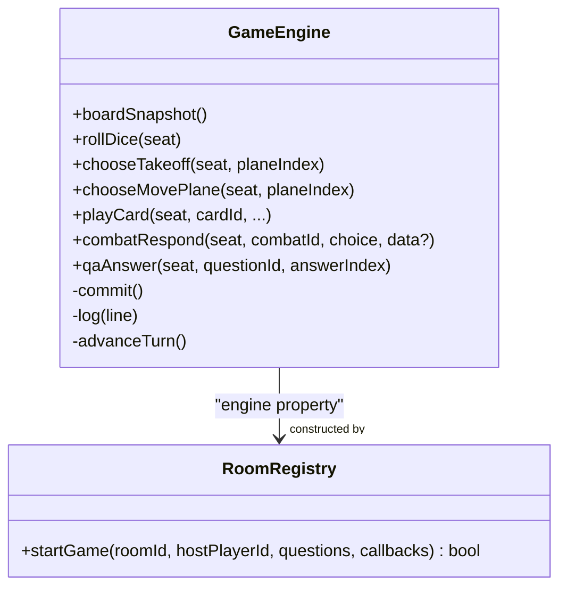
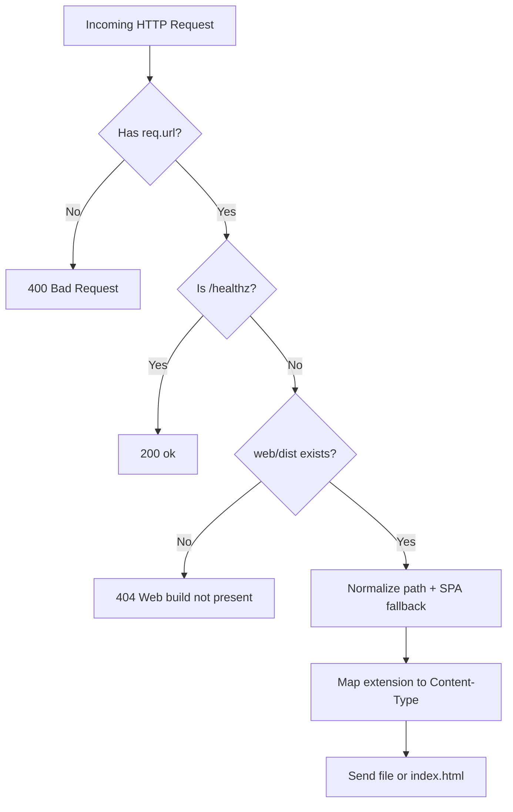
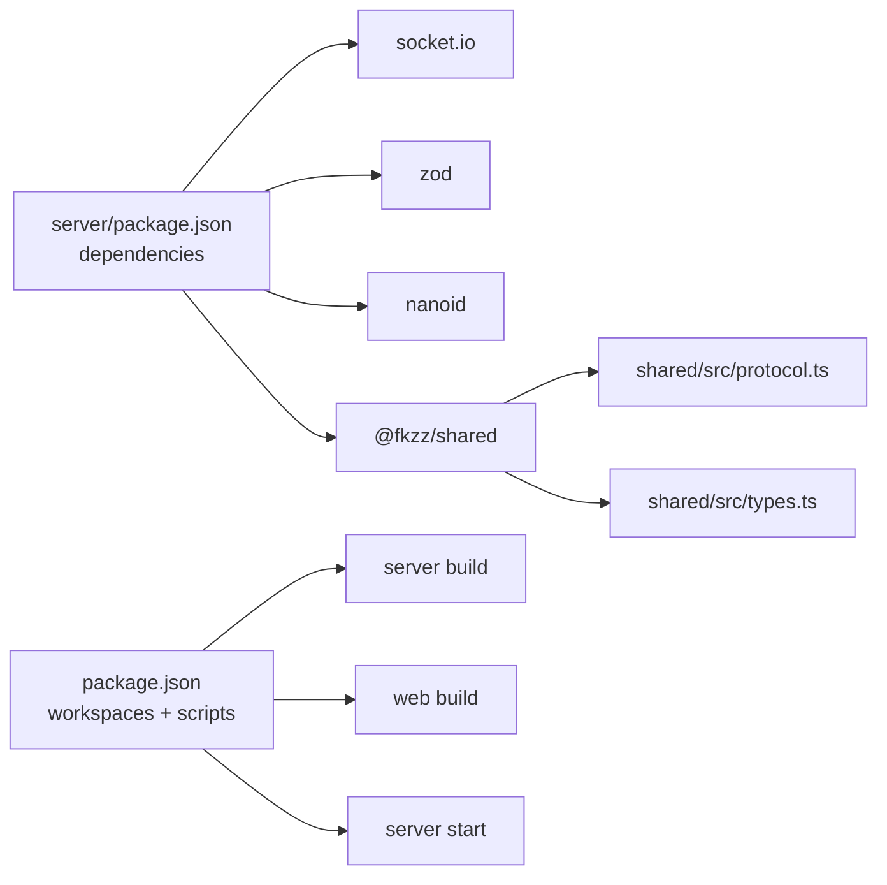

# Server Infrastructure

<cite>
**Referenced Files in This Document**
- [server/src/index.ts](file://server/src/index.ts)
- [server/src/net/handlers.ts](file://server/src/net/handlers.ts)
- [server/src/rooms.ts](file://server/src/rooms.ts)
- [server/src/game/engine.ts](file://server/src/game/engine.ts)
- [server/src/game/board.ts](file://server/src/game/board.ts)
- [server/src/game/decks.ts](file://server/src/game/decks.ts)
- [server/src/game/rules.ts](file://server/src/game/rules.ts)
- [server/src/game/combat.ts](file://server/src/game/combat.ts)
- [server/package.json](file://server/package.json)
- [server/tsconfig.json](file://server/tsconfig.json)
- [shared/src/index.ts](file://shared/src/index.ts)
- [shared/src/protocol.ts](file://shared/src/protocol.ts)
- [shared/src/types.ts](file://shared/src/types.ts)
- [package.json](file://package.json)
- [tsconfig.base.json](file://tsconfig.base.json)
- [web/vite.config.ts](file://web/vite.config.ts)
- [web/package.json](file://web/package.json)
- [web/tsconfig.json](file://web/tsconfig.json)
</cite>

## Table of Contents
1. [Introduction](#introduction)
2. [Project Structure](#project-structure)
3. [Core Components](#core-components)
4. [Architecture Overview](#architecture-overview)
5. [Detailed Component Analysis](#detailed-component-analysis)
6. [Dependency Analysis](#dependency-analysis)
7. [Performance Considerations](#performance-considerations)
8. [Troubleshooting Guide](#troubleshooting-guide)
9. [Conclusion](#conclusion)
10. [Appendices](#appendices)

## Introduction
This document describes the server infrastructure for the 导弹飞行棋 Socket.IO server. It explains how the server initializes, serves static assets in production, binds Socket.IO handlers, manages rooms and game lifecycle, and integrates with the authoritative game engine. It also covers TypeScript compilation, module resolution, build optimization, deployment considerations, port configuration, security headers, monitoring, logging, and error handling at the infrastructure level.

## Project Structure
The repository is a monorepo with three workspaces:
- server: Node.js/TypeScript Socket.IO server with static asset serving and game engine integration
- web: React/Vite frontend that connects via Socket.IO
- shared: TypeScript definitions and protocol shared between server and client

Key runtime entry point and build scripts are orchestrated from the root workspace.

**Diagram sources**
- [package.json:1-17](file://package.json#L1-L17)
- [server/src/index.ts:1-95](file://server/src/index.ts#L1-L95)
- [server/src/net/handlers.ts:1-230](file://server/src/net/handlers.ts#L1-L230)
- [server/src/rooms.ts:1-211](file://server/src/rooms.ts#L1-L211)
- [server/src/game/engine.ts:1-920](file://server/src/game/engine.ts#L1-L920)
- [server/src/game/board.ts:1-257](file://server/src/game/board.ts#L1-L257)
- [server/src/game/decks.ts:1-101](file://server/src/game/decks.ts#L1-L101)
- [server/src/game/rules.ts:1-198](file://server/src/game/rules.ts#L1-L198)
- [server/src/game/combat.ts:1-33](file://server/src/game/combat.ts#L1-L33)
- [shared/src/index.ts:1-3](file://shared/src/index.ts#L1-L3)
- [shared/src/protocol.ts:1-97](file://shared/src/protocol.ts#L1-L97)
- [shared/src/types.ts:1-186](file://shared/src/types.ts#L1-L186)
- [web/vite.config.ts:1-17](file://web/vite.config.ts#L1-L17)
- [web/package.json:1-27](file://web/package.json#L1-L27)
- [web/tsconfig.json:1-12](file://web/tsconfig.json#L1-L12)

**Section sources**
- [package.json:1-17](file://package.json#L1-L17)
- [tsconfig.base.json:1-17](file://tsconfig.base.json#L1-L17)

## Core Components
- Server entry point: creates an HTTP server, serves static assets in production, initializes Socket.IO with CORS, loads Q&A data, and binds handlers.
- Socket.IO handler binding: translates C2S events into room and engine operations, emits S2C events, and manages per-room broadcasts.
- Room registry: maintains player-to-room mapping, seat claiming, readiness, options, and game start conditions; constructs the authoritative engine.
- Game engine: authoritative state machine implementing turn-based mechanics, movement, collisions, specials, Q&A, card play, and combat.
- Shared protocol and types: strongly typed event names and payload schemas for bidirectional communication.

**Section sources**
- [server/src/index.ts:1-95](file://server/src/index.ts#L1-L95)
- [server/src/net/handlers.ts:1-230](file://server/src/net/handlers.ts#L1-L230)
- [server/src/rooms.ts:1-211](file://server/src/rooms.ts#L1-L211)
- [server/src/game/engine.ts:1-920](file://server/src/game/engine.ts#L1-L920)
- [shared/src/protocol.ts:1-97](file://shared/src/protocol.ts#L1-L97)
- [shared/src/types.ts:1-186](file://shared/src/types.ts#L1-L186)

## Architecture Overview
The server is a single-process Node.js application:
- HTTP server serves the built web client in production and responds to health checks.
- Socket.IO server runs on the same HTTP server, enabling real-time communication.
- Handlers translate client actions into room operations and engine transitions.
- The engine is constructed per room at game start and emits state updates and events.

**Diagram sources**
- [server/src/index.ts:43-84](file://server/src/index.ts#L43-L84)
- [server/src/net/handlers.ts:15-176](file://server/src/net/handlers.ts#L15-L176)
- [server/src/rooms.ts:140-151](file://server/src/rooms.ts#L140-L151)
- [server/src/game/engine.ts:76-114](file://server/src/game/engine.ts#L76-L114)

## Detailed Component Analysis

### Server Initialization and Lifecycle
- Port configuration: reads PORT from environment with a default fallback.
- Health endpoint: responds to /healthz for monitoring.
- Static asset serving: serves web/dist if present; otherwise returns 404 instructing to build.
- SPA fallback: routes unmatched routes to index.html.
- Content-type mapping: sets appropriate MIME types per extension.
- Socket.IO initialization: creates server with CORS enabled.
- Room registry and handler binding: constructs registry, loads Q&A, binds handlers.
- Startup logging: prints number of loaded Q&A rows.

**Diagram sources**
- [server/src/index.ts:14-94](file://server/src/index.ts#L14-L94)

**Section sources**
- [server/src/index.ts:14-94](file://server/src/index.ts#L14-L94)

### Socket.IO Configuration and Handler Binding
- Event-driven handler registration on connection.
- Zod-based payload validation for all incoming messages.
- Room-scoped broadcasting and per-seat sensitive events.
- Engine callbacks emit authoritative state and events to the room.

**Diagram sources**
- [server/src/net/handlers.ts:15-176](file://server/src/net/handlers.ts#L15-L176)
- [server/src/rooms.ts:140-151](file://server/src/rooms.ts#L140-L151)
- [server/src/game/engine.ts:63-74](file://server/src/game/engine.ts#L63-L74)

**Section sources**
- [server/src/net/handlers.ts:1-230](file://server/src/net/handlers.ts#L1-L230)
- [shared/src/protocol.ts:1-97](file://shared/src/protocol.ts#L1-L97)

### Room Registry and Game Lifecycle
- Player attachment to sockets, room creation, joining, and seat claiming.
- Ready flags and host-only options mutation.
- Game start validation: minimum players, readiness, and host identity.
- Engine instantiation with options, seats, and questions; emits board snapshot and initial state.

**Diagram sources**
- [server/src/rooms.ts:140-151](file://server/src/rooms.ts#L140-L151)
- [server/src/net/handlers.ts:76-89](file://server/src/net/handlers.ts#L76-L89)

**Section sources**
- [server/src/rooms.ts:1-211](file://server/src/rooms.ts#L1-L211)

### Game Engine: Authoritative State Machine
- Construction: builds board, decks, initializes state, and sets turn order.
- Turn lifecycle: dice roll, takeoff/move choices, special cells, combat, Q&A, card play.
- Events: dice, card drawn, log entries; all emitted via callbacks.
- End conditions: victory detection and game over callback.

**Diagram sources**
- [server/src/game/engine.ts:76-114](file://server/src/game/engine.ts#L76-L114)
- [server/src/rooms.ts:140-151](file://server/src/rooms.ts#L140-L151)

**Section sources**
- [server/src/game/engine.ts:1-920](file://server/src/game/engine.ts#L1-L920)

### Static File Serving Capabilities
- Production mode: serves built assets from web/dist.
- SPA routing: falls back to index.html for unmatched routes.
- Security: path normalization and prefix check to prevent directory traversal.
- Content-type mapping: supports HTML, JS, CSS, JSON, SVG, PNG, JPG/JPEG.

**Diagram sources**
- [server/src/index.ts:43-80](file://server/src/index.ts#L43-L80)

**Section sources**
- [server/src/index.ts:43-80](file://server/src/index.ts#L43-L80)

### Environment-Specific Configurations
- Port: configured via PORT environment variable with a default fallback.
- Development: Vite dev server proxies Socket.IO to the server on port 3001.
- Production: serve built web assets from web/dist.

**Section sources**
- [server/src/index.ts:14-16](file://server/src/index.ts#L14-L16)
- [web/vite.config.ts:6-15](file://web/vite.config.ts#L6-L15)

### Relationship Between Entry Point and Game Engine Initialization
- The entry point constructs the HTTP server, initializes Socket.IO, and binds handlers.
- Handlers call into RoomRegistry to start the game, which constructs GameEngine with options, seats, and questions.
- Engine callbacks are passed to the engine and used to emit authoritative state and events.

**Section sources**
- [server/src/index.ts:82-90](file://server/src/index.ts#L82-L90)
- [server/src/net/handlers.ts:76-89](file://server/src/net/handlers.ts#L76-L89)
- [server/src/rooms.ts:140-151](file://server/src/rooms.ts#L140-L151)

### TypeScript Compilation Setup, Module Resolution, and Build Optimization
- Base configuration: ES2022 target, ESNext modules, Bundler resolution, strictness, DOM libs.
- Server: compiles to dist with ESNext/Bundler; uses Node types.
- Web: compiles TS to JS then bundles with Vite; JSX enabled; noEmit.
- Root scripts: build shared first, then server, then web; dev runs server and web concurrently.

**Section sources**
- [tsconfig.base.json:1-17](file://tsconfig.base.json#L1-L17)
- [server/tsconfig.json:1-13](file://server/tsconfig.json#L1-L13)
- [web/tsconfig.json:1-12](file://web/tsconfig.json#L1-L12)
- [server/package.json:1-23](file://server/package.json#L1-L23)
- [web/package.json:1-27](file://web/package.json#L1-L27)
- [package.json:7-11](file://package.json#L7-L11)

## Dependency Analysis
- Runtime dependencies:
  - socket.io for real-time bidirectional communication
  - nanoid for identifiers
  - zod for payload validation
  - @fkzz/shared for shared types and protocol
- Dev dependencies:
  - tsx for dev watching
  - typescript and @types/node for type checking
- Build orchestration:
  - Root workspace builds shared, server, and web in order
  - Server start script runs the compiled Node entry

**Diagram sources**
- [server/package.json:11-21](file://server/package.json#L11-L21)
- [package.json:6-11](file://package.json#L6-L11)
- [shared/src/index.ts:1-3](file://shared/src/index.ts#L1-L3)

**Section sources**
- [server/package.json:1-23](file://server/package.json#L1-L23)
- [package.json:1-17](file://package.json#L1-L17)

## Performance Considerations
- In-memory rooms and engines: suitable for single-instance deployments; consider clustering or sharding for scale.
- Static asset serving: minimal overhead; ensure web/dist is built and served efficiently by a CDN or reverse proxy in production.
- Engine commit batching: the engine commits state after each transition; keep payloads minimal and rely on server-side authoritative state.
- Validation overhead: Zod parsing occurs on every event; keep payloads compact and avoid unnecessary nested structures.
- Deck shuffling: performed once per game; ensure sufficient entropy and avoid repeated shuffles during gameplay.

## Troubleshooting Guide
- Health checks: /healthz endpoint returns ok when server is running.
- Static build missing: if web/dist does not exist, the server returns a 404 with guidance to build.
- Path traversal protection: requests outside web/dist receive 403.
- SPA fallback: unmatched routes fall back to index.html; ensure client-side routing is configured correctly.
- CORS: enabled for all origins; adjust in production environments requiring stricter policies.
- Error emission: handlers emit S2C.Error with code and message for malformed payloads or invalid operations.

**Section sources**
- [server/src/index.ts:45-51](file://server/src/index.ts#L45-L51)
- [server/src/index.ts:54-64](file://server/src/index.ts#L54-L64)
- [server/src/net/handlers.ts:227-229](file://server/src/net/handlers.ts#L227-L229)

## Conclusion
The 导弹飞行棋 server is a focused, single-process implementation that combines HTTP static serving, Socket.IO real-time messaging, and an authoritative game engine. Its design emphasizes clear separation of concerns: the entry point initializes infrastructure, handlers mediate between clients and rooms, rooms orchestrate lifecycle and engine instantiation, and the engine enforces deterministic game state. With shared protocol and types, the system remains cohesive across server and client boundaries. For production, ensure proper port configuration, static asset availability, and CORS/security policies aligned with your deployment environment.

## Appendices

### Deployment Considerations
- Port configuration: set PORT for containerized or cloud deployments.
- Reverse proxy: place a CDN/reverse proxy in front of the server to serve web/dist and handle TLS termination.
- Health checks: use /healthz for uptime monitoring.
- Static assets: build the web workspace and deploy web/dist alongside the server binary.
- Security headers: add CSP, HSTS, and other headers via reverse proxy or middleware as needed.

### Monitoring and Logging
- Console logs: server startup and Q&A load status are logged to stdout.
- Socket.IO events: authoritative state and events are emitted to clients; monitor via client-side logging or external observability tools.
- Error handling: malformed payloads and invalid operations emit structured errors to clients.

### Security Headers
- Current configuration enables broad CORS; tailor CORS.origin to trusted origins in production.
- Add security headers (e.g., CSP, X-Frame-Options, X-Content-Type-Options) via reverse proxy or middleware.