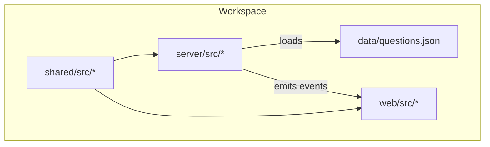
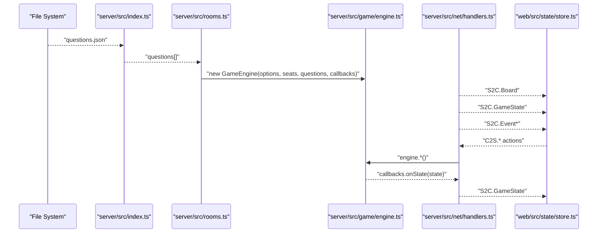
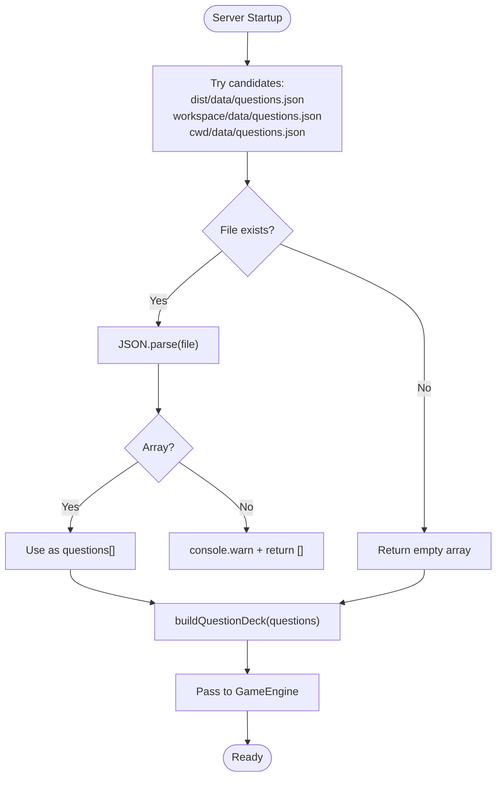
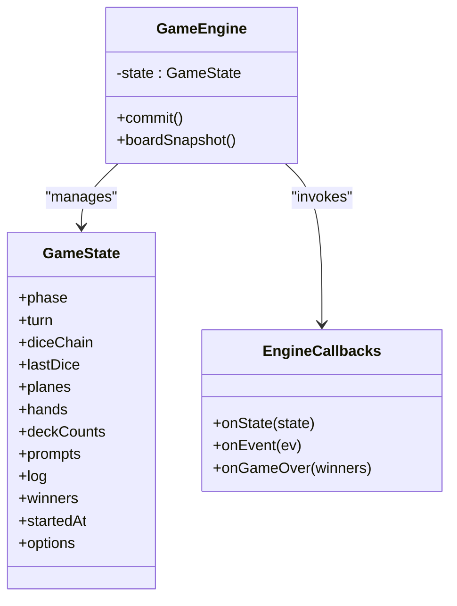
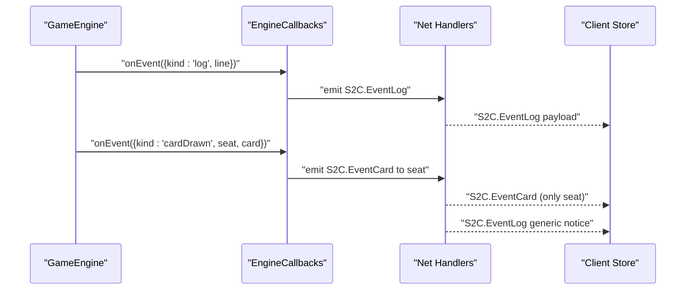
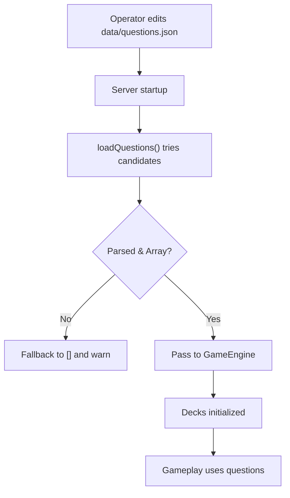
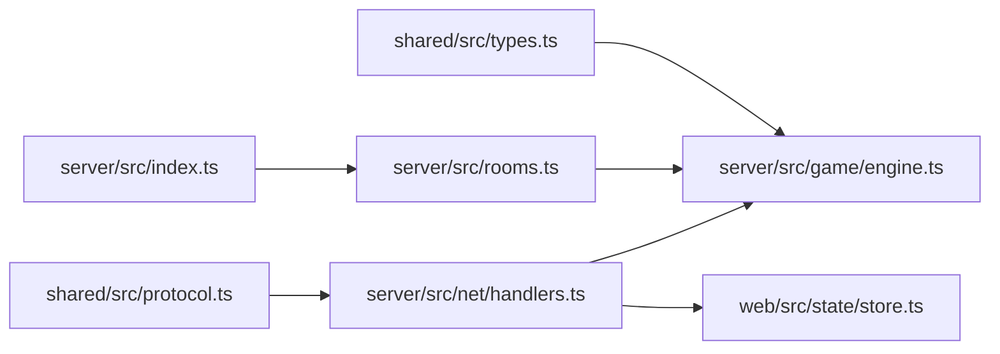
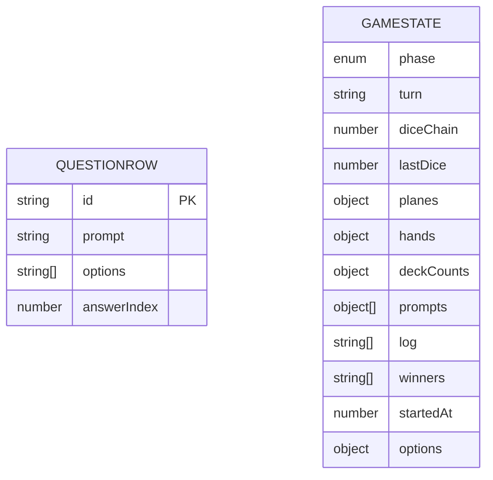

# Data Management

<cite>
**Referenced Files in This Document**
- [README.md](file://README.md)
- [package.json](file://package.json)
- [data/questions.json](file://data/questions.json)
- [server/src/index.ts](file://server/src/index.ts)
- [server/src/game/engine.ts](file://server/src/game/engine.ts)
- [server/src/game/decks.ts](file://server/src/game/decks.ts)
- [server/src/game/types.ts](file://server/src/game/types.ts)
- [server/src/net/handlers.ts](file://server/src/net/handlers.ts)
- [server/src/rooms.ts](file://server/src/rooms.ts)
- [shared/src/types.ts](file://shared/src/types.ts)
- [shared/src/protocol.ts](file://shared/src/protocol.ts)
- [web/src/state/store.ts](file://web/src/state/store.ts)
</cite>

## Table of Contents
1. [Introduction](#introduction)
2. [Project Structure](#project-structure)
3. [Core Components](#core-components)
4. [Architecture Overview](#architecture-overview)
5. [Detailed Component Analysis](#detailed-component-analysis)
6. [Dependency Analysis](#dependency-analysis)
7. [Performance Considerations](#performance-considerations)
8. [Troubleshooting Guide](#troubleshooting-guide)
9. [Conclusion](#conclusion)
10. [Appendices](#appendices)

## Introduction
This document explains the data management architecture for the 导弹飞行棋 project, focusing on:
- Question database system: JSON schema, loading, validation, and integration
- Game state persistence and serialization
- Event logging and distribution
- Data flow from file storage to runtime usage
- Random number generation security and fairness
- State cloning and data lifecycle management
- Configuration options for game parameters
- Backup and content management strategies
- Integrity, security, and performance considerations

## Project Structure
The repository is organized into three workspaces:
- shared: shared domain types and protocol definitions
- server: authoritative game engine, networking, and room management
- web: client UI and state management

Key data-related assets:
- data/questions.json: external question bank supplied by operators
- server loads questions at startup and exposes them to the game engine
- Client state is synchronized via Socket.IO events and stored locally in the browser

**Diagram sources**
- [server/src/index.ts:18-38](file://server/src/index.ts#L18-L38)
- [server/src/net/handlers.ts:15-89](file://server/src/net/handlers.ts#L15-L89)
- [web/src/state/store.ts:60-87](file://web/src/state/store.ts#L60-L87)

**Section sources**
- [README.md:5-14](file://README.md#L5-L14)
- [package.json:6-11](file://package.json#L6-L11)

## Core Components
- Question database: JSON file with a strict schema; loaded at server startup and injected into the game engine
- Game engine: authoritative state machine that manages turns, moves, combat, library challenges, and logs
- Networking: Socket.IO handlers translate client actions into engine transitions and emit snapshots/events
- Client store: synchronizes server snapshots and local UI state

Key data structures and responsibilities:
- QuestionRow: defines the schema for each question
- GameState: central runtime state persisted across turns and emitted to clients
- Decks: collections for missiles, radars, rewards, punishments, and questions with draw/discard semantics
- RoomRegistry: manages room lifecycle and starts engines with the current question set

**Section sources**
- [shared/src/types.ts:180-185](file://shared/src/types.ts#L180-L185)
- [server/src/game/engine.ts:153-166](file://server/src/game/engine.ts#L153-L166)
- [server/src/game/decks.ts:18-37](file://server/src/game/decks.ts#L18-L37)
- [server/src/rooms.ts:140-151](file://server/src/rooms.ts#L140-L151)

## Architecture Overview
The system follows an authoritative server model:
- Server loads questions from disk at startup
- Clients connect and receive board and state snapshots
- Actions are validated server-side; each state change triggers a snapshot broadcast
- Events (dice, card draws, logs) are emitted to clients with privacy controls

**Diagram sources**
- [server/src/index.ts:18-38](file://server/src/index.ts#L18-L38)
- [server/src/rooms.ts:140-151](file://server/src/rooms.ts#L140-L151)
- [server/src/game/engine.ts:175-178](file://server/src/game/engine.ts#L175-L178)
- [server/src/net/handlers.ts:15-89](file://server/src/net/handlers.ts#L15-L89)
- [web/src/state/store.ts:60-87](file://web/src/state/store.ts#L60-L87)

## Detailed Component Analysis

### Question Database System
- Schema: QuestionRow with id, prompt, options, answerIndex
- Loading: The server attempts multiple candidate paths to locate questions.json, parses JSON, validates array shape, and logs loaded count
- Integration: Loaded questions are passed into the GameEngine constructor and used to build the question deck

**Diagram sources**
- [server/src/index.ts:18-38](file://server/src/index.ts#L18-L38)
- [server/src/game/decks.ts:88-90](file://server/src/game/decks.ts#L88-L90)
- [server/src/rooms.ts:149](file://server/src/rooms.ts#L149)

**Section sources**
- [README.md:60-80](file://README.md#L60-L80)
- [shared/src/types.ts:180-185](file://shared/src/types.ts#L180-L185)
- [server/src/index.ts:18-38](file://server/src/index.ts#L18-L38)
- [data/questions.json:1-2](file://data/questions.json#L1-2)

### Game State Persistence and Serialization
- State snapshot: After every validated action, the engine commits a deep clone of the current GameState and emits it to all clients
- Snapshot shape: Includes phase, turn, dice chain, planes, hands, deck counts, prompts, log, winners, timestamps, and options
- Cloning: Uses structuredClone to ensure immutability and prevent accidental mutation of the authoritative state

**Diagram sources**
- [server/src/game/engine.ts:153-166](file://server/src/game/engine.ts#L153-L166)
- [server/src/game/engine.ts:63-74](file://server/src/game/engine.ts#L63-L74)
- [server/src/game/engine.ts:175-178](file://server/src/game/engine.ts#L175-L178)

**Section sources**
- [server/src/game/engine.ts:175-178](file://server/src/game/engine.ts#L175-L178)
- [server/src/game/engine.ts:153-166](file://server/src/game/engine.ts#L153-L166)

### Event Logging and Privacy
- Logs: Maintained as a capped array; oldest entries are trimmed when exceeding capacity
- Events: Dedicated event channels for dice, card draws, and logs
- Privacy: Card draws are delivered privately to the drawing seat; others receive a generic notice

**Diagram sources**
- [server/src/game/engine.ts:170-174](file://server/src/game/engine.ts#L170-L174)
- [server/src/net/handlers.ts:198-225](file://server/src/net/handlers.ts#L198-L225)
- [web/src/state/store.ts:80-87](file://web/src/state/store.ts#L80-L87)

**Section sources**
- [server/src/game/engine.ts:170-174](file://server/src/game/engine.ts#L170-L174)
- [server/src/net/handlers.ts:203-219](file://server/src/net/handlers.ts#L203-L219)
- [web/src/state/store.ts:80-87](file://web/src/state/store.ts#L80-L87)

### Data Flow: File to Runtime
- File location: The server probes multiple locations for questions.json
- Validation: JSON parsing and array check; warnings logged on failure
- Injection: Questions passed to GameEngine; deck built and used during gameplay
- Restart requirement: Changes require server restart to reload

**Diagram sources**
- [server/src/index.ts:18-38](file://server/src/index.ts#L18-L38)
- [server/src/game/decks.ts:88-90](file://server/src/game/decks.ts#L88-L90)

**Section sources**
- [server/src/index.ts:18-38](file://server/src/index.ts#L18-L38)
- [README.md:80-81](file://README.md#L80-L81)

### Randomness and Security
- RNG source: Server-side crypto.randomInt for deterministic yet unpredictable outcomes
- Client isolation: No client-side randomness; all randomness is server-generated and communicated via events
- Fairness: Centralized RNG prevents manipulation and ensures identical behavior across sessions

**Section sources**
- [README.md:109](file://README.md#L109)
- [server/src/net/handlers.ts:204-216](file://server/src/net/handlers.ts#L204-L216)

### State Cloning and Lifecycle
- Cloning: structuredClone is used to emit immutable snapshots
- Lifecycle: commit updates deck counts, pushes logs, and emits state; subsequent actions mutate the cloned state safely
- Garbage collection: Rooms without players are removed; engines are destroyed when rooms are cleaned up

**Section sources**
- [server/src/game/engine.ts:175-178](file://server/src/game/engine.ts#L175-L178)
- [server/src/rooms.ts:165-169](file://server/src/rooms.ts#L165-L169)

### Configuration Options and Content Management
- Room options: takeoffNumbers, turnTimeoutMs, victory mode, timeLimitMs, fillBots
- Question content: managed externally via questions.json; restart required after edits
- Backup strategy: maintain git-controlled copies of questions.json; export/import as needed

**Section sources**
- [shared/src/types.ts:119-125](file://shared/src/types.ts#L119-L125)
- [shared/src/protocol.ts:37-43](file://shared/src/protocol.ts#L37-L43)
- [README.md:60-81](file://README.md#L60-L81)

## Dependency Analysis
The server depends on shared types and protocol definitions. Networking binds handlers to the room registry and engine. The client consumes typed payloads and maintains a local store.

**Diagram sources**
- [shared/src/types.ts:1-186](file://shared/src/types.ts#L1-L186)
- [shared/src/protocol.ts:1-97](file://shared/src/protocol.ts#L1-L97)
- [server/src/index.ts:1-95](file://server/src/index.ts#L1-L95)
- [server/src/rooms.ts:1-211](file://server/src/rooms.ts#L1-L211)
- [server/src/game/engine.ts:1-920](file://server/src/game/engine.ts#L1-L920)
- [server/src/net/handlers.ts:1-230](file://server/src/net/handlers.ts#L1-L230)
- [web/src/state/store.ts:1-164](file://web/src/state/store.ts#L1-L164)

**Section sources**
- [shared/src/types.ts:1-186](file://shared/src/types.ts#L1-L186)
- [shared/src/protocol.ts:1-97](file://shared/src/protocol.ts#L1-L97)
- [server/src/index.ts:1-95](file://server/src/index.ts#L1-L95)
- [server/src/rooms.ts:1-211](file://server/src/rooms.ts#L1-L211)
- [server/src/game/engine.ts:1-920](file://server/src/game/engine.ts#L1-L920)
- [server/src/net/handlers.ts:1-230](file://server/src/net/handlers.ts#L1-L230)
- [web/src/state/store.ts:1-164](file://web/src/state/store.ts#L1-L164)

## Performance Considerations
- Snapshot size: Keep GameState compact; avoid storing large transient data
- Log trimming: Maintain a bounded log window to limit memory growth
- Deck shuffling: Fisher-Yates shuffle is O(n); ensure minimal overhead during initialization
- Network bandwidth: Emit only necessary fields; rely on typed payloads to reduce noise
- Large datasets: For extensive question banks, consider pre-sharding or caching strategies at the server level

[No sources needed since this section provides general guidance]

## Troubleshooting Guide
Common issues and resolutions:
- Questions not loading: Verify questions.json exists in one of the candidate paths; check JSON validity and array shape; restart server after edits
- Client not receiving state: Confirm Socket.IO connectivity and that handlers are bound; ensure room and engine are created
- Privacy violations: Ensure card draw privacy is enforced by delivering concrete card details only to the drawing seat
- Excessive memory usage: Reduce log window or prune older entries; monitor deck sizes

**Section sources**
- [server/src/index.ts:18-38](file://server/src/index.ts#L18-L38)
- [server/src/net/handlers.ts:203-219](file://server/src/net/handlers.ts#L203-L219)
- [server/src/game/engine.ts:170-174](file://server/src/game/engine.ts#L170-L174)

## Conclusion
The 导弹飞行棋 data management system centers on a robust, authoritative server that:
- Loads and validates the question bank from a JSON file
- Maintains a compact, immutable GameState and emits snapshots via structuredClone
- Emits privacy-aware events and enforces centralized randomness
- Provides a clear data lifecycle from file to runtime and integrates seamlessly with the client store

[No sources needed since this section summarizes without analyzing specific files]

## Appendices

### Data Model: QuestionRow and GameState

**Diagram sources**
- [shared/src/types.ts:180-185](file://shared/src/types.ts#L180-L185)
- [server/src/game/engine.ts:153-166](file://server/src/game/engine.ts#L153-L166)

### API Surface: Networking and Payloads
- Client-to-server events: lobby, room, turn actions, combat, QA, chat
- Server-to-client events: welcome, room state, board, game state, events, chat, errors
- Payloads are validated using Zod schemas

**Section sources**
- [shared/src/protocol.ts:6-82](file://shared/src/protocol.ts#L6-L82)
- [server/src/net/handlers.ts:15-176](file://server/src/net/handlers.ts#L15-L176)