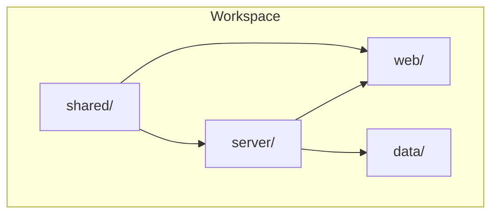
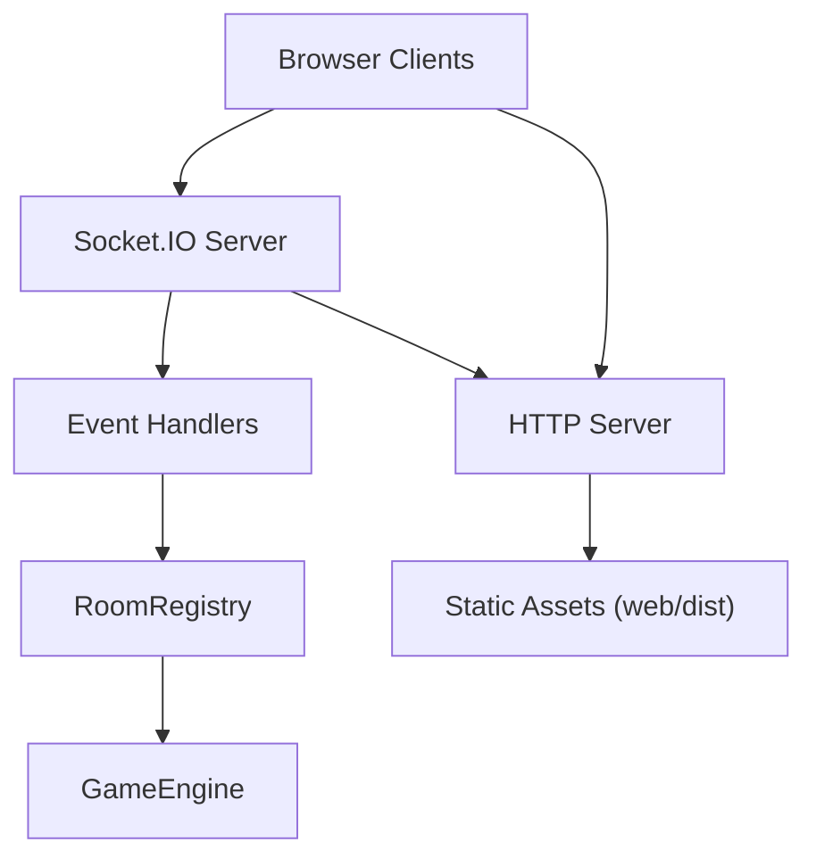
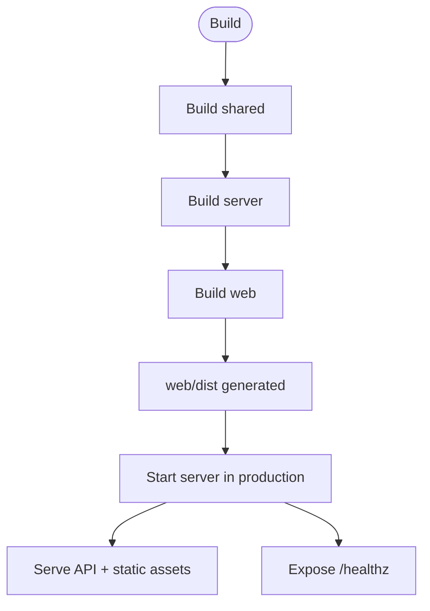
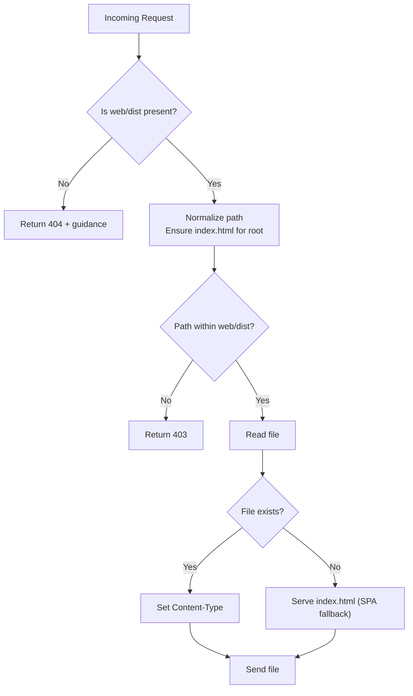
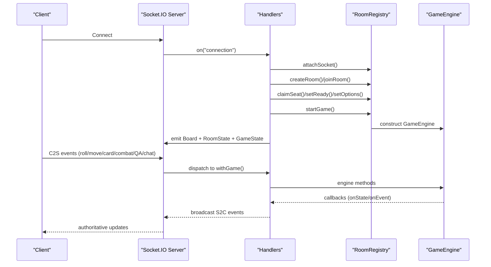
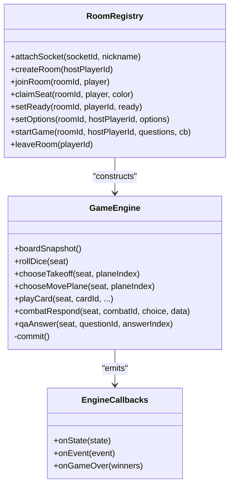
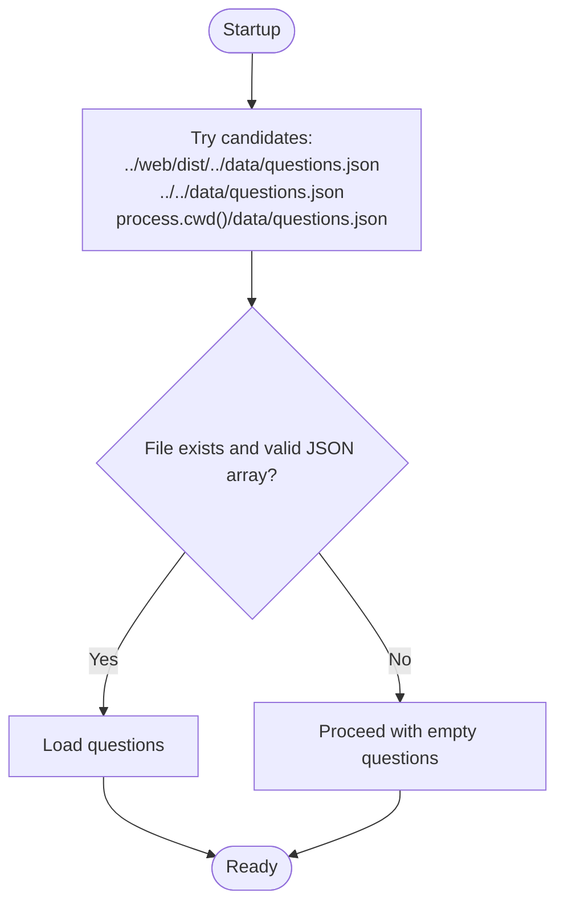
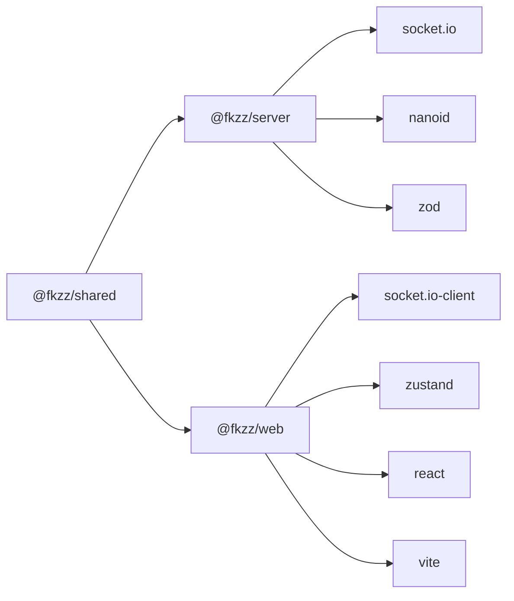

# Deployment & Operations

<cite>
**Referenced Files in This Document**
- [README.md](file://README.md)
- [package.json](file://package.json)
- [server/package.json](file://server/package.json)
- [web/package.json](file://web/package.json)
- [server/src/index.ts](file://server/src/index.ts)
- [web/vite.config.ts](file://web/vite.config.ts)
- [server/src/rooms.ts](file://server/src/rooms.ts)
- [server/src/net/handlers.ts](file://server/src/net/handlers.ts)
- [server/src/game/engine.ts](file://server/src/game/engine.ts)
- [shared/src/protocol.ts](file://shared/src/protocol.ts)
- [shared/src/types.ts](file://shared/src/types.ts)
</cite>

## Table of Contents
1. [Introduction](#introduction)
2. [Project Structure](#project-structure)
3. [Core Components](#core-components)
4. [Architecture Overview](#architecture-overview)
5. [Detailed Component Analysis](#detailed-component-analysis)
6. [Dependency Analysis](#dependency-analysis)
7. [Performance Considerations](#performance-considerations)
8. [Troubleshooting Guide](#troubleshooting-guide)
9. [Conclusion](#conclusion)
10. [Appendices](#appendices)

## Introduction
This document provides comprehensive deployment and operations guidance for 导弹飞行棋 (Air Defense Combat Flying Chess). It covers build process optimization, production server configuration, static asset serving, containerization options, load balancing and horizontal scaling, monitoring and maintenance, security hardening, deployment automation, rollback strategies, disaster recovery, capacity planning, and operational troubleshooting.

## Project Structure
The project is a monorepo workspace composed of three packages:
- shared: shared TypeScript protocol and types used by both server and web.
- server: Node.js + Socket.IO authoritative game server with integrated static asset serving.
- web: React + Vite client that builds static assets served by the server in production.

Key runtime and build behaviors:
- Production startup serves both API and static assets from a single Node.js process.
- Static assets are served from the web/dist directory built by the web package.
- Health checks are exposed via a dedicated endpoint.
- The server loads a Q&A bank at startup from a data file located at the workspace root.

**Diagram sources**
- [README.md:5-14](file://README.md#L5-L14)
- [package.json:6](file://package.json#L6)

**Section sources**
- [README.md:5-14](file://README.md#L5-L14)
- [package.json:6](file://package.json#L6)

## Core Components
- Server entrypoint and static asset server
  - Serves API and static assets from a single Node.js HTTP server.
  - Provides health check endpoint.
  - Loads Q&A bank from workspace-root data directory.
- Socket.IO integration
  - Handles lobby, room, turn, combat, QA, and chat events.
  - Emits authoritative state and event streams to clients.
- Room registry and lifecycle
  - Manages player sessions, room creation, seating, readiness, and game start conditions.
- Game engine
  - Authoritative state machine implementing turn-based gameplay, movement, collisions, special cells, card draws, combat resolution, and Q&A challenges.
  - Emits structured state snapshots and event logs.

Operational highlights:
- Single binary deployment: server/dist/index.js is the production entrypoint.
- Static assets: web/dist is served under the server’s HTTP route.
- Health endpoint: /healthz for liveness/readiness probes.

**Section sources**
- [server/src/index.ts:40-95](file://server/src/index.ts#L40-L95)
- [server/src/net/handlers.ts:15-176](file://server/src/net/handlers.ts#L15-L176)
- [server/src/rooms.ts:39-211](file://server/src/rooms.ts#L39-L211)
- [server/src/game/engine.ts:76-180](file://server/src/game/engine.ts#L76-L180)
- [README.md:42-49](file://README.md#L42-L49)

## Architecture Overview
The production architecture combines a single Node.js process hosting:
- An HTTP server that serves static assets from web/dist.
- A Socket.IO server for real-time gameplay.
- The authoritative game engine and room registry.

**Diagram sources**
- [server/src/index.ts:43-84](file://server/src/index.ts#L43-L84)
- [server/src/net/handlers.ts:15-176](file://server/src/net/handlers.ts#L15-L176)
- [server/src/rooms.ts:39-211](file://server/src/rooms.ts#L39-L211)
- [server/src/game/engine.ts:76-114](file://server/src/game/engine.ts#L76-L114)

## Detailed Component Analysis

### Build and Production Startup
- Build pipeline
  - Workspaces: shared → server → web.
  - Server build produces server/dist/index.js.
  - Web build produces web/dist for static assets.
- Production startup
  - Start command runs the server entrypoint which serves both API and static assets.
  - Environment variable PORT controls the listening port.
  - Health endpoint /healthz returns a simple OK response.

**Diagram sources**
- [package.json:9](file://package.json#L9)
- [server/src/index.ts:14](file://server/src/index.ts#L14)
- [server/src/index.ts:45](file://server/src/index.ts#L45)

**Section sources**
- [README.md:21-26](file://README.md#L21-L26)
- [README.md:42-49](file://README.md#L42-L49)
- [package.json:9](file://package.json#L9)
- [server/src/index.ts:14](file://server/src/index.ts#L14)
- [server/src/index.ts:45](file://server/src/index.ts#L45)

### Static Asset Serving Strategy
- The server’s HTTP handler serves files from web/dist.
- SPA fallback: missing routes fall back to index.html.
- Content-Type mapping supports HTML, JS, CSS, JSON, SVG, PNG, JPEG.
- Security: path traversal guard ensures requested file stays within web/dist.

**Diagram sources**
- [server/src/index.ts:43-80](file://server/src/index.ts#L43-L80)

**Section sources**
- [server/src/index.ts:43-80](file://server/src/index.ts#L43-L80)

### Networking and Real-Time Events
- Socket.IO server configuration
  - CORS origin is set broadly for development convenience.
  - WebSocket upgrades are proxied by the Vite dev server during local development.
- Event binding
  - Handlers manage lobby creation/join, room actions, turns, card plays, combat responses, QA answers, and chat.
  - Engine callbacks emit authoritative state and events.

**Diagram sources**
- [server/src/net/handlers.ts:15-176](file://server/src/net/handlers.ts#L15-L176)
- [server/src/rooms.ts:140-151](file://server/src/rooms.ts#L140-L151)
- [server/src/game/engine.ts:175-178](file://server/src/game/engine.ts#L175-L178)

**Section sources**
- [server/src/net/handlers.ts:15-176](file://server/src/net/handlers.ts#L15-L176)
- [server/src/rooms.ts:140-151](file://server/src/rooms.ts#L140-L151)
- [server/src/game/engine.ts:175-178](file://server/src/game/engine.ts#L175-L178)

### Game Engine and Data Model
- Authoritative state machine
  - Turn lifecycle, dice rolling, takeoff/move logic, collisions, special cells, card draws, combat, QA, and win conditions.
  - Structured state snapshots are emitted after every state change.
- Types and protocol
  - Strongly typed events and payloads defined with Zod schemas.
  - Shared types define board layout, planes, hands, prompts, and game options.

**Diagram sources**
- [server/src/game/engine.ts:76-180](file://server/src/game/engine.ts#L76-L180)
- [server/src/rooms.ts:140-151](file://server/src/rooms.ts#L140-L151)
- [shared/src/protocol.ts:6-82](file://shared/src/protocol.ts#L6-L82)
- [shared/src/types.ts:153-166](file://shared/src/types.ts#L153-L166)

**Section sources**
- [server/src/game/engine.ts:76-180](file://server/src/game/engine.ts#L76-L180)
- [shared/src/protocol.ts:6-82](file://shared/src/protocol.ts#L6-L82)
- [shared/src/types.ts:153-166](file://shared/src/types.ts#L153-L166)

### Q&A Bank and Data Loading
- The server attempts to load the Q&A bank from multiple candidate paths at startup.
- If absent, the server proceeds with zero questions.

**Diagram sources**
- [server/src/index.ts:19-38](file://server/src/index.ts#L19-L38)

**Section sources**
- [server/src/index.ts:19-38](file://server/src/index.ts#L19-L38)

## Dependency Analysis
- Internal dependencies
  - server depends on shared for protocol and types.
  - web depends on shared for protocol and types.
- External dependencies
  - server: socket.io, nanoid, zod.
  - web: socket.io-client, zustand, react, vite.
- Build and tooling
  - TypeScript, Vite, concurrently for dev, tsc for builds.

**Diagram sources**
- [server/package.json:11-16](file://server/package.json#L11-L16)
- [web/package.json:11-18](file://web/package.json#L11-L18)
- [package.json:6](file://package.json#L6)

**Section sources**
- [server/package.json:11-16](file://server/package.json#L11-L16)
- [web/package.json:11-18](file://web/package.json#L11-L18)
- [package.json:6](file://package.json#L6)

## Performance Considerations
- Memory footprint
  - Rooms and engines are stored in-memory; expect per-room memory proportional to state size and log length.
  - Consider room eviction policies and GC of empty rooms to limit growth.
- CPU-bound tasks
  - Game engine computations are deterministic and stateless; keep rooms small and minimize concurrent games per instance.
- Network I/O
  - Socket.IO emits frequent state snapshots; batch or throttle where appropriate to reduce bandwidth.
- Static serving
  - Serve compressed assets (gzip/brotli) and enable caching headers to reduce load.
- Concurrency
  - Node.js single-threaded event loop; scale horizontally across instances rather than relying on threads.

[No sources needed since this section provides general guidance]

## Troubleshooting Guide
Common operational issues and remedies:
- Static assets not found in production
  - Ensure web/build ran and web/dist exists before starting the server.
  - Verify the server can read web/dist and that requests remain within the directory.
- Health probe failures
  - Confirm /healthz responds with OK; otherwise inspect server logs and static asset availability.
- Q&A bank errors
  - Validate data/questions.json schema and ensure it is readable at startup.
- Socket.IO disconnects
  - Check client connectivity, CORS settings, and server logs for disconnect events.
- Game state desync
  - Clients receive authoritative state; verify client-side event handling and payload validation.

**Section sources**
- [server/src/index.ts:46-51](file://server/src/index.ts#L46-L51)
- [server/src/index.ts:45](file://server/src/index.ts#L45)
- [server/src/index.ts:19-38](file://server/src/index.ts#L19-L38)
- [server/src/net/handlers.ts:166-174](file://server/src/net/handlers.ts#L166-L174)

## Conclusion
Deploy 导弹飞行棋 as a single-process Node.js service that serves both API and static assets. Optimize builds, secure endpoints, and monitor health and performance. Scale horizontally across instances, back up game state externally if needed, and maintain clear rollback procedures. Harden security with TLS and restrictive CORS in production.

[No sources needed since this section summarizes without analyzing specific files]

## Appendices

### A. Build Process Optimization
- Use incremental builds and separate caches for shared, server, and web.
- Precompile shared types and reuse across builds.
- Minimize rebuild scope by watching only necessary files.

**Section sources**
- [package.json:9](file://package.json#L9)
- [server/package.json:8](file://server/package.json#L8)
- [web/package.json:8](file://web/package.json#L8)

### B. Server Configuration for Production
- Environment
  - PORT: listening port (default 3001).
  - Static assets: served from web/dist.
  - Health: /healthz endpoint.
- CORS
  - Broad origin in development; tighten in production.

**Section sources**
- [server/src/index.ts:14](file://server/src/index.ts#L14)
- [server/src/index.ts:45](file://server/src/index.ts#L45)
- [server/src/index.ts:82-84](file://server/src/index.ts#L82-L84)

### C. Static Asset Serving Strategies
- Enable compression and cache headers.
- Use CDN for static assets.
- Maintain index.html fallback for SPA routing.

**Section sources**
- [server/src/index.ts:66-78](file://server/src/index.ts#L66-L78)
- [server/src/index.ts:58-63](file://server/src/index.ts#L58-L63)

### D. Containerization Options
- Image
  - Multi-stage build: compile TypeScript, copy web/dist, install runtime dependencies.
- Entrypoint
  - Start server/dist/index.js.
- Ports
  - Expose PORT.
- Volumes
  - Mount data/questions.json at runtime.

**Section sources**
- [README.md:42-49](file://README.md#L42-L49)
- [server/src/index.ts:19-38](file://server/src/index.ts#L19-L38)

### E. Load Balancing and Horizontal Scaling
- Stateless scaling
  - Each instance serves API and static assets independently.
- Sticky sessions
  - Not required; Socket.IO rooms are in-memory; consider external state if sticky sessions are desired.
- Health checks
  - Use /healthz for readiness/liveness.

**Section sources**
- [server/src/index.ts:45](file://server/src/index.ts#L45)
- [server/src/rooms.ts:39-211](file://server/src/rooms.ts#L39-L211)

### F. Monitoring and Maintenance
- Metrics
  - Track room counts, active games, and average state sizes.
- Logs
  - Capture server logs and client error events.
- Stats
  - Collect game outcomes and prompts via engine callbacks.

**Section sources**
- [server/src/game/engine.ts:175-178](file://server/src/game/engine.ts#L175-L178)
- [server/src/net/handlers.ts:198-225](file://server/src/net/handlers.ts#L198-L225)

### G. Security Hardening
- TLS/SSL
  - Terminate TLS at reverse proxy or ingress; configure strong ciphers and protocols.
- CORS
  - Restrict origins to trusted domains.
- Rate limiting
  - Limit per-IP connections and message rates.
- Input validation
  - Enforce Zod schemas on all C2S events.

**Section sources**
- [server/src/index.ts:82-84](file://server/src/index.ts#L82-L84)
- [shared/src/protocol.ts:26-65](file://shared/src/protocol.ts#L26-L65)

### H. Deployment Automation and Rollback
- CI/CD
  - Build → Test → Package → Deploy.
- Rollback
  - Keep previous image/tag; swap traffic to previous version on failure.
- Zero-downtime
  - Rolling restarts across instances; drain connections before restart.

[No sources needed since this section provides general guidance]

### I. Disaster Recovery
- Backups
  - Persist Q&A bank and any external state.
- Recovery
  - Restore data and redeploy latest healthy image.

**Section sources**
- [server/src/index.ts:19-38](file://server/src/index.ts#L19-L38)

### J. Capacity Planning and Resource Optimization
- Instance sizing
  - Allocate CPU for engine computations and memory for rooms.
- Scaling signals
  - Latency, room counts, and GC pressure.

[No sources needed since this section provides general guidance]