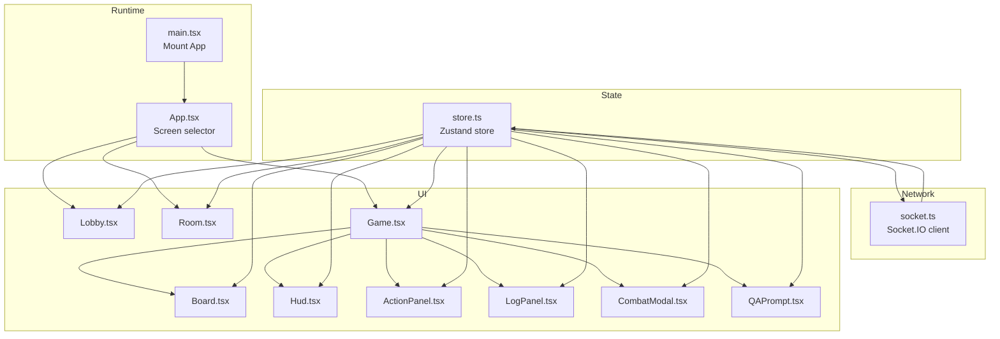
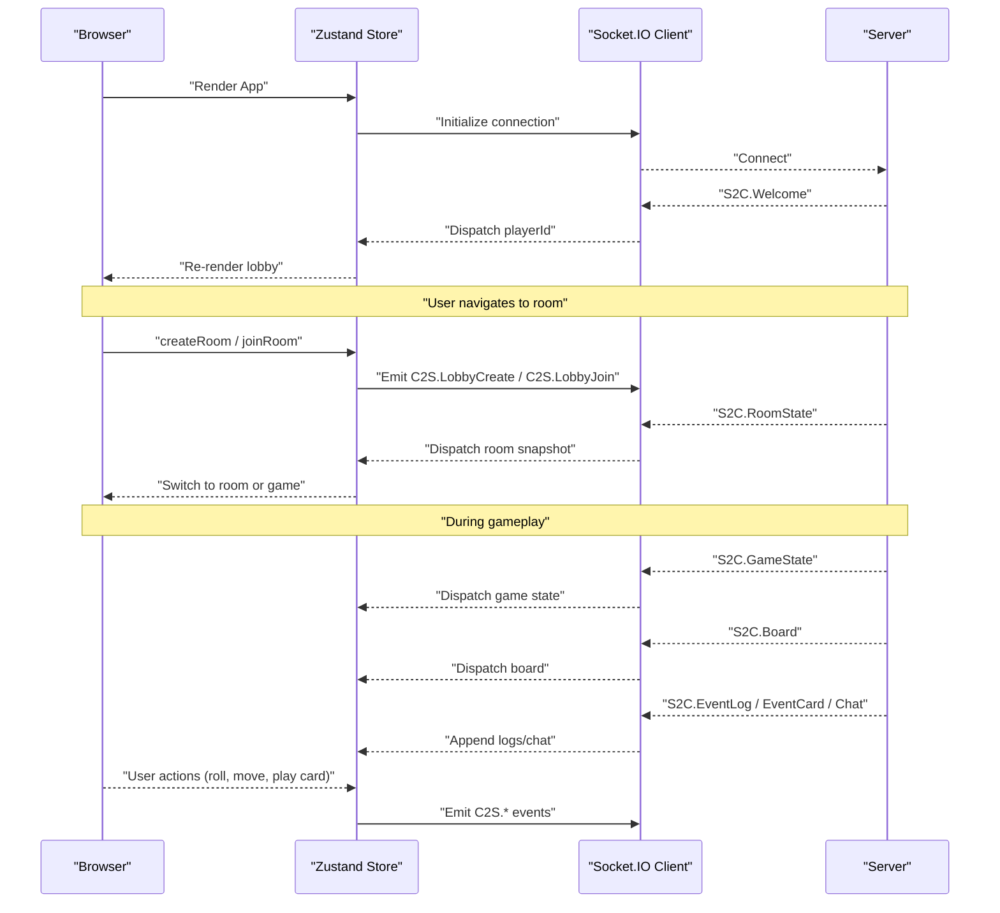
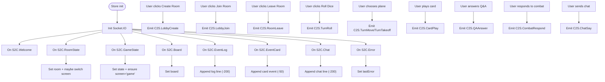
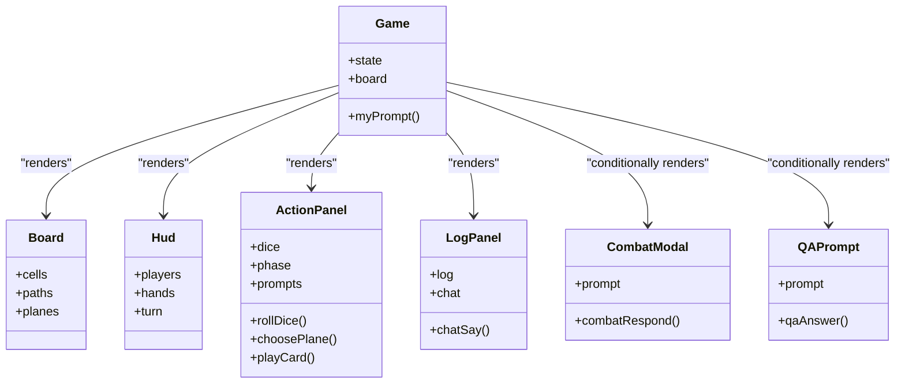
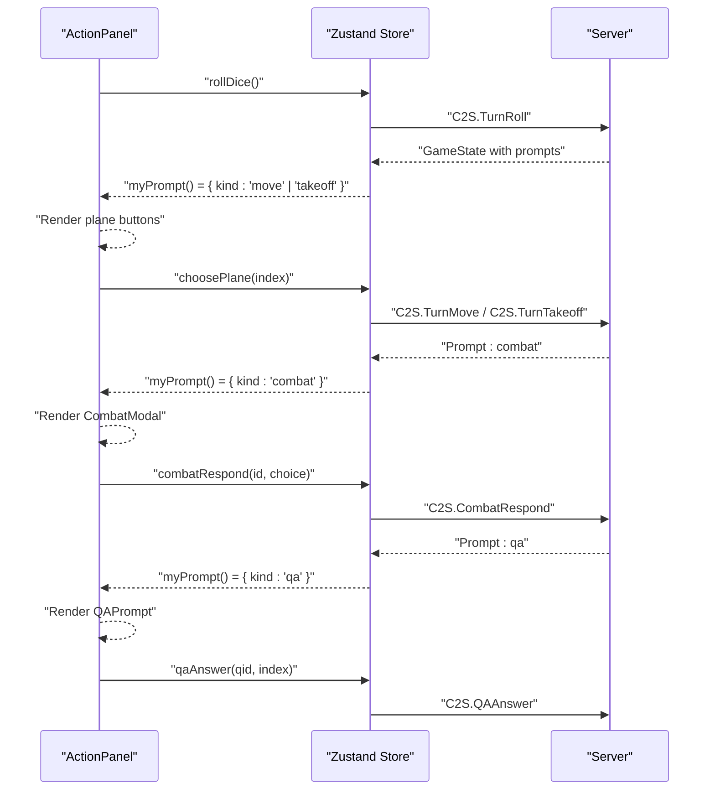
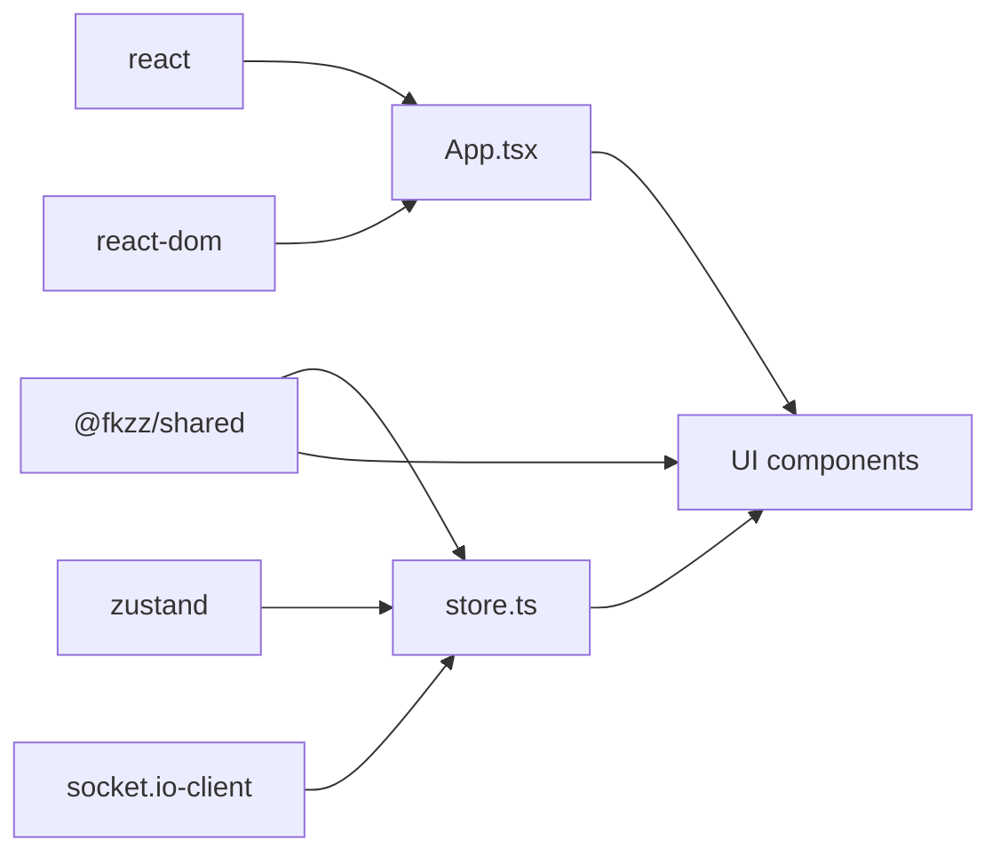

# Frontend System

<cite>
**Referenced Files in This Document**
- [web/src/main.tsx](file://web/src/main.tsx)
- [web/src/App.tsx](file://web/src/App.tsx)
- [web/src/net/socket.ts](file://web/src/net/socket.ts)
- [web/src/state/store.ts](file://web/src/state/store.ts)
- [web/src/ui/Lobby.tsx](file://web/src/ui/Lobby.tsx)
- [web/src/ui/Room.tsx](file://web/src/ui/Room.tsx)
- [web/src/ui/Game.tsx](file://web/src/ui/Game.tsx)
- [web/src/ui/Board.tsx](file://web/src/ui/Board.tsx)
- [web/src/ui/Hud.tsx](file://web/src/ui/Hud.tsx)
- [web/src/ui/ActionPanel.tsx](file://web/src/ui/ActionPanel.tsx)
- [web/src/ui/LogPanel.tsx](file://web/src/ui/LogPanel.tsx)
- [web/src/ui/CombatModal.tsx](file://web/src/ui/CombatModal.tsx)
- [web/src/ui/QAPrompt.tsx](file://web/src/ui/QAPrompt.tsx)
- [web/src/styles.css](file://web/src/styles.css)
- [web/package.json](file://web/package.json)
</cite>

## Table of Contents
1. [Introduction](#introduction)
2. [Project Structure](#project-structure)
3. [Core Components](#core-components)
4. [Architecture Overview](#architecture-overview)
5. [Detailed Component Analysis](#detailed-component-analysis)
6. [Dependency Analysis](#dependency-analysis)
7. [Performance Considerations](#performance-considerations)
8. [Troubleshooting Guide](#troubleshooting-guide)
9. [Conclusion](#conclusion)
10. [Appendices](#appendices)

## Introduction
This document describes the frontend system of the 导弹飞行棋 React web client. It covers the application structure, component hierarchy, state management with Zustand, real-time communication via Socket.IO, UI patterns for lobby, room, and game screens, and interactive panels for prompts, combat resolution, and Q&A challenges. It also documents styling, responsive design, and accessibility considerations.

## Project Structure
The web client is a React 18 application bootstrapped with Vite. The runtime entry renders the root app, which selects the active screen (lobby, room, or game) based on client state. Real-time updates are handled by a single Socket.IO client connected to the backend server. Client state is managed in a central Zustand store that mirrors server snapshots and exposes actions to emit events.

**Diagram sources**
- [web/src/main.tsx:1-11](file://web/src/main.tsx#L1-L11)
- [web/src/App.tsx:1-19](file://web/src/App.tsx#L1-L19)
- [web/src/net/socket.ts:1-11](file://web/src/net/socket.ts#L1-L11)
- [web/src/state/store.ts:1-164](file://web/src/state/store.ts#L1-L164)
- [web/src/ui/Lobby.tsx:1-44](file://web/src/ui/Lobby.tsx#L1-L44)
- [web/src/ui/Room.tsx:1-62](file://web/src/ui/Room.tsx#L1-L62)
- [web/src/ui/Game.tsx:1-34](file://web/src/ui/Game.tsx#L1-L34)
- [web/src/ui/Board.tsx:1-115](file://web/src/ui/Board.tsx#L1-L115)
- [web/src/ui/Hud.tsx:1-44](file://web/src/ui/Hud.tsx#L1-L44)
- [web/src/ui/ActionPanel.tsx:1-129](file://web/src/ui/ActionPanel.tsx#L1-L129)
- [web/src/ui/LogPanel.tsx:1-31](file://web/src/ui/LogPanel.tsx#L1-L31)
- [web/src/ui/CombatModal.tsx:1-32](file://web/src/ui/CombatModal.tsx#L1-L32)
- [web/src/ui/QAPrompt.tsx:1-45](file://web/src/ui/QAPrompt.tsx#L1-L45)

**Section sources**
- [web/src/main.tsx:1-11](file://web/src/main.tsx#L1-L11)
- [web/src/App.tsx:1-19](file://web/src/App.tsx#L1-L19)
- [web/package.json:1-27](file://web/package.json#L1-L27)

## Core Components
- Application shell and routing: The root App component reads the current screen from the store and renders the lobby, room, or game views. It also displays transient errors as a toast.
- Central state store: A Zustand store holds player identity, navigation state, room/game snapshots, logs, chat, and transient card events. It initializes the Socket.IO client and registers listeners for server-sent events. It also exposes action methods that emit client-to-server events.
- Socket.IO client: A singleton connection configured for WebSocket and polling transports, with automatic connection and environment-aware URL resolution.
- UI screens:
  - Lobby: nickname input, create/join room controls.
  - Room: seat claiming, readiness toggling, host-only start.
  - Game: board, HUD, action panel, log panel, and modal prompts for combat and Q&A.
- Styling: A centralized stylesheet defines theme tokens, layout, and component-specific styles.

**Section sources**
- [web/src/App.tsx:1-19](file://web/src/App.tsx#L1-L19)
- [web/src/state/store.ts:1-164](file://web/src/state/store.ts#L1-L164)
- [web/src/net/socket.ts:1-11](file://web/src/net/socket.ts#L1-L11)
- [web/src/ui/Lobby.tsx:1-44](file://web/src/ui/Lobby.tsx#L1-L44)
- [web/src/ui/Room.tsx:1-62](file://web/src/ui/Room.tsx#L1-L62)
- [web/src/ui/Game.tsx:1-34](file://web/src/ui/Game.tsx#L1-L34)
- [web/src/styles.css:1-118](file://web/src/styles.css#L1-L118)

## Architecture Overview
The frontend follows a unidirectional data flow:
- Server emits snapshots and events (room state, game state, board, logs, chat, prompts).
- The Socket.IO listener updates the Zustand store.
- React components subscribe to store slices and re-render.
- User interactions trigger actions that emit commands to the server.

**Diagram sources**
- [web/src/state/store.ts:60-87](file://web/src/state/store.ts#L60-L87)
- [web/src/net/socket.ts:5-10](file://web/src/net/socket.ts#L5-L10)
- [web/src/ui/Lobby.tsx:9-18](file://web/src/ui/Lobby.tsx#L9-L18)
- [web/src/ui/Room.tsx:10-16](file://web/src/ui/Room.tsx#L10-L16)
- [web/src/ui/Game.tsx:10-17](file://web/src/ui/Game.tsx#L10-L17)

## Detailed Component Analysis

### Zustand Store and Real-Time Sync
- Responsibilities:
  - Maintain identity (playerId, nickname), navigation (screen), room/game snapshots, logs, chat, and transient card events.
  - Subscribe to Socket.IO events and update state accordingly.
  - Expose actions to emit commands to the server.
- Key behaviors:
  - Welcome handler sets playerId.
  - RoomState updates room and transitions screen based on room presence/in-game flag.
  - GameState ensures screen is game and updates game state.
  - Board, EventLog, EventCard, Chat, and Error handlers keep UI synchronized.
  - Actions map to C2S events and delegate to the Socket.IO client.
  - Helper getters derive mySeat, isMyTurn, and myPrompt from current state.
- Complexity:
  - Listeners are O(1) per event.
  - Updates are shallow merges; log/chat arrays are capped to maintain bounded memory.

**Diagram sources**
- [web/src/state/store.ts:60-164](file://web/src/state/store.ts#L60-L164)
- [web/src/net/socket.ts:5-10](file://web/src/net/socket.ts#L5-L10)

**Section sources**
- [web/src/state/store.ts:1-164](file://web/src/state/store.ts#L1-L164)

### Socket.IO Client
- Singleton initialization with environment-aware URL and dual transport support.
- Lazily created and reused by the store.

**Section sources**
- [web/src/net/socket.ts:1-11](file://web/src/net/socket.ts#L1-L11)

### Lobby Screen
- Captures nickname, supports creating or joining a room.
- Enforces non-empty inputs before emitting events.

**Section sources**
- [web/src/ui/Lobby.tsx:1-44](file://web/src/ui/Lobby.tsx#L1-L44)

### Room Screen
- Displays seats, readiness, and host-only start button.
- Enables claiming seats and toggling readiness.
- Host can start the game when conditions are met.

**Section sources**
- [web/src/ui/Room.tsx:1-62](file://web/src/ui/Room.tsx#L1-L62)

### Game Screen and Panels
- Game orchestrator composes Board, HUD, ActionPanel, LogPanel, and conditionally renders CombatModal or QAPrompt based on prompts.
- Board renders SVG cells, hangars, and planes with positional logic and stacking.
- HUD shows player stats, turn indicators, and deck counts.
- ActionPanel shows dice, phase, and prompts; handles rolling, moving, taking off, and playing cards.
- LogPanel shows recent event log and chat, with auto-scroll and send-on-submit form.
- Modals handle combat choices and Q&A selection.

**Diagram sources**
- [web/src/ui/Game.tsx:1-34](file://web/src/ui/Game.tsx#L1-L34)
- [web/src/ui/Board.tsx:1-115](file://web/src/ui/Board.tsx#L1-L115)
- [web/src/ui/Hud.tsx:1-44](file://web/src/ui/Hud.tsx#L1-L44)
- [web/src/ui/ActionPanel.tsx:1-129](file://web/src/ui/ActionPanel.tsx#L1-L129)
- [web/src/ui/LogPanel.tsx:1-31](file://web/src/ui/LogPanel.tsx#L1-L31)
- [web/src/ui/CombatModal.tsx:1-32](file://web/src/ui/CombatModal.tsx#L1-L32)
- [web/src/ui/QAPrompt.tsx:1-45](file://web/src/ui/QAPrompt.tsx#L1-L45)

**Section sources**
- [web/src/ui/Game.tsx:1-34](file://web/src/ui/Game.tsx#L1-L34)
- [web/src/ui/Board.tsx:1-115](file://web/src/ui/Board.tsx#L1-L115)
- [web/src/ui/Hud.tsx:1-44](file://web/src/ui/Hud.tsx#L1-L44)
- [web/src/ui/ActionPanel.tsx:1-129](file://web/src/ui/ActionPanel.tsx#L1-L129)
- [web/src/ui/LogPanel.tsx:1-31](file://web/src/ui/LogPanel.tsx#L1-L31)
- [web/src/ui/CombatModal.tsx:1-32](file://web/src/ui/CombatModal.tsx#L1-L32)
- [web/src/ui/QAPrompt.tsx:1-45](file://web/src/ui/QAPrompt.tsx#L1-L45)

### UI Patterns: Prompts, Combat, and Q&A
- Prompt-driven interactions:
  - Move/takeoff prompts show selectable planes.
  - Combat prompt shows options to resolve combat.
  - Q&A prompt shows multiple-choice questions with radio selection.
- Interaction model:
  - Components read myPrompt from the store and render modals accordingly.
  - Users confirm selections; actions emit corresponding server commands.

**Diagram sources**
- [web/src/ui/ActionPanel.tsx:26-48](file://web/src/ui/ActionPanel.tsx#L26-L48)
- [web/src/ui/CombatModal.tsx:9-31](file://web/src/ui/CombatModal.tsx#L9-L31)
- [web/src/ui/QAPrompt.tsx:9-44](file://web/src/ui/QAPrompt.tsx#L9-L44)
- [web/src/state/store.ts:124-144](file://web/src/state/store.ts#L124-L144)

## Dependency Analysis
- Runtime dependencies:
  - React 18 and ReactDOM for rendering.
  - Zustand for global state.
  - Socket.IO client for real-time communication.
  - Shared types and protocol definitions from @fkzz/shared.
- Build and dev dependencies include TypeScript, Vite, and React plugin.
- The store depends on the Socket.IO client and @fkzz/shared types/protocol.
- UI components depend on the store and @fkzz/shared types.

**Diagram sources**
- [web/package.json:11-25](file://web/package.json#L11-L25)
- [web/src/state/store.ts:4-9](file://web/src/state/store.ts#L4-L9)
- [web/src/App.tsx:1-5](file://web/src/App.tsx#L1-L5)

**Section sources**
- [web/package.json:1-27](file://web/package.json#L1-L27)
- [web/src/state/store.ts:4-9](file://web/src/state/store.ts#L4-L9)

## Performance Considerations
- Rendering:
  - Board uses SVG and minimal DOM nodes; plane positions computed from state to avoid unnecessary re-renders.
  - LogPanel limits history length and uses refs for auto-scroll.
- State updates:
  - Store updates are atomic merges; capped arrays prevent unbounded growth.
  - Selective subscriptions via store selectors reduce re-renders.
- Network:
  - Socket.IO configured with WebSocket and polling; connection is lazy-initialized.
- Memory:
  - Transient card events capped to recent items.
  - Chat/log arrays capped to recent entries.

[No sources needed since this section provides general guidance]

## Troubleshooting Guide
- No data displayed in game:
  - Verify room state and game state are present; check for S2C.RoomState and S2C.GameState handlers updating the store.
- Cannot connect to server:
  - Confirm environment URL resolution and network connectivity; inspect Socket.IO initialization.
- Error messages:
  - The store sets lastError on S2C.Error; the App renders a toast. Clear the error by resolving the underlying issue.
- Chat not appearing:
  - Ensure S2C.Chat is received and appended; verify LogPanel subscribes to chat slice.
- Prompts not showing:
  - Check myPrompt getter and that GameState includes prompts for the local seat.

**Section sources**
- [web/src/state/store.ts:72-87](file://web/src/state/store.ts#L72-L87)
- [web/src/net/socket.ts:5-10](file://web/src/net/socket.ts#L5-L10)
- [web/src/App.tsx:10-16](file://web/src/App.tsx#L10-L16)
- [web/src/ui/LogPanel.tsx:15-28](file://web/src/ui/LogPanel.tsx#L15-L28)
- [web/src/state/store.ts:157-161](file://web/src/state/store.ts#L157-L161)

## Conclusion
The frontend is a React 18 application with a clean separation of concerns: a Zustand store for state and real-time synchronization, a Socket.IO client for bidirectional communication, and modular UI components for lobby, room, and game experiences. The design emphasizes responsiveness, accessibility through semantic markup and keyboard-friendly controls, and maintainable styling via CSS variables and reusable components.

## Appendices

### Styling Approach and Accessibility
- Theming:
  - CSS variables define primary colors, backgrounds, and radii; applied consistently across components.
- Layout:
  - Flexbox and grid used for responsive layouts; max-width and aspect-ratio constraints for the board.
- Accessibility:
  - Buttons and inputs are styled for focus visibility; labels associate with inputs; semantic headings and lists.
- Responsive design:
  - Media-friendly widths, flexible grids, and constrained SVG viewport ensure readability and usability on various devices.

**Section sources**
- [web/src/styles.css:1-118](file://web/src/styles.css#L1-L118)