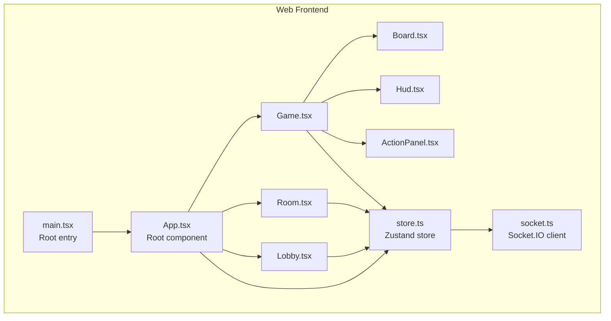
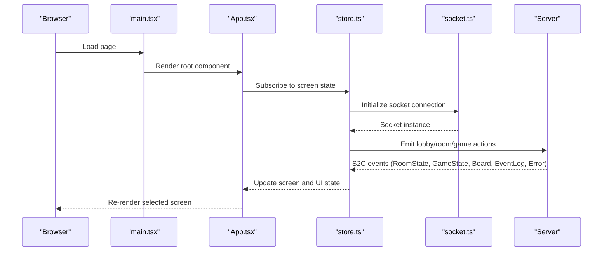
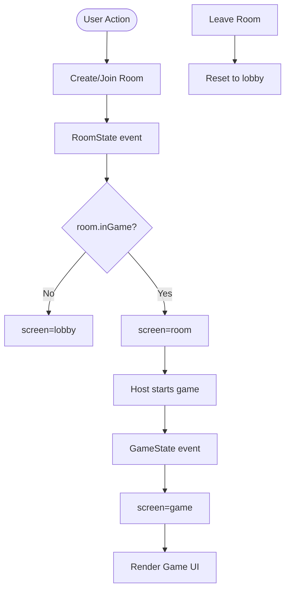
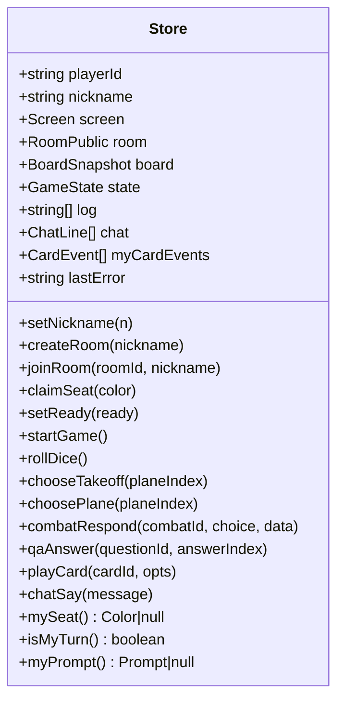
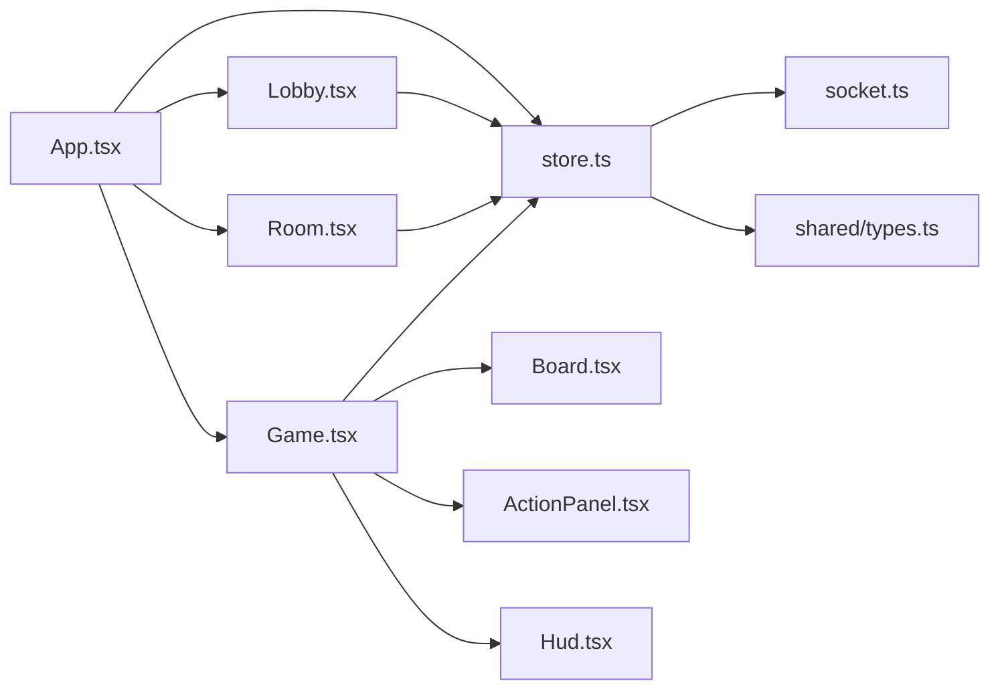

# React Application Structure

<cite>
**Referenced Files in This Document**
- [web/src/App.tsx](file://web/src/App.tsx)
- [web/src/main.tsx](file://web/src/main.tsx)
- [web/index.html](file://web/index.html)
- [web/vite.config.ts](file://web/vite.config.ts)
- [web/tsconfig.json](file://web/tsconfig.json)
- [web/src/state/store.ts](file://web/src/state/store.ts)
- [web/src/net/socket.ts](file://web/src/net/socket.ts)
- [web/src/ui/Lobby.tsx](file://web/src/ui/Lobby.tsx)
- [web/src/ui/Room.tsx](file://web/src/ui/Room.tsx)
- [web/src/ui/Game.tsx](file://web/src/ui/Game.tsx)
- [web/src/ui/Board.tsx](file://web/src/ui/Board.tsx)
- [web/src/ui/Hud.tsx](file://web/src/ui/Hud.tsx)
- [web/src/ui/ActionPanel.tsx](file://web/src/ui/ActionPanel.tsx)
- [shared/src/types.ts](file://shared/src/types.ts)
- [package.json](file://package.json)
</cite>

## Table of Contents
1. [Introduction](#introduction)
2. [Project Structure](#project-structure)
3. [Core Components](#core-components)
4. [Architecture Overview](#architecture-overview)
5. [Detailed Component Analysis](#detailed-component-analysis)
6. [Dependency Analysis](#dependency-analysis)
7. [Performance Considerations](#performance-considerations)
8. [Troubleshooting Guide](#troubleshooting-guide)
9. [Conclusion](#conclusion)

## Introduction
This document explains the React 18 application structure for 导弹飞行棋 (Air Defense Combat Flying Chess). It covers the component hierarchy in the main App, the screen-based routing system driven by a centralized store, and the main entry point configuration. It also documents the Vite build and dev server setup, HTML template, module resolution, and component organization patterns. Finally, it details the screen management system that switches between lobby, room, and game views, along with React best practices and performance techniques used in the application.

## Project Structure
The frontend is organized under web/src with a clear separation of concerns:
- Entry point and root app: main.tsx and App.tsx
- UI screens: Lobby, Room, Game and supporting components (Board, Hud, ActionPanel, etc.)
- State management: Zustand store with server synchronization
- Networking: Socket.IO client wrapper
- Build and config: Vite, TypeScript, and HTML template

**Diagram sources**
- [web/src/main.tsx:1-11](file://web/src/main.tsx#L1-L11)
- [web/src/App.tsx:1-19](file://web/src/App.tsx#L1-L19)
- [web/src/ui/Lobby.tsx:1-44](file://web/src/ui/Lobby.tsx#L1-L44)
- [web/src/ui/Room.tsx:1-62](file://web/src/ui/Room.tsx#L1-L62)
- [web/src/ui/Game.tsx:1-34](file://web/src/ui/Game.tsx#L1-L34)
- [web/src/ui/Board.tsx:1-115](file://web/src/ui/Board.tsx#L1-L115)
- [web/src/ui/Hud.tsx:1-44](file://web/src/ui/Hud.tsx#L1-L44)
- [web/src/ui/ActionPanel.tsx:1-129](file://web/src/ui/ActionPanel.tsx#L1-L129)
- [web/src/state/store.ts:1-164](file://web/src/state/store.ts#L1-L164)
- [web/src/net/socket.ts:1-11](file://web/src/net/socket.ts#L1-L11)

**Section sources**
- [web/src/main.tsx:1-11](file://web/src/main.tsx#L1-L11)
- [web/src/App.tsx:1-19](file://web/src/App.tsx#L1-L19)
- [web/index.html:1-13](file://web/index.html#L1-L13)
- [web/vite.config.ts:1-17](file://web/vite.config.ts#L1-L17)
- [web/tsconfig.json:1-12](file://web/tsconfig.json#L1-L12)

## Core Components
- Root entry and rendering: main.tsx creates the React 18 root and renders App inside StrictMode.
- Root app: App.tsx selects the current screen based on the store’s screen state and renders Lobby, Room, or Game accordingly. It also displays a global error toast when present.
- UI screens:
  - Lobby: nickname input, create/join room controls.
  - Room: seat claiming, readiness toggles, host-only start button.
  - Game: composed of Board, ActionPanel, Hud, LogPanel, and conditional modals for prompts.
- Supporting components:
  - Board: SVG-based rendering of cells, hangars, and planes.
  - Hud: per-seat stats and turn indicators.
  - ActionPanel: dice rolling, plane selection prompts, and card playing UI.

**Section sources**
- [web/src/main.tsx:1-11](file://web/src/main.tsx#L1-L11)
- [web/src/App.tsx:1-19](file://web/src/App.tsx#L1-L19)
- [web/src/ui/Lobby.tsx:1-44](file://web/src/ui/Lobby.tsx#L1-L44)
- [web/src/ui/Room.tsx:1-62](file://web/src/ui/Room.tsx#L1-L62)
- [web/src/ui/Game.tsx:1-34](file://web/src/ui/Game.tsx#L1-L34)
- [web/src/ui/Board.tsx:1-115](file://web/src/ui/Board.tsx#L1-L115)
- [web/src/ui/Hud.tsx:1-44](file://web/src/ui/Hud.tsx#L1-L44)
- [web/src/ui/ActionPanel.tsx:1-129](file://web/src/ui/ActionPanel.tsx#L1-L129)

## Architecture Overview
The application follows a unidirectional data flow:
- UI components subscribe to a single Zustand store.
- The store listens to Socket.IO events to keep the UI in sync with the authoritative server state.
- Navigation is controlled by updating the store’s screen field.
- The HTML template provides a single mount point for the React root.

**Diagram sources**
- [web/src/main.tsx:1-11](file://web/src/main.tsx#L1-L11)
- [web/src/App.tsx:1-19](file://web/src/App.tsx#L1-L19)
- [web/src/state/store.ts:1-164](file://web/src/state/store.ts#L1-L164)
- [web/src/net/socket.ts:1-11](file://web/src/net/socket.ts#L1-L11)

## Detailed Component Analysis

### App.tsx: Root Component and Screen Routing
- Purpose: Centralized screen router and error display.
- Behavior:
  - Reads screen from the store and conditionally renders Lobby, Room, or Game.
  - Displays a persistent error toast when lastError is set.
- Best practices:
  - Minimal branching logic in render; delegates logic to store and child components.
  - Uses className-based layout for consistent styling.

**Section sources**
- [web/src/App.tsx:1-19](file://web/src/App.tsx#L1-L19)

### Screen Management System: Lobby → Room → Game
- Navigation triggers:
  - Creating a room or joining updates the room in the store.
  - Room state transitions (inGame flag) and game state events switch the screen to game.
  - Leaving a room resets screen to lobby.
- Conditional rendering:
  - App.tsx switches on screen value.
  - Game.tsx conditionally renders modals based on active prompts.

**Diagram sources**
- [web/src/state/store.ts:66-77](file://web/src/state/store.ts#L66-L77)
- [web/src/App.tsx:12-14](file://web/src/App.tsx#L12-L14)

**Section sources**
- [web/src/state/store.ts:60-99](file://web/src/state/store.ts#L60-L99)
- [web/src/App.tsx:7-18](file://web/src/App.tsx#L7-L18)

### Zustand Store: State, Actions, and Server Sync
- Responsibilities:
  - Holds identity, navigation state (screen), room/game snapshots, logs, chat, and transient prompts.
  - Exposes actions to mutate state and emit commands to the server.
  - Subscribes to Socket.IO events to keep UI synchronized.
- Key patterns:
  - Selector-based subscriptions via useStore(selector) to minimize re-renders.
  - Derived helpers (mySeat, isMyTurn, myPrompt) encapsulate logic for UI components.
  - Event-driven updates for room, game, board, logs, chat, and errors.

**Diagram sources**
- [web/src/state/store.ts:15-58](file://web/src/state/store.ts#L15-L58)

**Section sources**
- [web/src/state/store.ts:1-164](file://web/src/state/store.ts#L1-L164)

### Networking: Socket.IO Client Wrapper
- Purpose: Provide a singleton Socket.IO client initialized once and reused across the app.
- Environment-aware URL: Uses local dev server in development, otherwise connects to the current origin in production.
- Transport: Enables WebSocket and polling for robust connectivity.

**Section sources**
- [web/src/net/socket.ts:1-11](file://web/src/net/socket.ts#L1-L11)

### UI Components: Composition Patterns
- Composition:
  - Game.tsx composes Board, ActionPanel, Hud, LogPanel, and conditional modals.
  - Board.tsx renders cells, hangars, and planes using shared types.
  - ActionPanel.tsx renders prompts and hand cards, delegating selections to store actions.
- Props and selectors:
  - Components read from the store via useStore(selector) to subscribe to minimal slices of state.
- Shared types:
  - Types such as Color, Cell, BoardSnapshot, GameState, and Prompt are defined in shared/src/types.ts and imported by UI components.

**Section sources**
- [web/src/ui/Game.tsx:1-34](file://web/src/ui/Game.tsx#L1-L34)
- [web/src/ui/Board.tsx:1-115](file://web/src/ui/Board.tsx#L1-L115)
- [web/src/ui/ActionPanel.tsx:1-129](file://web/src/ui/ActionPanel.tsx#L1-L129)
- [shared/src/types.ts:1-186](file://shared/src/types.ts#L1-L186)

### Build and Dev Server Configuration
- Vite:
  - Plugin: @vitejs/plugin-react enables JSX transform and fast refresh.
  - Dev server: port 5173 with a proxy for Socket.IO WebSocket traffic to the backend server.
- HTML Template:
  - Single div#root mounts the React root.
  - Module script tag loads the main entry.
- TypeScript:
  - Module and resolution set to ESNext/Bundler for modern bundling.
  - JSX set to react-jsx.
  - DOM libs included for browser APIs.

**Section sources**
- [web/vite.config.ts:1-17](file://web/vite.config.ts#L1-L17)
- [web/index.html:1-13](file://web/index.html#L1-L13)
- [web/tsconfig.json:1-12](file://web/tsconfig.json#L1-L12)

### Entry Point Configuration
- main.tsx:
  - Creates a React 18 root targeting the #root element.
  - Wraps the App in React.StrictMode for stricter checks in development.
  - Imports global styles before mounting.

**Section sources**
- [web/src/main.tsx:1-11](file://web/src/main.tsx#L1-L11)

## Dependency Analysis
- Internal dependencies:
  - App depends on UI screens and the store.
  - UI screens depend on the store and shared types.
  - Game composes Board, ActionPanel, and Hud.
- External dependencies:
  - Zustand for state management.
  - Socket.IO client for real-time communication.
  - Vite and React plugin for build and dev server.
- Workspace setup:
  - Root package.json defines workspaces for shared, server, and web packages, enabling monorepo-style development and builds.

**Diagram sources**
- [web/src/App.tsx:1-19](file://web/src/App.tsx#L1-L19)
- [web/src/state/store.ts:1-164](file://web/src/state/store.ts#L1-L164)
- [web/src/net/socket.ts:1-11](file://web/src/net/socket.ts#L1-L11)
- [shared/src/types.ts:1-186](file://shared/src/types.ts#L1-L186)
- [web/src/ui/Lobby.tsx:1-44](file://web/src/ui/Lobby.tsx#L1-L44)
- [web/src/ui/Room.tsx:1-62](file://web/src/ui/Room.tsx#L1-L62)
- [web/src/ui/Game.tsx:1-34](file://web/src/ui/Game.tsx#L1-L34)
- [web/src/ui/Board.tsx:1-115](file://web/src/ui/Board.tsx#L1-L115)
- [web/src/ui/Hud.tsx:1-44](file://web/src/ui/Hud.tsx#L1-L44)
- [web/src/ui/ActionPanel.tsx:1-129](file://web/src/ui/ActionPanel.tsx#L1-L129)

**Section sources**
- [package.json:1-17](file://package.json#L1-L17)

## Performance Considerations
- Selective re-renders:
  - Prefer useStore(selector) to subscribe to small slices of state instead of the whole store.
- Derived helpers:
  - Encapsulate computations in the store (e.g., mySeat, isMyTurn, myPrompt) to avoid recomputation in components.
- Conditional rendering:
  - App.tsx and Game.tsx gate expensive renders behind simple boolean checks.
- SVG rendering:
  - Board.tsx renders static shapes efficiently; avoid unnecessary re-layouts by keeping props stable.
- Network-bound updates:
  - Debounce or coalesce frequent UI updates when reacting to rapid server events.
- Bundle size:
  - Vite with ESNext/Bundler module resolution reduces overhead; ensure unused code is tree-shaken.

[No sources needed since this section provides general guidance]

## Troubleshooting Guide
- No UI appears after page load:
  - Verify the root element exists in the HTML template and the React root is created in main.tsx.
- Screen does not switch from lobby to room or game:
  - Confirm store listeners receive RoomState and GameState events and update screen accordingly.
- Socket connection errors:
  - Check the dev server proxy configuration and backend availability; confirm the environment URL logic in the socket wrapper.
- Global error toast appears:
  - Inspect the Error event handler in the store and the error message propagation to the UI.

**Section sources**
- [web/index.html:8-10](file://web/index.html#L8-L10)
- [web/src/main.tsx:6-10](file://web/src/main.tsx#L6-L10)
- [web/src/state/store.ts:87-87](file://web/src/state/store.ts#L87-L87)
- [web/src/net/socket.ts:7-8](file://web/src/net/socket.ts#L7-L8)

## Conclusion
The application employs a clean, scalable React 18 architecture with a centralized Zustand store, modular UI components, and a straightforward screen-based routing model. Vite provides a fast development experience with a simple proxy configuration for Socket.IO. The component composition favors small, focused components with selector-based subscriptions, enabling maintainable and performant UI updates driven by authoritative server state.