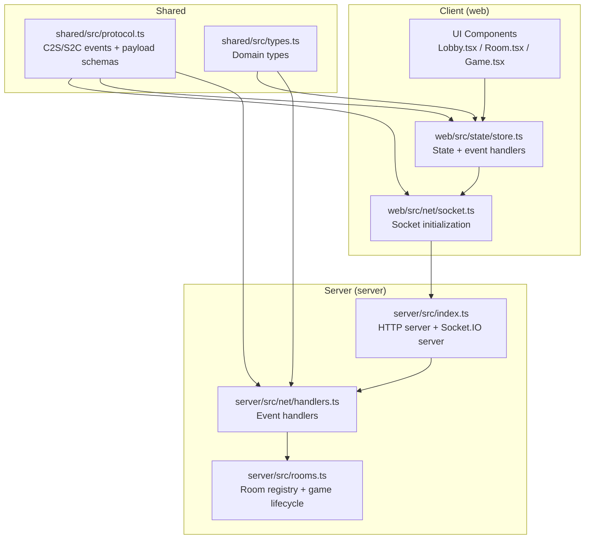
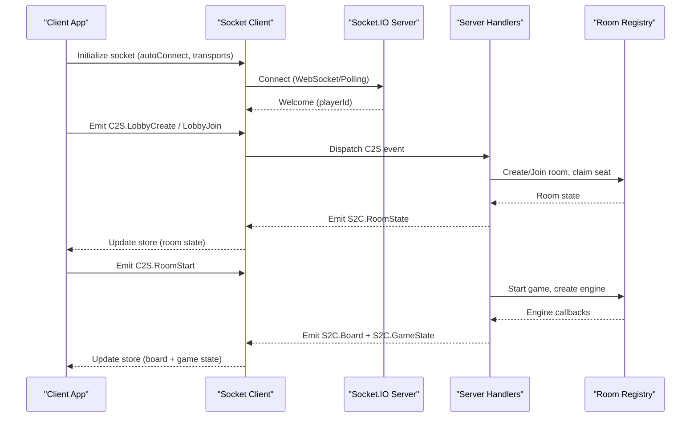
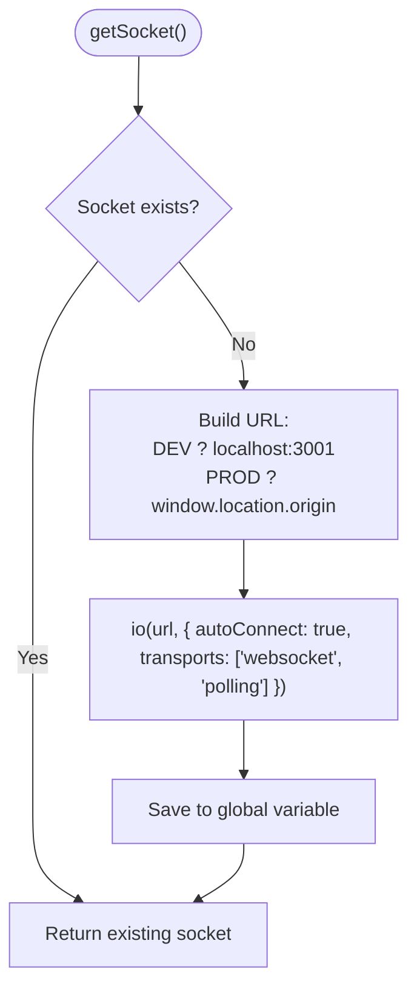
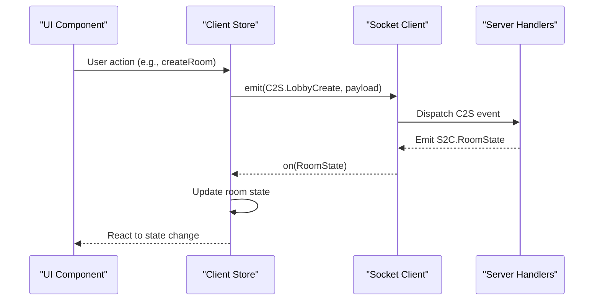
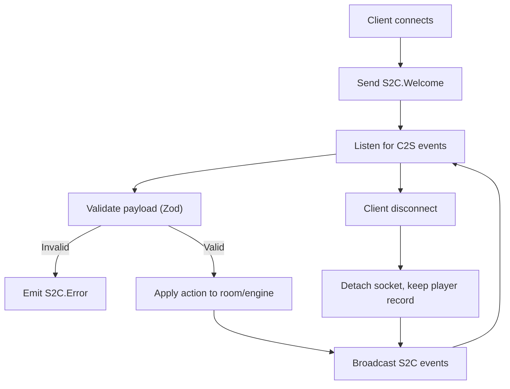
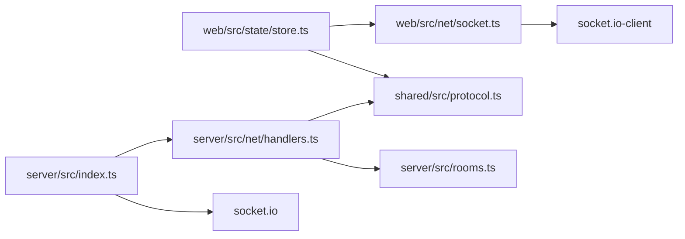

# Socket.IO Client Implementation

<cite>
**Referenced Files in This Document**
- [socket.ts](file://web/src/net/socket.ts)
- [protocol.ts](file://shared/src/protocol.ts)
- [types.ts](file://shared/src/types.ts)
- [store.ts](file://web/src/state/store.ts)
- [handlers.ts](file://server/src/net/handlers.ts)
- [rooms.ts](file://server/src/rooms.ts)
- [index.ts](file://server/src/index.ts)
- [Lobby.tsx](file://web/src/ui/Lobby.tsx)
- [Room.tsx](file://web/src/ui/Room.tsx)
- [Game.tsx](file://web/src/ui/Game.tsx)
</cite>

## Table of Contents
1. [Introduction](#introduction)
2. [Project Structure](#project-structure)
3. [Core Components](#core-components)
4. [Architecture Overview](#architecture-overview)
5. [Detailed Component Analysis](#detailed-component-analysis)
6. [Dependency Analysis](#dependency-analysis)
7. [Performance Considerations](#performance-considerations)
8. [Troubleshooting Guide](#troubleshooting-guide)
9. [Conclusion](#conclusion)

## Introduction
This document provides comprehensive documentation for the Socket.IO client implementation in the 导弹飞行棋 project. It focuses on real-time communication setup, connection management, and event handling patterns. The documentation covers socket initialization, connection lifecycle, error handling strategies, event subscription patterns, message formatting, state synchronization with the server, reconnection logic, and practical debugging approaches for real-time features.

## Project Structure
The Socket.IO client implementation spans three primary areas:
- Client-side socket initialization and connection management
- Shared protocol definitions for client-server events and payloads
- Client-side state management that subscribes to server events and dispatches actions

**Diagram sources**
- [socket.ts:1-11](file://web/src/net/socket.ts#L1-L11)
- [store.ts:1-164](file://web/src/state/store.ts#L1-L164)
- [protocol.ts:1-97](file://shared/src/protocol.ts#L1-L97)
- [types.ts:1-186](file://shared/src/types.ts#L1-L186)
- [handlers.ts:1-230](file://server/src/net/handlers.ts#L1-L230)
- [rooms.ts:1-211](file://server/src/rooms.ts#L1-L211)
- [index.ts:1-95](file://server/src/index.ts#L1-L95)

**Section sources**
- [socket.ts:1-11](file://web/src/net/socket.ts#L1-L11)
- [protocol.ts:1-97](file://shared/src/protocol.ts#L1-L97)
- [types.ts:1-186](file://shared/src/types.ts#L1-L186)
- [store.ts:1-164](file://web/src/state/store.ts#L1-L164)
- [handlers.ts:1-230](file://server/src/net/handlers.ts#L1-L230)
- [rooms.ts:1-211](file://server/src/rooms.ts#L1-L211)
- [index.ts:1-95](file://server/src/index.ts#L1-L95)

## Core Components
This section documents the core components involved in real-time communication:
- Socket initialization and connection management
- Event protocol definitions (client-to-server and server-to-client)
- Client-side state synchronization and action dispatch
- Server-side event handlers and room management

Key responsibilities:
- Socket initialization sets up the connection URL and transport options
- Protocol definitions enforce strict event names and payload schemas
- Client state subscribes to server events and updates UI accordingly
- Server handlers validate payloads, manage room state, and emit authoritative updates

**Section sources**
- [socket.ts:1-11](file://web/src/net/socket.ts#L1-L11)
- [protocol.ts:1-97](file://shared/src/protocol.ts#L1-L97)
- [store.ts:1-164](file://web/src/state/store.ts#L1-L164)
- [handlers.ts:1-230](file://server/src/net/handlers.ts#L1-L230)
- [rooms.ts:1-211](file://server/src/rooms.ts#L1-L211)

## Architecture Overview
The real-time architecture follows an authoritative server model:
- Clients connect via Socket.IO and subscribe to server-sent events
- Clients emit actions to the server, which validates and executes them
- Server responds with state snapshots and event notifications
- Client state stores reflect the authoritative server state

**Diagram sources**
- [socket.ts:1-11](file://web/src/net/socket.ts#L1-L11)
- [handlers.ts:1-230](file://server/src/net/handlers.ts#L1-L230)
- [rooms.ts:1-211](file://server/src/rooms.ts#L1-L211)
- [store.ts:1-164](file://web/src/state/store.ts#L1-L164)

## Detailed Component Analysis

### Socket Initialization and Connection Management
The client initializes a single Socket.IO instance with environment-aware URL resolution and transport preferences. The initialization ensures a singleton socket instance and automatic connection.

Implementation highlights:
- Environment-based URL selection (development vs production)
- Transport preference for WebSocket and Polling
- Singleton pattern to prevent multiple connections
- Automatic connection on creation

**Diagram sources**
- [socket.ts:1-11](file://web/src/net/socket.ts#L1-L11)

**Section sources**
- [socket.ts:1-11](file://web/src/net/socket.ts#L1-L11)

### Event Protocol Definitions
The shared protocol defines all client-to-server (C2S) and server-to-client (S2C) events along with their payload schemas. This ensures type-safe communication and runtime validation.

Client-to-server events include:
- Lobby actions: create, join, leave
- Room actions: set options, claim seat, ready, start
- Gameplay actions: roll, choose takeoff, choose plane, play card, combat response, QA answer
- Chat messages

Server-to-client events include:
- Welcome with player ID
- Room state updates
- Game state snapshots
- Board snapshots
- Events: dice, card drawn, log entries
- Chat messages
- Error notifications

Payload schemas use Zod for runtime validation, ensuring robustness against malformed data.

**Section sources**
- [protocol.ts:1-97](file://shared/src/protocol.ts#L1-L97)

### Client State Synchronization
The client state store subscribes to server events and maintains synchronized UI state. It handles welcome, room state, game state, board snapshots, event logs, card events, chat, and errors.

Key synchronization patterns:
- Welcome event sets player ID
- Room state updates trigger screen transitions
- Game state updates drive UI rendering
- Board snapshots render the game board
- Event logs and chat append new entries
- Errors update lastError for display

Action dispatch patterns:
- UI components call store methods
- Store emits C2S events via the socket
- Actions are validated by the server handler layer

**Diagram sources**
- [store.ts:1-164](file://web/src/state/store.ts#L1-L164)
- [handlers.ts:1-230](file://server/src/net/handlers.ts#L1-L230)

**Section sources**
- [store.ts:1-164](file://web/src/state/store.ts#L1-L164)

### Server-Side Event Handling
The server binds Socket.IO events to handlers that validate payloads, manage room state, and emit authoritative updates. Handlers enforce game rules and maintain consistency.

Handler responsibilities:
- Validate payloads using Zod schemas
- Manage player and room lifecycle
- Start games with engine callbacks
- Broadcast room and game state
- Deliver targeted events (e.g., card details to drawing player)
- Handle disconnects gracefully

**Diagram sources**
- [handlers.ts:1-230](file://server/src/net/handlers.ts#L1-L230)
- [rooms.ts:1-211](file://server/src/rooms.ts#L1-L211)

**Section sources**
- [handlers.ts:1-230](file://server/src/net/handlers.ts#L1-L230)
- [rooms.ts:1-211](file://server/src/rooms.ts#L1-L211)

### Real-Time Communication Patterns
The client-server communication follows these patterns:
- Request-response for lobby and room actions
- Event-driven updates for game state and events
- Targeted delivery for sensitive information (e.g., drawn card details)
- Broadcast updates for room state and general events

Practical examples:
- Creating a room: client emits C2S.LobbyCreate; server responds with S2C.RoomState
- Starting a game: client emits C2S.RoomStart; server emits S2C.Board and S2C.GameState
- Playing a card: client emits C2S.CardPlay; server emits S2C.GameState and targeted S2C.EventCard

**Section sources**
- [handlers.ts:1-230](file://server/src/net/handlers.ts#L1-L230)
- [store.ts:1-164](file://web/src/state/store.ts#L1-L164)

## Dependency Analysis
The Socket.IO client implementation exhibits clear separation of concerns:
- web/src/net/socket.ts depends on socket.io-client
- web/src/state/store.ts depends on shared protocol definitions and socket initialization
- server/src/net/handlers.ts depends on shared protocol definitions and room registry
- server/src/index.ts composes HTTP server and Socket.IO server

**Diagram sources**
- [socket.ts:1-11](file://web/src/net/socket.ts#L1-L11)
- [store.ts:1-164](file://web/src/state/store.ts#L1-L164)
- [protocol.ts:1-97](file://shared/src/protocol.ts#L1-L97)
- [handlers.ts:1-230](file://server/src/net/handlers.ts#L1-L230)
- [rooms.ts:1-211](file://server/src/rooms.ts#L1-L211)
- [index.ts:1-95](file://server/src/index.ts#L1-L95)

**Section sources**
- [socket.ts:1-11](file://web/src/net/socket.ts#L1-L11)
- [store.ts:1-164](file://web/src/state/store.ts#L1-L164)
- [protocol.ts:1-97](file://shared/src/protocol.ts#L1-L97)
- [handlers.ts:1-230](file://server/src/net/handlers.ts#L1-L230)
- [rooms.ts:1-211](file://server/src/rooms.ts#L1-L211)
- [index.ts:1-95](file://server/src/index.ts#L1-L95)

## Performance Considerations
- Transport selection: WebSocket with polling fallback reduces connection failures
- Payload validation: Zod schemas prevent unnecessary processing of invalid data
- Event filtering: Only necessary events are subscribed to, minimizing bandwidth
- State updates: Client store updates are batched and efficient
- Server broadcasting: Room-scoped broadcasts limit unnecessary traffic

## Troubleshooting Guide
Common issues and debugging approaches:
- Connection failures: Verify development vs production URL resolution and CORS configuration
- Event deserialization errors: Check payload schemas and ensure client and server share the same protocol definitions
- State inconsistencies: Monitor S2C.GameState emissions and client store updates
- Room state mismatches: Confirm room lifecycle events and seat claiming sequences
- Error propagation: Inspect S2C.Error events and client lastError handling

Debugging tips:
- Enable Socket.IO debug logging in development
- Verify event names match shared protocol definitions
- Check payload shapes against Zod schemas
- Monitor server logs for validation errors and room state changes
- Use browser developer tools to inspect WebSocket frames and emitted events

**Section sources**
- [handlers.ts:1-230](file://server/src/net/handlers.ts#L1-L230)
- [store.ts:1-164](file://web/src/state/store.ts#L1-L164)

## Conclusion
The Socket.IO client implementation in 导弹飞行棋 demonstrates a clean, authoritative architecture with strong typing and robust event handling. The client initializes a singleton socket, subscribes to server events, and dispatches actions with validated payloads. The server enforces game rules, manages room lifecycles, and emits authoritative state updates. Together, these components provide a reliable foundation for real-time multiplayer gameplay with clear separation of concerns and maintainable code structure.