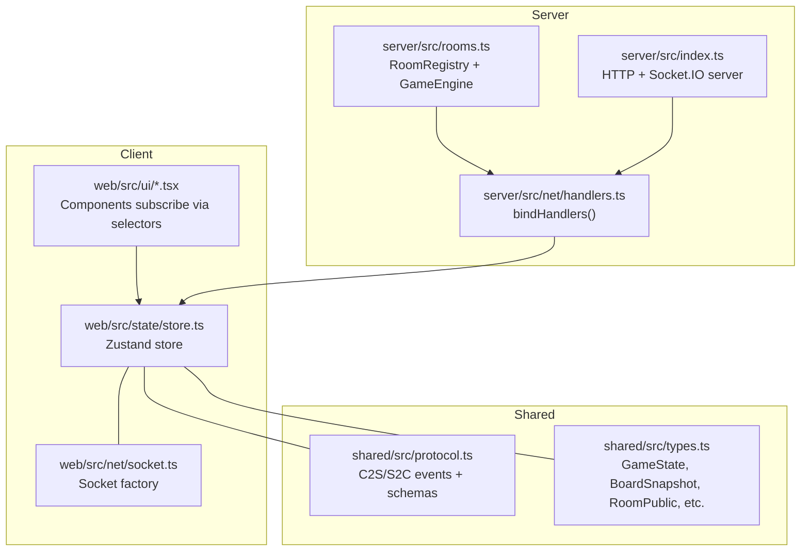
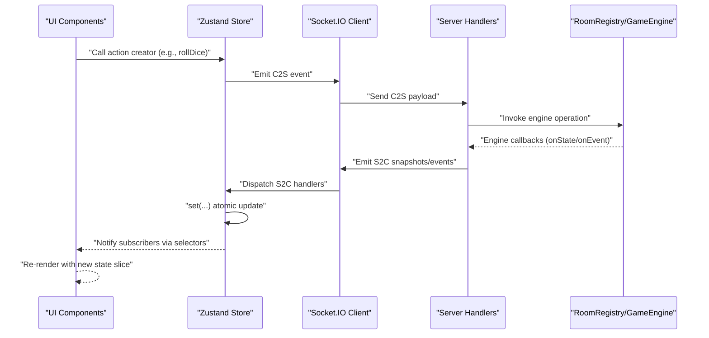
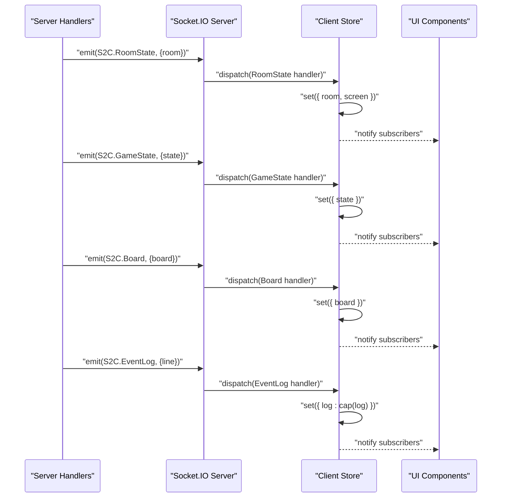
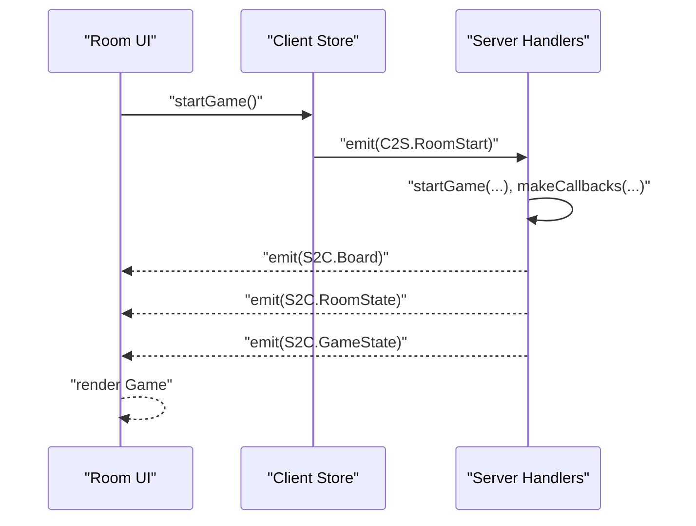
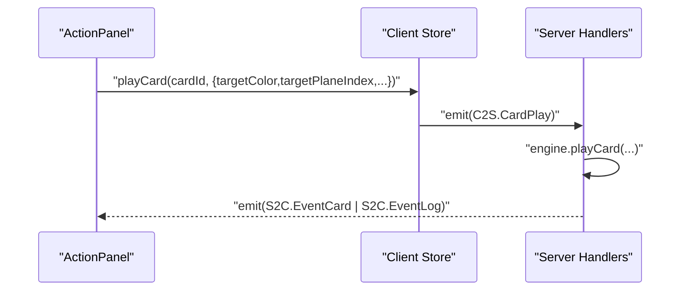
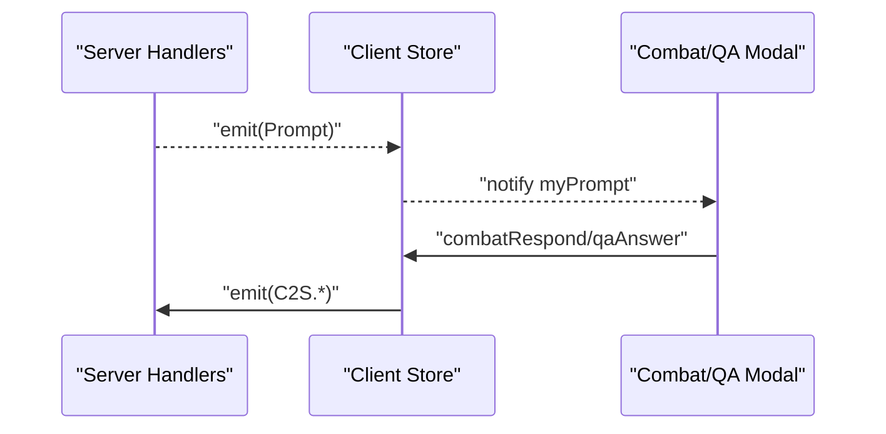
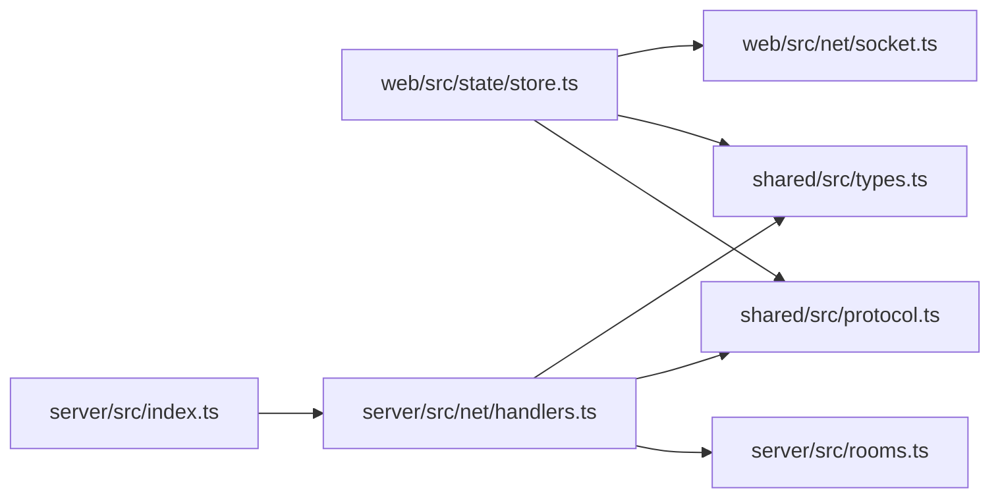

# State Management with Zustand

<cite>
**Referenced Files in This Document**
- [store.ts](file://web/src/state/store.ts)
- [socket.ts](file://web/src/net/socket.ts)
- [types.ts](file://shared/src/types.ts)
- [protocol.ts](file://shared/src/protocol.ts)
- [handlers.ts](file://server/src/net/handlers.ts)
- [rooms.ts](file://server/src/rooms.ts)
- [App.tsx](file://web/src/App.tsx)
- [Lobby.tsx](file://web/src/ui/Lobby.tsx)
- [Room.tsx](file://web/src/ui/Room.tsx)
- [Game.tsx](file://web/src/ui/Game.tsx)
- [ActionPanel.tsx](file://web/src/ui/ActionPanel.tsx)
- [Hud.tsx](file://web/src/ui/Hud.tsx)
- [index.ts](file://server/src/index.ts)
</cite>

## Table of Contents
1. [Introduction](#introduction)
2. [Project Structure](#project-structure)
3. [Core Components](#core-components)
4. [Architecture Overview](#architecture-overview)
5. [Detailed Component Analysis](#detailed-component-analysis)
6. [Dependency Analysis](#dependency-analysis)
7. [Performance Considerations](#performance-considerations)
8. [Troubleshooting Guide](#troubleshooting-guide)
9. [Conclusion](#conclusion)
10. [Appendices](#appendices)

## Introduction
This document explains the Zustand-based state management system used by the 导弹飞行棋 web client. It covers the centralized store architecture, state slices, action creators, real-time synchronization with the server, optimistic UI patterns, selectors and subscriptions, performance optimizations, initialization/reset/cleanup, and practical examples of mutations and async updates. It also addresses persistence and caching considerations.

## Project Structure
The state management spans three layers:
- Client store: a single Zustand store that mirrors server snapshots and holds transient UI state.
- Protocol and types: shared definitions for messages, payloads, and domain models.
- Server handlers: event-driven orchestration that emits state snapshots and events to clients.



**Diagram sources**
- [store.ts:1-164](file://web/src/state/store.ts#L1-L164)
- [socket.ts:1-11](file://web/src/net/socket.ts#L1-L11)
- [protocol.ts:1-97](file://shared/src/protocol.ts#L1-L97)
- [types.ts:1-186](file://shared/src/types.ts#L1-L186)
- [handlers.ts:1-230](file://server/src/net/handlers.ts#L1-L230)
- [rooms.ts:1-211](file://server/src/rooms.ts#L1-L211)
- [index.ts:1-95](file://server/src/index.ts#L1-L95)

**Section sources**
- [store.ts:1-164](file://web/src/state/store.ts#L1-L164)
- [protocol.ts:1-97](file://shared/src/protocol.ts#L1-L97)
- [types.ts:1-186](file://shared/src/types.ts#L1-L186)
- [handlers.ts:1-230](file://server/src/net/handlers.ts#L1-L230)
- [rooms.ts:1-211](file://server/src/rooms.ts#L1-L211)
- [index.ts:1-95](file://server/src/index.ts#L1-L95)

## Core Components
- Centralized store: Holds identity, navigation, room/game snapshots, logs, chat, transient card events, and last error. Exposes action creators for all user intents and derived helpers (seat resolution, turn checks, prompt lookup).
- Socket integration: Lazily creates a Socket.IO client and registers listeners for server-sent events.
- UI selectors: Components subscribe to minimal slices of state to optimize re-renders.
- Server handlers: Translate client actions into engine operations and emit snapshots/events to all clients.

Key store responsibilities:
- Real-time synchronization: Applies server snapshots atomically via Zustand setters.
- Transient UI state: Maintains capped logs, chat, and recent card events.
- Derived helpers: Compute mySeat, isMyTurn, and myPrompt without duplicating data.
- Async actions: Emit C2S events; server responds with S2C snapshots/events.

**Section sources**
- [store.ts:15-163](file://web/src/state/store.ts#L15-L163)
- [socket.ts:5-10](file://web/src/net/socket.ts#L5-L10)
- [protocol.ts:6-82](file://shared/src/protocol.ts#L6-L82)

## Architecture Overview
The client-server state flow is event-driven and snapshot-based. The server maintains authoritative game state and pushes snapshots and events. The client applies them locally and renders immediately.



**Diagram sources**
- [store.ts:60-163](file://web/src/state/store.ts#L60-L163)
- [socket.ts:5-10](file://web/src/net/socket.ts#L5-L10)
- [handlers.ts:15-230](file://server/src/net/handlers.ts#L15-L230)
- [rooms.ts:140-151](file://server/src/rooms.ts#L140-L151)

## Detailed Component Analysis

### Zustand Store: State Slices and Actions
The store defines:
- Identity: playerId, nickname
- Navigation: screen (lobby/room/game)
- Room: RoomPublic snapshot
- Game: BoardSnapshot and GameState snapshots
- Logs: capped arrays for event log and chat
- Transient: myCardEvents (recent card draws)
- Error: lastError
- Actions: all user intents (create/join/claim/start, roll, choose, play, chat, etc.)
- Derived helpers: mySeat, isMyTurn, myPrompt

Real-time synchronization:
- Listeners for S2C events apply snapshots atomically.
- Room/game transitions update screen automatically.
- Logs/chat are capped to prevent unbounded growth.

Selectors and subscriptions:
- Components subscribe to minimal slices (e.g., state, board, myPrompt) to reduce re-renders.

Optimistic UI:
- Some actions (e.g., rolling dice, playing cards) are emitted optimistically; server snapshots later reconcile.

Initialization and reset:
- Initial state is set in the store creator.
- leaveRoom clears room/game state and resets screen to lobby.

Cleanup:
- No explicit cleanup hooks are used; leaving a room resets relevant slices.

**Section sources**
- [store.ts:15-163](file://web/src/state/store.ts#L15-L163)

#### Class Diagram: Store Shape and Derived Helpers
```mermaid
classDiagram
class Store {
+string playerId
+string nickname
+Screen screen
+RoomPublic room
+BoardSnapshot board
+GameState state
+string[] log
+ChatLine[] chat
+{cardType : string; cardKind? : string; ts : number}[] myCardEvents
+string lastError
+setNickname(n)
+createRoom(nickname)
+joinRoom(roomId, nickname)
+leaveRoom()
+claimSeat(color)
+setReady(ready)
+startGame()
+rollDice()
+chooseTakeoff(planeIndex)
+choosePlane(planeIndex)
+combatRespond(combatId, choice, data?)
+qaAnswer(questionId, answerIndex)
+playCard(cardId, opts?)
+chatSay(message)
+mySeat() Color|null
+isMyTurn() boolean
+myPrompt() Prompt|null
}
```

**Diagram sources**
- [store.ts:15-58](file://web/src/state/store.ts#L15-L58)

### Socket Integration
- Lazy singleton socket creation with environment-aware URL.
- Auto-connect and transport selection configured.

**Section sources**
- [socket.ts:5-10](file://web/src/net/socket.ts#L5-L10)

### Server Handlers: Snapshot and Event Emission
- C2S events are validated against Zod schemas and mapped to engine operations.
- Engine callbacks emit S2C snapshots and events:
  - Room state snapshots
  - Game state snapshots
  - Board snapshot once at game start
  - Dice/card/log events
  - Chat messages
  - Errors

**Section sources**
- [handlers.ts:15-230](file://server/src/net/handlers.ts#L15-L230)
- [protocol.ts:6-82](file://shared/src/protocol.ts#L6-L82)

### UI Subscriptions and Selectors
- App switches screens based on store.screen and displays lastError.
- Lobby subscribes to nickname and actions to create/join rooms.
- Room subscribes to room and actions to claim seats, set ready, start game.
- Game subscribes to state and board; conditionally renders prompts.
- ActionPanel subscribes to state, derived helpers, and action creators.
- HUD subscribes to state, room, and derived seat info.

**Section sources**
- [App.tsx:7-18](file://web/src/App.tsx#L7-L18)
- [Lobby.tsx:4-44](file://web/src/ui/Lobby.tsx#L4-L44)
- [Room.tsx:9-62](file://web/src/ui/Room.tsx#L9-L62)
- [Game.tsx:10-34](file://web/src/ui/Game.tsx#L10-L34)
- [ActionPanel.tsx:5-98](file://web/src/ui/ActionPanel.tsx#L5-L98)
- [Hud.tsx:7-44](file://web/src/ui/Hud.tsx#L7-L44)

### Real-Time Synchronization Flow


**Diagram sources**
- [handlers.ts:191-196](file://server/src/net/handlers.ts#L191-L196)
- [handlers.ts:200-224](file://server/src/net/handlers.ts#L200-L224)
- [store.ts:66-87](file://web/src/state/store.ts#L66-L87)

### Optimistic UI Patterns
- Actions like rollDice, choosePlane, playCard, and qaAnswer are emitted immediately.
- Server snapshots later reconcile state; if divergence occurs, the snapshot overwrites local state.
- myPrompt is derived from state and room to ensure UI reflects authoritative state.

**Section sources**
- [store.ts:124-144](file://web/src/state/store.ts#L124-L144)
- [store.ts:153-161](file://web/src/state/store.ts#L153-L161)

### State Initialization, Reset, and Cleanup
- Initialization: Defaults are set in the store creator; nickname may be restored from localStorage.
- Reset: leaveRoom clears room/game state and resets screen to lobby.
- Cleanup: No explicit cleanup hooks; leaving a room resets relevant slices.

**Section sources**
- [store.ts:89-114](file://web/src/state/store.ts#L89-L114)

### Practical Examples

#### Example: Starting a Game
- Host emits RoomStart; server validates readiness and starts engine.
- Server emits Board snapshot once and then GameState snapshots.
- Client applies snapshots and updates screen to game.



**Diagram sources**
- [store.ts:121-123](file://web/src/state/store.ts#L121-L123)
- [handlers.ts:76-89](file://server/src/net/handlers.ts#L76-L89)
- [handlers.ts:198-225](file://server/src/net/handlers.ts#L198-L225)

#### Example: Playing a Card (with Target)
- Player selects a card and target; client emits CardPlay with optional target options.
- Server resolves engine effects and emits events/logs.



**Diagram sources**
- [store.ts:139-141](file://web/src/state/store.ts#L139-L141)
- [handlers.ts:116-124](file://server/src/net/handlers.ts#L116-L124)

#### Example: Resolving a Prompt
- Server sends Prompt; client derives myPrompt and renders modal.
- Player responds; client emits CombatRespond or QAAnswer.



**Diagram sources**
- [handlers.ts:198-225](file://server/src/net/handlers.ts#L198-L225)
- [store.ts:133-138](file://web/src/state/store.ts#L133-L138)

### Debugging State Changes
- Subscribe to minimal slices to observe targeted updates.
- Use lastError to surface server-side validation errors.
- Inspect logs and chat arrays for recent events.
- Verify derived helpers (mySeat, isMyTurn, myPrompt) align with expectations.

**Section sources**
- [store.ts:35-36](file://web/src/state/store.ts#L35-L36)
- [store.ts:146-161](file://web/src/state/store.ts#L146-L161)

## Dependency Analysis
- Client store depends on:
  - Socket factory for transport
  - Shared protocol for event names and schemas
  - Shared types for state shapes
- Server handlers depend on:
  - RoomRegistry for room lifecycle
  - GameEngine for authoritative state
  - Shared protocol/types for payloads



**Diagram sources**
- [store.ts:1-10](file://web/src/state/store.ts#L1-L10)
- [protocol.ts:1-97](file://shared/src/protocol.ts#L1-L97)
- [types.ts:1-186](file://shared/src/types.ts#L1-L186)
- [handlers.ts:1-230](file://server/src/net/handlers.ts#L1-L230)
- [rooms.ts:1-211](file://server/src/rooms.ts#L1-L211)
- [index.ts:1-95](file://server/src/index.ts#L1-L95)

**Section sources**
- [store.ts:1-10](file://web/src/state/store.ts#L1-L10)
- [handlers.ts:1-15](file://server/src/net/handlers.ts#L1-L15)
- [rooms.ts:1-30](file://server/src/rooms.ts#L1-L30)
- [index.ts:1-20](file://server/src/index.ts#L1-L20)

## Performance Considerations
- Minimal selector subscriptions: Components subscribe to small slices (e.g., state, board, myPrompt) to avoid unnecessary re-renders.
- Capped arrays: log and chat arrays are capped to limit memory growth.
- Atomic updates: Zustand setters apply snapshots atomically, preventing partial renders.
- Derived helpers: Computation is lightweight and cached by React’s memoization of selector results.
- Transport: WebSocket/polling transports are configured for reliable delivery.

[No sources needed since this section provides general guidance]

## Troubleshooting Guide
Common issues and remedies:
- No updates after joining room: Verify RoomState listener applies room and updates screen.
- Game does not start: Ensure host conditions (ready players) are met; check RoomStart emission and RoomState updates.
- Actions not reflected: Confirm C2S events are emitted and S2C snapshots/events arrive; check lastError for validation failures.
- Stale UI: Ensure components subscribe to the correct slices and that derived helpers are used consistently.

**Section sources**
- [store.ts:66-87](file://web/src/state/store.ts#L66-L87)
- [handlers.ts:76-89](file://server/src/net/handlers.ts#L76-L89)
- [handlers.ts:227-229](file://server/src/net/handlers.ts#L227-L229)

## Conclusion
The Zustand store provides a clean, centralized state model synchronized with the server via Socket.IO. The design leverages snapshot-based updates, minimal selector subscriptions, and derived helpers to achieve responsive, predictable UI updates. Server handlers maintain authoritative state and emit structured events, while the client applies snapshots and renders immediately, with optimistic actions complemented by reconciliation on the next snapshot.

[No sources needed since this section summarizes without analyzing specific files]

## Appendices

### State Initialization and Persistence
- Initial state defaults are set in the store creator.
- Nickname persists to localStorage and is restored on startup.
- Logs and chat are capped to manage memory.

**Section sources**
- [store.ts:89-104](file://web/src/state/store.ts#L89-L104)

### Server Lifecycle and Snapshot Timing
- Room state snapshots are broadcast on room changes.
- Board snapshot is sent once at game start.
- Game state snapshots are emitted on engine state changes.
- Events (dice, card, log) are emitted as they occur.

**Section sources**
- [handlers.ts:191-196](file://server/src/net/handlers.ts#L191-L196)
- [handlers.ts:84-88](file://server/src/net/handlers.ts#L84-L88)
- [handlers.ts:200-224](file://server/src/net/handlers.ts#L200-L224)