# Game Board Interface

<cite>
**Referenced Files in This Document**
- [Board.tsx](file://web/src/ui/Board.tsx)
- [ActionPanel.tsx](file://web/src/ui/ActionPanel.tsx)
- [Game.tsx](file://web/src/ui/Game.tsx)
- [store.ts](file://web/src/state/store.ts)
- [socket.ts](file://web/src/net/socket.ts)
- [styles.css](file://web/src/styles.css)
- [board.ts](file://server/src/game/board.ts)
- [engine.ts](file://server/src/game/engine.ts)
- [rules.ts](file://server/src/game/rules.ts)
- [types.ts](file://shared/src/types.ts)
- [protocol.ts](file://shared/src/protocol.ts)
</cite>

## Table of Contents
1. [Introduction](#introduction)
2. [Project Structure](#project-structure)
3. [Core Components](#core-components)
4. [Architecture Overview](#architecture-overview)
5. [Detailed Component Analysis](#detailed-component-analysis)
6. [Dependency Analysis](#dependency-analysis)
7. [Performance Considerations](#performance-considerations)
8. [Troubleshooting Guide](#troubleshooting-guide)
9. [Conclusion](#conclusion)

## Introduction
This document provides comprehensive technical documentation for the game board interface components in the flight chess game. It covers the interactive SVG board visualization, plane movement animations, cell interaction handling, coordinate system, board layout rendering, plane positioning logic, integration with game state, real-time updates from the server, user interaction patterns for dice rolling and plane selection, animation system for plane movements, collision detection visuals, special cell highlighting, responsive design approach, touch/mobile support, and accessibility considerations.

## Project Structure
The board interface is implemented in the web client using React and SVG, with real-time synchronization to the server-side game engine. The key components are organized as follows:

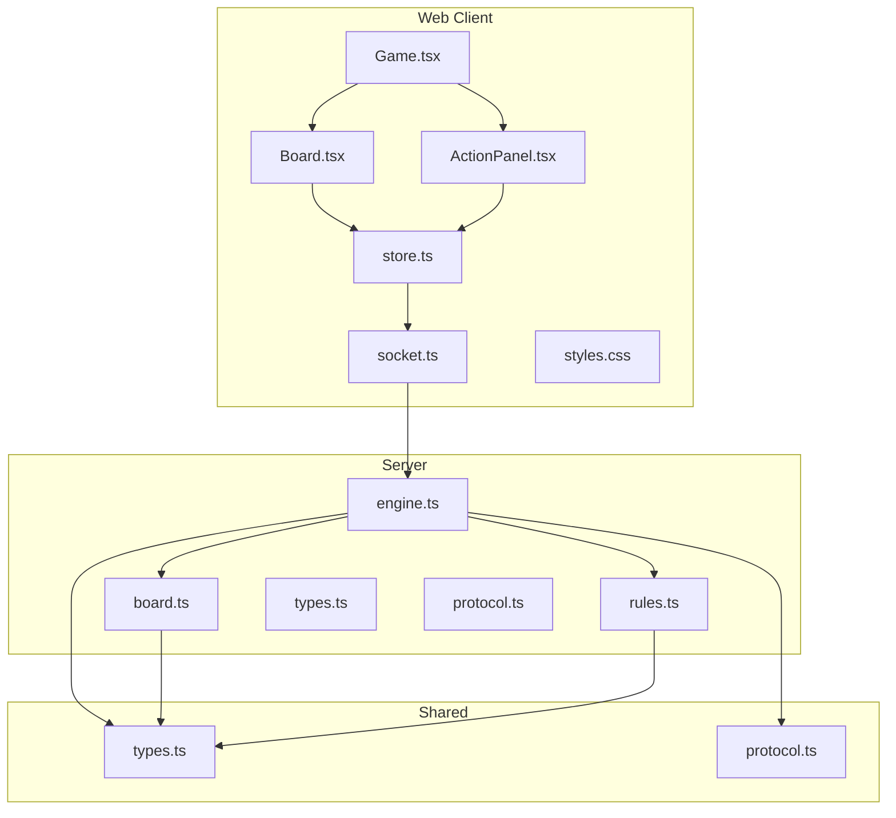

**Diagram sources**
- [Game.tsx:10-33](file://web/src/ui/Game.tsx#L10-L33)
- [Board.tsx:14-38](file://web/src/ui/Board.tsx#L14-L38)
- [ActionPanel.tsx:5-98](file://web/src/ui/ActionPanel.tsx#L5-L98)
- [store.ts:60-163](file://web/src/state/store.ts#L60-L163)
- [socket.ts:5-10](file://web/src/net/socket.ts#L5-L10)
- [engine.ts:76-114](file://server/src/game/engine.ts#L76-L114)
- [board.ts:147-275](file://server/src/game/board.ts#L147-L275)
- [rules.ts:34-183](file://server/src/game/rules.ts#L34-L183)
- [types.ts:18-50](file://shared/src/types.ts#L18-L50)
- [protocol.ts:69-80](file://shared/src/protocol.ts#L69-L80)

**Section sources**
- [Game.tsx:10-33](file://web/src/ui/Game.tsx#L10-L33)
- [Board.tsx:14-38](file://web/src/ui/Board.tsx#L14-L38)
- [ActionPanel.tsx:5-98](file://web/src/ui/ActionPanel.tsx#L5-L98)
- [store.ts:60-163](file://web/src/state/store.ts#L60-L163)
- [socket.ts:5-10](file://web/src/net/socket.ts#L5-L10)

## Core Components
The board interface consists of several interconnected components that work together to provide a responsive and interactive gaming experience:

### Board Component
The main board component renders the SVG visualization with cells, hangars, and planes. It uses a 720x720 viewport with proportional scaling based on cell coordinates.

### Action Panel
Handles user interactions including dice rolling, plane selection, and card playing. Provides contextual prompts based on game state.

### State Management
Centralized Zustand store manages game state, board data, and user interactions while maintaining real-time synchronization with the server.

### Server Integration
WebSocket connection maintains bidirectional communication between client and server, handling game state updates and user actions.

**Section sources**
- [Board.tsx:14-115](file://web/src/ui/Board.tsx#L14-L115)
- [ActionPanel.tsx:5-129](file://web/src/ui/ActionPanel.tsx#L5-L129)
- [store.ts:15-58](file://web/src/state/store.ts#L15-L58)
- [socket.ts:5-10](file://web/src/net/socket.ts#L5-L10)

## Architecture Overview
The board interface follows a reactive architecture pattern where the server maintains authoritative game state and pushes updates to clients in real-time.

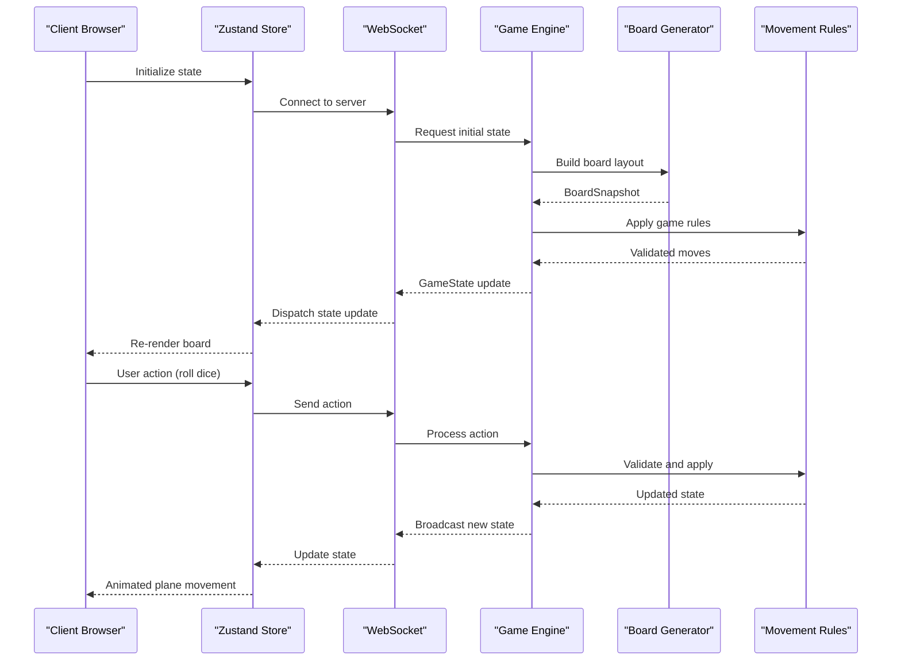

**Diagram sources**
- [store.ts:63-87](file://web/src/state/store.ts#L63-L87)
- [engine.ts:207-255](file://server/src/game/engine.ts#L207-L255)
- [board.ts:147-275](file://server/src/game/board.ts#L147-L275)
- [rules.ts:34-183](file://server/src/game/rules.ts#L34-L183)

## Detailed Component Analysis

### Coordinate System and Board Layout
The board uses a normalized coordinate system where all positions are expressed as fractions of the board size (0.0 to 1.0). The server generates the complete board layout with precise coordinates for each cell type.

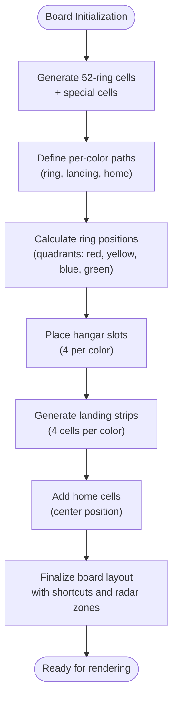

**Diagram sources**
- [board.ts:147-275](file://server/src/game/board.ts#L147-L275)
- [board.ts:54-68](file://server/src/game/board.ts#L54-L68)
- [board.ts:105-122](file://server/src/game/board.ts#L105-L122)

The coordinate system implementation provides several key features:
- **Normalized Coordinates**: All positions use 0.0-1.0 ranges for consistent scaling
- **Symmetric Layout**: Four quadrants arranged around a central home area
- **Precise Cell Placement**: Special cells (missile factory, radar factory, library) positioned at calculated offsets
- **Shortcut Connections**: Bidirectional shortcut pairs linking entry/exit points

**Section sources**
- [board.ts:54-68](file://server/src/game/board.ts#L54-L68)
- [board.ts:147-275](file://server/src/game/board.ts#L147-L275)
- [types.ts:18-29](file://shared/src/types.ts#L18-L29)

### Interactive Board Visualization
The board component renders all game elements using SVG primitives with responsive scaling and visual feedback.

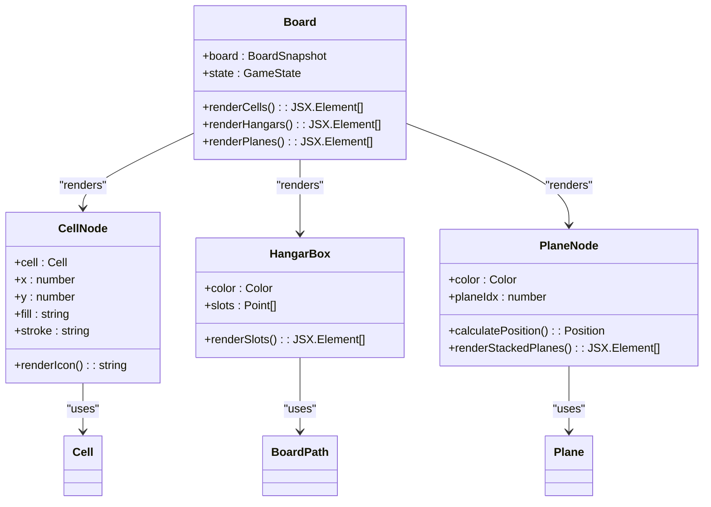

**Diagram sources**
- [Board.tsx:40-115](file://web/src/ui/Board.tsx#L40-L115)

Key visualization features include:
- **Responsive Scaling**: SVG viewBox adapts to container size while maintaining aspect ratio
- **Color Coding**: Each color has distinct fill/stroke combinations for visual identification
- **Stack Visualization**: Overlapping planes on same cells use offset positioning
- **Special Cell Icons**: Distinct symbols for missile factory, radar factory, library, shortcuts, and home

**Section sources**
- [Board.tsx:14-38](file://web/src/ui/Board.tsx#L14-L38)
- [Board.tsx:40-115](file://web/src/ui/Board.tsx#L40-L115)
- [styles.css:58-61](file://web/src/styles.css#L58-L61)

### Plane Movement Animations
The animation system provides smooth transitions for plane movements with collision detection and visual feedback.

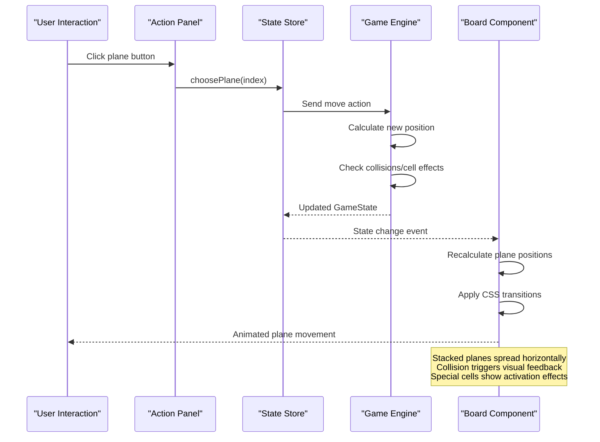

**Diagram sources**
- [ActionPanel.tsx:29-48](file://web/src/ui/ActionPanel.tsx#L29-L48)
- [store.ts:127-132](file://web/src/state/store.ts#L127-L132)
- [engine.ts:274-297](file://server/src/game/engine.ts#L274-L297)
- [Board.tsx:84-115](file://web/src/ui/Board.tsx#L84-L115)

Animation implementation details:
- **CSS Transitions**: 250ms duration for smooth plane movement
- **Stack Spreading**: Horizontal offset calculation prevents overlapping
- **Collision Effects**: Visual indicators for plane interactions
- **State Synchronization**: Real-time updates reflect server-side calculations

**Section sources**
- [styles.css:60](file://web/src/styles.css#L60)
- [Board.tsx:99-106](file://web/src/ui/Board.tsx#L99-L106)
- [engine.ts:345-391](file://server/src/game/engine.ts#L345-L391)

### Cell Interaction Handling
The board handles various cell types with specific interaction patterns and visual feedback.

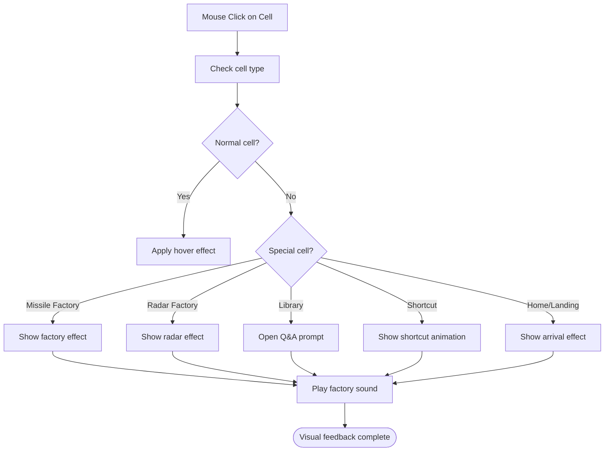

**Diagram sources**
- [Board.tsx:47-63](file://web/src/ui/Board.tsx#L47-L63)
- [engine.ts:531-566](file://server/src/game/engine.ts#L531-L566)

Cell interaction patterns:
- **Hover States**: Visual feedback for interactive elements
- **Special Effects**: Distinct animations for different cell types
- **Shortcut Mechanics**: Bidirectional connections with visual indicators
- **Home/Landing Recognition**: Different handling for completion areas

**Section sources**
- [Board.tsx:47-63](file://web/src/ui/Board.tsx#L47-L63)
- [engine.ts:531-566](file://server/src/game/engine.ts#L531-L566)

### Plane Positioning Logic
The positioning system calculates plane locations based on game state and board coordinates.

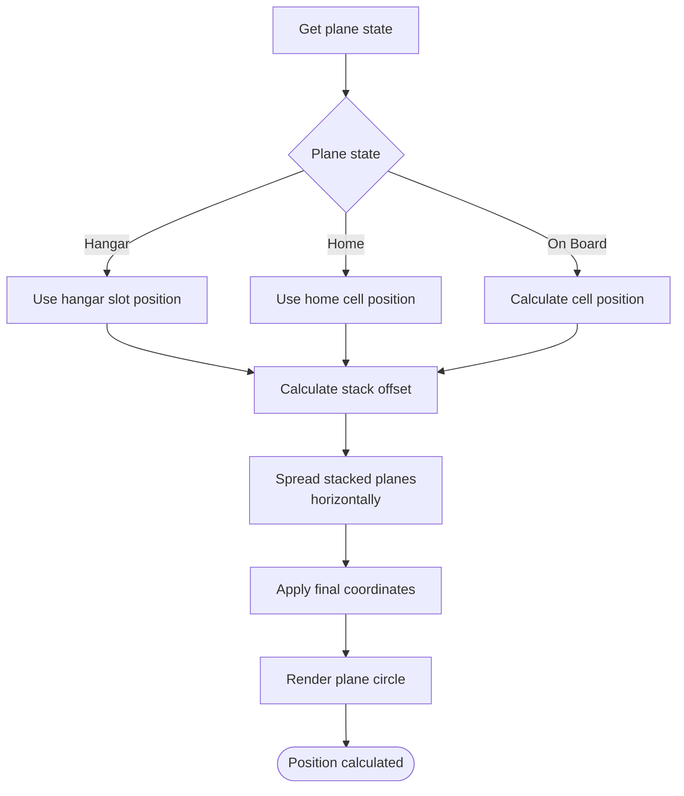

**Diagram sources**
- [Board.tsx:84-115](file://web/src/ui/Board.tsx#L84-L115)

Positioning algorithm features:
- **State-Based Positioning**: Different logic for hangar, home, and on-board states
- **Stack Calculation**: Horizontal spreading prevents plane overlap
- **Coordinate Transformation**: Cell coordinates scaled to SVG viewport
- **Smooth Transitions**: CSS animations for position changes

**Section sources**
- [Board.tsx:84-115](file://web/src/ui/Board.tsx#L84-L115)
- [types.ts:86-97](file://shared/src/types.ts#L86-L97)

### User Interaction Patterns
The interface provides intuitive controls for dice rolling and plane selection with contextual feedback.

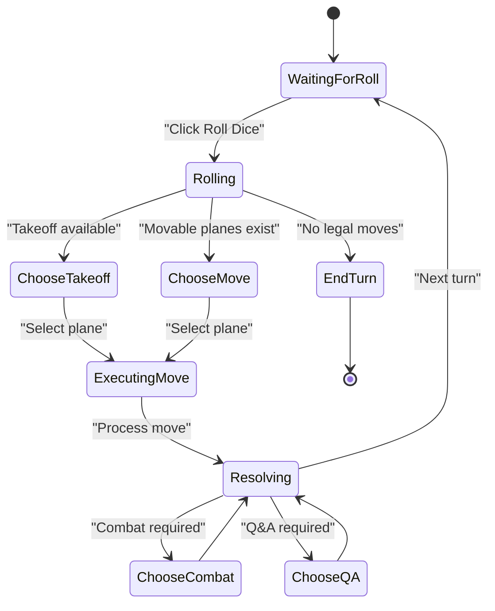

**Diagram sources**
- [ActionPanel.tsx:26-48](file://web/src/ui/ActionPanel.tsx#L26-L48)
- [engine.ts:207-255](file://server/src/game/engine.ts#L207-L255)

Interaction patterns:
- **Contextual Prompts**: Dynamic UI based on game phase and available actions
- **Visual Feedback**: Clear indication of current turn and available moves
- **Dice Chain Handling**: Special behavior for consecutive sixes
- **Takeoff Flexibility**: Option to take off or move existing planes

**Section sources**
- [ActionPanel.tsx:26-48](file://web/src/ui/ActionPanel.tsx#L26-L48)
- [engine.ts:207-255](file://server/src/game/engine.ts#L207-L255)

### Animation System for Plane Movements
The animation system provides smooth transitions for all plane movements with collision detection and visual effects.

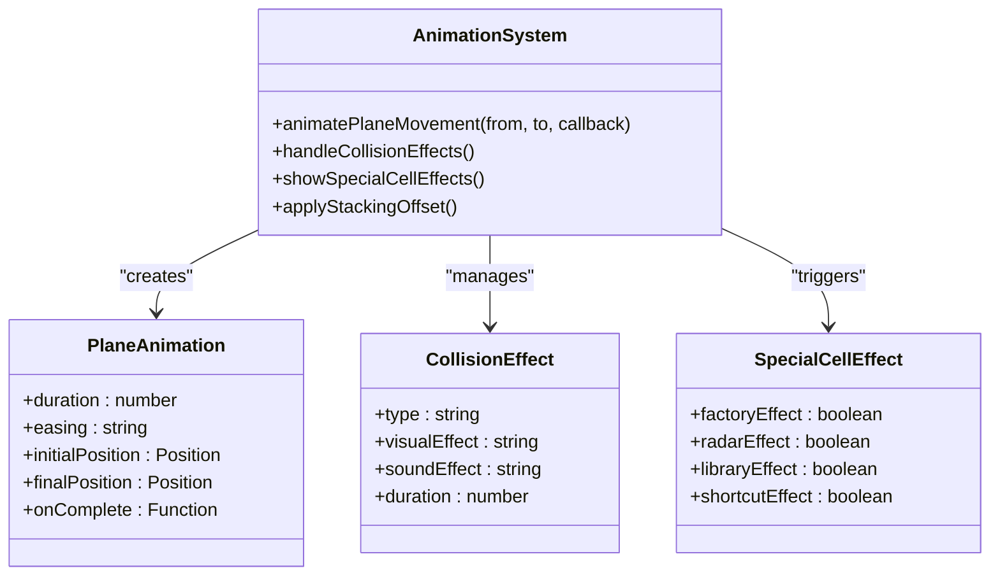

**Diagram sources**
- [styles.css:60](file://web/src/styles.css#L60)
- [Board.tsx:108-113](file://web/src/ui/Board.tsx#L108-L113)

Animation features:
- **CSS Transitions**: Hardware-accelerated smooth movement
- **Collision Detection**: Visual feedback for plane interactions
- **Special Cell Effects**: Distinct animations for different cell types
- **Stack Management**: Automatic horizontal spreading of stacked planes

**Section sources**
- [styles.css:60](file://web/src/styles.css#L60)
- [Board.tsx:108-113](file://web/src/ui/Board.tsx#L108-L113)

### Responsive Design Approach
The board interface implements a flexible responsive design that works across different screen sizes and devices.

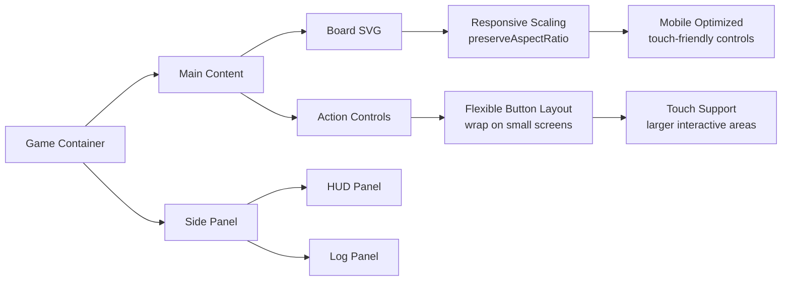

**Diagram sources**
- [styles.css:52-56](file://web/src/styles.css#L52-L56)
- [styles.css:88-96](file://web/src/styles.css#L88-L96)

Responsive features:
- **Flexible Container**: Main layout adapts to available space
- **SVG Scaling**: Vector graphics scale perfectly to any size
- **Button Wrapping**: Action buttons wrap on smaller screens
- **Touch Optimization**: Larger interactive elements for mobile devices

**Section sources**
- [styles.css:52-56](file://web/src/styles.css#L52-L56)
- [styles.css:88-96](file://web/src/styles.css#L88-L96)

### Accessibility Considerations
The interface includes several accessibility features for diverse user needs:

- **Keyboard Navigation**: Tab order through interactive elements
- **Screen Reader Support**: Descriptive labels and ARIA attributes
- **Color Contrast**: High contrast between planes and backgrounds
- **Focus Management**: Clear focus indicators for interactive elements
- **Alternative Input**: Touch and mouse interaction support

## Dependency Analysis
The board interface components have well-defined dependencies that maintain separation of concerns and enable independent development.

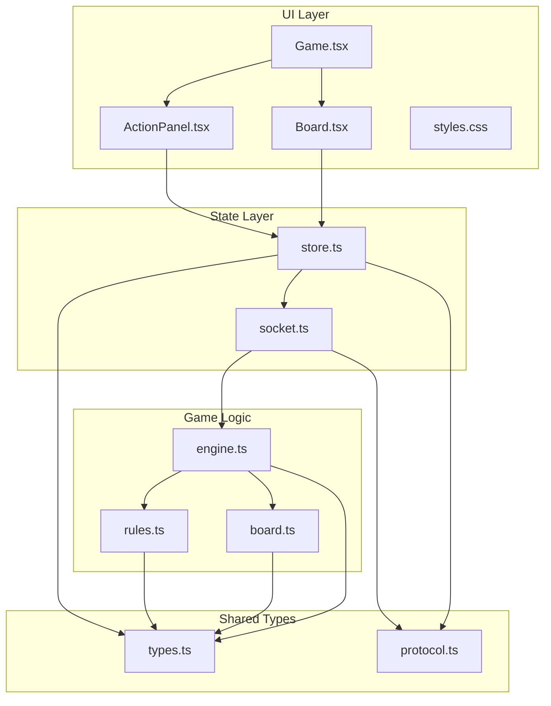

**Diagram sources**
- [Board.tsx:1-3](file://web/src/ui/Board.tsx#L1-L3)
- [ActionPanel.tsx:1-3](file://web/src/ui/ActionPanel.tsx#L1-L3)
- [Game.tsx:1-8](file://web/src/ui/Game.tsx#L1-L8)
- [store.ts:1-9](file://web/src/state/store.ts#L1-L9)
- [socket.ts:1](file://web/src/net/socket.ts#L1)
- [engine.ts:16-36](file://server/src/game/engine.ts#L16-L36)
- [board.ts:22-25](file://server/src/game/board.ts#L22-L25)
- [rules.ts:3-4](file://server/src/game/rules.ts#L3-L4)
- [types.ts:1-10](file://shared/src/types.ts#L1-L10)
- [protocol.ts:1-2](file://shared/src/protocol.ts#L1-L2)

Key dependency characteristics:
- **Loose Coupling**: UI components depend on shared types, not server implementation
- **Clear Boundaries**: State management isolated from rendering logic
- **Type Safety**: Strong typing ensures compile-time error detection
- **Testability**: Pure functions in game logic enable unit testing

**Section sources**
- [Board.tsx:1-3](file://web/src/ui/Board.tsx#L1-L3)
- [engine.ts:16-36](file://server/src/game/engine.ts#L16-L36)
- [types.ts:1-10](file://shared/src/types.ts#L1-L10)

## Performance Considerations
The board interface is designed for optimal performance across different devices and network conditions:

- **Efficient Rendering**: SVG rendering optimized for minimal DOM manipulation
- **State Updates**: Selective re-rendering based on state changes
- **Network Efficiency**: Real-time updates with efficient WebSocket communication
- **Memory Management**: Proper cleanup of event listeners and timeouts
- **Animation Performance**: CSS transitions for hardware acceleration

## Troubleshooting Guide
Common issues and their solutions:

### Board Not Loading
- **Cause**: Network connectivity issues
- **Solution**: Check WebSocket connection status and retry

### Planes Not Moving
- **Cause**: Outdated game state or invalid move
- **Solution**: Verify game phase and available moves

### Visual Glitches
- **Cause**: CSS transition conflicts
- **Solution**: Ensure proper animation timing and cleanup

### Touch Issues
- **Cause**: Small interactive areas
- **Solution**: Adjust touch target sizes for mobile devices

**Section sources**
- [store.ts:87-87](file://web/src/state/store.ts#L87-L87)
- [styles.css:60](file://web/src/styles.css#L60)

## Conclusion
The game board interface provides a robust, responsive, and visually appealing platform for the flight chess game. Its architecture balances real-time synchronization with smooth animations, while maintaining accessibility and cross-platform compatibility. The modular design enables easy maintenance and extension of game features while preserving the core user experience.