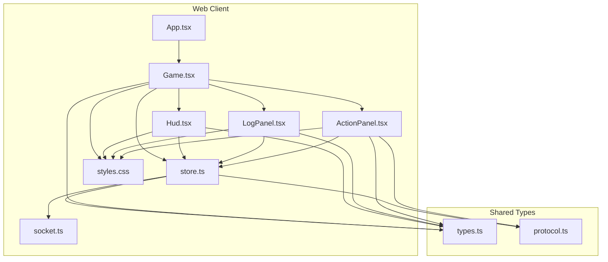
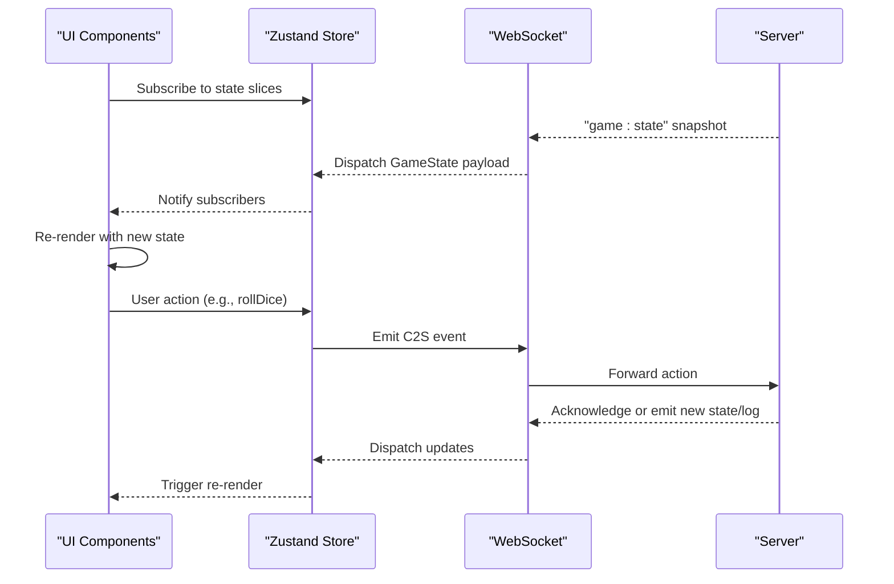
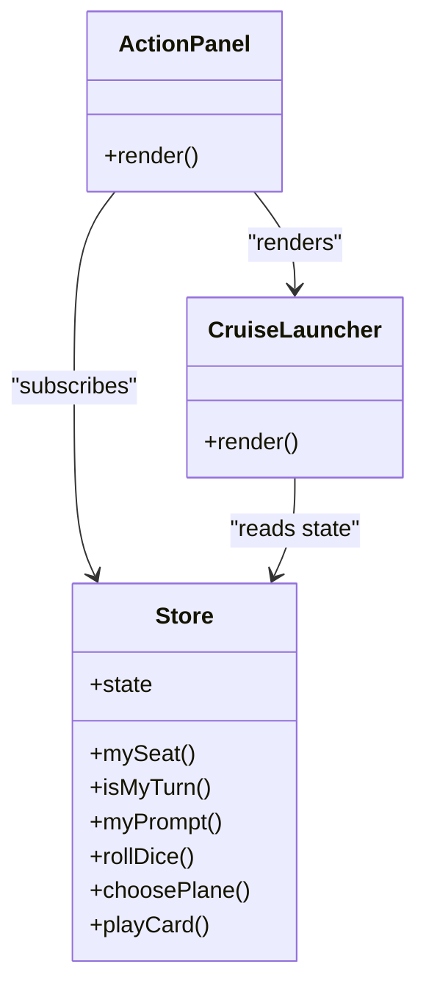
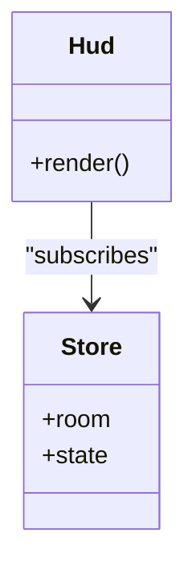
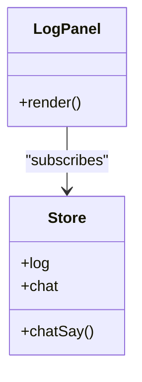
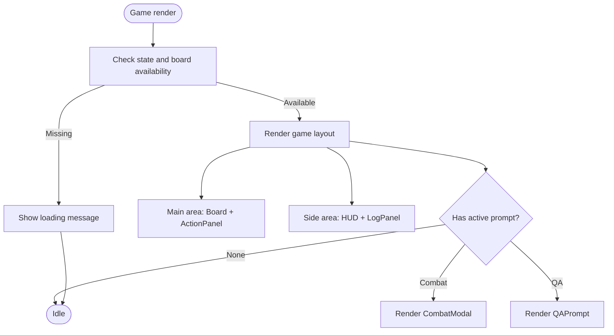
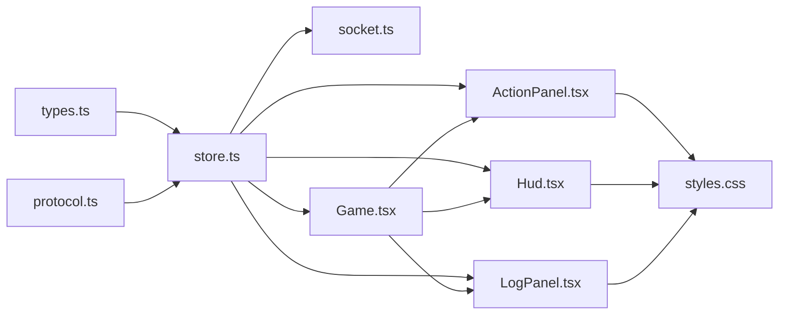

# Interactive Action Panels

<cite>
**Referenced Files in This Document**
- [ActionPanel.tsx](file://web/src/ui/ActionPanel.tsx)
- [Hud.tsx](file://web/src/ui/Hud.tsx)
- [LogPanel.tsx](file://web/src/ui/LogPanel.tsx)
- [store.ts](file://web/src/state/store.ts)
- [socket.ts](file://web/src/net/socket.ts)
- [types.ts](file://shared/src/types.ts)
- [protocol.ts](file://shared/src/protocol.ts)
- [styles.css](file://web/src/styles.css)
- [App.tsx](file://web/src/App.tsx)
- [Game.tsx](file://web/src/ui/Game.tsx)
- [QAPrompt.tsx](file://web/src/ui/QAPrompt.tsx)
</cite>

## Table of Contents
1. [Introduction](#introduction)
2. [Project Structure](#project-structure)
3. [Core Components](#core-components)
4. [Architecture Overview](#architecture-overview)
5. [Detailed Component Analysis](#detailed-component-analysis)
6. [Dependency Analysis](#dependency-analysis)
7. [Performance Considerations](#performance-considerations)
8. [Troubleshooting Guide](#troubleshooting-guide)
9. [Conclusion](#conclusion)

## Introduction
This document explains the interactive action panel system for the missile flight chess game. It covers three primary UI components:
- ActionPanel: Presents turn-based prompts, dice rolling, plane selection, and card usage for the current player.
- HUD (Heads-Up Display): Shows live player stats, current turn indicators, and deck counts.
- LogPanel: Displays recent game events and chat messages with a simple chat input.

These components synchronize with the server via a WebSocket connection, update reactively through a centralized Zustand store, and integrate seamlessly into the overall game layout.

## Project Structure
The interactive panels live under the web UI layer and share types and protocol definitions with the server and client. The store manages state transitions and network events, while the styles define responsive layouts and visual themes.

**Diagram sources**
- [App.tsx:1-19](file://web/src/App.tsx#L1-L19)
- [Game.tsx:1-34](file://web/src/ui/Game.tsx#L1-L34)
- [Hud.tsx:1-44](file://web/src/ui/Hud.tsx#L1-L44)
- [LogPanel.tsx:1-31](file://web/src/ui/LogPanel.tsx#L1-L31)
- [ActionPanel.tsx:1-129](file://web/src/ui/ActionPanel.tsx#L1-L129)
- [store.ts:1-164](file://web/src/state/store.ts#L1-L164)
- [socket.ts:1-11](file://web/src/net/socket.ts#L1-L11)
- [types.ts:1-186](file://shared/src/types.ts#L1-L186)
- [protocol.ts:1-97](file://shared/src/protocol.ts#L1-L97)
- [styles.css:1-118](file://web/src/styles.css#L1-L118)

**Section sources**
- [App.tsx:1-19](file://web/src/App.tsx#L1-L19)
- [Game.tsx:1-34](file://web/src/ui/Game.tsx#L1-L34)
- [store.ts:1-164](file://web/src/state/store.ts#L1-L164)
- [socket.ts:1-11](file://web/src/net/socket.ts#L1-L11)
- [types.ts:1-186](file://shared/src/types.ts#L1-L186)
- [protocol.ts:1-97](file://shared/src/protocol.ts#L1-L97)
- [styles.css:1-118](file://web/src/styles.css#L1-L118)

## Core Components
- ActionPanel: Renders turn state, dice roll, plane movement prompts, takeoff choices, and playable cards. It reacts to prompts and emits actions to the server.
- HUD: Displays all players’ stats, current turn, and deck counts. Highlights the current player and shows status effects like shields and skips.
- LogPanel: Shows capped event logs and recent chat messages, with a form to send new chat messages.

Key integration points:
- All components subscribe to the Zustand store for reactive updates.
- The store listens to server events and updates state accordingly.
- The store emits client-to-server actions via the WebSocket.

**Section sources**
- [ActionPanel.tsx:5-98](file://web/src/ui/ActionPanel.tsx#L5-L98)
- [Hud.tsx:7-43](file://web/src/ui/Hud.tsx#L7-L43)
- [LogPanel.tsx:4-30](file://web/src/ui/LogPanel.tsx#L4-L30)
- [store.ts:60-164](file://web/src/state/store.ts#L60-L164)

## Architecture Overview
The system follows a unidirectional data flow:
- Server emits snapshots and events (game state, board, logs, chat, errors).
- Client store receives and updates internal state.
- UI components re-render based on subscribed slices of state.
- User interactions trigger actions that are sent back to the server.

**Diagram sources**
- [store.ts:60-164](file://web/src/state/store.ts#L60-L164)
- [socket.ts:1-11](file://web/src/net/socket.ts#L1-L11)
- [protocol.ts:67-82](file://shared/src/protocol.ts#L67-L82)
- [types.ts:139-166](file://shared/src/types.ts#L139-L166)

## Detailed Component Analysis

### ActionPanel
Purpose:
- Present the current turn, dice roll, and dice chain.
- Show phase information and enable dice rolling when it is the local player’s turn.
- Render prompts for plane movement or takeoff and allow plane selection.
- Render the player’s missile and reward cards, enabling targeted card plays.

Composition patterns:
- Uses hooks to subscribe to state slices: current game state, whether it is the local player’s turn, the local player’s seat color, and the current prompt.
- Renders conditional UI based on the prompt kind and available planes/cards.
- Provides specialized helpers for card targeting (e.g., CruiseLauncher) that compute valid targets dynamically.

State synchronization:
- Subscribes to the global store for state, prompts, and hand information.
- Emits actions to the server for rolling dice, choosing planes/takeoffs, and playing cards.

User interaction handling:
- Button clicks trigger actions bound to store methods.
- Select menus for card targeting update immediately and call playCard with target options.

Dynamic content rendering:
- Prompts are filtered by seat to show only the local player’s active prompt.
- Plane buttons reflect the seat color with themed styling.
- CruiseLauncher builds a dynamic target list based on current board state.

Notification systems:
- No explicit toast notifications here; errors surface via the app-level error toast.

Real-time updates:
- Reacts to incoming GameState events and prompt changes.

Styling and responsiveness:
- Uses CSS classes for dice display, prompt areas, plane buttons, and hand cards.
- Plane buttons are styled per seat color.

Integration with game flow:
- Appears within the main game area alongside the board.
- Integrates with modal overlays for combat and QA prompts.

Examples:
- Panel activation: When the store’s state becomes available and the screen is game, ActionPanel renders.
- Content updates: On receiving a new GameState, the panel updates turn, phase, dice, and prompts.
- User feedback: Clicking a plane button triggers a move action; selecting a cruise target emits a card play.

**Section sources**
- [ActionPanel.tsx:5-98](file://web/src/ui/ActionPanel.tsx#L5-L98)
- [ActionPanel.tsx:100-128](file://web/src/ui/ActionPanel.tsx#L100-L128)
- [store.ts:60-164](file://web/src/state/store.ts#L60-L164)
- [types.ts:139-146](file://shared/src/types.ts#L139-L146)
- [styles.css:87-101](file://web/src/styles.css#L87-L101)

#### Class Diagram: ActionPanel and Helpers

**Diagram sources**
- [ActionPanel.tsx:5-98](file://web/src/ui/ActionPanel.tsx#L5-L98)
- [ActionPanel.tsx:100-128](file://web/src/ui/ActionPanel.tsx#L100-L128)
- [store.ts:60-164](file://web/src/state/store.ts#L60-L164)

### HUD (Heads-Up Display)
Purpose:
- Display all players’ information, including seat color, nickname, current turn indicator, and stats.
- Show deck counts for missiles, radars, rewards, punishments, and questions.

Composition patterns:
- Iterates over all four colors to render each player’s row.
- Uses the room’s seat information to determine who is seated and whether it is the local player’s turn.
- Reads hand counts from the current GameState.

State synchronization:
- Subscribes to the global store for room and state.
- Reacts to RoomState and GameState events.

User interaction handling:
- No direct user interaction; purely informational.

Dynamic content rendering:
- Highlights the current turn player.
- Shows the local player badge.
- Displays radar count, missile count, home-plane count, skip rounds, and shield status.

Real-time updates:
- Updates whenever the room or state changes.

Styling and responsiveness:
- Responsive grid-like layout with colored dots and badges.
- Uses CSS variables for consistent theming.

Integration with game flow:
- Lives in the side panel of the game layout.

**Section sources**
- [Hud.tsx:7-43](file://web/src/ui/Hud.tsx#L7-L43)
- [store.ts:60-164](file://web/src/state/store.ts#L60-L164)
- [types.ts:109-117](file://shared/src/types.ts#L109-L117)
- [styles.css:62-76](file://web/src/styles.css#L62-L76)

#### Class Diagram: HUD

**Diagram sources**
- [Hud.tsx:7-43](file://web/src/ui/Hud.tsx#L7-L43)
- [store.ts:60-164](file://web/src/state/store.ts#L60-L164)

### LogPanel
Purpose:
- Display recent game event logs and chat messages.
- Provide a simple input to send chat messages.

Composition patterns:
- Subscribes to log and chat arrays from the store.
- Automatically scrolls to the bottom when new items arrive.
- Limits displayed entries to recent caps.

State synchronization:
- Subscribes to log and chat slices.
- Reacts to EventLog and Chat events.

User interaction handling:
- Form submission triggers chatSay, which emits a chat message to the server.

Dynamic content rendering:
- Renders capped slices of log and chat.
- Chat lines include nicknames and timestamps.

Real-time updates:
- Updates immediately upon receiving new log or chat events.

Styling and responsiveness:
- Flex layout with scrollable body and inline input bar.
- Responsive small-screen adjustments.

Integration with game flow:
- Lives in the side panel of the game layout.

**Section sources**
- [LogPanel.tsx:4-30](file://web/src/ui/LogPanel.tsx#L4-L30)
- [store.ts:60-164](file://web/src/state/store.ts#L60-L164)
- [protocol.ts:76-79](file://shared/src/protocol.ts#L76-L79)
- [styles.css:77-86](file://web/src/styles.css#L77-L86)

#### Class Diagram: LogPanel

**Diagram sources**
- [LogPanel.tsx:4-30](file://web/src/ui/LogPanel.tsx#L4-L30)
- [store.ts:60-164](file://web/src/state/store.ts#L60-L164)

### Game Layout Integration
The Game component orchestrates the layout and conditionally renders modals for combat and QA prompts. It ensures ActionPanel and HUD are visible during gameplay, and LogPanel remains accessible.

**Diagram sources**
- [Game.tsx:10-33](file://web/src/ui/Game.tsx#L10-L33)
- [QAPrompt.tsx:9-44](file://web/src/ui/QAPrompt.tsx#L9-L44)

**Section sources**
- [Game.tsx:10-33](file://web/src/ui/Game.tsx#L10-L33)
- [QAPrompt.tsx:9-44](file://web/src/ui/QAPrompt.tsx#L9-L44)

## Dependency Analysis
- UI components depend on the Zustand store for state and actions.
- The store depends on the WebSocket for network communication and on shared types for typing.
- The store emits typed client-to-server events and handles typed server-to-client events.
- Styles are shared across components via CSS classes.

**Diagram sources**
- [store.ts:1-164](file://web/src/state/store.ts#L1-L164)
- [socket.ts:1-11](file://web/src/net/socket.ts#L1-L11)
- [types.ts:1-186](file://shared/src/types.ts#L1-L186)
- [protocol.ts:1-97](file://shared/src/protocol.ts#L1-L97)
- [styles.css:1-118](file://web/src/styles.css#L1-L118)

**Section sources**
- [store.ts:1-164](file://web/src/state/store.ts#L1-L164)
- [socket.ts:1-11](file://web/src/net/socket.ts#L1-L11)
- [types.ts:1-186](file://shared/src/types.ts#L1-L186)
- [protocol.ts:1-97](file://shared/src/protocol.ts#L1-L97)
- [styles.css:1-118](file://web/src/styles.css#L1-L118)

## Performance Considerations
- Subscription granularity: Components subscribe only to the slices they need, minimizing unnecessary re-renders.
- Capped logs and chat arrays prevent memory growth over long games.
- Auto-scroll in LogPanel is triggered only when lengths change, avoiding excessive DOM manipulation.
- Dynamic target computation in ActionPanel recomputes only when state changes.

## Troubleshooting Guide
Common issues and resolutions:
- Panels not appearing:
  - Ensure the store’s screen is set to game and state/board are loaded.
  - Verify the Game component is rendering and not showing a loading message.
- No dice roll button:
  - Confirm the local player’s seat is known and it is their turn according to the store.
- Prompts not visible:
  - Check that the GameState includes prompts and that myPrompt resolves to the local player’s prompt.
- Chat not sending:
  - Confirm the chat input is not empty and chatSay is bound to the form submit handler.
- Errors shown:
  - The app displays a persistent error toast; inspect the lastError in the store.

**Section sources**
- [Game.tsx:15-17](file://web/src/ui/Game.tsx#L15-L17)
- [store.ts:72-87](file://web/src/state/store.ts#L72-L87)
- [LogPanel.tsx:24-27](file://web/src/ui/LogPanel.tsx#L24-L27)
- [App.tsx:15-15](file://web/src/App.tsx#L15-L15)

## Conclusion
The interactive action panels system provides a cohesive, reactive interface for turn-based decision-making, real-time information display, and social interaction. By centralizing state in the store and synchronizing with the server via typed events, the components remain decoupled, maintainable, and responsive. The modular design allows for easy extension of prompts, cards, and UI elements while preserving a consistent user experience.