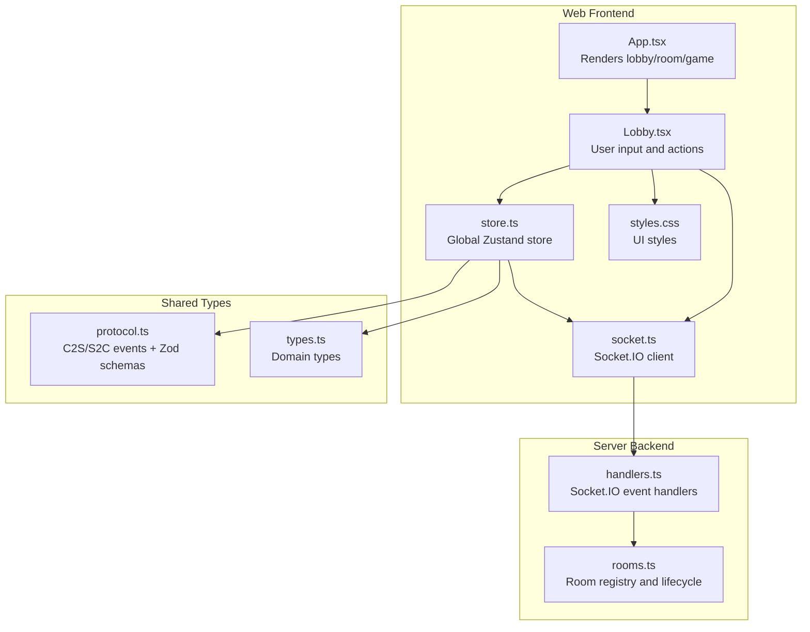
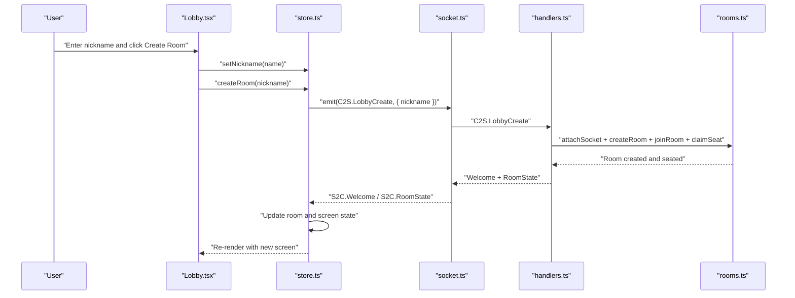
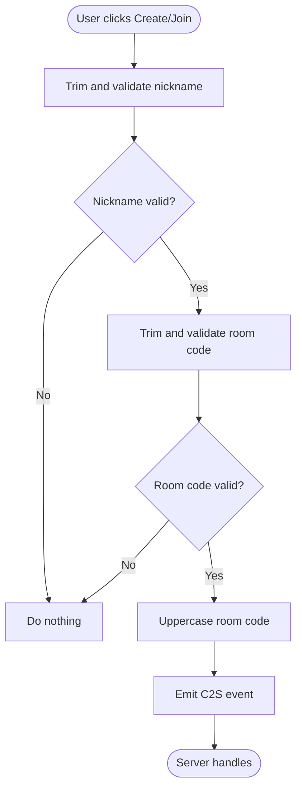
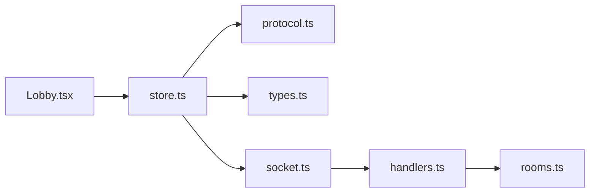

# Lobby Interface

<cite>
**Referenced Files in This Document**
- [Lobby.tsx](file://web/src/ui/Lobby.tsx)
- [store.ts](file://web/src/state/store.ts)
- [socket.ts](file://web/src/net/socket.ts)
- [protocol.ts](file://shared/src/protocol.ts)
- [types.ts](file://shared/src/types.ts)
- [handlers.ts](file://server/src/net/handlers.ts)
- [rooms.ts](file://server/src/rooms.ts)
- [styles.css](file://web/src/styles.css)
- [App.tsx](file://web/src/App.tsx)
- [Room.tsx](file://web/src/ui/Room.tsx)
</cite>

## Table of Contents
1. [Introduction](#introduction)
2. [Project Structure](#project-structure)
3. [Core Components](#core-components)
4. [Architecture Overview](#architecture-overview)
5. [Detailed Component Analysis](#detailed-component-analysis)
6. [Dependency Analysis](#dependency-analysis)
7. [Performance Considerations](#performance-considerations)
8. [Troubleshooting Guide](#troubleshooting-guide)
9. [Conclusion](#conclusion)
10. [Appendices](#appendices)

## Introduction
This document provides comprehensive technical documentation for the lobby interface component of the online Air Defense Combat Flying Chess game. It covers room creation and joining functionality, nickname management, form validation patterns, React hooks-based state management, event handlers, integration with the global Zustand store, and the Socket.IO client. It also explains user input validation, room code formatting, error prevention mechanisms, visual design elements, responsive layout considerations, accessibility features, and practical usage examples.

## Project Structure
The lobby interface is part of a React-based frontend that communicates with a TypeScript/Node.js backend via Socket.IO. The lobby component renders a simple form with nickname and room code inputs, and buttons to create or join a room. The global store manages UI state, player identity, room state, and game state, while the Socket.IO client handles real-time communication with the server.

**Diagram sources**
- [App.tsx:7-18](file://web/src/App.tsx#L7-L18)
- [Lobby.tsx:4-43](file://web/src/ui/Lobby.tsx#L4-L43)
- [store.ts:60-163](file://web/src/state/store.ts#L60-L163)
- [socket.ts:5-10](file://web/src/net/socket.ts#L5-L10)
- [protocol.ts:6-82](file://shared/src/protocol.ts#L6-L82)
- [types.ts:170-176](file://shared/src/types.ts#L170-L176)
- [handlers.ts:15-176](file://server/src/net/handlers.ts#L15-L176)
- [rooms.ts:39-211](file://server/src/rooms.ts#L39-L211)
- [styles.css:27-36](file://web/src/styles.css#L27-L36)

**Section sources**
- [App.tsx:1-19](file://web/src/App.tsx#L1-L19)
- [Lobby.tsx:1-44](file://web/src/ui/Lobby.tsx#L1-L44)
- [store.ts:1-164](file://web/src/state/store.ts#L1-L164)
- [socket.ts:1-11](file://web/src/net/socket.ts#L1-L11)
- [protocol.ts:1-97](file://shared/src/protocol.ts#L1-L97)
- [types.ts:168-176](file://shared/src/types.ts#L168-L176)
- [handlers.ts:1-230](file://server/src/net/handlers.ts#L1-L230)
- [rooms.ts:1-211](file://server/src/rooms.ts#L1-L211)
- [styles.css:1-118](file://web/src/styles.css#L1-L118)

## Core Components
- Lobby component: Renders the lobby UI, manages local nickname and room code inputs, and triggers store actions for room creation and joining.
- Zustand store: Centralized state for player identity, room state, game state, navigation, and error messages. Exposes actions to create/join rooms and integrates with Socket.IO.
- Socket.IO client: Singleton connection factory that connects to the backend server and emits/receives events.
- Protocol and types: Define C2S/S2C event names and payload schemas validated by Zod on the server side.

Key responsibilities:
- Input validation and sanitization (trimming, max lengths, uppercase room code).
- Navigation transitions between lobby, room, and game screens.
- Real-time synchronization of room and game state via Socket.IO.

**Section sources**
- [Lobby.tsx:4-43](file://web/src/ui/Lobby.tsx#L4-L43)
- [store.ts:15-58](file://web/src/state/store.ts#L15-L58)
- [store.ts:101-110](file://web/src/state/store.ts#L101-L110)
- [socket.ts:5-10](file://web/src/net/socket.ts#L5-L10)
- [protocol.ts:6-82](file://shared/src/protocol.ts#L6-L82)

## Architecture Overview
The lobby component interacts with the global store, which encapsulates Socket.IO communication. The store listens for server events and updates UI state accordingly, including navigation transitions. The server validates incoming requests using Zod schemas and maintains room state.

**Diagram sources**
- [Lobby.tsx:9-13](file://web/src/ui/Lobby.tsx#L9-L13)
- [store.ts:101-107](file://web/src/state/store.ts#L101-L107)
- [socket.ts:5-10](file://web/src/net/socket.ts#L5-L10)
- [handlers.ts:19-29](file://server/src/net/handlers.ts#L19-L29)
- [rooms.ts:78-121](file://server/src/rooms.ts#L78-L121)

## Detailed Component Analysis

### Lobby Component
The lobby component uses React hooks to manage local state for nickname and room code, and delegates persistence and network actions to the global store.

- State management:
  - Local nickname input bound to a controlled input field.
  - Room code input bound to a controlled input field.
- Validation and formatting:
  - Trims whitespace from nickname and room code before submission.
  - Enforces maximum lengths (nickname up to 16 chars, room code up to 8 chars).
  - Converts room code to uppercase for consistency.
- Actions:
  - Create Room: Validates non-empty nickname, sets nickname, and calls store.createRoom.
  - Join Room: Validates non-empty nickname and room code, sets nickname, and calls store.joinRoom.

Accessibility and UX:
- Uses semantic labels and placeholders for inputs.
- Responsive layout via CSS grid/flex utilities.
- Clear visual separation between create and join sections.

**Section sources**
- [Lobby.tsx:4-43](file://web/src/ui/Lobby.tsx#L4-L43)
- [styles.css:27-36](file://web/src/styles.css#L27-L36)

### Global Store (Zustand)
The store centralizes UI and game state, manages Socket.IO subscriptions, and exposes actions for lobby and room operations.

- Identity and navigation:
  - playerId, nickname, screen (lobby/room/game).
- Room and game state:
  - room, board, state, log, chat, myCardEvents, lastError.
- Actions:
  - setNickname persists to localStorage and updates state.
  - createRoom emits C2S.LobbyCreate.
  - joinRoom emits C2S.LobbyJoin with uppercase room code.
  - Navigation updates based on S2C.RoomState and S2C.GameState.
- Error handling:
  - Listens for S2C.Error and stores lastError for display.

Integration with Socket.IO:
- Subscribes to S2C events and updates state accordingly.
- Emits C2S events for lobby and room operations.

**Section sources**
- [store.ts:15-58](file://web/src/state/store.ts#L15-L58)
- [store.ts:60-87](file://web/src/state/store.ts#L60-L87)
- [store.ts:101-110](file://web/src/state/store.ts#L101-L110)
- [store.ts:146-161](file://web/src/state/store.ts#L146-L161)

### Socket.IO Client
The client creates a singleton Socket.IO connection, auto-connecting via WebSocket and polling transports. The URL is dev vs production based on environment.

- Connection behavior:
  - autoConnect: true.
  - transports: websocket, polling.
- Environment-aware URL resolution.

**Section sources**
- [socket.ts:5-10](file://web/src/net/socket.ts#L5-L10)

### Server-Side Handlers and Room Registry
The server validates payloads using Zod schemas and manages room lifecycle.

- Validation:
  - C2S.LobbyCreate: nickname min/max length.
  - C2S.LobbyJoin: room code min/max length and nickname min/max length.
- Room operations:
  - Create room, join room, claim seat, set ready, start game.
  - Broadcast room state and game state to clients.
- Room ID generation:
  - Uses a compact alphabet and fallback to nanoid for uniqueness.

**Section sources**
- [handlers.ts:19-41](file://server/src/net/handlers.ts#L19-L41)
- [protocol.ts:26-32](file://shared/src/protocol.ts#L26-L32)
- [rooms.ts:78-104](file://server/src/rooms.ts#L78-L104)
- [rooms.ts:201-209](file://server/src/rooms.ts#L201-L209)

### Form Validation Patterns
- Client-side:
  - Non-empty checks for nickname and room code.
  - Max length enforcement for inputs.
  - Uppercase normalization for room code.
- Server-side:
  - Zod schemas enforce min/max lengths and types for lobby create/join payloads.

**Diagram sources**
- [Lobby.tsx:9-18](file://web/src/ui/Lobby.tsx#L9-L18)
- [store.ts:108-109](file://web/src/state/store.ts#L108-L109)
- [protocol.ts:26-32](file://shared/src/protocol.ts#L26-L32)

**Section sources**
- [Lobby.tsx:9-18](file://web/src/ui/Lobby.tsx#L9-L18)
- [store.ts:108-109](file://web/src/state/store.ts#L108-L109)
- [protocol.ts:26-32](file://shared/src/protocol.ts#L26-L32)

### Room Code Formatting and Error Prevention
- Room code formatting:
  - Uppercase conversion ensures consistent matching.
  - Max length prevents overly long codes.
- Error prevention:
  - Client-side guard prevents empty submissions.
  - Server-side Zod validation rejects malformed payloads.
  - Server checks for room existence and availability before joining.

**Section sources**
- [Lobby.tsx:35](file://web/src/ui/Lobby.tsx#L35)
- [store.ts:109](file://web/src/state/store.ts#L109)
- [handlers.ts:31-41](file://server/src/net/handlers.ts#L31-L41)
- [protocol.ts:30](file://shared/src/protocol.ts#L30)

### Visual Design Elements and Responsive Layout
- Typography and spacing:
  - Centered layout with a card container for inputs and actions.
  - Divider element separates create and join sections.
- Colors and themes:
  - Uses CSS variables for consistent theming (colors, backgrounds, muted text).
- Responsive behavior:
  - Fixed width card with max-width 100% for mobile adaptability.
  - Flexbox and grid utilities support adaptive layouts.

**Section sources**
- [styles.css:27-36](file://web/src/styles.css#L27-L36)
- [styles.css:1-20](file://web/src/styles.css#L1-L20)

### Accessibility Features
- Semantic labels for inputs improve screen reader support.
- Clear button states and hover feedback enhance usability.
- Keyboard navigable inputs and buttons.

[No sources needed since this section provides general guidance]

## Dependency Analysis
The lobby component depends on the global store and Socket.IO client. The store depends on shared protocol and types, and the server depends on Zod schemas and room registry.

**Diagram sources**
- [Lobby.tsx:5](file://web/src/ui/Lobby.tsx#L5)
- [store.ts:8-9](file://web/src/state/store.ts#L8-L9)
- [protocol.ts:1-3](file://shared/src/protocol.ts#L1-L3)
- [types.ts:1-1](file://shared/src/types.ts#L1-L1)
- [socket.ts:1-2](file://web/src/net/socket.ts#L1-L2)
- [handlers.ts:3-13](file://server/src/net/handlers.ts#L3-L13)
- [rooms.ts:3-8](file://server/src/rooms.ts#L3-L8)

**Section sources**
- [Lobby.tsx:1-44](file://web/src/ui/Lobby.tsx#L1-L44)
- [store.ts:1-164](file://web/src/state/store.ts#L1-L164)
- [protocol.ts:1-97](file://shared/src/protocol.ts#L1-L97)
- [types.ts:1-186](file://shared/src/types.ts#L1-L186)
- [handlers.ts:1-230](file://server/src/net/handlers.ts#L1-L230)
- [rooms.ts:1-211](file://server/src/rooms.ts#L1-L211)
- [socket.ts:1-11](file://web/src/net/socket.ts#L1-L11)

## Performance Considerations
- Minimize re-renders by keeping lobby state minimal and delegating heavy logic to the store.
- Debounce or throttle input changes if needed, though current implementation is lightweight.
- Use memoization for derived values (e.g., mySeat) already present in the store.

[No sources needed since this section provides general guidance]

## Troubleshooting Guide
Common issues and resolutions:
- Room not found when joining:
  - Verify room code formatting (uppercase) and length.
  - Confirm the room exists and is not full.
- Invalid payload errors:
  - Ensure nickname length is within 1–16 characters.
  - Ensure room code length is within 4–8 characters.
- Navigation stuck in lobby:
  - Check S2C.RoomState and S2C.GameState subscriptions in the store.
  - Confirm server broadcasts room state after join/create.

**Section sources**
- [handlers.ts:31-41](file://server/src/net/handlers.ts#L31-L41)
- [protocol.ts:26-32](file://shared/src/protocol.ts#L26-L32)
- [store.ts:66-78](file://web/src/state/store.ts#L66-L78)

## Conclusion
The lobby interface component provides a clean, accessible, and robust entry point to the game. It enforces client-side validation, integrates tightly with the global store and Socket.IO, and leverages server-side Zod schemas for strong input validation. The design emphasizes simplicity and responsiveness, while the store manages navigation and state transitions seamlessly.

## Appendices

### Example Usage and Integration Patterns
- Creating a room:
  - Enter a nickname (1–16 chars), click “Create Room”.
  - The store emits C2S.LobbyCreate and transitions to the room screen upon receiving S2C.RoomState.
- Joining a room:
  - Enter nickname and a room code (4–8 chars, uppercase), click “Join Room”.
  - The store emits C2S.LobbyJoin and transitions to the room screen upon successful join.
- Room navigation:
  - The App component switches between lobby, room, and game based on store.screen.
- Error display:
  - The App component shows a toast with the last error received from S2C.Error.

**Section sources**
- [Lobby.tsx:9-18](file://web/src/ui/Lobby.tsx#L9-L18)
- [store.ts:101-110](file://web/src/state/store.ts#L101-L110)
- [store.ts:66-87](file://web/src/state/store.ts#L66-L87)
- [App.tsx:7-18](file://web/src/App.tsx#L7-L18)