# Room Management Interface

<cite>
**Referenced Files in This Document**
- [Room.tsx](file://web/src/ui/Room.tsx)
- [store.ts](file://web/src/state/store.ts)
- [socket.ts](file://web/src/net/socket.ts)
- [handlers.ts](file://server/src/net/handlers.ts)
- [rooms.ts](file://server/src/rooms.ts)
- [types.ts](file://shared/src/types.ts)
- [protocol.ts](file://shared/src/protocol.ts)
- [Lobby.tsx](file://web/src/ui/Lobby.tsx)
- [App.tsx](file://web/src/App.tsx)
- [Game.tsx](file://web/src/ui/Game.tsx)
</cite>

## Table of Contents
1. [Introduction](#introduction)
2. [Project Structure](#project-structure)
3. [Core Components](#core-components)
4. [Architecture Overview](#architecture-overview)
5. [Detailed Component Analysis](#detailed-component-analysis)
6. [Dependency Analysis](#dependency-analysis)
7. [Performance Considerations](#performance-considerations)
8. [Troubleshooting Guide](#troubleshooting-guide)
9. [Conclusion](#conclusion)

## Introduction
The Room Management Interface is the central component for multiplayer setup and coordination in the flight chess game. It provides a comprehensive system for seat assignment, player ready-state management, and game configuration options. The component facilitates real-time room operations through Socket.IO integration, enabling seamless multiplayer experiences with immediate UI feedback and error handling.

This documentation covers the seat assignment system, player ready-state coordination, game configuration options, host privileges, real-time room updates, and the complete state management patterns that drive the multiplayer setup experience.

## Project Structure
The room management system spans three main layers: client-side UI components, state management, and server-side room orchestration.

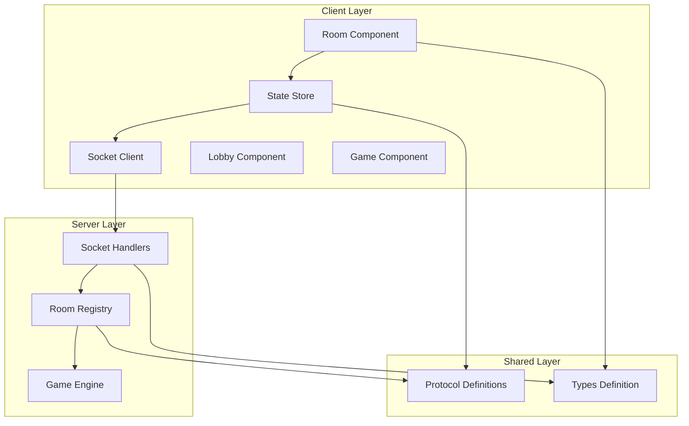

**Diagram sources**
- [Room.tsx:1-62](file://web/src/ui/Room.tsx#L1-L62)
- [store.ts:1-164](file://web/src/state/store.ts#L1-L164)
- [handlers.ts:1-230](file://server/src/net/handlers.ts#L1-L230)
- [rooms.ts:1-211](file://server/src/rooms.ts#L1-L211)

**Section sources**
- [Room.tsx:1-62](file://web/src/ui/Room.tsx#L1-L62)
- [store.ts:1-164](file://web/src/state/store.ts#L1-L164)
- [handlers.ts:1-230](file://server/src/net/handlers.ts#L1-L230)
- [rooms.ts:1-211](file://server/src/rooms.ts#L1-L211)

## Core Components

### Room Component Architecture
The Room component serves as the primary interface for multiplayer room management, implementing seat assignment, player readiness, and game configuration controls.

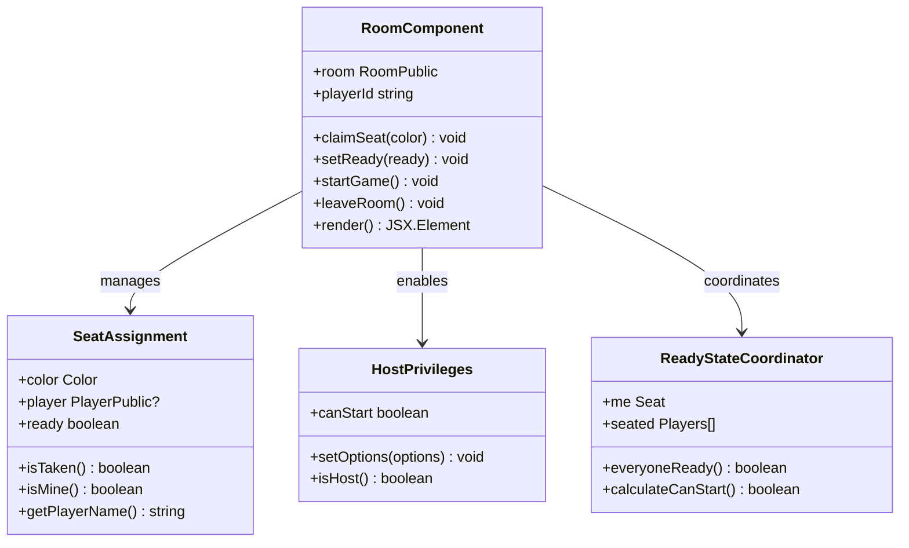

**Diagram sources**
- [Room.tsx:9-61](file://web/src/ui/Room.tsx#L9-L61)
- [types.ts:170-176](file://shared/src/types.ts#L170-L176)

### State Management Pattern
The client-side state management follows a centralized store pattern using Zustand, providing reactive updates and real-time synchronization with server state.

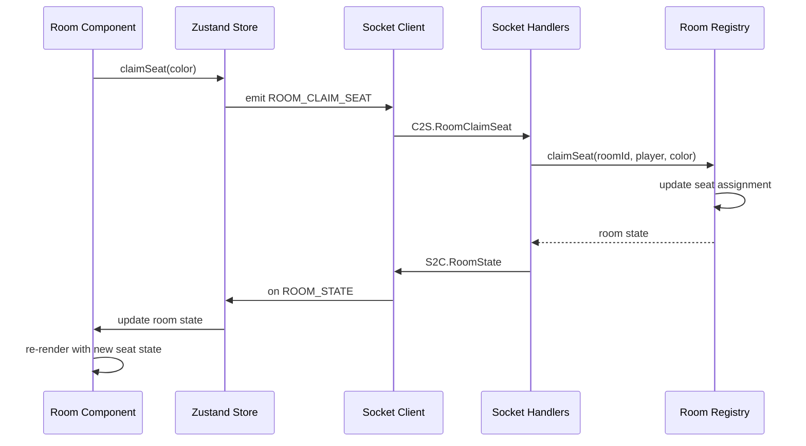

**Diagram sources**
- [store.ts:115-120](file://web/src/state/store.ts#L115-L120)
- [handlers.ts:43-52](file://server/src/net/handlers.ts#L43-L52)
- [rooms.ts:106-121](file://server/src/rooms.ts#L106-L121)

**Section sources**
- [Room.tsx:9-61](file://web/src/ui/Room.tsx#L9-L61)
- [store.ts:60-164](file://web/src/state/store.ts#L60-L164)
- [types.ts:170-176](file://shared/src/types.ts#L170-L176)

## Architecture Overview

### Real-Time Communication Flow
The room management system implements a robust real-time communication architecture using Socket.IO for immediate state synchronization and user interaction feedback.

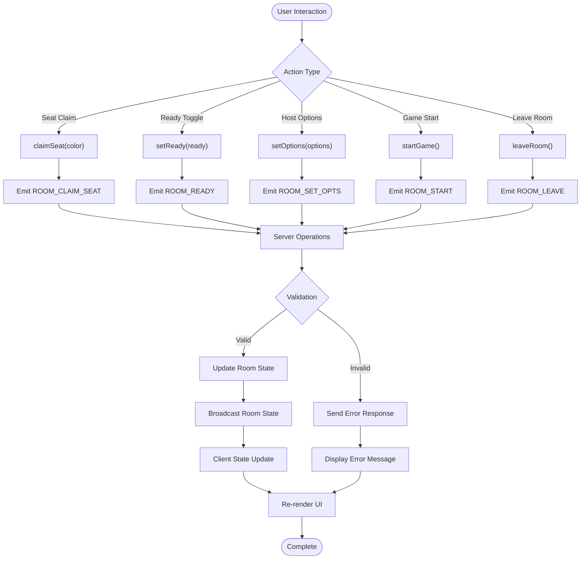

**Diagram sources**
- [protocol.ts:6-21](file://shared/src/protocol.ts#L6-L21)
- [handlers.ts:19-89](file://server/src/net/handlers.ts#L19-L89)
- [store.ts:66-87](file://web/src/state/store.ts#L66-L87)

### Seat Assignment System
The seat assignment mechanism provides a flexible color-based seating arrangement with automatic seat claiming and movement capabilities.

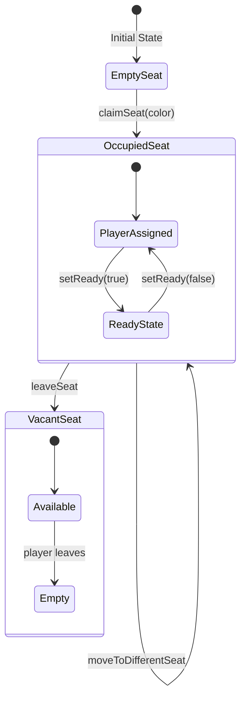

**Diagram sources**
- [rooms.ts:106-121](file://server/src/rooms.ts#L106-L121)
- [Room.tsx:25-38](file://web/src/ui/Room.tsx#L25-L38)

**Section sources**
- [Room.tsx:25-38](file://web/src/ui/Room.tsx#L25-L38)
- [rooms.ts:106-121](file://server/src/rooms.ts#L106-L121)
- [handlers.ts:43-52](file://server/src/net/handlers.ts#L43-L52)

## Detailed Component Analysis

### Seat Assignment Component
The seat assignment system provides intuitive color-based seating with visual feedback and automatic seat management.

#### Seat Data Model
Each seat maintains its color identity, player association, and readiness state with strict validation and conflict resolution.

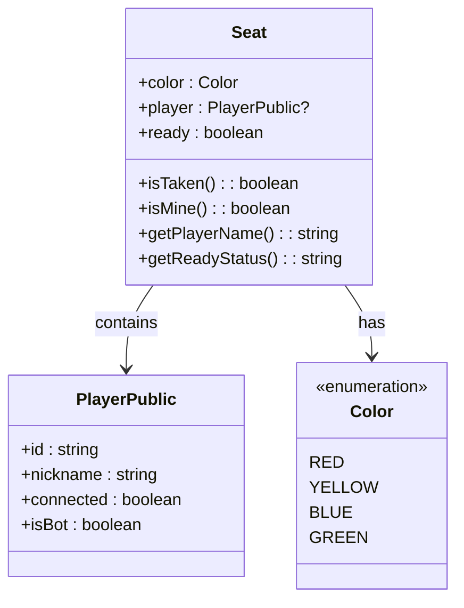

**Diagram sources**
- [types.ts:170-176](file://shared/src/types.ts#L170-L176)
- [types.ts:101-107](file://shared/src/types.ts#L101-L107)
- [types.ts:3-4](file://shared/src/types.ts#L3-L4)

#### Seat Claiming Mechanics
The seat claiming process ensures exclusive seat ownership while preventing conflicts and maintaining game integrity.

**Section sources**
- [Room.tsx:25-38](file://web/src/ui/Room.tsx#L25-L38)
- [rooms.ts:106-121](file://server/src/rooms.ts#L106-L121)
- [handlers.ts:43-52](file://server/src/net/handlers.ts#L43-L52)

### Player Ready-State Coordination
The ready-state system coordinates player readiness across all seats with host privilege validation and automatic state synchronization.

#### Ready-State Validation Logic
The system implements sophisticated validation to ensure proper game progression conditions are met.

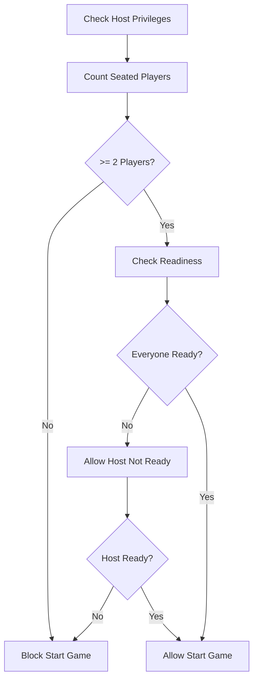

**Diagram sources**
- [Room.tsx:16](file://web/src/ui/Room.tsx#L16)
- [rooms.ts:144-147](file://server/src/rooms.ts#L144-L147)

**Section sources**
- [Room.tsx:13-17](file://web/src/ui/Room.tsx#L13-L17)
- [rooms.ts:123-130](file://server/src/rooms.ts#L123-L130)
- [handlers.ts:54-63](file://server/src/net/handlers.ts#L54-L63)

### Game Configuration Options
The host-only configuration system allows customization of game parameters with strict validation and immediate propagation to all clients.

#### Configuration Options Schema
The game configuration system provides comprehensive customization options with built-in validation and defaults.

**Section sources**
- [Room.tsx:40-45](file://web/src/ui/Room.tsx#L40-L45)
- [types.ts:119-125](file://shared/src/types.ts#L119-L125)
- [handlers.ts:65-74](file://server/src/net/handlers.ts#L65-L74)

### Host Privileges and Game Control
The host privilege system grants exclusive control over game initiation and configuration modifications.

#### Host Privilege Validation
Host privileges are strictly validated to prevent unauthorized game control and maintain fair play.

**Section sources**
- [Room.tsx:14](file://web/src/ui/Room.tsx#L14)
- [rooms.ts:132-138](file://server/src/rooms.ts#L132-L138)
- [handlers.ts:76-89](file://server/src/net/handlers.ts#L76-L89)

## Dependency Analysis

### Component Dependencies
The room management system exhibits clean separation of concerns with well-defined dependencies between components.

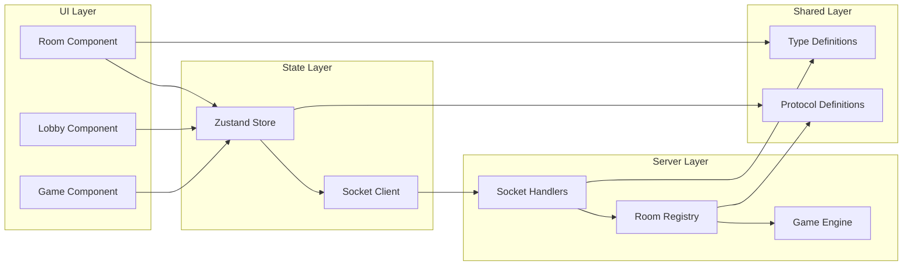

**Diagram sources**
- [Room.tsx:1-11](file://web/src/ui/Room.tsx#L1-L11)
- [store.ts:1-10](file://web/src/state/store.ts#L1-L10)
- [handlers.ts:1-15](file://server/src/net/handlers.ts#L1-L15)
- [rooms.ts:1-10](file://server/src/rooms.ts#L1-L10)

### Real-Time Event Flow
The system implements a comprehensive event-driven architecture for real-time room updates and state synchronization.

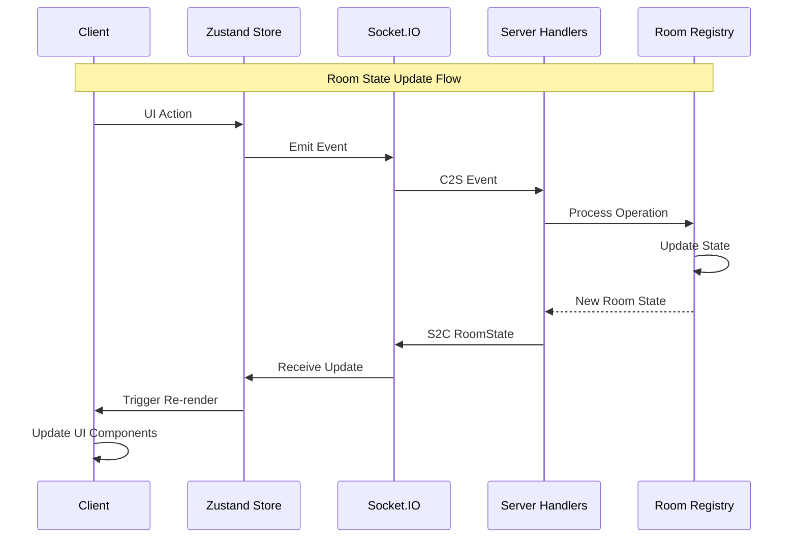

**Diagram sources**
- [store.ts:66-71](file://web/src/state/store.ts#L66-L71)
- [handlers.ts:191-196](file://server/src/net/handlers.ts#L191-L196)
- [rooms.ts:171-183](file://server/src/rooms.ts#L171-L183)

**Section sources**
- [store.ts:60-164](file://web/src/state/store.ts#L60-L164)
- [handlers.ts:191-196](file://server/src/net/handlers.ts#L191-L196)
- [rooms.ts:171-183](file://server/src/rooms.ts#L171-L183)

## Performance Considerations

### State Synchronization Efficiency
The room management system optimizes performance through efficient state synchronization and minimal re-rendering.

#### Optimized Rendering Patterns
The component implements selective rendering based on state changes, reducing unnecessary DOM updates and improving responsiveness.

### Network Communication Optimization
Real-time updates are efficiently propagated through Socket.IO with targeted broadcasting to minimize network overhead.

## Troubleshooting Guide

### Common Error Scenarios
The system implements comprehensive error handling with clear user feedback for various failure conditions.

#### Error Handling Mechanisms
Errors are categorized and communicated through standardized error codes with descriptive messages for user-friendly troubleshooting.

**Section sources**
- [store.ts:87](file://web/src/state/store.ts#L87)
- [handlers.ts:227-229](file://server/src/net/handlers.ts#L227-L229)
- [protocol.ts:96](file://shared/src/protocol.ts#L96)

### Room State Transition Examples

#### Successful Room Creation Flow
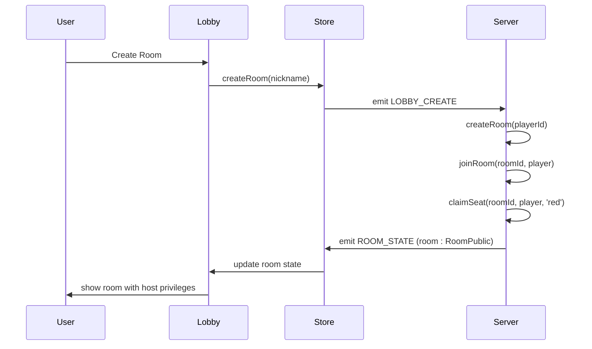

#### Multi-Player Seat Assignment Flow
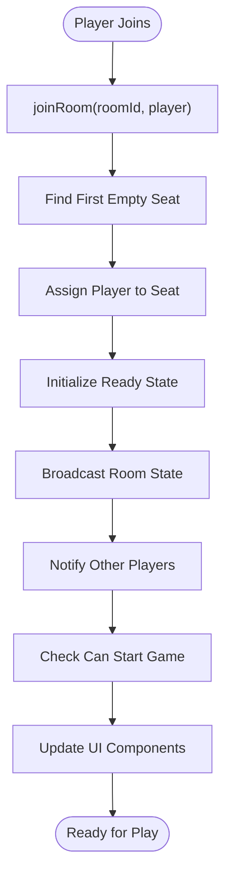

**Diagram sources**
- [handlers.ts:31-41](file://server/src/net/handlers.ts#L31-L41)
- [rooms.ts:90-104](file://server/src/rooms.ts#L90-L104)
- [store.ts:66-71](file://web/src/state/store.ts#L66-L71)

### User Interaction Flows

#### Seat Claiming User Journey
The seat claiming process provides immediate visual feedback and prevents conflicts through server-side validation.

#### Ready-State Coordination Flow
The ready-state system automatically updates all connected clients when any player changes their readiness status, ensuring synchronized game state across all participants.

**Section sources**
- [Room.tsx:13-17](file://web/src/ui/Room.tsx#L13-L17)
- [store.ts:115-120](file://web/src/state/store.ts#L115-L120)
- [handlers.ts:54-63](file://server/src/net/handlers.ts#L54-L63)

## Conclusion
The Room Management Interface provides a comprehensive, real-time multiplayer experience through its sophisticated seat assignment system, ready-state coordination, and host privilege management. The component's architecture ensures reliable state synchronization, efficient real-time communication, and robust error handling while maintaining an intuitive user interface.

Key strengths of the implementation include:
- **Real-time Synchronization**: Immediate state updates across all connected clients
- **Host Privilege Control**: Secure game initiation and configuration management
- **Seat Assignment Flexibility**: Color-based seating with automatic conflict resolution
- **Ready-State Coordination**: Automated game progression validation
- **Comprehensive Error Handling**: User-friendly error messaging and recovery

The system successfully balances functionality with performance, providing a solid foundation for multiplayer flight chess gameplay while maintaining extensibility for future enhancements.