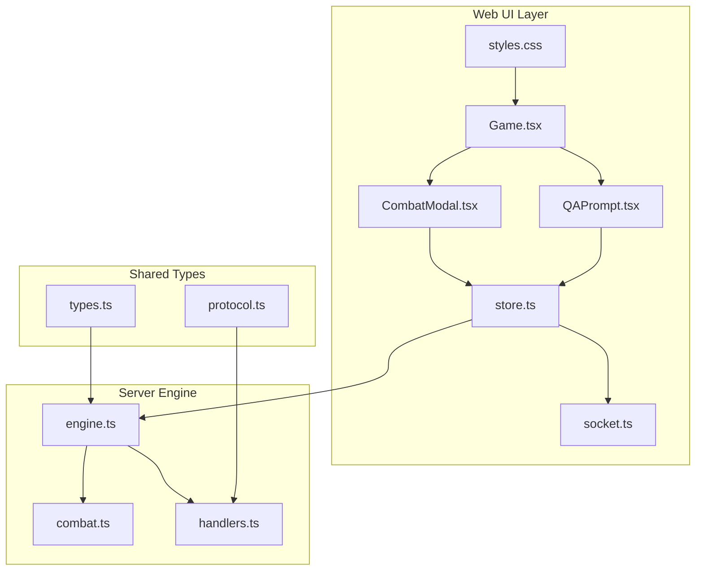
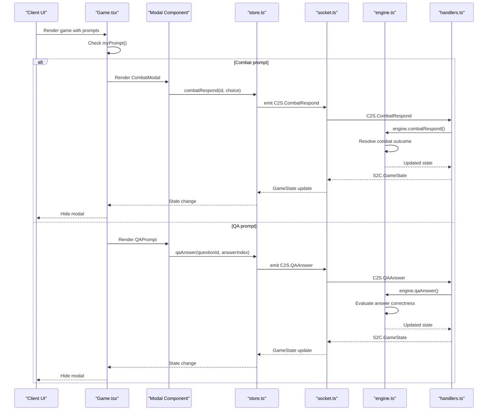
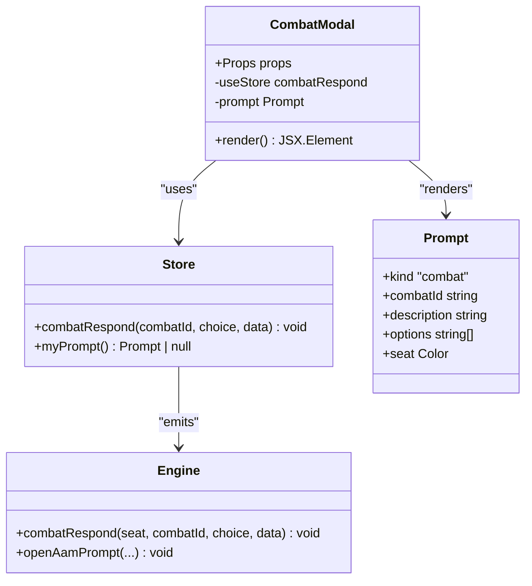
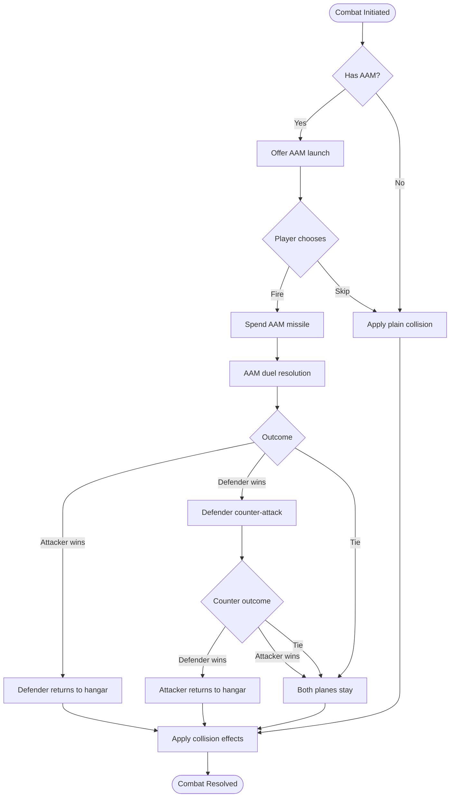
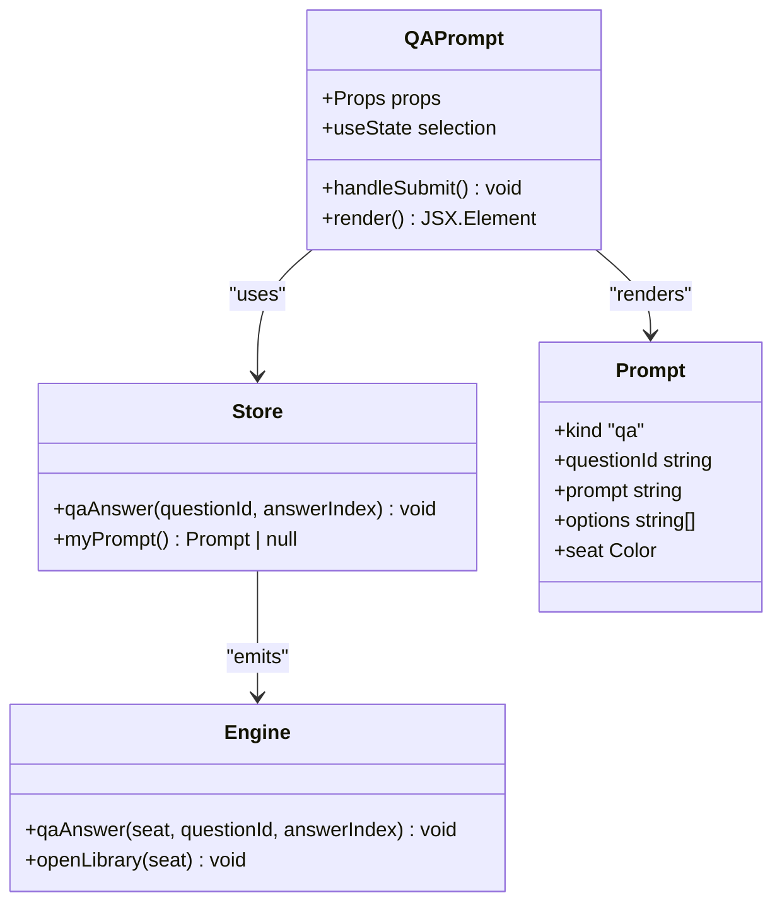
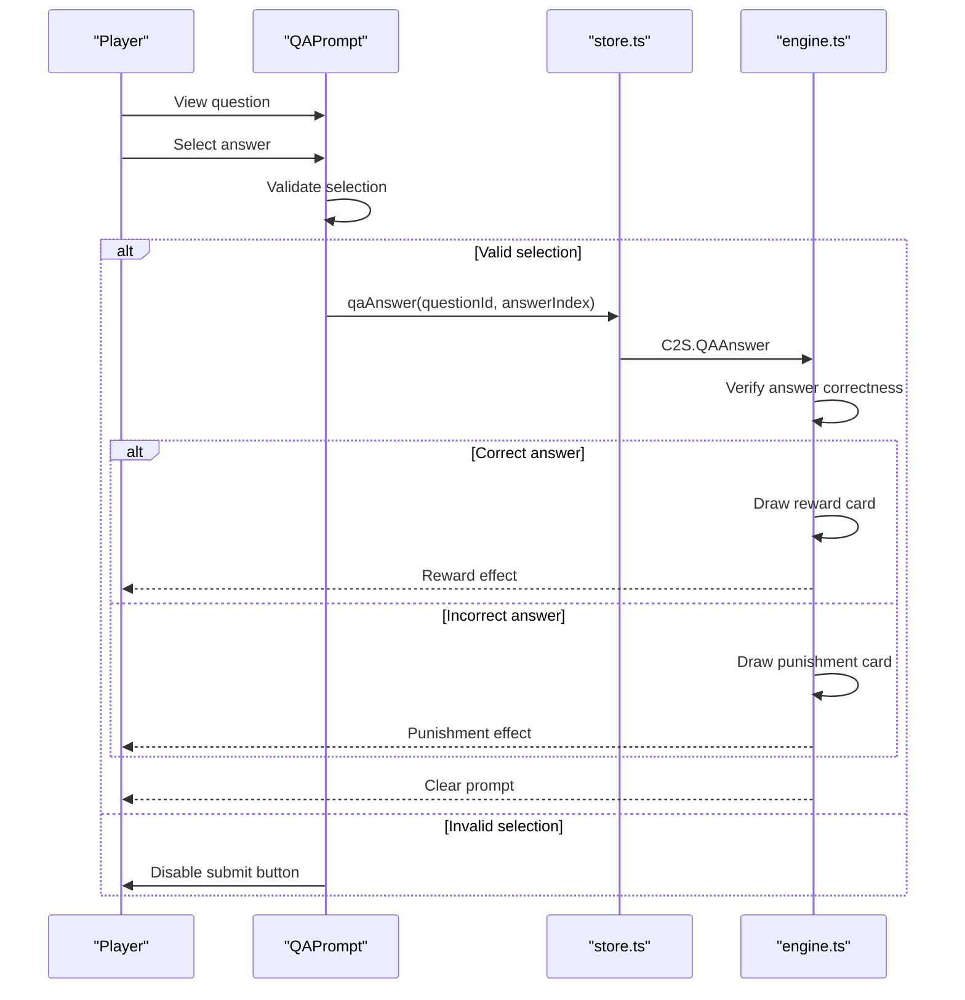
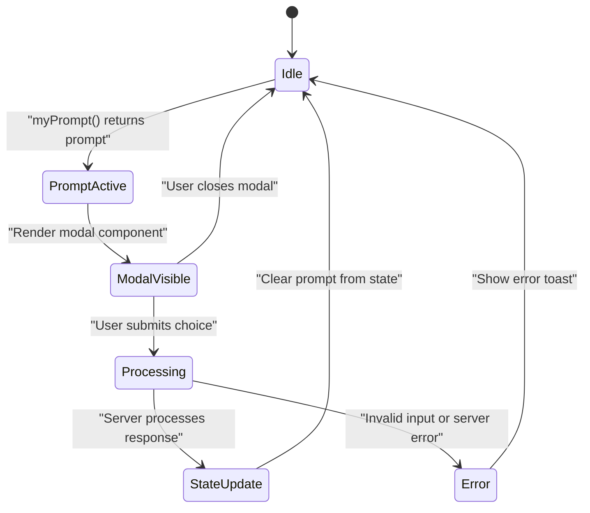
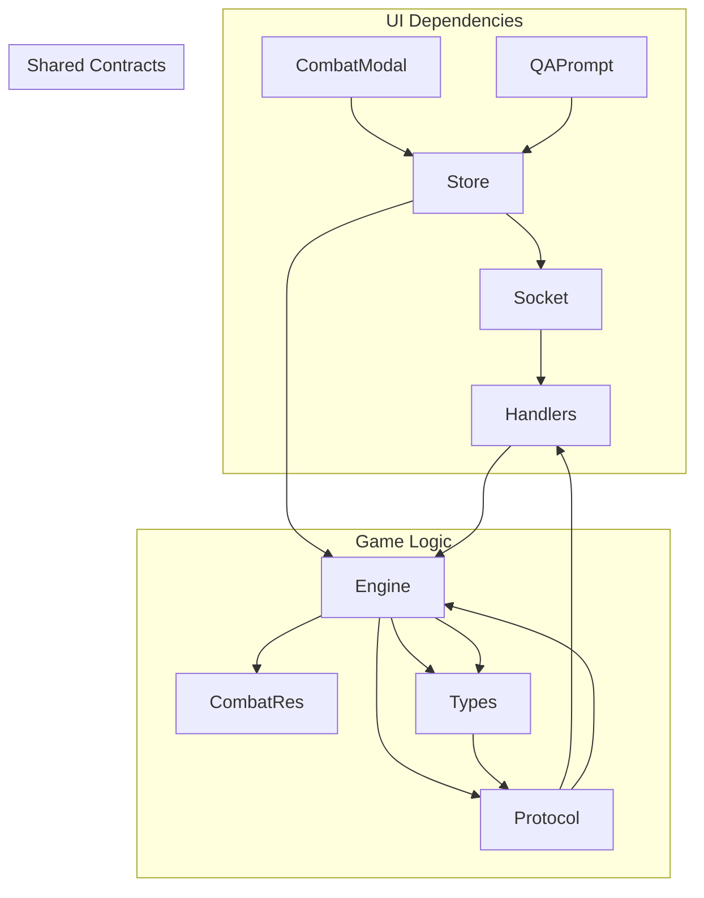

# Specialized Modal Components

<cite>
**Referenced Files in This Document**
- [CombatModal.tsx](file://web/src/ui/CombatModal.tsx)
- [QAPrompt.tsx](file://web/src/ui/QAPrompt.tsx)
- [Game.tsx](file://web/src/ui/Game.tsx)
- [store.ts](file://web/src/state/store.ts)
- [engine.ts](file://server/src/game/engine.ts)
- [combat.ts](file://server/src/game/combat.ts)
- [types.ts](file://shared/src/types.ts)
- [protocol.ts](file://shared/src/protocol.ts)
- [styles.css](file://web/src/styles.css)
- [socket.ts](file://web/src/net/socket.ts)
- [handlers.ts](file://server/src/net/handlers.ts)
</cite>

## Table of Contents
1. [Introduction](#introduction)
2. [Project Structure](#project-structure)
3. [Core Components](#core-components)
4. [Architecture Overview](#architecture-overview)
5. [Detailed Component Analysis](#detailed-component-analysis)
6. [Dependency Analysis](#dependency-analysis)
7. [Performance Considerations](#performance-considerations)
8. [Troubleshooting Guide](#troubleshooting-guide)
9. [Conclusion](#conclusion)

## Introduction
This document provides comprehensive technical documentation for the specialized modal components in the missile flight chess game. It focuses on two key modal interfaces:
- **CombatModal**: Handles tactical combat resolution for AAM/SAM/ARM combat scenarios, presenting choices and displaying outcomes
- **QAPrompt**: Manages educational question-and-answer challenges with interactive selection and scoring mechanisms

The documentation covers component architecture, lifecycle management, overlay handling, focus management, integration with game state, animation systems, accessibility features, and state synchronization with the game engine.

## Project Structure
The modal components are part of the web UI layer and integrate with the shared game types and server-side engine. The key files involved are:

**Diagram sources**
- [Game.tsx:10-33](file://web/src/ui/Game.tsx#L10-L33)
- [CombatModal.tsx:1-32](file://web/src/ui/CombatModal.tsx#L1-L32)
- [QAPrompt.tsx:1-45](file://web/src/ui/QAPrompt.tsx#L1-L45)
- [store.ts:1-164](file://web/src/state/store.ts#L1-L164)
- [engine.ts:1-920](file://server/src/game/engine.ts#L1-L920)
- [combat.ts:1-33](file://server/src/game/combat.ts#L1-L33)
- [types.ts:140-146](file://shared/src/types.ts#L140-L146)
- [protocol.ts:55-64](file://shared/src/protocol.ts#L55-L64)
- [handlers.ts:126-142](file://server/src/net/handlers.ts#L126-L142)

**Section sources**
- [Game.tsx:10-33](file://web/src/ui/Game.tsx#L10-L33)
- [CombatModal.tsx:1-32](file://web/src/ui/CombatModal.tsx#L1-L32)
- [QAPrompt.tsx:1-45](file://web/src/ui/QAPrompt.tsx#L1-L45)
- [store.ts:1-164](file://web/src/state/store.ts#L1-L164)

## Core Components
This section documents the two specialized modal components and their roles in the game flow.

### CombatModal Component
The CombatModal presents tactical combat choices during AAM/SAM/ARM encounters. It receives a combat prompt from the game state and renders available options for the current player.

Key characteristics:
- Receives a combat prompt containing description and selectable options
- Provides primary action buttons for combat decisions
- Integrates with the store's combat response handler
- Uses modal overlay styling for focus and isolation

Implementation highlights:
- Uses the store's combatRespond action to submit choices
- Renders options as primary buttons with click handlers
- Displays combat description text for context

**Section sources**
- [CombatModal.tsx:9-31](file://web/src/ui/CombatModal.tsx#L9-L31)
- [store.ts:49-50](file://web/src/state/store.ts#L49-L50)

### QAPrompt Component
The QAPrompt manages educational question-and-answer challenges. It presents questions, handles user selection, validates answers, and submits responses to the server.

Key characteristics:
- Presents question text and multiple-choice options
- Uses radio button selection with visual feedback
- Validates submission to prevent empty answers
- Integrates with the store's QA answer handler

Implementation highlights:
- Maintains local selection state using React hooks
- Disables submit button until a selection is made
- Submits answer using the store's qaAnswer action

**Section sources**
- [QAPrompt.tsx:9-44](file://web/src/ui/QAPrompt.tsx#L9-L44)
- [store.ts:50](file://web/src/state/store.ts#L50)

## Architecture Overview
The modal components operate within a client-server architecture with strict separation of concerns:

**Diagram sources**
- [Game.tsx:29-30](file://web/src/ui/Game.tsx#L29-L30)
- [store.ts:133-138](file://web/src/state/store.ts#L133-L138)
- [handlers.ts:126-142](file://server/src/net/handlers.ts#L126-L142)
- [engine.ts:435-522](file://server/src/game/engine.ts#L435-L522)
- [engine.ts:568-584](file://server/src/game/engine.ts#L568-L584)

## Detailed Component Analysis

### CombatModal Analysis
The CombatModal component handles tactical combat resolution with the following structure:

**Diagram sources**
- [CombatModal.tsx:5-7](file://web/src/ui/CombatModal.tsx#L5-L7)
- [store.ts:49](file://web/src/state/store.ts#L49)
- [types.ts:145](file://shared/src/types.ts#L145)
- [engine.ts:416-433](file://server/src/game/engine.ts#L416-L433)

#### Combat Resolution Flow
The combat resolution follows a deterministic sequence:

**Diagram sources**
- [engine.ts:416-522](file://server/src/game/engine.ts#L416-L522)
- [combat.ts:14-20](file://server/src/game/combat.ts#L14-L20)

**Section sources**
- [CombatModal.tsx:9-31](file://web/src/ui/CombatModal.tsx#L9-L31)
- [engine.ts:416-522](file://server/src/game/engine.ts#L416-L522)
- [combat.ts:14-20](file://server/src/game/combat.ts#L14-L20)

### QAPrompt Analysis
The QAPrompt component manages educational challenges with the following structure:

**Diagram sources**
- [QAPrompt.tsx:5-7](file://web/src/ui/QAPrompt.tsx#L5-L7)
- [store.ts:50](file://web/src/state/store.ts#L50)
- [types.ts:146](file://shared/src/types.ts#L146)
- [engine.ts:556-566](file://server/src/game/engine.ts#L556-L566)

#### QA Challenge Flow
The question-and-answer challenge follows this process:

**Diagram sources**
- [QAPrompt.tsx:13-16](file://web/src/ui/QAPrompt.tsx#L13-L16)
- [store.ts:136-138](file://web/src/state/store.ts#L136-L138)
- [engine.ts:568-584](file://server/src/game/engine.ts#L568-L584)

**Section sources**
- [QAPrompt.tsx:9-44](file://web/src/ui/QAPrompt.tsx#L9-L44)
- [engine.ts:556-584](file://server/src/game/engine.ts#L556-L584)

### Modal Lifecycle Management
The modal lifecycle is managed through the game state and store integration:

**Diagram sources**
- [Game.tsx:13-30](file://web/src/ui/Game.tsx#L13-L30)
- [store.ts:157-161](file://web/src/state/store.ts#L157-L161)

**Section sources**
- [Game.tsx:10-33](file://web/src/ui/Game.tsx#L10-L33)
- [store.ts:157-161](file://web/src/state/store.ts#L157-L161)

## Dependency Analysis
The modal components depend on several layers of the application architecture:

**Diagram sources**
- [store.ts:8](file://web/src/state/store.ts#L8)
- [handlers.ts:4-13](file://server/src/net/handlers.ts#L4-L13)
- [engine.ts:18-32](file://server/src/game/engine.ts#L18-L32)
- [types.ts:140-146](file://shared/src/types.ts#L140-L146)
- [protocol.ts:55-64](file://shared/src/protocol.ts#L55-L64)

**Section sources**
- [store.ts:8](file://web/src/state/store.ts#L8)
- [handlers.ts:4-13](file://server/src/net/handlers.ts#L4-L13)
- [engine.ts:18-32](file://server/src/game/engine.ts#L18-L32)

## Performance Considerations
- **Minimal re-renders**: Both modals use focused rendering based on prompt presence, avoiding unnecessary updates
- **Local state management**: QAPrompt maintains minimal local state for selections, reducing prop drilling
- **Efficient event handling**: Modal components delegate all state changes to the centralized store
- **Animation optimization**: CSS animations use transform properties for GPU acceleration

## Troubleshooting Guide
Common issues and solutions:

### Modal Not Appearing
- **Cause**: No active prompt in game state
- **Solution**: Verify `myPrompt()` returns a prompt object for the current player's seat
- **Debug**: Check store state for `prompts` array and `state.turn`

### Combat Options Not Responding
- **Cause**: Invalid combat ID or seat mismatch
- **Solution**: Ensure combatId matches the pending combat and seat belongs to current player
- **Debug**: Verify engine state for `pendingCombat` field

### QA Submission Disabled
- **Cause**: No selection made or invalid answer index
- **Solution**: Ensure radio button selection is valid and within bounds
- **Debug**: Check answerIndex range and selection state

**Section sources**
- [engine.ts:435-522](file://server/src/game/engine.ts#L435-L522)
- [engine.ts:568-584](file://server/src/game/engine.ts#L568-L584)
- [QAPrompt.tsx:13-16](file://web/src/ui/QAPrompt.tsx#L13-L16)

## Conclusion
The specialized modal components provide robust, accessible interfaces for tactical combat and educational challenges in the missile flight chess game. Their architecture ensures clean separation of concerns, reliable state synchronization, and responsive user interactions. The components integrate seamlessly with the game engine while maintaining performance and accessibility standards.

The design supports future enhancements such as additional combat types, expanded question categories, and improved accessibility features without disrupting existing functionality.