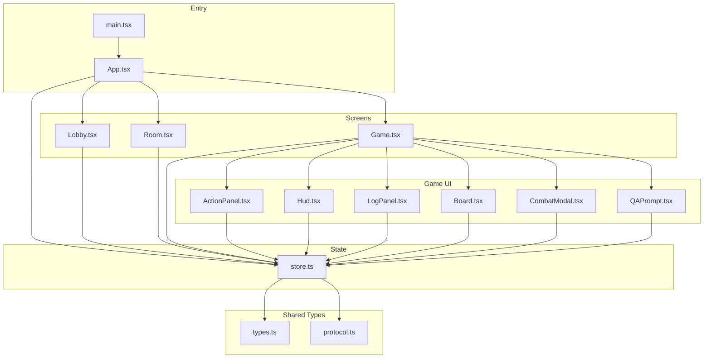
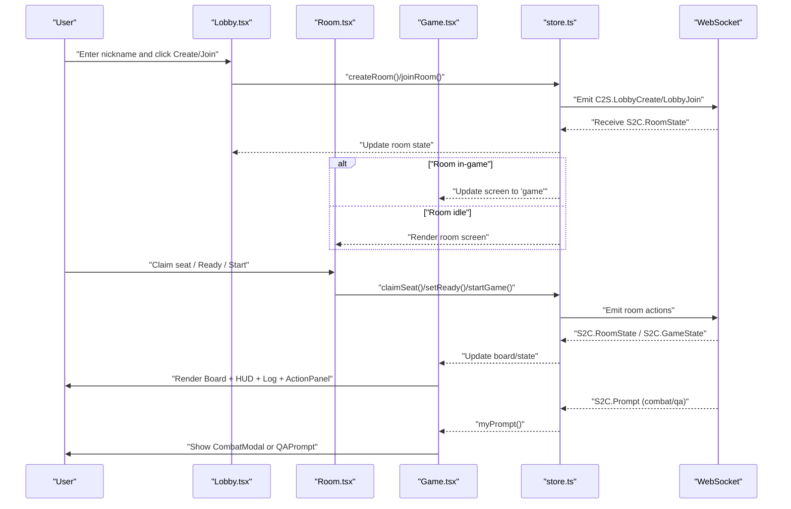
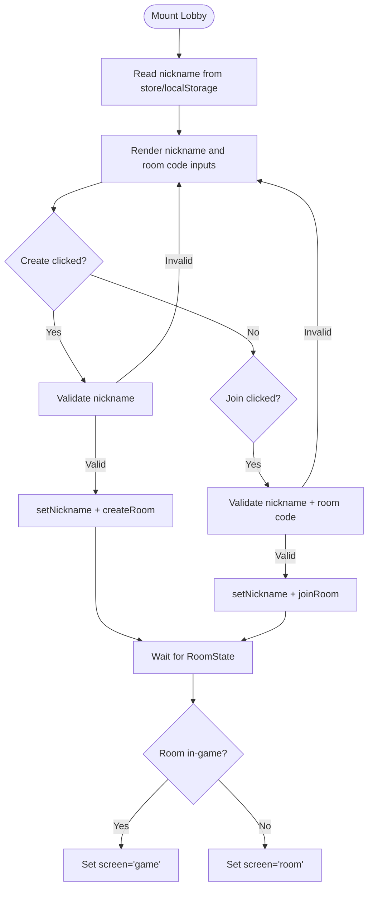
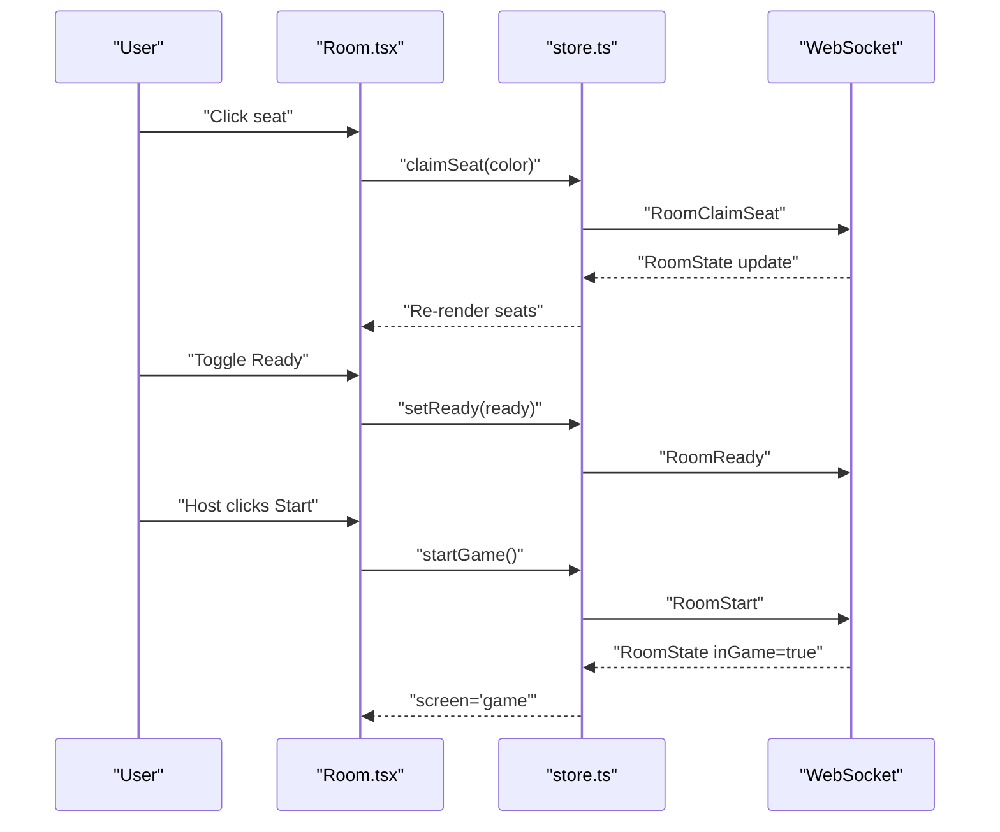
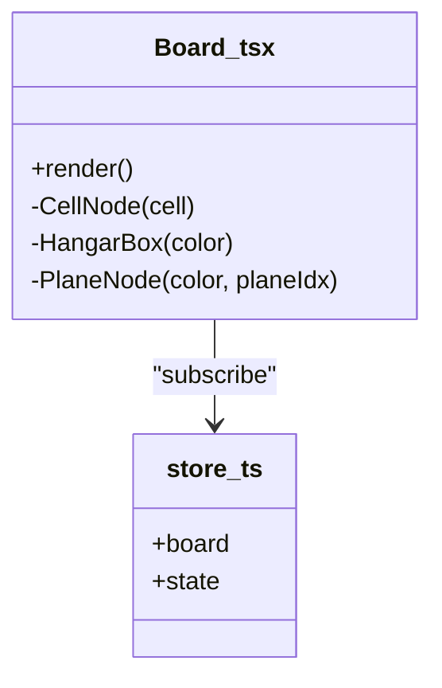
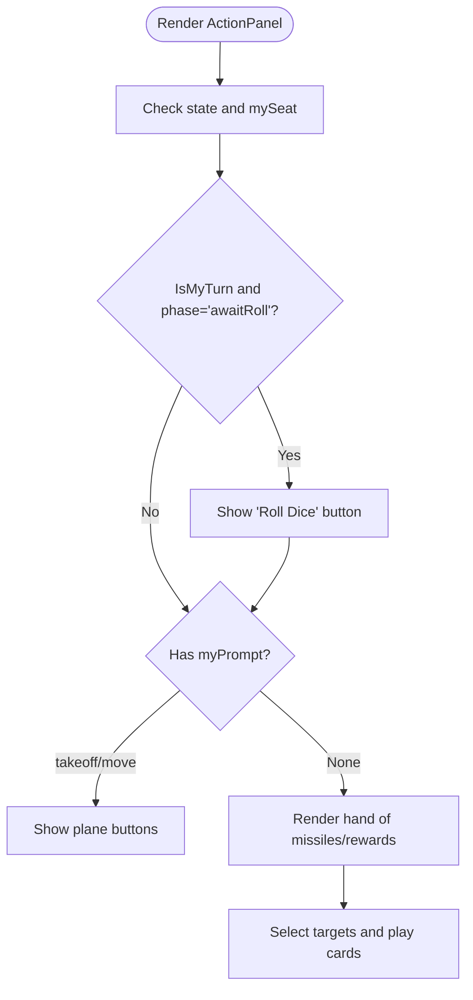
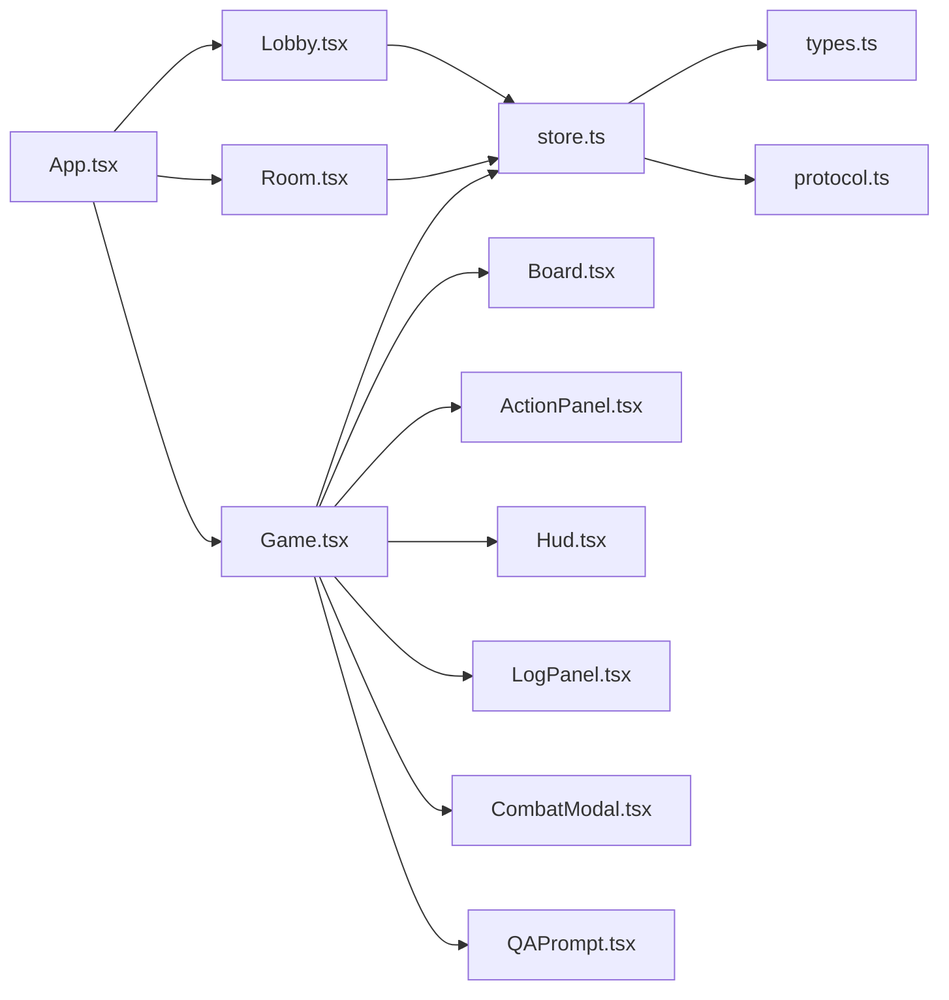

# UI Components Architecture

<cite>
**Referenced Files in This Document**
- [web/src/App.tsx](file://web/src/App.tsx)
- [web/src/main.tsx](file://web/src/main.tsx)
- [web/src/state/store.ts](file://web/src/state/store.ts)
- [web/src/ui/Lobby.tsx](file://web/src/ui/Lobby.tsx)
- [web/src/ui/Room.tsx](file://web/src/ui/Room.tsx)
- [web/src/ui/Game.tsx](file://web/src/ui/Game.tsx)
- [web/src/ui/Board.tsx](file://web/src/ui/Board.tsx)
- [web/src/ui/Hud.tsx](file://web/src/ui/Hud.tsx)
- [web/src/ui/ActionPanel.tsx](file://web/src/ui/ActionPanel.tsx)
- [web/src/ui/LogPanel.tsx](file://web/src/ui/LogPanel.tsx)
- [web/src/ui/CombatModal.tsx](file://web/src/ui/CombatModal.tsx)
- [web/src/ui/QAPrompt.tsx](file://web/src/ui/QAPrompt.tsx)
- [web/src/styles.css](file://web/src/styles.css)
- [shared/src/types.ts](file://shared/src/types.ts)
- [shared/src/protocol.ts](file://shared/src/protocol.ts)
</cite>

## Table of Contents
1. [Introduction](#introduction)
2. [Project Structure](#project-structure)
3. [Core Components](#core-components)
4. [Architecture Overview](#architecture-overview)
5. [Detailed Component Analysis](#detailed-component-analysis)
6. [Dependency Analysis](#dependency-analysis)
7. [Performance Considerations](#performance-considerations)
8. [Troubleshooting Guide](#troubleshooting-guide)
9. [Conclusion](#conclusion)
10. [Appendices](#appendices)

## Introduction
This document describes the UI components architecture for 导弹飞行棋. It explains the component hierarchy, prop interfaces, composition patterns, and user interaction flows across the lobby, room, and game screens. Specialized components such as ActionPanel, HUD, LogPanel, Board, CombatModal, and QAPrompt are documented alongside their roles in prompting players, displaying game state, and enabling tactical interactions. Styling and responsive design patterns are covered, along with accessibility considerations and error handling.

## Project Structure
The UI layer is organized around a small set of React components under web/src/ui, orchestrated by a central Zustand store. The store manages navigation state (lobby, room, game), server-synchronized game state, logs, chat, and transient prompts. Styles are centralized in a single stylesheet with theme variables and responsive layout rules.

**Diagram sources**
- [web/src/main.tsx:1-11](file://web/src/main.tsx#L1-L11)
- [web/src/App.tsx:1-19](file://web/src/App.tsx#L1-L19)
- [web/src/state/store.ts:1-164](file://web/src/state/store.ts#L1-L164)
- [web/src/ui/Lobby.tsx:1-44](file://web/src/ui/Lobby.tsx#L1-L44)
- [web/src/ui/Room.tsx:1-62](file://web/src/ui/Room.tsx#L1-L62)
- [web/src/ui/Game.tsx:1-34](file://web/src/ui/Game.tsx#L1-L34)
- [web/src/ui/Board.tsx:1-115](file://web/src/ui/Board.tsx#L1-L115)
- [web/src/ui/Hud.tsx:1-44](file://web/src/ui/Hud.tsx#L1-L44)
- [web/src/ui/ActionPanel.tsx:1-129](file://web/src/ui/ActionPanel.tsx#L1-L129)
- [web/src/ui/LogPanel.tsx:1-31](file://web/src/ui/LogPanel.tsx#L1-L31)
- [web/src/ui/CombatModal.tsx:1-32](file://web/src/ui/CombatModal.tsx#L1-L32)
- [web/src/ui/QAPrompt.tsx:1-45](file://web/src/ui/QAPrompt.tsx#L1-L45)
- [shared/src/types.ts:1-186](file://shared/src/types.ts#L1-L186)
- [shared/src/protocol.ts:1-97](file://shared/src/protocol.ts#L1-L97)

**Section sources**
- [web/src/main.tsx:1-11](file://web/src/main.tsx#L1-L11)
- [web/src/App.tsx:1-19](file://web/src/App.tsx#L1-L19)
- [web/src/state/store.ts:1-164](file://web/src/state/store.ts#L1-L164)

## Core Components
- App: Renders the current screen based on the store’s screen state and displays global errors.
- Lobby: Collects nickname, creates/joins rooms, and navigates to room/game.
- Room: Seat claiming, readiness toggling, host-only options, and starting the game.
- Game: Composes Board, ActionPanel, HUD, LogPanel, and conditionally renders CombatModal or QAPrompt based on prompts.
- Board: SVG-based rendering of cells, hangars, and planes.
- ActionPanel: Dice rolling, plane selection prompts, and card playing with dynamic controls.
- HUD: Per-color player stats, turn indicators, and deck counts.
- LogPanel: Event log and chat input with auto-scroll.
- CombatModal: Tactical choices during combat prompts.
- QAPrompt: Educational challenge with radio-button answers.

**Section sources**
- [web/src/App.tsx:7-18](file://web/src/App.tsx#L7-L18)
- [web/src/ui/Lobby.tsx:4-43](file://web/src/ui/Lobby.tsx#L4-L43)
- [web/src/ui/Room.tsx:9-61](file://web/src/ui/Room.tsx#L9-L61)
- [web/src/ui/Game.tsx:10-33](file://web/src/ui/Game.tsx#L10-L33)
- [web/src/ui/Board.tsx:14-38](file://web/src/ui/Board.tsx#L14-L38)
- [web/src/ui/ActionPanel.tsx:5-97](file://web/src/ui/ActionPanel.tsx#L5-L97)
- [web/src/ui/Hud.tsx:7-43](file://web/src/ui/Hud.tsx#L7-L43)
- [web/src/ui/LogPanel.tsx:4-29](file://web/src/ui/LogPanel.tsx#L4-L29)
- [web/src/ui/CombatModal.tsx:9-31](file://web/src/ui/CombatModal.tsx#L9-L31)
- [web/src/ui/QAPrompt.tsx:9-44](file://web/src/ui/QAPrompt.tsx#L9-L44)

## Architecture Overview
The UI follows a unidirectional data flow:
- The Zustand store subscribes to WebSocket events and updates local state.
- Components subscribe to slices of the store via selectors.
- User interactions trigger actions in the store, which emit client-to-server events.

**Diagram sources**
- [web/src/ui/Lobby.tsx:9-18](file://web/src/ui/Lobby.tsx#L9-L18)
- [web/src/state/store.ts:105-123](file://web/src/state/store.ts#L105-L123)
- [web/src/state/store.ts:66-71](file://web/src/state/store.ts#L66-L71)
- [web/src/state/store.ts:72-77](file://web/src/state/store.ts#L72-L77)
- [web/src/ui/Room.tsx:13-16](file://web/src/ui/Room.tsx#L13-L16)
- [web/src/ui/Room.tsx:30-36](file://web/src/ui/Room.tsx#L30-L36)
- [web/src/ui/Game.tsx:19-31](file://web/src/ui/Game.tsx#L19-L31)
- [shared/src/protocol.ts:6-21](file://shared/src/protocol.ts#L6-L21)
- [shared/src/protocol.ts:69-80](file://shared/src/protocol.ts#L69-L80)

## Detailed Component Analysis

### Lobby Interface (Room Management Entry)
- Responsibilities:
  - Capture and persist nickname.
  - Create or join a room with a room code.
  - Navigate to room or game upon state change.
- Props: None (uses store hooks).
- Interactions:
  - On create/join, validates inputs and calls store actions.
  - Updates nickname in local storage and store.
- Accessibility:
  - Inputs have placeholders and max-length constraints.
  - Buttons clearly labeled.

**Diagram sources**
- [web/src/ui/Lobby.tsx:4-43](file://web/src/ui/Lobby.tsx#L4-L43)
- [web/src/state/store.ts:101-113](file://web/src/state/store.ts#L101-L113)
- [web/src/state/store.ts:66-71](file://web/src/state/store.ts#L66-L71)

**Section sources**
- [web/src/ui/Lobby.tsx:4-43](file://web/src/ui/Lobby.tsx#L4-L43)
- [web/src/state/store.ts:101-113](file://web/src/state/store.ts#L101-L113)

### Room Screen (Player Coordination)
- Responsibilities:
  - Display seats, player names, readiness, and connection status.
  - Host-only options display.
  - Start game when conditions are met.
- Props: None (uses store hooks).
- Interactions:
  - Claim seat triggers seat assignment.
  - Toggle readiness for self.
  - Start game emits start signal.
- Composition:
  - Uses color labels and seat state to render UI.

**Diagram sources**
- [web/src/ui/Room.tsx:9-61](file://web/src/ui/Room.tsx#L9-L61)
- [web/src/state/store.ts:115-123](file://web/src/state/store.ts#L115-L123)
- [shared/src/protocol.ts:10-13](file://shared/src/protocol.ts#L10-L13)
- [shared/src/protocol.ts:69-80](file://shared/src/protocol.ts#L69-L80)

**Section sources**
- [web/src/ui/Room.tsx:9-61](file://web/src/ui/Room.tsx#L9-L61)
- [web/src/state/store.ts:115-123](file://web/src/state/store.ts#L115-L123)

### Game Board (Interactive Gameplay)
- Responsibilities:
  - Render the SVG board with cells, hangars, and planes.
  - Compute plane positions considering stacks and states.
- Props: None (uses store hooks).
- Rendering:
  - Cells rendered with icons based on kind.
  - Hangars shown as translucent boxes per color.
  - Planes rendered with color and index; stacked planes spread horizontally.

**Diagram sources**
- [web/src/ui/Board.tsx:14-115](file://web/src/ui/Board.tsx#L14-L115)
- [web/src/state/store.ts:26-28](file://web/src/state/store.ts#L26-L28)

**Section sources**
- [web/src/ui/Board.tsx:14-115](file://web/src/ui/Board.tsx#L14-L115)
- [web/src/state/store.ts:26-28](file://web/src/state/store.ts#L26-L28)

### ActionPanel (User Prompts and Controls)
- Responsibilities:
  - Show turn, last dice, and dice chain.
  - Present prompts for takeoff/move selections.
  - Manage missile and reward card plays with dynamic selects.
- Props: None (uses store hooks).
- Interactions:
  - Roll dice when it is your turn and phase allows.
  - Choose plane for movement/takeoff.
  - Play cards targeting opponents or specific planes.

**Diagram sources**
- [web/src/ui/ActionPanel.tsx:5-97](file://web/src/ui/ActionPanel.tsx#L5-L97)
- [web/src/state/store.ts:54-57](file://web/src/state/store.ts#L54-L57)

**Section sources**
- [web/src/ui/ActionPanel.tsx:5-97](file://web/src/ui/ActionPanel.tsx#L5-L97)
- [web/src/state/store.ts:54-57](file://web/src/state/store.ts#L54-L57)

### HUD (Game Information Display)
- Responsibilities:
  - List players by color with nicknames and readiness.
  - Show turn indicator, radar count, missile count, home-plane counts, skip/shield status.
  - Display deck counts for missiles, radar, rewards, punishments, and questions.
- Props: None (uses store hooks).

**Section sources**
- [web/src/ui/Hud.tsx:7-43](file://web/src/ui/Hud.tsx#L7-L43)
- [shared/src/types.ts:101-117](file://shared/src/types.ts#L101-L117)

### LogPanel (Event History and Chat)
- Responsibilities:
  - Display capped event log and recent chat messages.
  - Auto-scroll to bottom on new entries.
  - Submit chat messages via form.
- Props: None (uses store hooks).
- Interactions:
  - Form submission triggers chat action.

**Section sources**
- [web/src/ui/LogPanel.tsx:4-29](file://web/src/ui/LogPanel.tsx#L4-L29)
- [web/src/state/store.ts:142-144](file://web/src/state/store.ts#L142-L144)

### CombatModal (Tactical Interactions)
- Responsibilities:
  - Present a combat prompt with multiple-choice options.
  - Submit response to server.
- Props:
  - prompt: Extracted combat prompt from store.
- Interactions:
  - Button click invokes combat response handler.

**Section sources**
- [web/src/ui/CombatModal.tsx:5-31](file://web/src/ui/CombatModal.tsx#L5-L31)
- [web/src/state/store.ts:133-135](file://web/src/state/store.ts#L133-L135)

### QAPrompt (Educational Challenges)
- Responsibilities:
  - Present a question with radio-button options.
  - Submit chosen answer.
- Props:
  - prompt: Extracted QA prompt from store.
- Interactions:
  - Select option and click submit.

**Section sources**
- [web/src/ui/QAPrompt.tsx:5-44](file://web/src/ui/QAPrompt.tsx#L5-L44)
- [web/src/state/store.ts:136-138](file://web/src/state/store.ts#L136-L138)

### Game Composition (Screen)
- Responsibilities:
  - Compose main and side panels.
  - Conditionally render modal overlays for combat/qa prompts.
- Props: None (uses store hooks).
- Composition:
  - Main area: Board + ActionPanel.
  - Side area: HUD + LogPanel.
  - Overlays: CombatModal or QAPrompt based on prompt kind.

**Section sources**
- [web/src/ui/Game.tsx:10-33](file://web/src/ui/Game.tsx#L10-L33)

## Dependency Analysis
- Component coupling:
  - All UI components depend on the central store via hooks.
  - Game composes multiple UI parts; Board/HUD/LogPanel/ActionPanel are leaf components.
- External dependencies:
  - WebSocket protocol defined in shared/protocol.ts.
  - Game types and enums defined in shared/types.ts.
- Navigation:
  - App switches screens based on store state.
  - Room and Game screens subscribe to server events to update state.

**Diagram sources**
- [web/src/App.tsx:7-18](file://web/src/App.tsx#L7-L18)
- [web/src/ui/Lobby.tsx:1-2](file://web/src/ui/Lobby.tsx#L1-L2)
- [web/src/ui/Room.tsx:1-2](file://web/src/ui/Room.tsx#L1-L2)
- [web/src/ui/Game.tsx:1-8](file://web/src/ui/Game.tsx#L1-L8)
- [web/src/ui/Board.tsx:1-2](file://web/src/ui/Board.tsx#L1-L2)
- [web/src/ui/ActionPanel.tsx:1-2](file://web/src/ui/ActionPanel.tsx#L1-L2)
- [web/src/ui/Hud.tsx:1-2](file://web/src/ui/Hud.tsx#L1-L2)
- [web/src/ui/LogPanel.tsx:1-2](file://web/src/ui/LogPanel.tsx#L1-L2)
- [web/src/ui/CombatModal.tsx:1-2](file://web/src/ui/CombatModal.tsx#L1-L2)
- [web/src/ui/QAPrompt.tsx:1-2](file://web/src/ui/QAPrompt.tsx#L1-L2)
- [web/src/state/store.ts:1-10](file://web/src/state/store.ts#L1-L10)
- [shared/src/types.ts:1-10](file://shared/src/types.ts#L1-L10)
- [shared/src/protocol.ts:1-10](file://shared/src/protocol.ts#L1-L10)

**Section sources**
- [web/src/App.tsx:7-18](file://web/src/App.tsx#L7-L18)
- [web/src/state/store.ts:1-10](file://web/src/state/store.ts#L1-L10)
- [shared/src/types.ts:1-10](file://shared/src/types.ts#L1-L10)
- [shared/src/protocol.ts:1-10](file://shared/src/protocol.ts#L1-L10)

## Performance Considerations
- Rendering:
  - Board uses SVG and memoizes plane positions; avoid unnecessary re-renders by keeping selectors minimal.
  - LogPanel caps arrays and scrolls to bottom efficiently.
- Store subscriptions:
  - Components subscribe to narrow slices; avoid full-state subscriptions to reduce re-renders.
- Network:
  - Debounce chat input; batch actions where appropriate.
- Accessibility:
  - Prefer semantic labels and keyboard-accessible controls.
  - Ensure focus management after modal dismissal.

## Troubleshooting Guide
- Error display:
  - Errors received from the server are stored and shown as toast notifications.
- Common issues:
  - Room navigation not updating: verify RoomState handling and screen transitions.
  - Missing prompts: confirm myPrompt derivation and prompt presence in state.
  - Chat not sending: check payload constraints and chatSay action.
- Logging:
  - Inspect log and chat arrays for recent entries; confirm auto-scroll behavior.

**Section sources**
- [web/src/state/store.ts:87-87](file://web/src/state/store.ts#L87-L87)
- [web/src/ui/App.tsx:15-15](file://web/src/ui/App.tsx#L15-L15)
- [web/src/state/store.ts:157-161](file://web/src/state/store.ts#L157-L161)
- [web/src/ui/LogPanel.tsx:11-13](file://web/src/ui/LogPanel.tsx#L11-L13)

## Conclusion
The UI architecture centers on a clean separation of concerns: a single store orchestrating navigation and state, and small, focused components handling distinct UI responsibilities. The composition model enables modular gameplay screens while specialized panels handle prompts, HUD, and logs. The design supports responsive layouts, clear affordances, and robust error signaling.

## Appendices

### Responsive Design Patterns
- Container widths:
  - Lobby and Room have fixed max widths with grid/flex layouts.
  - Game layout splits main content and side panel with flex and min-width constraints.
- Typography and spacing:
  - Consistent font sizes and gaps using CSS variables.
- Modals:
  - Centered overlays with constrained widths and scrollable content.

**Section sources**
- [web/src/styles.css:27-56](file://web/src/styles.css#L27-L56)
- [web/src/styles.css:58-118](file://web/src/styles.css#L58-L118)

### Accessibility Features
- Keyboard-friendly controls:
  - Buttons and selects are focusable; ensure tab order aligns with visual layout.
- Clear labels:
  - Inputs and selects have associated labels; placeholders complement labels.
- Visual cues:
  - Color-coded elements and badges aid quick recognition.
- Focus management:
  - After modal close, return focus to triggering control when feasible.

**Section sources**
- [web/src/ui/ActionPanel.tsx:56-66](file://web/src/ui/ActionPanel.tsx#L56-L66)
- [web/src/ui/QAPrompt.tsx:26-35](file://web/src/ui/QAPrompt.tsx#L26-L35)

### Data Model Interfaces (Selected)
- GameState, RoomPublic, BoardSnapshot, Prompt, and related types define the props and state shapes used by components.

**Section sources**
- [shared/src/types.ts:153-166](file://shared/src/types.ts#L153-L166)
- [shared/src/types.ts:170-176](file://shared/src/types.ts#L170-L176)
- [shared/src/types.ts:47-50](file://shared/src/types.ts#L47-L50)
- [shared/src/types.ts:141-146](file://shared/src/types.ts#L141-L146)