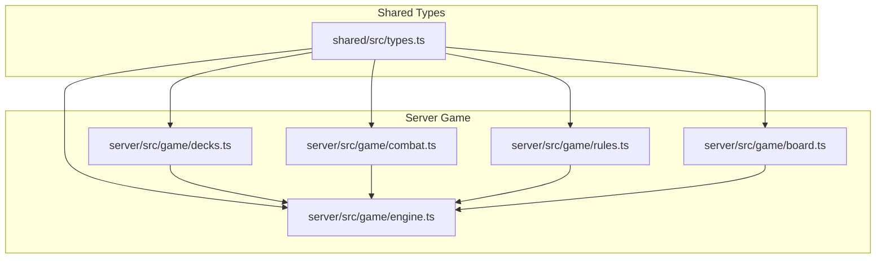
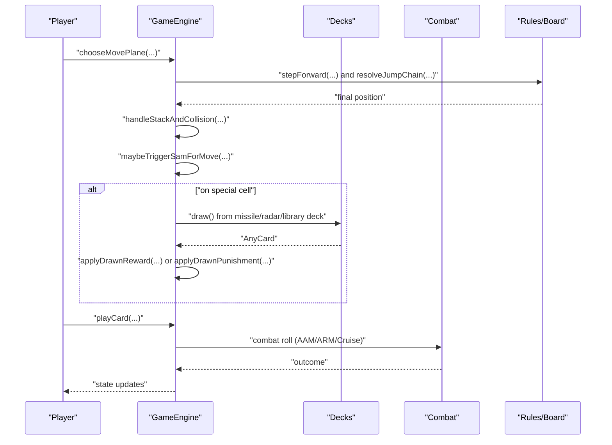
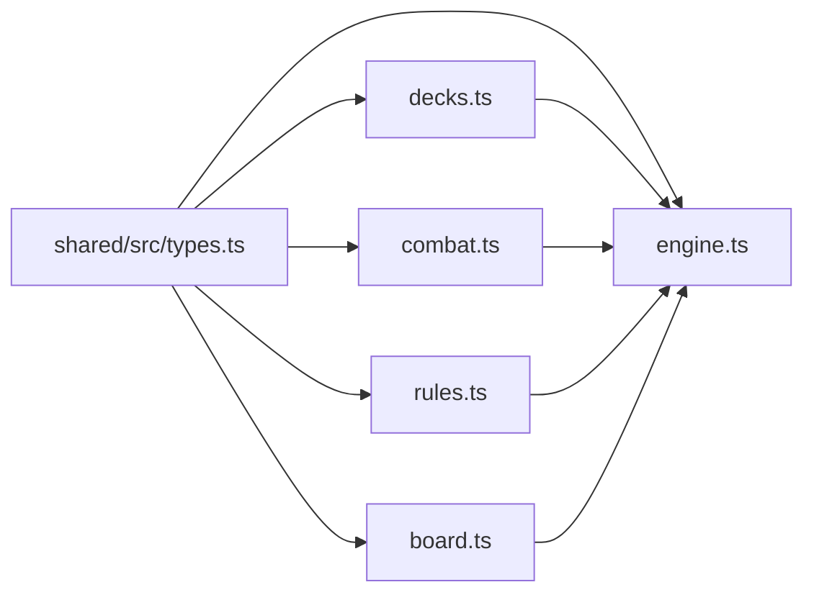

# Card System

<cite>
**Referenced Files in This Document**
- [README.md](file://README.md)
- [server/src/game/decks.ts](file://server/src/game/decks.ts)
- [server/src/game/engine.ts](file://server/src/game/engine.ts)
- [server/src/game/combat.ts](file://server/src/game/combat.ts)
- [server/src/game/rules.ts](file://server/src/game/rules.ts)
- [server/src/game/board.ts](file://server/src/game/board.ts)
- [shared/src/types.ts](file://shared/src/types.ts)
</cite>

## Table of Contents
1. [Introduction](#introduction)
2. [Project Structure](#project-structure)
3. [Core Components](#core-components)
4. [Architecture Overview](#architecture-overview)
5. [Detailed Component Analysis](#detailed-component-analysis)
6. [Dependency Analysis](#dependency-analysis)
7. [Performance Considerations](#performance-considerations)
8. [Troubleshooting Guide](#troubleshooting-guide)
9. [Conclusion](#conclusion)
10. [Appendices](#appendices)

## Introduction
This document explains the card-based mechanics in 防控作战飞行棋 (Air Defense Combat Flying Chess). It covers the missile card system (AAM, SAM, ARM, and cruise missiles), reward and punishment cards, radar cards, deck construction and distribution, probabilities, and strategies for optimal usage. It also documents how cards interact with movement, combat, and special cells.

## Project Structure
The card system spans shared types, server-side game logic, and board mechanics:
- Shared types define card kinds and hand state.
- Decks module constructs and shuffles decks and exposes held-card rules.
- Engine integrates card draws, triggers, and player actions.
- Combat module defines random outcomes for missile combat.
- Rules and board modules support movement, landing, and SAM detection.

**Diagram sources**
- [shared/src/types.ts:54-81](file://shared/src/types.ts#L54-L81)
- [server/src/game/decks.ts:18-101](file://server/src/game/decks.ts#L18-L101)
- [server/src/game/engine.ts:76-114](file://server/src/game/engine.ts#L76-L114)
- [server/src/game/combat.ts:7-32](file://server/src/game/combat.ts#L7-L32)
- [server/src/game/rules.ts:34-79](file://server/src/game/rules.ts#L34-L79)
- [server/src/game/board.ts:147-297](file://server/src/game/board.ts#L147-L297)

**Section sources**
- [README.md:1-122](file://README.md#L1-L122)
- [shared/src/types.ts:54-81](file://shared/src/types.ts#L54-L81)
- [server/src/game/decks.ts:18-101](file://server/src/game/decks.ts#L18-L101)
- [server/src/game/engine.ts:76-114](file://server/src/game/engine.ts#L76-L114)
- [server/src/game/combat.ts:7-32](file://server/src/game/combat.ts#L7-L32)
- [server/src/game/rules.ts:34-79](file://server/src/game/rules.ts#L34-L79)
- [server/src/game/board.ts:147-297](file://server/src/game/board.ts#L147-L297)

## Core Components
- Card kinds and hand state are defined in shared types.
- Decks module builds and shuffles decks and determines held vs trigger-only cards.
- Engine manages card draws from special cells, applies immediate and held effects, and integrates with combat and movement.
- Combat helpers provide randomized outcomes for AAM, ARM, and cruise landing checks.
- Rules and board support movement, landing, and SAM detection.

Key responsibilities:
- Decks: construct decks, shuffle, draw/discard, and held-card classification.
- Engine: draw cards from special cells, apply reward/punishment effects, play missiles and radar, and manage hand state.
- Combat: random outcomes for missile combat.
- Rules/Board: movement, landing, and SAM zone computation.

**Section sources**
- [shared/src/types.ts:54-81](file://shared/src/types.ts#L54-L81)
- [server/src/game/decks.ts:18-101](file://server/src/game/decks.ts#L18-L101)
- [server/src/game/engine.ts:530-684](file://server/src/game/engine.ts#L530-L684)
- [server/src/game/combat.ts:7-32](file://server/src/game/combat.ts#L7-L32)
- [server/src/game/rules.ts:34-79](file://server/src/game/rules.ts#L34-L79)
- [server/src/game/board.ts:289-297](file://server/src/game/board.ts#L289-L297)

## Architecture Overview
The card system is integrated into the authoritative engine. Players draw cards from special cells (missile factory, radar factory, library). Rewards and punishments are either immediate or held until used. Missiles are played from hand during combat or targeted actions.

**Diagram sources**
- [server/src/game/engine.ts:274-343](file://server/src/game/engine.ts#L274-L343)
- [server/src/game/engine.ts:530-684](file://server/src/game/engine.ts#L530-L684)
- [server/src/game/combat.ts:14-32](file://server/src/game/combat.ts#L14-L32)
- [server/src/game/rules.ts:103-183](file://server/src/game/rules.ts#L103-L183)

## Detailed Component Analysis

### Missile Card System
- Kinds: AAM, SAM, ARM, cruise.
- Factory deck composition:
  - AAM: 20
  - SAM: 20
  - ARM: 4
  - Cruise: 4
- Total missile deck: 48.
- Usage:
  - AAM/SAM are reactive in combat; AAM can be declared on collision; SAM auto-prompts when enemy enters radar zone.
  - ARM targets an opponent’s radar; success reduces their radars by one.
  - Cruise targets enemy planes on takeoff or landing strip; automatic hit on takeoff; landing strip requires 4/5/6.

Restrictions and deployment:
- AAM/SAM cannot be directly played from hand; they are used reactively.
- ARM requires a valid enemy target with radars.
- Cruise requires a valid target plane on takeoff or landing strip; shield protects the target.

Strategic notes:
- ARM is strong against radar-heavy opponents.
- Cruise is powerful against early takeoffs or landing strips.
- SAM auto-defense is crucial for protecting the radar zone.

**Section sources**
- [server/src/game/decks.ts:47-49](file://server/src/game/decks.ts#L47-L49)
- [server/src/game/engine.ts:500-522](file://server/src/game/engine.ts#L500-L522)
- [server/src/game/engine.ts:762-775](file://server/src/game/engine.ts#L762-L775)
- [server/src/game/engine.ts:777-808](file://server/src/game/engine.ts#L777-L808)
- [server/src/game/combat.ts:14-32](file://server/src/game/combat.ts#L14-L32)
- [server/src/game/board.ts:289-297](file://server/src/game/board.ts#L289-L297)

### Reward Card System
- Kinds and counts:
  - Immediate trigger-only: rerollFwd (+2/+4/+6), rerollBwd, bwd2/bwd4/bwd6, toTakeoff, selfSkip.
  - Held until used: gainMissile, gainRadar, enemySkip, shield.
- Behavior:
  - Trigger-only cards are applied immediately upon drawing and discarded.
  - Held cards remain in hand until used; some are consumed immediately upon drawing (e.g., gainMissile, gainRadar, shield) and then discarded.
  - enemySkip is played on an opponent to force them to skip a round.

Examples:
- Immediate: rerollFwd lets the player reroll and advance; bwd2 sends the last moved plane back 2 steps.
- Held: enemySkip targets an opponent; shield defends one attack.

**Section sources**
- [server/src/game/decks.ts:39-46](file://server/src/game/decks.ts#L39-L46)
- [server/src/game/decks.ts:94-100](file://server/src/game/decks.ts#L94-L100)
- [server/src/game/engine.ts:586-616](file://server/src/game/engine.ts#L586-L616)
- [server/src/game/engine.ts:636-684](file://server/src/game/engine.ts#L636-L684)
- [shared/src/types.ts:55-63](file://shared/src/types.ts#L55-L63)

### Punishment Card System
- Kinds and counts:
  - Immediate trigger-only: rerollBwd, bwd2/bwd4/bwd6, toTakeoff, selfSkip.
  - Held until used: loseMissile, loseRadar.
- Behavior:
  - Immediate trigger-only cards are applied immediately upon drawing and discarded.
  - Held cards are kept in hand; loseMissile removes a random missile; loseRadar removes a radar.
  - Some held cards are consumed immediately upon drawing (loseMissile/loseRadar) and then discarded.

Penalties and disadvantages:
- loseMissile reduces missile inventory.
- loseRadar reduces SAM defense capability.
- selfSkip prevents the player from moving next turn.

**Section sources**
- [server/src/game/decks.ts:43-46](file://server/src/game/decks.ts#L43-L46)
- [server/src/game/decks.ts:98-100](file://server/src/game/decks.ts#L98-L100)
- [server/src/game/engine.ts:636-684](file://server/src/game/engine.ts#L636-L684)

### Radar Card Mechanics
- Count: 28.
- Purpose: enables SAM detection by expanding the radar zone.
- Zone size increases with radars: 0/1/3/5/7 cells depending on radar count.
- SAM auto-prompts when an enemy enters the zone.

Distribution:
- Drawing from radar factory adds one radar to hand.
- loseRadar discards a radar back to the deck.

**Section sources**
- [server/src/game/decks.ts:50](file://server/src/game/decks.ts#L50)
- [server/src/game/engine.ts:530-554](file://server/src/game/engine.ts#L530-L554)
- [server/src/game/engine.ts:811-837](file://server/src/game/engine.ts#L811-L837)
- [server/src/game/board.ts:289-297](file://server/src/game/board.ts#L289-L297)

### Deck Construction and Distribution
- Decks:
  - Missile factory deck: 48 cards (AAM/SAM/ARM/cruise).
  - Radar deck: 28 identical radar cards.
  - Reward deck: 32 cards (4 each of 8 reward kinds).
  - Punishment deck: 32 cards (4 each of 8 punishment kinds).
  - Question deck: constructed from provided rows.
- Shuffling:
  - Fisher-Yates shuffle is used for decks.
- Draw/discard:
  - draw() returns null if both draw and discard piles are empty.
  - discard() pushes to discard pile; discardMany() pushes multiple.
- Distribution:
  - Special cells (missile factory, radar factory, library) draw cards.
  - Cards are private to the drawer; others see generic logs.

**Section sources**
- [server/src/game/decks.ts:18-37](file://server/src/game/decks.ts#L18-L37)
- [server/src/game/decks.ts:52-90](file://server/src/game/decks.ts#L52-L90)
- [server/src/game/engine.ts:537-554](file://server/src/game/engine.ts#L537-L554)

### Card Probability Calculations
- Deck sizes:
  - Missile: 48
  - Radar: 28
  - Reward: 32
  - Punishment: 32
- Probabilities depend on remaining cards in each deck; exact values vary dynamically.
- Example approximations (based on initial counts):
  - Probability of drawing a specific missile kind (AAM or SAM) ≈ 20/48 ≈ 41.7%.
  - Probability of drawing a specific missile kind (ARM or cruise) ≈ 4/48 ≈ 8.3%.
  - Probability of drawing a specific reward kind ≈ 4/32 = 12.5%.
  - Probability of drawing a specific punishment kind ≈ 4/32 = 12.5%.
  - Probability of drawing a radar ≈ 28/28 = 100% from radar factory deck.

Note: These are approximate initial probabilities; actual probabilities change as cards are drawn and discarded.

**Section sources**
- [server/src/game/decks.ts:47-49](file://server/src/game/decks.ts#L47-L49)
- [server/src/game/decks.ts:39-46](file://server/src/game/decks.ts#L39-L46)
- [server/src/game/decks.ts:50](file://server/src/game/decks.ts#L50)

### Deck Management Strategies
- Keep a balanced hand:
  - Mix AAM/SAM for reactive defense/offense.
  - Carry ARM for disrupting enemy radars.
  - Carry cruise for early takeoff or landing strip pressure.
- Manage held cards:
  - Use enemySkip strategically to disrupt opponents.
  - Use shield to survive one attack.
  - GainMissile/gainRadar can be consumed immediately to strengthen your hand.
- Radar management:
  - Accumulate radars to expand SAM zone and increase defensive coverage.
  - LoseRadar is a significant disadvantage; avoid losing it unnecessarily.

Optimal usage patterns:
- Early game: focus on radar accumulation and basic movement.
- Mid game: deploy ARM to reduce enemy SAM capability.
- Late game: use cruise to finish off planes near landing strip or takeoff.

**Section sources**
- [server/src/game/decks.ts:94-100](file://server/src/game/decks.ts#L94-L100)
- [server/src/game/engine.ts:636-684](file://server/src/game/engine.ts#L636-L684)
- [server/src/game/engine.ts:762-775](file://server/src/game/engine.ts#L762-L775)
- [server/src/game/engine.ts:777-808](file://server/src/game/engine.ts#L777-L808)

### Strategic Timing and Combinations
- Timing:
  - Use rerollFwd to maximize movement after drawing.
  - Use selfSkip to reset momentum when stuck.
  - Use enemySkip to disrupt an opponent’s turn.
- Combinations:
  - ARM + SAM: reduce enemy radar and then defend with SAM.
  - Cruise + landing strip: secure kills on planes attempting to land.
  - Shield + SAM: survive SAM attempts while preserving defense.

**Section sources**
- [server/src/game/engine.ts:623-634](file://server/src/game/engine.ts#L623-L634)
- [server/src/game/engine.ts:676-684](file://server/src/game/engine.ts#L676-L684)
- [server/src/game/engine.ts:730-741](file://server/src/game/engine.ts#L730-L741)

## Dependency Analysis
The card system depends on shared types and integrates with engine, combat, rules, and board modules.

**Diagram sources**
- [shared/src/types.ts:54-81](file://shared/src/types.ts#L54-L81)
- [server/src/game/decks.ts:18-101](file://server/src/game/decks.ts#L18-L101)
- [server/src/game/engine.ts:76-114](file://server/src/game/engine.ts#L76-L114)
- [server/src/game/combat.ts:7-32](file://server/src/game/combat.ts#L7-L32)
- [server/src/game/rules.ts:34-79](file://server/src/game/rules.ts#L34-L79)
- [server/src/game/board.ts:147-297](file://server/src/game/board.ts#L147-L297)

**Section sources**
- [shared/src/types.ts:54-81](file://shared/src/types.ts#L54-L81)
- [server/src/game/decks.ts:18-101](file://server/src/game/decks.ts#L18-L101)
- [server/src/game/engine.ts:76-114](file://server/src/game/engine.ts#L76-L114)
- [server/src/game/combat.ts:7-32](file://server/src/game/combat.ts#L7-L32)
- [server/src/game/rules.ts:34-79](file://server/src/game/rules.ts#L34-L79)
- [server/src/game/board.ts:147-297](file://server/src/game/board.ts#L147-L297)

## Performance Considerations
- Deck shuffling uses Fisher-Yates; complexity O(n).
- Draw/discard operations are O(1).
- Card counts are tracked to provide estimates; missile deck counts are approximated as a single mixed deck.

[No sources needed since this section provides general guidance]

## Troubleshooting Guide
Common issues and resolutions:
- Drawing from empty deck:
  - If draw fails, engine checks discard pile and reshuffles; otherwise returns null.
- Card not found:
  - playCard errors if the card is not in hand or not playable in that context.
- Target validation:
  - ARM requires a valid enemy target with radars.
  - Cruise requires a valid target plane on takeoff or landing strip.
- SAM auto-prompt:
  - Ensure radars are present and the enemy enters the radar zone.

**Section sources**
- [server/src/game/decks.ts:27-36](file://server/src/game/decks.ts#L27-L36)
- [server/src/game/engine.ts:747-757](file://server/src/game/engine.ts#L747-L757)
- [server/src/game/engine.ts:777-791](file://server/src/game/engine.ts#L777-L791)
- [server/src/game/engine.ts:811-837](file://server/src/game/engine.ts#L811-L837)

## Conclusion
The card system integrates tightly with movement, combat, and special cells. Players must balance immediate and long-term benefits, manage radar coverage, and deploy missiles strategically. Understanding held vs trigger-only cards, SAM auto-prompt mechanics, and cruise/ARM targeting rules is essential for competitive play.

[No sources needed since this section summarizes without analyzing specific files]

## Appendices

### Card Kind Reference
- Missile kinds: AAM, SAM, ARM, cruise.
- Reward kinds: rerollFwd, fwd2, fwd4, fwd6, gainMissile, gainRadar, enemySkip, shield.
- Punishment kinds: rerollBwd, bwd2, bwd4, bwd6, toTakeoff, selfSkip, loseMissile, loseRadar.

**Section sources**
- [shared/src/types.ts:54-79](file://shared/src/types.ts#L54-L79)