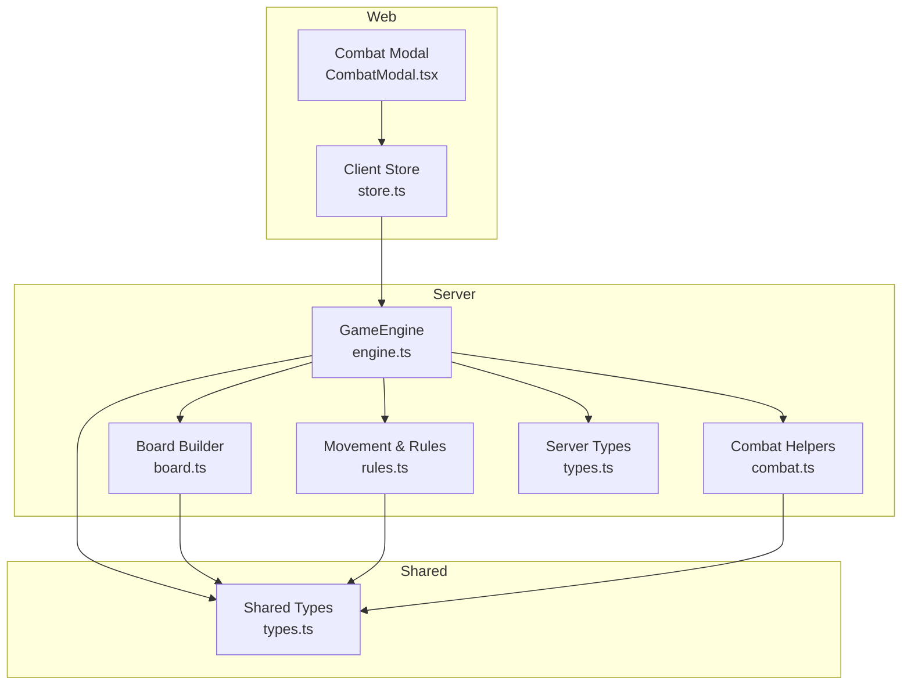
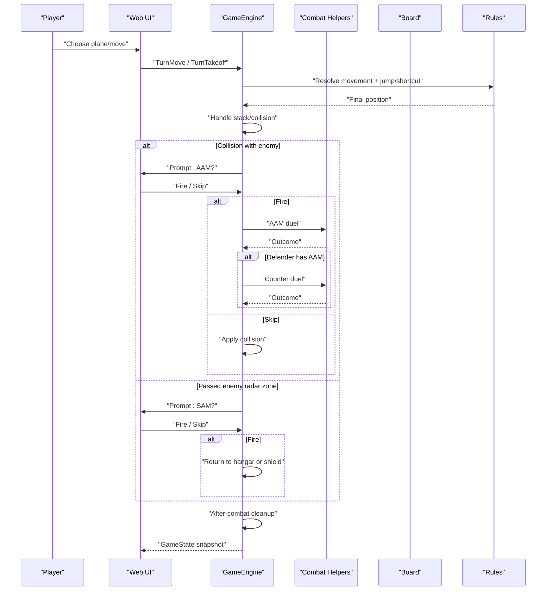
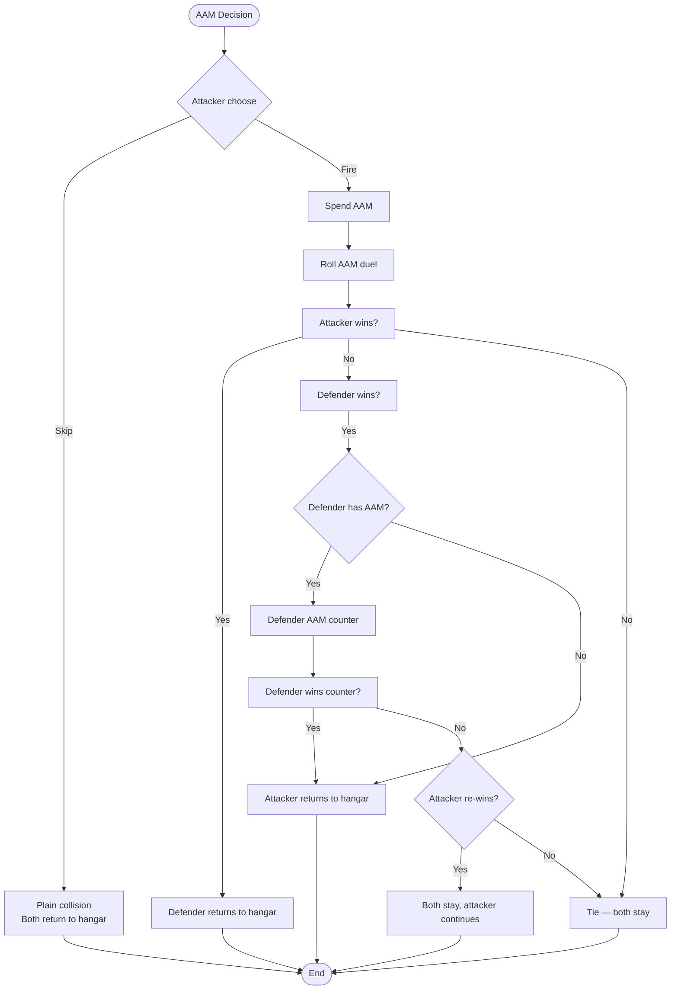
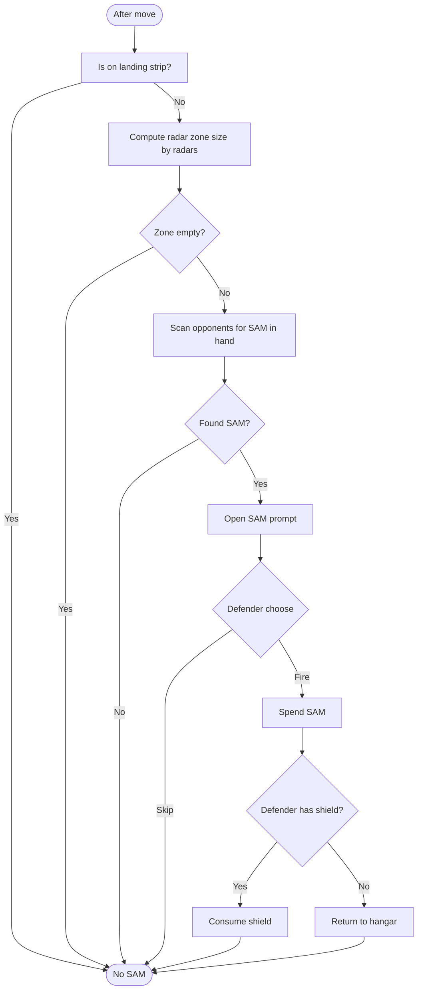
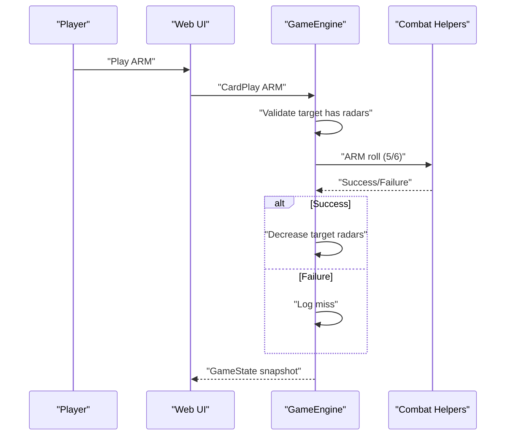
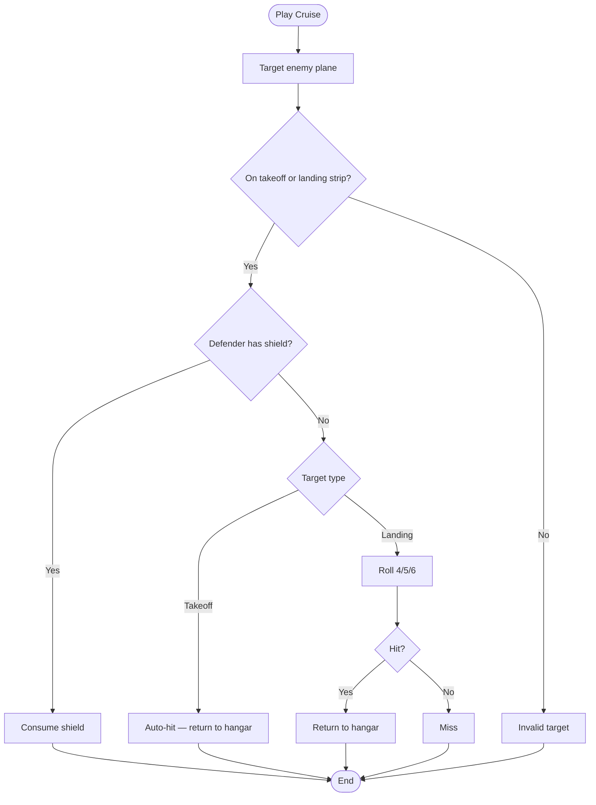
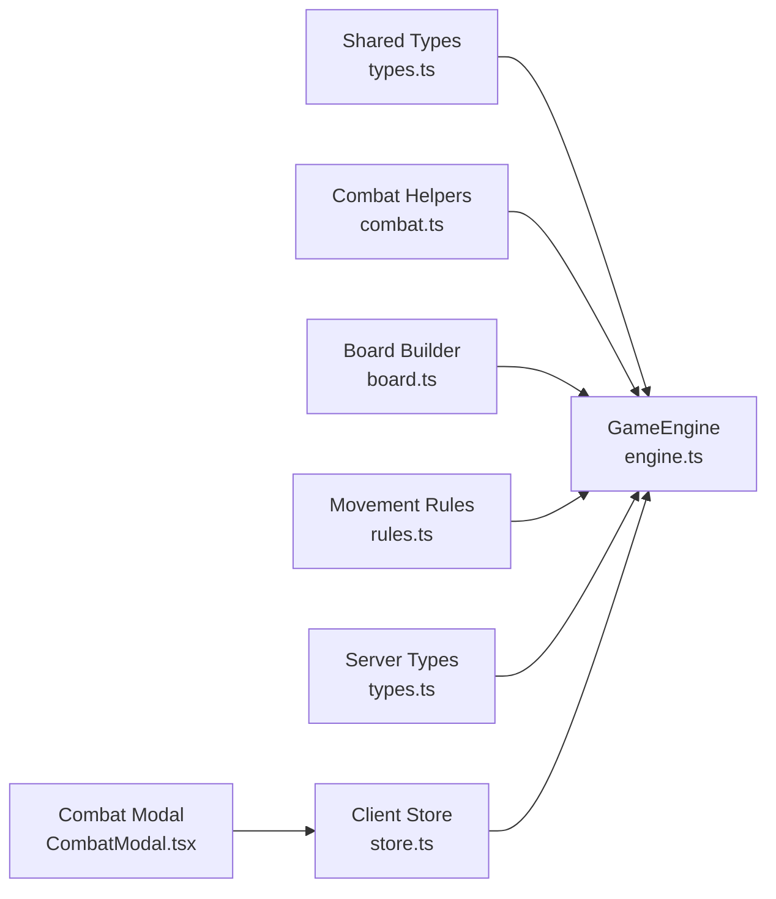

# Combat System

<cite>
**Referenced Files in This Document**
- [combat.ts](file://server/src/game/combat.ts)
- [engine.ts](file://server/src/game/engine.ts)
- [board.ts](file://server/src/game/board.ts)
- [rules.ts](file://server/src/game/rules.ts)
- [types.ts](file://server/src/game/types.ts)
- [types.ts](file://shared/src/types.ts)
- [CombatModal.tsx](file://web/src/ui/CombatModal.tsx)
- [store.ts](file://web/src/state/store.ts)
- [README.md](file://README.md)
</cite>

## Table of Contents
1. [Introduction](#introduction)
2. [Project Structure](#project-structure)
3. [Core Components](#core-components)
4. [Architecture Overview](#architecture-overview)
5. [Detailed Component Analysis](#detailed-component-analysis)
6. [Dependency Analysis](#dependency-analysis)
7. [Performance Considerations](#performance-considerations)
8. [Troubleshooting Guide](#troubleshooting-guide)
9. [Conclusion](#conclusion)
10. [Appendices](#appendices)

## Introduction
This document explains the complex combat system in 防控作战飞行棋 (Air Defense Combat Flying Chess). It covers:
- Air-to-air missile (AAM) duels: dice outcomes, counter-attacks, and tactical decisions
- Surface-to-air missile (SAM) auto-prompt system: radar zone detection and defensive positioning
- Anti-radar missile (ARM) targeting: radar destruction and strategic implications
- Cruise missile attacks: targeting takeoff and landing strip positions, including shield mechanics and defensive counters
- Combat resolution algorithms, probability calculations, and strategic decision-making frameworks
- Example scenarios and optimal tactical choices

The system is implemented in a server-authoritative engine with deterministic outcomes and a clean separation between combat resolution and UI prompts.

## Project Structure
The combat system spans the server engine, shared types, and the web UI:
- Server engine orchestrates turns, detects collisions and SAM zones, resolves AAM/AAM counter-attacks, and executes ARM/cruise effects
- Shared types define game state, prompts, and card kinds
- Web UI renders combat prompts and sends user choices back to the server

**Diagram sources**
- [engine.ts:1-920](file://server/src/game/engine.ts#L1-L920)
- [combat.ts:1-33](file://server/src/game/combat.ts#L1-L33)
- [board.ts:1-297](file://server/src/game/board.ts#L1-L297)
- [rules.ts:1-198](file://server/src/game/rules.ts#L1-L198)
- [types.ts:1-27](file://server/src/game/types.ts#L1-L27)
- [types.ts:1-186](file://shared/src/types.ts#L1-L186)
- [CombatModal.tsx:1-32](file://web/src/ui/CombatModal.tsx#L1-L32)
- [store.ts:1-164](file://web/src/state/store.ts#L1-L164)

**Section sources**
- [README.md:1-122](file://README.md#L1-L122)

## Core Components
- Combat helpers: deterministic dice outcomes for AAM, ARM, and cruise
- Game engine: manages prompts, resolves combat, updates state, and enforces rules
- Board builder: computes radar zones and path layouts
- Movement rules: landing detection, collision handling, and jump/shortcut chains
- Shared types: define prompts, planes, hands, and card kinds

Key responsibilities:
- Deterministic randomness via server-side crypto RNG
- Clear separation between “auto-prompt” and “player-choice” combat
- Defensive mechanics: SAM, shield, and landing strip immunity

**Section sources**
- [combat.ts:1-33](file://server/src/game/combat.ts#L1-L33)
- [engine.ts:1-920](file://server/src/game/engine.ts#L1-L920)
- [board.ts:277-297](file://server/src/game/board.ts#L277-L297)
- [rules.ts:71-84](file://server/src/game/rules.ts#L71-L84)
- [types.ts:1-186](file://shared/src/types.ts#L1-L186)

## Architecture Overview
The combat lifecycle is a state machine with explicit prompts. The server decides when to open prompts and resolves outcomes deterministically.

**Diagram sources**
- [engine.ts:299-343](file://server/src/game/engine.ts#L299-L343)
- [engine.ts:415-528](file://server/src/game/engine.ts#L415-L528)
- [engine.ts:810-837](file://server/src/game/engine.ts#L810-L837)
- [combat.ts:13-32](file://server/src/game/combat.ts#L13-L32)
- [rules.ts:103-183](file://server/src/game/rules.ts#L103-L183)

## Detailed Component Analysis

### AAM Duel Mechanics
- Both attacker and defender roll a six-sided die
- Outcomes:
  - Attacker wins: defender plane returns to hangar; attacker stays
  - Defender wins: defender plane stays; attacker returns to hangar
  - Tie: both planes stay; attacker continues their turn
- If defender wins, they may counter with their own AAM (if available), resolving a second duel
- If the counter is won by defender, attacker returns to hangar; if attacker re-wins, both stay and attacker continues; otherwise tie

**Diagram sources**
- [engine.ts:439-498](file://server/src/game/engine.ts#L439-L498)
- [combat.ts:13-20](file://server/src/game/combat.ts#L13-L20)

**Section sources**
- [engine.ts:415-498](file://server/src/game/engine.ts#L415-L498)
- [combat.ts:11-20](file://server/src/game/combat.ts#L11-L20)

### SAM Auto-Prompt System
- Detection: after movement, if a plane passes through an enemy’s radar zone and is not on the landing strip, and the defender has SAM in hand, a combat prompt is opened
- Radar zone: computed as up to seven cells fanning out from the defender’s base, with the number of active cells determined by radar count
- Outcome: defender may fire SAM to return the attacker’s plane to hangar; if the defender’s plane has a shield, it is consumed instead

**Diagram sources**
- [engine.ts:810-837](file://server/src/game/engine.ts#L810-L837)
- [board.ts:277-297](file://server/src/game/board.ts#L277-L297)
- [rules.ts:71-79](file://server/src/game/rules.ts#L71-L79)

**Section sources**
- [engine.ts:810-837](file://server/src/game/engine.ts#L810-L837)
- [board.ts:277-297](file://server/src/game/board.ts#L277-L297)
- [rules.ts:71-79](file://server/src/game/rules.ts#L71-L79)

### ARM Targeting Mechanics
- ARM requires a target opponent who has at least one radar
- Roll determines success: 5 or 6 destroys one of the target’s radars
- Strategic implications:
  - Reduces SAM auto-prompt frequency by shrinking radar zone size
  - Disrupts SAM readiness and defensive positioning
  - ARM is a “direct play” from hand; it does not require a reactive prompt

**Diagram sources**
- [engine.ts:747-775](file://server/src/game/engine.ts#L747-L775)
- [combat.ts:22-26](file://server/src/game/combat.ts#L22-L26)

**Section sources**
- [engine.ts:747-775](file://server/src/game/engine.ts#L747-L775)
- [combat.ts:22-26](file://server/src/game/combat.ts#L22-L26)

### Cruise Missile Attacks
- Targets only enemy planes that are on the takeoff cell or on the landing strip
- Takeoff: automatic hit (returns to hangar)
- Landing strip: success on 4/5/6; otherwise miss
- If the defender has a shield, it is consumed instead of returning the plane to hangar
- Cruise is a “direct play” from hand; it does not require a reactive prompt

**Diagram sources**
- [engine.ts:777-808](file://server/src/game/engine.ts#L777-L808)
- [combat.ts:28-32](file://server/src/game/combat.ts#L28-L32)
- [rules.ts:71-84](file://server/src/game/rules.ts#L71-L84)

**Section sources**
- [engine.ts:777-808](file://server/src/game/engine.ts#L777-L808)
- [combat.ts:28-32](file://server/src/game/combat.ts#L28-L32)
- [rules.ts:71-84](file://server/src/game/rules.ts#L71-L84)

### Probability Calculations and Strategic Implications
- AAM duel: each side has equal chance to roll higher; ties occur 1/6 probability; defender’s counter adds a second independent roll
- ARM: 2/6 success rate; diminishing returns as radars decrease radar zone size
- Cruise vs landing strip: 3/6 success rate; pierces landing strip immunity when successful
- SAM: auto-prompt triggers when enemy enters radar zone; effectiveness depends on radar count and whether defender has SAM in hand

These probabilities inform:
- Risk-reward trade-offs for launching AAM versus skipping
- When to spend ARM to reduce SAM readiness
- Whether to target landing strips for guaranteed hits

**Section sources**
- [combat.ts:13-32](file://server/src/game/combat.ts#L13-L32)
- [board.ts:289-296](file://server/src/game/board.ts#L289-L296)

### Strategic Decision-Making Framework
- Pre-move planning:
  - Assess radar count and SAM availability of nearby opponents
  - Consider whether a lane exposes a plane to SAM auto-prompt
- During move:
  - Prefer lanes that avoid entering radar zones unless necessary
  - Use same-color jumps and shortcuts to minimize exposure
- In combat:
  - AAM: launch when attacker is favored; consider defender’s counter risk
  - SAM: fire when enemy is vulnerable; protect planes on landing strips
  - ARM: prioritize targets with multiple radars to shrink their SAM zone
  - Cruise: target planes on takeoff for automatic hits; landing strip for high-value disruption

**Section sources**
- [engine.ts:810-837](file://server/src/game/engine.ts#L810-L837)
- [board.ts:277-297](file://server/src/game/board.ts#L277-L297)

### Example Scenarios and Optimal Choices
- Scenario 1: Attacker collides with a defender on a same-color cell
  - Optimal: Launch AAM if attacker has a good chance; if defender has AAM, consider skipping to avoid risk
- Scenario 2: Attacker passes through an opponent’s radar zone
  - Optimal: If defender has SAM, consider ARM to reduce their SAM readiness; otherwise, fire SAM to return the attacker to hangar
- Scenario 3: Defender has a plane on landing strip
  - Optimal: Use cruise to target landing strip; success returns the plane to hangar; consider ARM beforehand to reduce SAM effectiveness
- Scenario 4: Attacker is perched on a stack after a 6-roll
  - Optimal: Plan next move to avoid exposing the perched plane to SAM or AAM; consider moving to a safer lane

**Section sources**
- [engine.ts:415-528](file://server/src/game/engine.ts#L415-L528)
- [engine.ts:810-837](file://server/src/game/engine.ts#L810-L837)
- [rules.ts:93-183](file://server/src/game/rules.ts#L93-L183)

## Dependency Analysis
The combat system relies on:
- Shared types for prompts, planes, hands, and card kinds
- Board builder for radar zone computation and path layout
- Movement rules for landing detection and jump/shortcut chains
- Combat helpers for deterministic dice outcomes

**Diagram sources**
- [types.ts:1-186](file://shared/src/types.ts#L1-L186)
- [engine.ts:1-920](file://server/src/game/engine.ts#L1-L920)
- [combat.ts:1-33](file://server/src/game/combat.ts#L1-L33)
- [board.ts:1-297](file://server/src/game/board.ts#L1-L297)
- [rules.ts:1-198](file://server/src/game/rules.ts#L1-L198)
- [types.ts:1-27](file://server/src/game/types.ts#L1-L27)
- [CombatModal.tsx:1-32](file://web/src/ui/CombatModal.tsx#L1-L32)
- [store.ts:1-164](file://web/src/state/store.ts#L1-L164)

**Section sources**
- [engine.ts:1-920](file://server/src/game/engine.ts#L1-L920)
- [types.ts:1-186](file://shared/src/types.ts#L1-L186)

## Performance Considerations
- Server-authoritative design ensures deterministic outcomes and prevents client-side manipulation
- Minimal state cloning via structuredClone for snapshots
- Efficient radar zone slicing by radar count avoids unnecessary computations
- Combat resolution is O(1) per prompt; no loops or recursive state mutations

[No sources needed since this section provides general guidance]

## Troubleshooting Guide
Common issues and resolutions:
- “Not your decision” during combat: ensure the prompt seat matches the current player
- “No such combat”: combat ID mismatch or expired prompt
- “No AAM” / “No SAM” / “No ARM”: verify missile availability in hand
- “Target has no radars” for ARM: confirm opponent has at least one radar
- “Cruise can only target takeoff or landing strip”: verify target position
- “Defender has shield”: shield consumed instead of returning plane to hangar

**Section sources**
- [engine.ts:435-522](file://server/src/game/engine.ts#L435-L522)
- [engine.ts:747-775](file://server/src/game/engine.ts#L747-L775)
- [engine.ts:777-808](file://server/src/game/engine.ts#L777-L808)

## Conclusion
The combat system balances deterministic randomness with meaningful tactical choices. Players must weigh risks (AAM outcomes, SAM auto-prompt) against rewards (cruise hits, ARM radar reduction). Strategic depth emerges from radar zone sizing, landing strip immunity, and defensive counters like shields and SAM.

[No sources needed since this section summarizes without analyzing specific files]

## Appendices

### UI Integration
- The web UI renders combat prompts and forwards player choices to the server
- The store emits combat responses with combatId and choice

**Section sources**
- [CombatModal.tsx:1-32](file://web/src/ui/CombatModal.tsx#L1-L32)
- [store.ts:133-135](file://web/src/state/store.ts#L133-L135)