# Core Gameplay Rules

<cite>
**Referenced Files in This Document**
- [README.md](file://README.md)
- [engine.ts](file://server/src/game/engine.ts)
- [board.ts](file://server/src/game/board.ts)
- [rules.ts](file://server/src/game/rules.ts)
- [combat.ts](file://server/src/game/combat.ts)
- [decks.ts](file://server/src/game/decks.ts)
- [types.ts](file://shared/src/types.ts)
- [protocol.ts](file://shared/src/protocol.ts)
- [store.ts](file://web/src/state/store.ts)
- [Game.tsx](file://web/src/ui/Game.tsx)
</cite>

## Table of Contents
1. [Introduction](#introduction)
2. [Project Structure](#project-structure)
3. [Core Components](#core-components)
4. [Architecture Overview](#architecture-overview)
5. [Detailed Component Analysis](#detailed-component-analysis)
6. [Dependency Analysis](#dependency-analysis)
7. [Performance Considerations](#performance-considerations)
8. [Troubleshooting Guide](#troubleshooting-guide)
9. [Conclusion](#conclusion)
10. [Appendices](#appendices)

## Introduction
This document explains the core gameplay mechanics of 导弹飞行棋 (Air Defense Combat Flying Chess). It covers the dice-based movement system, takeoff procedures, plane movement logic, collision detection, jump chain mechanics on same-color cells, shortcut traversal, stacking rules, turn-based state machine, phase transitions, player actions, and game progression. It also documents the board layout, cell types, positional calculations, mathematical models for movement steps and bounce mechanics, and positional validation. Practical examples illustrate common scenarios such as takeoff decisions, movement choices, and legal move validation.

## Project Structure
The game is implemented as a Node.js authoritative server with a React web client and shared TypeScript protocol. The server’s game engine encapsulates all core logic, while the client renders the board, HUD, logs, and prompts, and communicates with the server via Socket.IO events.

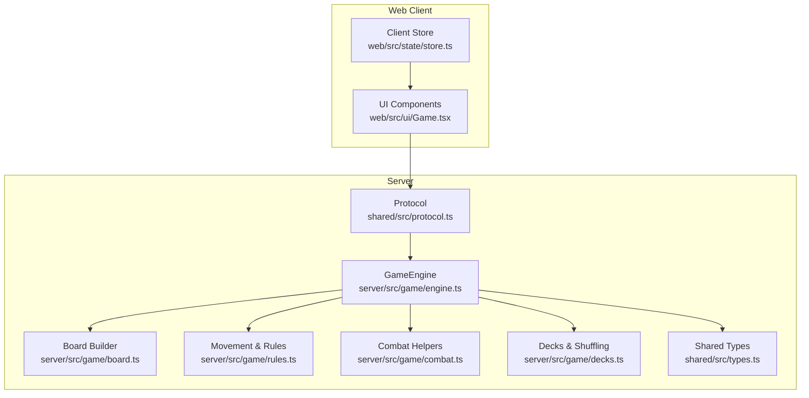

**Diagram sources**
- [engine.ts:1-120](file://server/src/game/engine.ts#L1-L120)
- [board.ts:107-235](file://server/src/game/board.ts#L107-L235)
- [rules.ts:34-197](file://server/src/game/rules.ts#L34-L197)
- [combat.ts:7-32](file://server/src/game/combat.ts#L7-L32)
- [decks.ts:18-101](file://server/src/game/decks.ts#L18-L101)
- [types.ts:18-186](file://shared/src/types.ts#L18-L186)
- [protocol.ts:6-97](file://shared/src/protocol.ts#L6-L97)
- [store.ts:60-164](file://web/src/state/store.ts#L60-L164)
- [Game.tsx:10-34](file://web/src/ui/Game.tsx#L10-L34)

**Section sources**
- [README.md:1-122](file://README.md#L1-L122)
- [engine.ts:1-120](file://server/src/game/engine.ts#L1-L120)
- [board.ts:107-235](file://server/src/game/board.ts#L107-L235)
- [rules.ts:34-197](file://server/src/game/rules.ts#L34-L197)
- [combat.ts:7-32](file://server/src/game/combat.ts#L7-L32)
- [decks.ts:18-101](file://server/src/game/decks.ts#L18-L101)
- [types.ts:18-186](file://shared/src/types.ts#L18-L186)
- [protocol.ts:6-97](file://shared/src/protocol.ts#L6-L97)
- [store.ts:60-164](file://web/src/state/store.ts#L60-L164)
- [Game.tsx:10-34](file://web/src/ui/Game.tsx#L10-L34)

## Core Components
- GameEngine: Authoritative state machine orchestrating turns, dice rolls, takeoff/move decisions, combat, library QA, and game end conditions.
- Board builder: Constructs the ring, landing strips, home cells, shortcuts, and radar zones per color.
- Movement rules: Pure functions computing forward/backward steps, bounce mechanics, landing strip/home detection, and jump/shortcut chains.
- Combat helpers: Randomized outcomes for AAM, ARM, and cruise missile rolls.
- Decks: Factory, radar, reward, punishment, and question decks with shuffling and draw/discard semantics.
- Shared types and protocol: Define cell kinds, board paths, plane states, prompts, phases, and client-server event schemas.

**Section sources**
- [engine.ts:76-148](file://server/src/game/engine.ts#L76-L148)
- [board.ts:107-235](file://server/src/game/board.ts#L107-L235)
- [rules.ts:34-197](file://server/src/game/rules.ts#L34-L197)
- [combat.ts:7-32](file://server/src/game/combat.ts#L7-L32)
- [decks.ts:18-101](file://server/src/game/decks.ts#L18-L101)
- [types.ts:18-186](file://shared/src/types.ts#L18-L186)
- [protocol.ts:6-97](file://shared/src/protocol.ts#L6-L97)

## Architecture Overview
The server maintains a single authoritative GameEngine instance. Clients connect via Socket.IO and receive periodic GameState snapshots. Actions are sent as C2S events, validated by the engine, and the resulting state is broadcast back to all clients.

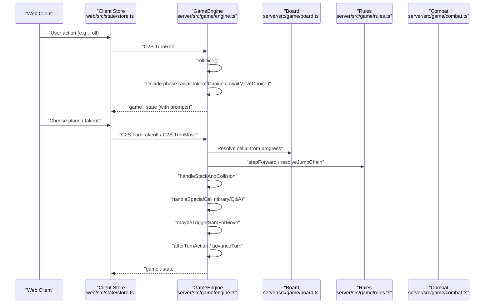

**Diagram sources**
- [engine.ts:206-255](file://server/src/game/engine.ts#L206-L255)
- [engine.ts:274-343](file://server/src/game/engine.ts#L274-L343)
- [engine.ts:299-343](file://server/src/game/engine.ts#L299-L343)
- [engine.ts:530-584](file://server/src/game/engine.ts#L530-L584)
- [engine.ts:810-837](file://server/src/game/engine.ts#L810-L837)
- [engine.ts:860-880](file://server/src/game/engine.ts#L860-L880)
- [board.ts:107-235](file://server/src/game/board.ts#L107-L235)
- [rules.ts:34-197](file://server/src/game/rules.ts#L34-L197)
- [combat.ts:7-32](file://server/src/game/combat.ts#L7-L32)
- [protocol.ts:6-21](file://shared/src/protocol.ts#L6-L21)

## Detailed Component Analysis

### Turn-Based State Machine and Phase Transitions
- Phases: lobby, awaitRoll, awaitTakeoffChoice, awaitMoveChoice, resolving, awaitCardActions, awaitCombat, awaitQA, gameOver.
- Lifecycle:
  - Start: awaitRoll for current player.
  - Roll: emit dice value and chain count; decide next phase based on takeoff eligibility and movable planes.
  - Takeoff/Movement: choose plane; if takeoff allowed and roll permits, place plane on takeoff; otherwise move on-board plane.
  - Resolve: apply jump/shortcut chain, stack/collision, special-cell triggers, SAM detection.
  - After resolve: extra roll on 6 or bust (three 6s in a row), or end turn.
  - Victory: check win condition (two planes home or timed) and end game.

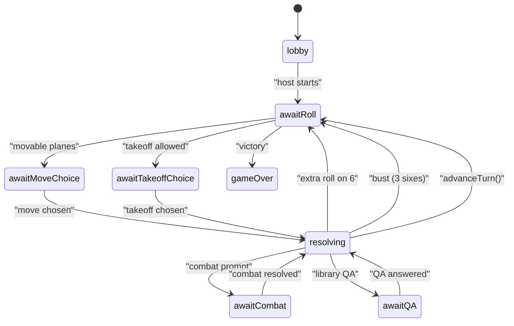

**Diagram sources**
- [types.ts:129-139](file://shared/src/types.ts#L129-L139)
- [engine.ts:180-204](file://server/src/game/engine.ts#L180-L204)
- [engine.ts:206-255](file://server/src/game/engine.ts#L206-L255)
- [engine.ts:860-880](file://server/src/game/engine.ts#L860-L880)
- [engine.ts:882-912](file://server/src/game/engine.ts#L882-L912)

**Section sources**
- [types.ts:129-139](file://shared/src/types.ts#L129-L139)
- [engine.ts:180-204](file://server/src/game/engine.ts#L180-L204)
- [engine.ts:206-255](file://server/src/game/engine.ts#L206-L255)
- [engine.ts:860-880](file://server/src/game/engine.ts#L860-L880)
- [engine.ts:882-912](file://server/src/game/engine.ts#L882-L912)

### Dice-Based Movement System
- Roll: 1d6 with chain tracking; three 6s in a row cancel the move and end the turn.
- Takeoff eligibility: configurable numbers (e.g., [6], [5,6], [2,4,6]).
- Movement:
  - Compute target progress = current progress + steps.
  - Bounce back if overshoot PATH_LEN_TO_HOME; clamp at 0.
  - Resolve cellId from progress along the color-specific path.
- Legal move validation:
  - If no takeoff allowed and no movable planes, end turn (extra roll on 6).
  - If takeoff allowed and no move, present takeoff prompt.
  - If takeoff allowed and move possible, present unified move prompt including hangar planes.

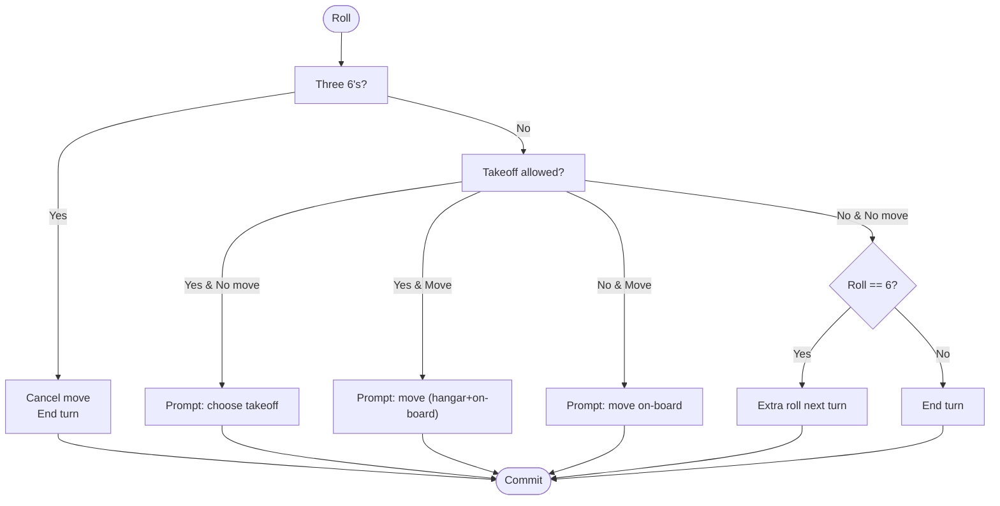

**Diagram sources**
- [engine.ts:206-255](file://server/src/game/engine.ts#L206-L255)
- [rules.ts:34-69](file://server/src/game/rules.ts#L34-L69)

**Section sources**
- [engine.ts:206-255](file://server/src/game/engine.ts#L206-L255)
- [rules.ts:34-69](file://server/src/game/rules.ts#L34-L69)

### Takeoff Procedures
- Eligibility: roll must match configured takeoff numbers and at least one hangar plane must be available.
- Placement: place the chosen hangar plane on the color’s takeoff cell (progress 0), reset cellId and progress, clear perched flag.
- Collision: takeoff itself is treated as safe; no collision occurs on entry.

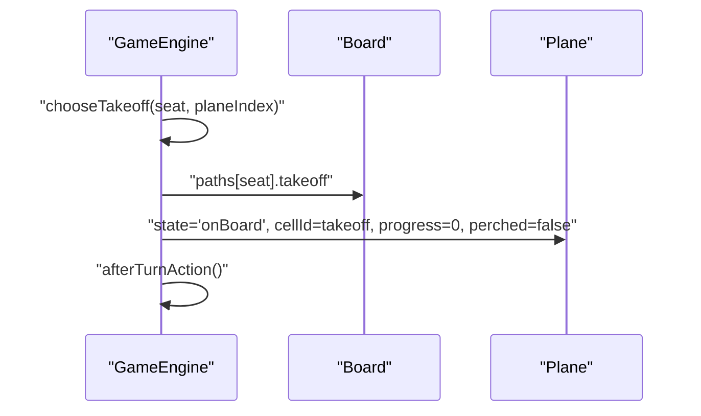

**Diagram sources**
- [engine.ts:257-272](file://server/src/game/engine.ts#L257-L272)
- [board.ts:186-195](file://server/src/game/board.ts#L186-L195)

**Section sources**
- [engine.ts:257-272](file://server/src/game/engine.ts#L257-L272)
- [board.ts:186-195](file://server/src/game/board.ts#L186-L195)

### Plane Movement Logic and Positional Calculations
- Forward step: target = fromProgress + steps; clamp overshoot to PATH_LEN_TO_HOME with bounce; clamp under 0 to 0.
- Backward step: clamp at 0.
- Cell resolution:
  - Landing strip: steps 50..53 mapped to landing cells.
  - Home: steps ≥ 54 mapped to home.
  - Ring: steps 1..49 mapped via color-specific ring path.
- Bounce mechanics: if overshoot occurs, plane bounces back by the amount of overshoot and logs the bounce.

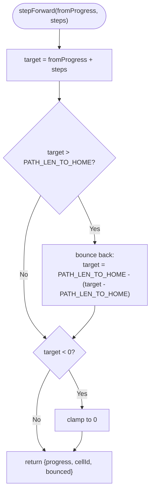

**Diagram sources**
- [rules.ts:34-69](file://server/src/game/rules.ts#L34-L69)
- [rules.ts:19-28](file://server/src/game/rules.ts#L19-L28)

**Section sources**
- [rules.ts:34-69](file://server/src/game/rules.ts#L34-L69)
- [rules.ts:19-28](file://server/src/game/rules.ts#L19-L28)

### Jump Chain Mechanics on Same-Color Cells
- Trigger: landing on a same-color cell (excluding takeoff) or shortcut entry.
- Priority: shortcut entry takes precedence.
- Behavior:
  - Shortcut entry from normal step: traverse to exit and chain-jump once from exit (if not blocked).
  - Shortcut entry reached via prior jump: traverse only (no extra jump).
  - Normal same-color jump: advance to next same-color cell if target is unoccupied.
- Occupancy suppression: if the target cell of a jump is occupied by any plane (foreign or stacked), the jump is suppressed.

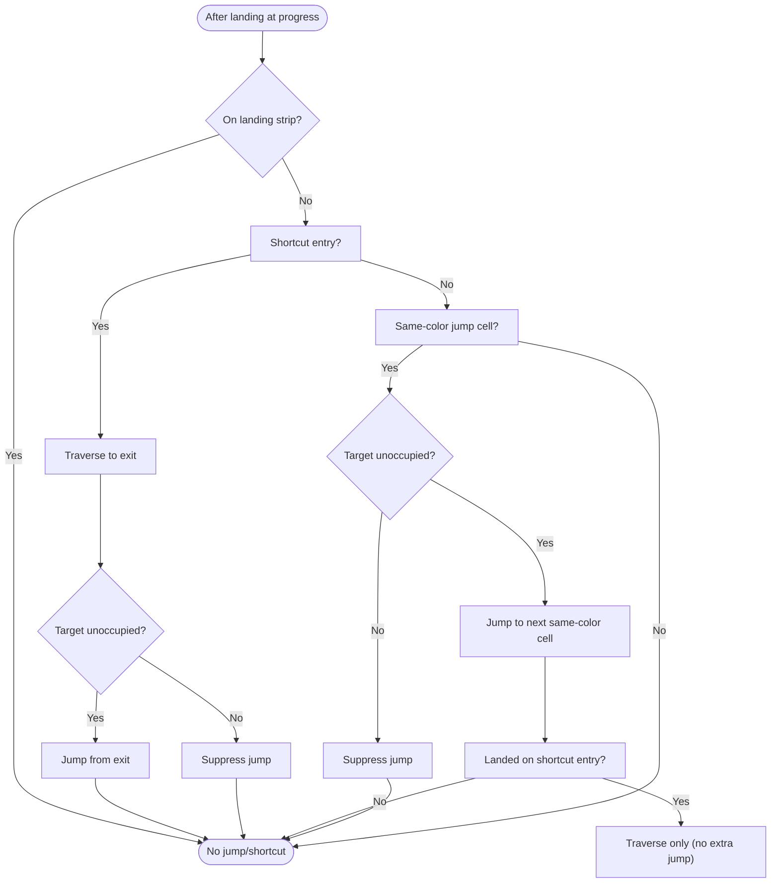

**Diagram sources**
- [rules.ts:103-183](file://server/src/game/rules.ts#L103-L183)
- [board.ts:201-232](file://server/src/game/board.ts#L201-L232)

**Section sources**
- [rules.ts:103-183](file://server/src/game/rules.ts#L103-L183)
- [board.ts:201-232](file://server/src/game/board.ts#L201-L232)

### Shortcut Traversal System
- Each color has a shortcut entry and exit located on same-color cells.
- Entry via normal step: traverse to exit and chain-jump once from exit (if target unoccupied).
- Entry via prior jump: traverse only (no extra jump).
- Pairing: entry/exit linked by shortcutPair.

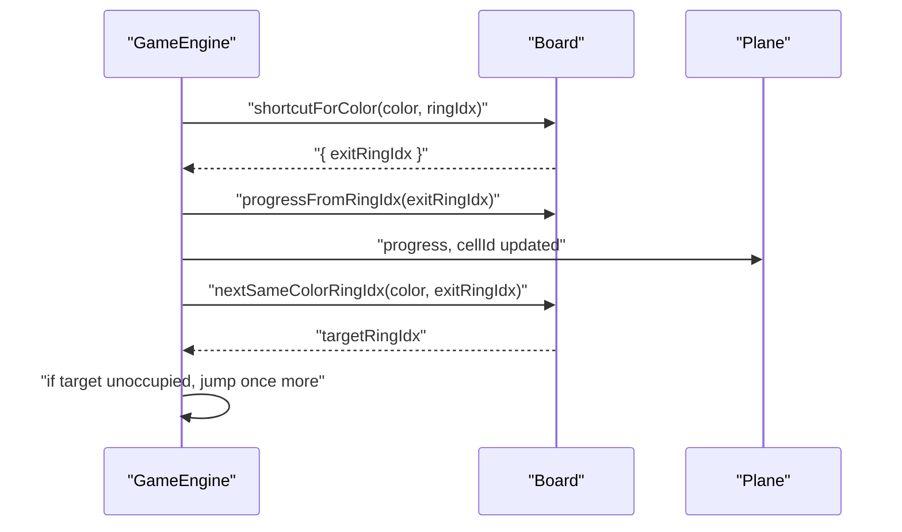

**Diagram sources**
- [board.ts:155-162](file://server/src/game/board.ts#L155-L162)
- [board.ts:226-232](file://server/src/game/board.ts#L226-L232)
- [rules.ts:129-149](file://server/src/game/rules.ts#L129-L149)

**Section sources**
- [board.ts:155-162](file://server/src/game/board.ts#L155-L162)
- [board.ts:226-232](file://server/src/game/board.ts#L226-L232)
- [rules.ts:129-149](file://server/src/game/rules.ts#L129-L149)

### Stacking Rules and Collision Detection
- Stacks: multiple planes can occupy the same cell; own planes do not collide with each other.
- Collisions:
  - If landing on a stack of two or more enemies of the same color, attacker may declare AAM; otherwise, collision returns both planes to hangar.
  - If landing on a single enemy stack, collision returns the attacker plus one stack member.
  - If landing on a single enemy plane, collision returns both planes.
- Perch rule: if landing on a stack of enemies from a 6-roll, the attacking plane perches and advances next turn.

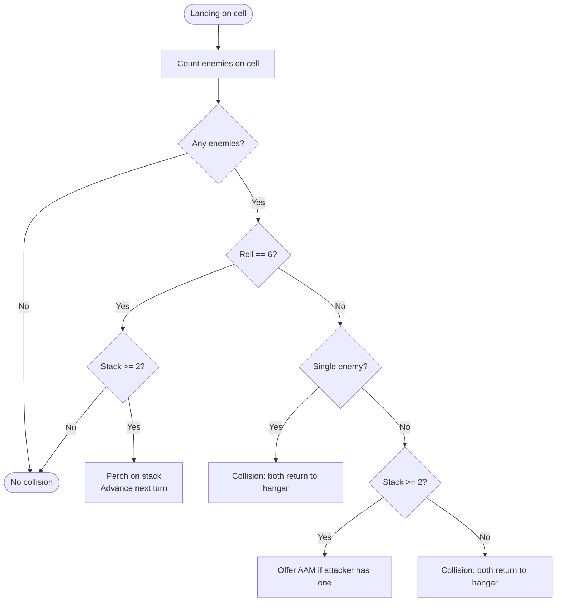

**Diagram sources**
- [engine.ts:345-391](file://server/src/game/engine.ts#L345-L391)
- [engine.ts:415-528](file://server/src/game/engine.ts#L415-L528)

**Section sources**
- [engine.ts:345-391](file://server/src/game/engine.ts#L345-L391)
- [engine.ts:415-528](file://server/src/game/engine.ts#L415-L528)

### Special Cells and Library Q&A
- Special cells:
  - Missile factory: draw a random missile card.
  - Radar factory: gain a radar (up to a cap; radar zone fan-out increases with count).
  - Library: draw a question; correct answer draws a reward; wrong answer draws a punishment.
- Library resolution:
  - Present QA prompt; upon answer, apply drawn reward/punishment immediately.
  - Some rewards/punishments are held in hand until played; others trigger immediately.

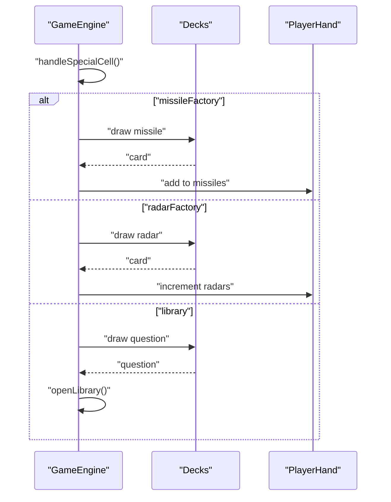

**Diagram sources**
- [engine.ts:530-584](file://server/src/game/engine.ts#L530-L584)
- [decks.ts:52-86](file://server/src/game/decks.ts#L52-L86)

**Section sources**
- [engine.ts:530-584](file://server/src/game/engine.ts#L530-L584)
- [decks.ts:52-86](file://server/src/game/decks.ts#L52-L86)

### SAM Detection and Auto-Prompts
- SAM triggers when an enemy plane enters or passes through a defender’s radar zone.
- Radar zone size depends on radar count: 0/1/3/5/7 cells near the base.
- Auto-prompt: defender may choose to fire SAM or hold fire; if shielded, SAM has no effect.

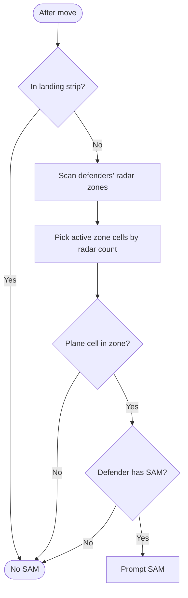

**Diagram sources**
- [engine.ts:810-837](file://server/src/game/engine.ts#L810-L837)
- [board.ts:241-257](file://server/src/game/board.ts#L241-L257)

**Section sources**
- [engine.ts:810-837](file://server/src/game/engine.ts#L810-L837)
- [board.ts:241-257](file://server/src/game/board.ts#L241-L257)

### Turn-Based State Machine with Player Actions
- Player actions:
  - Roll dice.
  - Choose takeoff or move plane.
  - Play held cards (missiles/arm/cruise) or rewards/punishments.
  - Respond to combat prompts (AAM, SAM) or library QA.
- Validation:
  - Engine enforces phase and ownership; invalid actions are rejected with errors.
  - Client store mirrors server state and exposes safe action dispatchers.

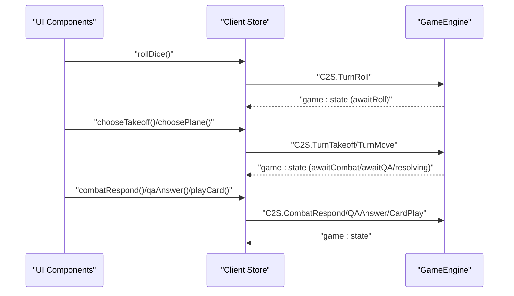

**Diagram sources**
- [store.ts:124-141](file://web/src/state/store.ts#L124-L141)
- [protocol.ts:6-21](file://shared/src/protocol.ts#L6-L21)
- [engine.ts:206-255](file://server/src/game/engine.ts#L206-L255)
- [engine.ts:274-343](file://server/src/game/engine.ts#L274-L343)
- [engine.ts:435-528](file://server/src/game/engine.ts#L435-L528)
- [engine.ts:568-584](file://server/src/game/engine.ts#L568-L584)
- [engine.ts:720-760](file://server/src/game/engine.ts#L720-L760)

**Section sources**
- [store.ts:124-141](file://web/src/state/store.ts#L124-L141)
- [protocol.ts:6-21](file://shared/src/protocol.ts#L6-L21)
- [engine.ts:206-255](file://server/src/game/engine.ts#L206-L255)
- [engine.ts:274-343](file://server/src/game/engine.ts#L274-L343)
- [engine.ts:435-528](file://server/src/game/engine.ts#L435-L528)
- [engine.ts:568-584](file://server/src/game/engine.ts#L568-L584)
- [engine.ts:720-760](file://server/src/game/engine.ts#L720-L760)

### Board Layout, Cell Types, and Positional Validation
- Ring: 52 cells arranged in four quadrants (red/yellow/blue/green), each 13 cells.
- Cell kinds:
  - Normal, takeoff, jump (same-color), shortcutEntry/shortcutExit, landing, home, missileFactory, radarFactory, library.
- Paths per color:
  - Ring order starting at takeoff.
  - Landing strip (4 cells) and home (1 cell).
  - Takeoff cell id and hangar positions.
  - Radar zone: up to 7 cells fanning out from base by radar count.
- Positional validation:
  - Progress 0 = takeoff; 1..49 = ring; 50..53 = landing; ≥54 = home.
  - Landing strip immunity from most attacks.

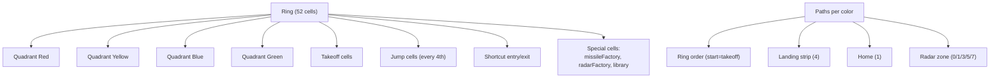

**Diagram sources**
- [board.ts:107-235](file://server/src/game/board.ts#L107-L235)
- [types.ts:6-45](file://shared/src/types.ts#L6-L45)

**Section sources**
- [board.ts:107-235](file://server/src/game/board.ts#L107-L235)
- [types.ts:6-45](file://shared/src/types.ts#L6-L45)

### Mathematical Models and Examples
- Movement steps:
  - Forward: progress = min(PATH_LEN_TO_HOME, max(0, fromProgress + steps)).
  - Backward: progress = max(0, fromProgress - steps).
  - Bounce: if overshoot occurs, bounce back by overshoot amount.
- Jump chain:
  - Same-color jump: advance to next same-color cell if target unoccupied.
  - Shortcut: traverse to exit; chain-jump once if entry via normal step and target unoccupied.
- Collision:
  - Attacker + 1 stack member return when stacked enemy; otherwise both return.
  - Perch on 6 when stacked enemy.
- Library effects:
  - Immediate trigger rewards/punishments (e.g., +2/+4/+6 steps, reroll).
  - Held rewards/punishments (e.g., enemySkip, shield) remain in hand until used.

Examples:
- Takeoff decision: choose hangar plane when roll equals takeoff number and at least one hangar plane exists.
- Movement choice: select on-board plane when no takeoff is possible; if takeoff allowed, choose between takeoff and moving.
- Legal move validation: if no legal move exists, end turn (extra roll on 6); otherwise present move prompt.

**Section sources**
- [rules.ts:34-69](file://server/src/game/rules.ts#L34-L69)
- [rules.ts:103-183](file://server/src/game/rules.ts#L103-L183)
- [engine.ts:222-253](file://server/src/game/engine.ts#L222-L253)
- [engine.ts:345-391](file://server/src/game/engine.ts#L345-L391)
- [engine.ts:586-684](file://server/src/game/engine.ts#L586-L684)

## Dependency Analysis
The server’s GameEngine depends on:
- Board builder for ring, paths, shortcuts, and radar zones.
- Movement rules for positional math and jump/shortcut logic.
- Combat helpers for randomized outcomes.
- Decks for card draw/discard semantics.
- Shared types and protocol for consistent data contracts.

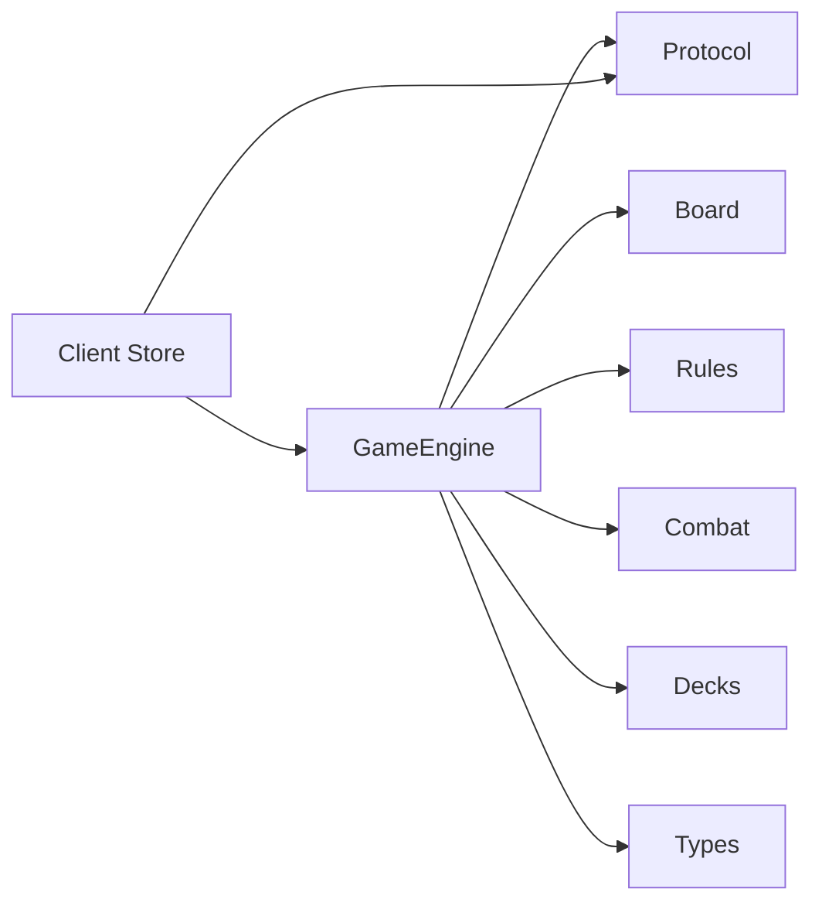

**Diagram sources**
- [engine.ts:25-36](file://server/src/game/engine.ts#L25-L36)
- [board.ts:107-235](file://server/src/game/board.ts#L107-L235)
- [rules.ts:34-197](file://server/src/game/rules.ts#L34-L197)
- [combat.ts:7-32](file://server/src/game/combat.ts#L7-L32)
- [decks.ts:18-101](file://server/src/game/decks.ts#L18-L101)
- [types.ts:18-186](file://shared/src/types.ts#L18-L186)
- [protocol.ts:6-97](file://shared/src/protocol.ts#L6-L97)
- [store.ts:60-164](file://web/src/state/store.ts#L60-L164)

**Section sources**
- [engine.ts:25-36](file://server/src/game/engine.ts#L25-L36)
- [board.ts:107-235](file://server/src/game/board.ts#L107-L235)
- [rules.ts:34-197](file://server/src/game/rules.ts#L34-L197)
- [combat.ts:7-32](file://server/src/game/combat.ts#L7-L32)
- [decks.ts:18-101](file://server/src/game/decks.ts#L18-L101)
- [types.ts:18-186](file://shared/src/types.ts#L18-L186)
- [protocol.ts:6-97](file://shared/src/protocol.ts#L6-L97)
- [store.ts:60-164](file://web/src/state/store.ts#L60-L164)

## Performance Considerations
- Authoritative server ensures deterministic outcomes and prevents client-side cheating.
- Snapshots are cloned via structuredClone to avoid accidental mutation.
- Deck shuffling uses in-place Fisher-Yates; card counts are cached for fast UI updates.
- Jump chain resolution iterates at most ring length; occupancy checks are O(n) per cell.

[No sources needed since this section provides general guidance]

## Troubleshooting Guide
Common issues and resolutions:
- “Not your turn” or “not your roll”: ensure the current player is the active seat and phase is correct.
- “No such plane” or “plane is not movable”: verify plane index and state.
- “Cannot take off on this roll”: confirm roll matches configured takeoff numbers.
- “No legal move”: if roll is 6, extra roll is granted; otherwise turn ends.
- “Three 6’s in a row”: move is canceled and turn ends.
- “No AAM” or “no SAM”: confirm the player has the respective missile in hand.
- “No QA”: ensure a question was drawn and prompt is active.
- “Card not found”: verify card id and type.

**Section sources**
- [engine.ts:206-255](file://server/src/game/engine.ts#L206-L255)
- [engine.ts:257-272](file://server/src/game/engine.ts#L257-L272)
- [engine.ts:274-297](file://server/src/game/engine.ts#L274-L297)
- [engine.ts:435-528](file://server/src/game/engine.ts#L435-L528)
- [engine.ts:568-584](file://server/src/game/engine.ts#L568-L584)
- [engine.ts:914-918](file://server/src/game/engine.ts#L914-L918)

## Conclusion
The game combines classic flying-chess movement with modern tactical elements: missile combat, radar zones, library Q&A, and strategic stacking. The authoritative server enforces precise rules for takeoff, movement, collisions, and special-cell interactions, while the client provides a responsive UI synchronized to the server state.

[No sources needed since this section summarizes without analyzing specific files]

## Appendices

### A. Cell Kinds and Descriptions
- Normal: standard ring cell.
- Takeoff: player’s entry point; safe for takeoff.
- Jump: same-color cell enabling same-color jump.
- ShortcutEntry/ShortcutExit: paired shortcut cells.
- Landing: four cells leading to home.
- Home: center cell; winning position.
- MissileFactory: draws a random missile.
- RadarFactory: draws a radar.
- Library: draws a question; correct answer rewards, wrong answer punishes.

**Section sources**
- [types.ts:6-16](file://shared/src/types.ts#L6-L16)
- [board.ts:112-153](file://server/src/game/board.ts#L112-L153)

### B. Victory Conditions
- Two planes home: first player to land two planes at home wins.
- Timed: winner determined by most planes home at time limit.

**Section sources**
- [engine.ts:882-912](file://server/src/game/engine.ts#L882-L912)

### C. Client-Server Events
- C2S: lobby/create, room/join, room/claimSeat, room/start, turn:roll, turn:chooseTakeoff, turn:choosePlane, card:play, combat:respond, qa:answer, chat:say.
- S2C: welcome, room:state, game:state, game:board, prompt, event:dice, event:cardDrawn, event:log, chat, error.

**Section sources**
- [protocol.ts:6-21](file://shared/src/protocol.ts#L6-L21)
- [protocol.ts:69-97](file://shared/src/protocol.ts#L69-L97)