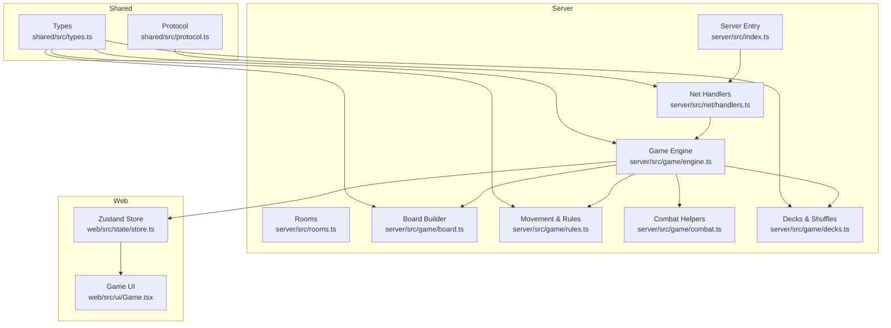
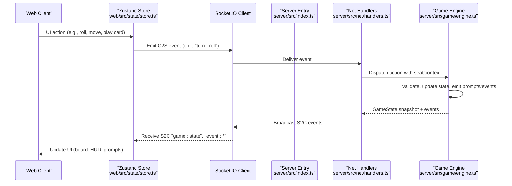
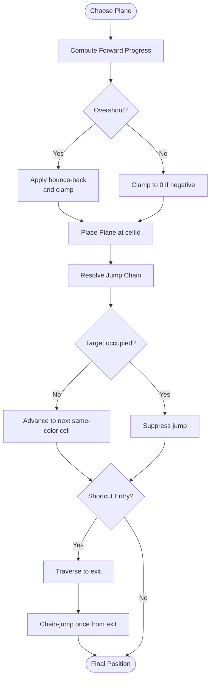
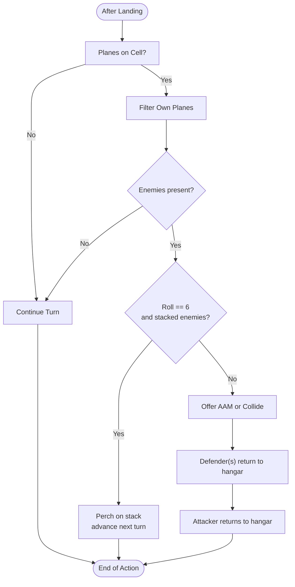
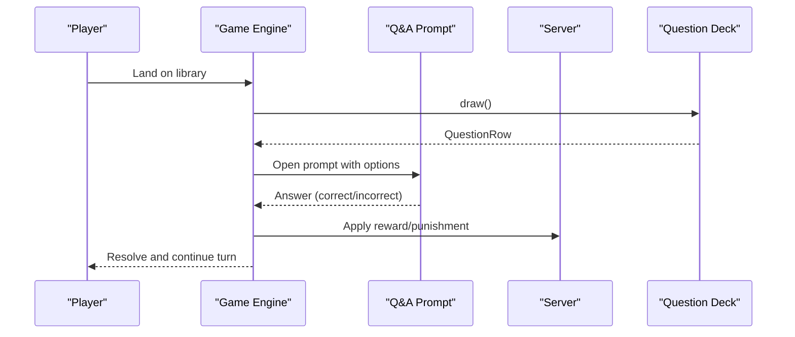
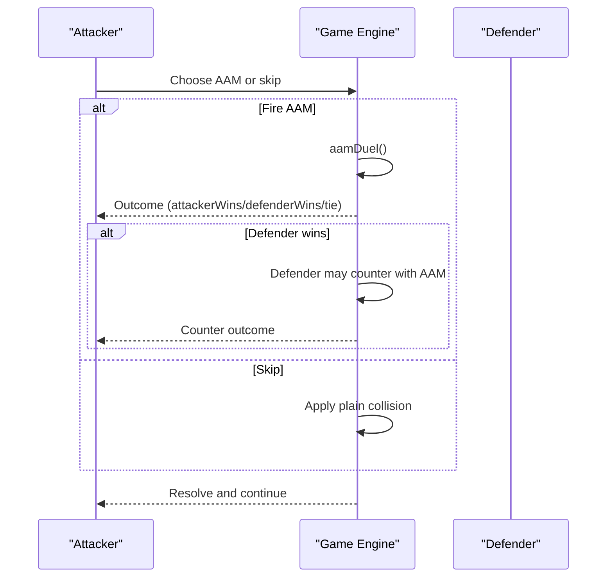
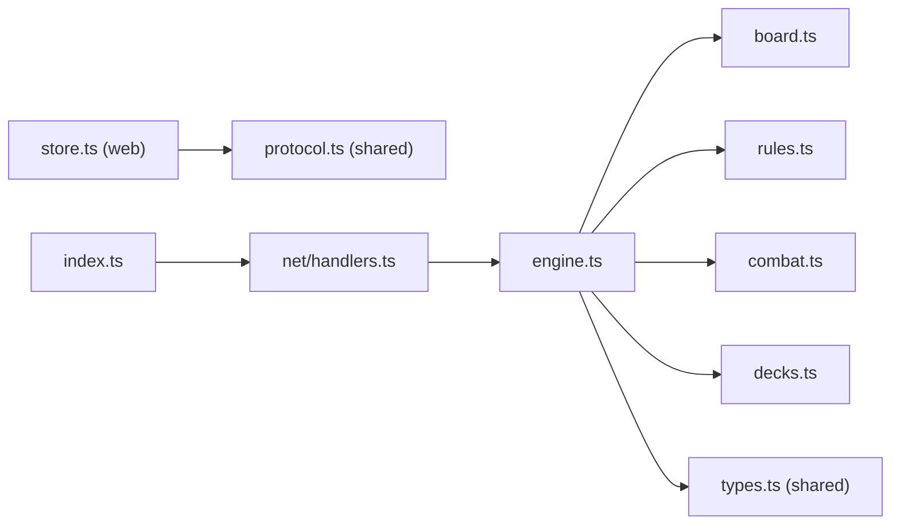

# Game Mechanics

<cite>
**Referenced Files in This Document**
- [README.md](file://README.md)
- [engine.ts](file://server/src/game/engine.ts)
- [board.ts](file://server/src/game/board.ts)
- [rules.ts](file://server/src/game/rules.ts)
- [combat.ts](file://server/src/game/combat.ts)
- [decks.ts](file://server/src/game/decks.ts)
- [types.ts](file://shared/src/types.ts)
- [protocol.ts](file://shared/src/protocol.ts)
- [store.ts](file://web/src/state/store.ts)
- [Game.tsx](file://web/src/ui/Game.tsx)
- [index.ts](file://server/src/index.ts)
- [questions.json](file://data/questions.json)
</cite>

## Table of Contents
1. [Introduction](#introduction)
2. [Project Structure](#project-structure)
3. [Core Components](#core-components)
4. [Architecture Overview](#architecture-overview)
5. [Detailed Component Analysis](#detailed-component-analysis)
6. [Dependency Analysis](#dependency-analysis)
7. [Performance Considerations](#performance-considerations)
8. [Troubleshooting Guide](#troubleshooting-guide)
9. [Conclusion](#conclusion)
10. [Appendices](#appendices)

## Introduction
This document explains the complete gameplay mechanics of 导弹飞行棋 (Air Defense Combat Flying Chess), a multiplayer online board game combining dice-based movement, plane takeoff and landing, collision detection, jump chain traversal, and a layered combat system. It covers:
- Movement and traversal: dice-based progression, same-color jump, shortcut chaining, stacking, and landing rules
- Combat system: AAM (air-to-air missile) duels, SAM (surface-to-air missile) auto-prompt, ARM (anti-radar missile) targeting, and cruise missile attacks
- Special systems: missile factory, radar station, library Q&A challenges, and card-based reward/punishment mechanics
- Strategic probability models and mathematical outcomes for combat resolution
- Victory conditions and turn lifecycle

The authoritative server enforces all rules and broadcasts state snapshots; the web client renders the board, HUD, logs, and prompts.

## Project Structure
The repository is organized into three main workspaces:
- shared: domain types and Socket.IO protocol
- server: authoritative game engine, networking, and room management
- web: React client with Zustand store, UI panels, and Socket.IO client

**Diagram sources**
- [engine.ts:1-920](file://server/src/game/engine.ts#L1-L920)
- [board.ts:1-257](file://server/src/game/board.ts#L1-L257)
- [rules.ts:1-198](file://server/src/game/rules.ts#L1-L198)
- [combat.ts:1-33](file://server/src/game/combat.ts#L1-L33)
- [decks.ts:1-101](file://server/src/game/decks.ts#L1-L101)
- [types.ts:1-186](file://shared/src/types.ts#L1-L186)
- [protocol.ts:1-97](file://shared/src/protocol.ts#L1-L97)
- [store.ts:1-164](file://web/src/state/store.ts#L1-L164)
- [Game.tsx:1-34](file://web/src/ui/Game.tsx#L1-L34)
- [index.ts:1-95](file://server/src/index.ts#L1-L95)

**Section sources**
- [README.md:5-14](file://README.md#L5-L14)
- [protocol.ts:1-97](file://shared/src/protocol.ts#L1-L97)
- [engine.ts:116-148](file://server/src/game/engine.ts#L116-L148)

## Core Components
- Game engine: authoritative state machine controlling turns, movement, collisions, combat prompts, special cells, and victory checks
- Board builder: constructs ring, landing strips, shortcuts, and radar zones per color
- Movement rules: forward/backward stepping, bounce-back, landing detection, and jump/shortcut chain resolution
- Combat helpers: deterministic RNG for d6 outcomes and combat resolution
- Decks: missile, radar, reward, punishment, and question decks with shuffling and draw/discard semantics
- Client store: synchronizes server snapshots, exposes actions, and renders prompts

Key mechanics:
- Dice-based movement with configurable takeoff numbers and chain-triggered extra rolls
- Same-color jump and shortcut chaining with suppression rules
- Collision detection and perching on stacks under specific conditions
- Special-cell interactions: missile factory, radar station, library Q&A
- Card-driven reward/punishment with immediate and held effects
- Auto-SAM detection based on radar count and proximity to enemy planes

**Section sources**
- [engine.ts:206-255](file://server/src/game/engine.ts#L206-L255)
- [engine.ts:274-343](file://server/src/game/engine.ts#L274-L343)
- [engine.ts:345-391](file://server/src/game/engine.ts#L345-L391)
- [engine.ts:530-584](file://server/src/game/engine.ts#L530-L584)
- [engine.ts:720-760](file://server/src/game/engine.ts#L720-L760)
- [engine.ts:810-837](file://server/src/game/engine.ts#L810-L837)
- [engine.ts:882-912](file://server/src/game/engine.ts#L882-L912)
- [board.ts:107-235](file://server/src/game/board.ts#L107-L235)
- [rules.ts:34-69](file://server/src/game/rules.ts#L34-L69)
- [rules.ts:103-183](file://server/src/game/rules.ts#L103-L183)
- [combat.ts:14-32](file://server/src/game/combat.ts#L14-L32)
- [decks.ts:18-37](file://server/src/game/decks.ts#L18-L37)

## Architecture Overview
The server runs an authoritative engine that validates all actions and emits state snapshots. Clients subscribe to updates and send actions via Socket.IO events defined in the shared protocol.

**Diagram sources**
- [protocol.ts:6-21](file://shared/src/protocol.ts#L6-L21)
- [protocol.ts:69-80](file://shared/src/protocol.ts#L69-L80)
- [store.ts:124-141](file://web/src/state/store.ts#L124-L141)
- [index.ts:82-90](file://server/src/index.ts#L82-L90)
- [engine.ts:175-178](file://server/src/game/engine.ts#L175-L178)

## Detailed Component Analysis

### Movement and Traversal
- Dice roll and takeoff eligibility are determined by configured takeoff numbers. Rolling a 6 increments a chain; three consecutive sixes cancel the turn.
- Movement computes forward progress with bounce-back from overshoot. Landing strip and home detection enable per-player landing lanes.
- Jump chain applies same-color jumps and shortcut traversal with suppression when target cells are occupied. Shortcut chaining rules prevent redundant same-color jumps after entry via prior jump.

**Diagram sources**
- [rules.ts:34-69](file://server/src/game/rules.ts#L34-L69)
- [rules.ts:103-183](file://server/src/game/rules.ts#L103-L183)
- [engine.ts:299-343](file://server/src/game/engine.ts#L299-L343)

**Section sources**
- [engine.ts:206-255](file://server/src/game/engine.ts#L206-L255)
- [engine.ts:274-297](file://server/src/game/engine.ts#L274-L297)
- [rules.ts:34-69](file://server/src/game/rules.ts#L34-L69)
- [rules.ts:103-183](file://server/src/game/rules.ts#L103-L183)

### Collision Detection and Stacking
- After landing, the engine detects enemies on the same cell. If a player rolls a 6 while stacking multiple enemy planes, the plane can perch atop the stack and advance next turn.
- Otherwise, collisions return both the attacker and defender(s) to hangars. If the attacker has an AAM, they may opt to launch it instead of colliding.

**Diagram sources**
- [engine.ts:345-391](file://server/src/game/engine.ts#L345-L391)
- [engine.ts:415-498](file://server/src/game/engine.ts#L415-L498)

**Section sources**
- [engine.ts:345-391](file://server/src/game/engine.ts#L345-L391)
- [engine.ts:415-498](file://server/src/game/engine.ts#L415-L498)

### Special Systems

#### Missile Factory
- Landing on the missile factory cell draws a random missile into the player’s hand. The deck is a mixed pool with counts per kind.

**Section sources**
- [engine.ts:537-543](file://server/src/game/engine.ts#L537-L543)
- [decks.ts:52-60](file://server/src/game/decks.ts#L52-L60)

#### Radar Station
- Landing on the radar factory cell grants a radar (up to a cap). The engine tracks radars per player for SAM auto-prompt computation.

**Section sources**
- [engine.ts:544-550](file://server/src/game/engine.ts#L544-L550)
- [board.ts:249-256](file://server/src/game/board.ts#L249-L256)

#### Library Q&A Challenge
- Landing on the library cell triggers a random question from the loaded question deck. Correct answers draw a reward; incorrect answers draw a punishment. The server loads questions from data/questions.json at startup.

**Diagram sources**
- [engine.ts:556-584](file://server/src/game/engine.ts#L556-L584)
- [index.ts:19-38](file://server/src/index.ts#L19-L38)
- [questions.json:1-2](file://data/questions.json#L1-L2)

**Section sources**
- [engine.ts:556-584](file://server/src/game/engine.ts#L556-L584)
- [index.ts:19-38](file://server/src/index.ts#L19-L38)
- [questions.json:1-2](file://data/questions.json#L1-L2)

#### Card-Based Reward/Punishment
- Rewards and punishments are drawn from separate decks. Some effects are immediate (applied during the same trigger), others are held until played (e.g., enemySkip, shield, loseMissile/loseRadar).

**Section sources**
- [engine.ts:586-684](file://server/src/game/engine.ts#L586-L684)
- [decks.ts:68-86](file://server/src/game/decks.ts#L68-L86)

### Combat System

#### AAM Duel
- When a collision occurs and the attacker has an AAM, they may launch it. A single round resolves by rolling d6 for both parties; outcomes are attacker win, defender win, or tie. Defender may counter with their own AAM if available.

**Diagram sources**
- [engine.ts:415-498](file://server/src/game/engine.ts#L415-L498)
- [combat.ts:14-20](file://server/src/game/combat.ts#L14-L20)

**Section sources**
- [engine.ts:415-498](file://server/src/game/engine.ts#L415-L498)
- [combat.ts:14-20](file://server/src/game/combat.ts#L14-L20)

#### SAM Auto-Prompt
- When an enemy plane enters a defender’s radar zone (based on radar count), the defender may launch SAM if they have one. Landing strip immunity prevents SAM activation while on the landing strip.

**Section sources**
- [engine.ts:810-837](file://server/src/game/engine.ts#L810-L837)
- [board.ts:249-256](file://server/src/game/board.ts#L249-L256)

#### ARM Anti-Radar
- ARM requires an enemy target with at least one radar. On successful hit (5/6), the target loses a radar. ARM is played from hand targeting an opponent’s radar.

**Section sources**
- [engine.ts:762-775](file://server/src/game/engine.ts#L762-L775)
- [combat.ts:23-26](file://server/src/game/combat.ts#L23-L26)

#### Cruise Missile Attack
- Cruise targets enemy planes on takeoff or within the landing strip. Automatic hit on takeoff; landing strip requires a roll of 4/5/6. If the defender has a shield, the missile is negated. Otherwise, the target returns to hangar on hit.

**Section sources**
- [engine.ts:777-808](file://server/src/game/engine.ts#L777-L808)
- [combat.ts:29-32](file://server/src/game/combat.ts#L29-L32)

### Mathematical Models and Probabilities

#### AAM Duel Outcomes
- Each participant rolls a fair d6. The outcome probabilities are:
  - Attacker wins: greater than
  - Defender wins: less than
  - Tie: equal
- Exact probability for each outcome can be computed from the 36 equally likely (attacker, defender) pairs.

#### ARM Success Probability
- Success threshold is 5 or 6 on a fair d6.
- Probability of success: 2/6 = 1/3 ≈ 33.33%.

#### Cruise Landing Strip Success
- Success threshold is 4, 5, or 6 on a fair d6.
- Probability of success: 3/6 = 1/2 = 50%.

These models inform strategic decisions: whether to risk a collision, when to spend ARM, and how to position planes for cruise effectiveness.

**Section sources**
- [combat.ts:14-32](file://server/src/game/combat.ts#L14-L32)

### Victory Conditions
- Default: first player to land two planes at home wins.
- Alternative: timed mode where the winner is determined by who has the most planes at home after a configured time limit.

**Section sources**
- [engine.ts:882-912](file://server/src/game/engine.ts#L882-L912)
- [types.ts:119-125](file://shared/src/types.ts#L119-L125)

## Dependency Analysis
The engine composes multiple modules to enforce gameplay deterministically. The board and rules define spatial and positional logic; combat helpers provide RNG-driven outcomes; decks manage card pools; the protocol defines client-server contracts; the store manages UI state and dispatches actions.

**Diagram sources**
- [engine.ts:25-36](file://server/src/game/engine.ts#L25-L36)
- [board.ts:22-25](file://server/src/game/board.ts#L22-L25)
- [rules.ts:3-4](file://server/src/game/rules.ts#L3-L4)
- [combat.ts:5](file://server/src/game/combat.ts#L5)
- [decks.ts:3-7](file://server/src/game/decks.ts#L3-L7)
- [types.ts:1-186](file://shared/src/types.ts#L1-L186)
- [protocol.ts:1-97](file://shared/src/protocol.ts#L1-L97)
- [index.ts:82-90](file://server/src/index.ts#L82-L90)

**Section sources**
- [engine.ts:25-36](file://server/src/game/engine.ts#L25-L36)
- [protocol.ts:1-97](file://shared/src/protocol.ts#L1-L97)

## Performance Considerations
- Authoritative server ensures correctness and prevents cheating; client-side UI remains responsive by rendering server snapshots.
- Decks use in-memory arrays with Fisher-Yates shuffling; deck sizes are modest, minimizing overhead.
- State snapshots are cloned before emission to avoid accidental mutation.
- Short-term logging is capped to reduce memory footprint.

[No sources needed since this section provides general guidance]

## Troubleshooting Guide
Common issues and resolutions:
- Not your turn errors: ensure the local seat matches the current turn and that prompts are cleared after actions.
- Invalid move/cannot takeoff: verify takeoff numbers configuration and that the chosen plane is eligible.
- Card not found or cannot play: confirm the card exists in hand and meets targeting requirements (e.g., ARM needs enemy with radars).
- Q&A not triggering: ensure questions.json is present and readable at server startup; the server logs the number of loaded rows.
- SAM not prompting: confirm the enemy plane entered the defender’s radar zone and that the defender has SAM in hand.

**Section sources**
- [engine.ts:914-918](file://server/src/game/engine.ts#L914-L918)
- [index.ts:19-38](file://server/src/index.ts#L19-L38)
- [engine.ts:810-837](file://server/src/game/engine.ts#L810-L837)
- [engine.ts:762-775](file://server/src/game/engine.ts#L762-L775)

## Conclusion
导导弹飞行棋 blends classic flying-chess movement with modern missile combat mechanics. The authoritative engine enforces deterministic rules for dice, movement, collisions, and combat, while the web client provides a responsive interface for players. Strategic depth emerges from probability-based combat, resource management (missiles, radars, rewards), and positioning for SAM auto-prompt and cruise effectiveness.

[No sources needed since this section summarizes without analyzing specific files]

## Appendices

### Shortcut Traversal Rules
- Shortcut entry from a normal step: traverse to exit and chain-jump once from the exit onto the next same-color cell.
- Shortcut entry reached via prior jump: traverse to exit only, without chaining another jump.

**Section sources**
- [rules.ts:129-149](file://server/src/game/rules.ts#L129-L149)

### Radar Zone Coverage
- Radar count determines how many nearby ring cells form the defender’s zone: 0, 1, 3, 5, or 7 cells.

**Section sources**
- [board.ts:249-256](file://server/src/game/board.ts#L249-L256)

### Client-Server Protocol Highlights
- Events: lobby, room, turn actions, combat responses, Q&A answers, and chat.
- Payloads: typed with Zod for safety.

**Section sources**
- [protocol.ts:6-66](file://shared/src/protocol.ts#L6-L66)
- [protocol.ts:69-97](file://shared/src/protocol.ts#L69-L97)