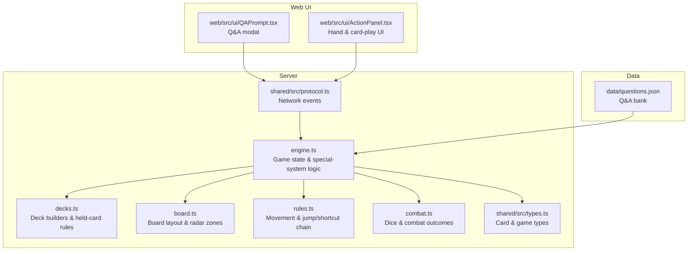
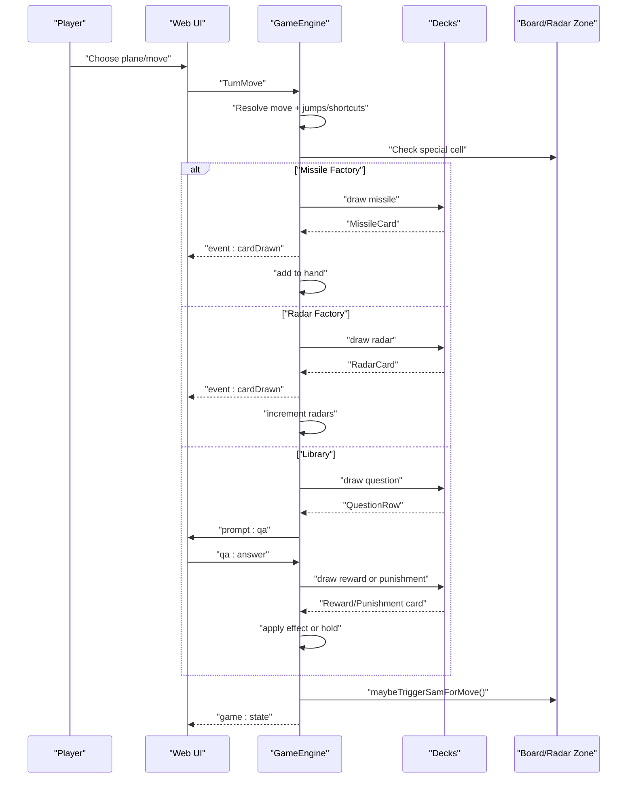
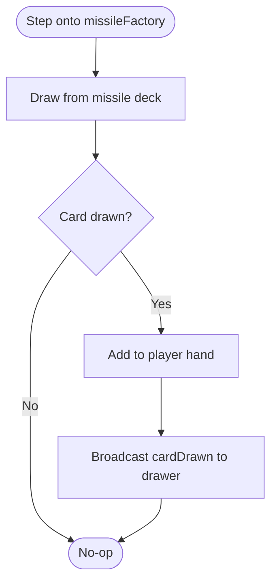
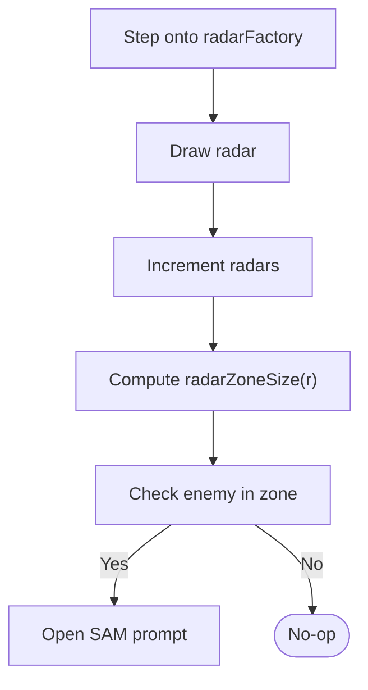
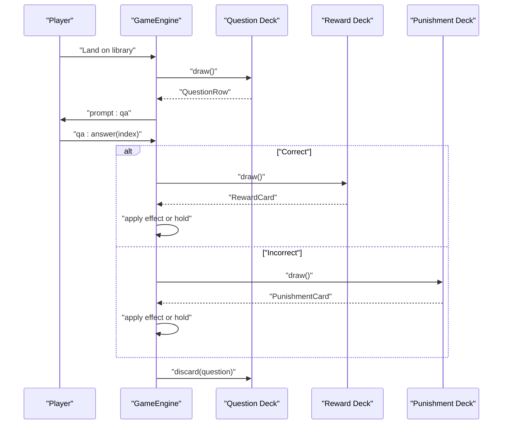
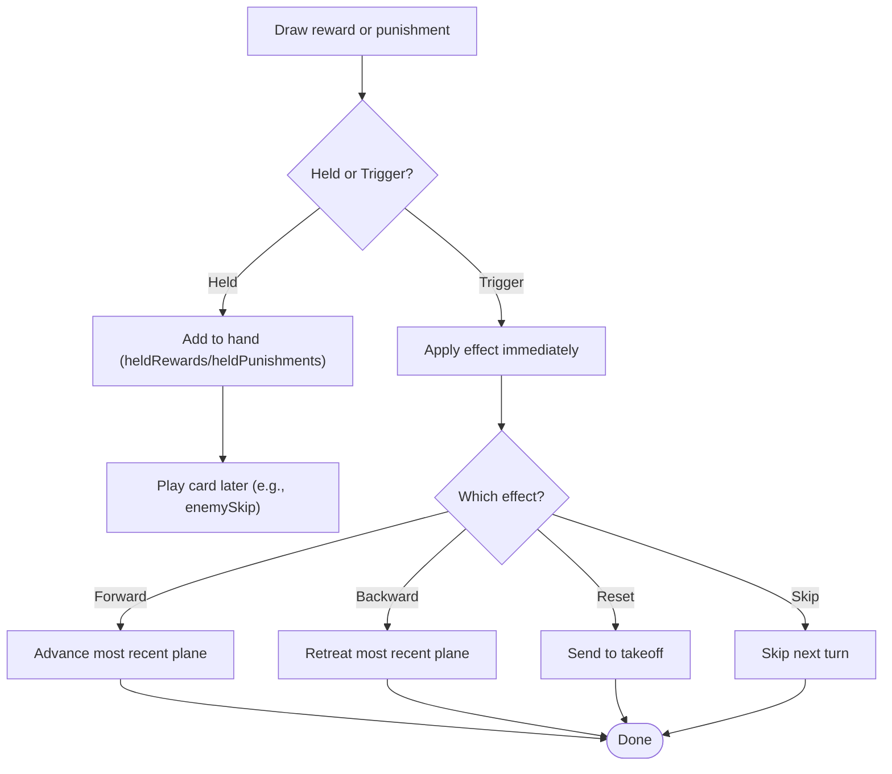
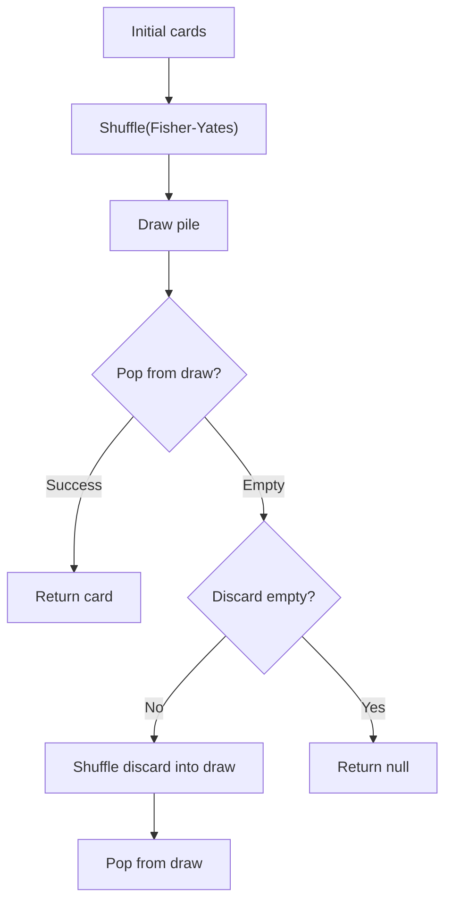
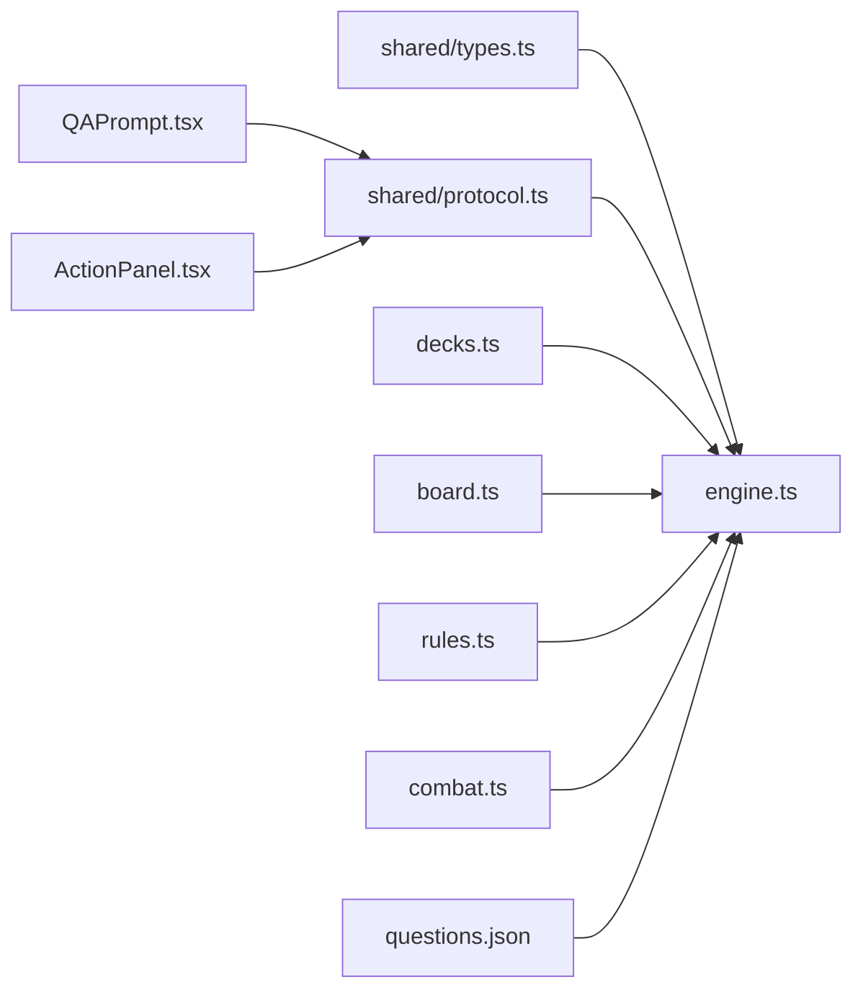

# Special Systems

<cite>
**Referenced Files in This Document**
- [README.md](file://README.md)
- [server/src/game/decks.ts](file://server/src/game/decks.ts)
- [server/src/game/engine.ts](file://server/src/game/engine.ts)
- [server/src/game/board.ts](file://server/src/game/board.ts)
- [server/src/game/rules.ts](file://server/src/game/rules.ts)
- [server/src/game/combat.ts](file://server/src/game/combat.ts)
- [shared/src/types.ts](file://shared/src/types.ts)
- [shared/src/protocol.ts](file://shared/src/protocol.ts)
- [web/src/ui/QAPrompt.tsx](file://web/src/ui/QAPrompt.tsx)
- [web/src/ui/ActionPanel.tsx](file://web/src/ui/ActionPanel.tsx)
- [data/questions.json](file://data/questions.json)
</cite>

## Table of Contents
1. [Introduction](#introduction)
2. [Project Structure](#project-structure)
3. [Core Components](#core-components)
4. [Architecture Overview](#architecture-overview)
5. [Detailed Component Analysis](#detailed-component-analysis)
6. [Dependency Analysis](#dependency-analysis)
7. [Performance Considerations](#performance-considerations)
8. [Troubleshooting Guide](#troubleshooting-guide)
9. [Conclusion](#conclusion)
10. [Appendices](#appendices)

## Introduction
This document explains the special interactive systems in 导弹飞行棋 (Air Defense Combat Flying Chess). It focuses on:
- Missile factory interactions: card drawing mechanics, missile deck management, and strategic resource acquisition
- Radar station operations: radar card effects and their impact on SAM detection
- Library Q&A system: question database integration, educational content mechanics, and reward/punishment card drawing
- Card-based reward and punishment system: immediate effects, held card mechanics, and strategic timing
- Mathematical models for card probabilities, deck management algorithms, and educational integration patterns

These systems are implemented in the authoritative server engine and surfaced to players via the web UI.

## Project Structure
The special systems live primarily in the server’s game engine and shared types. The web UI renders prompts and collects player choices.

**Diagram sources**
- [server/src/game/decks.ts:1-101](file://server/src/game/decks.ts#L1-L101)
- [server/src/game/engine.ts:1-920](file://server/src/game/engine.ts#L1-L920)
- [server/src/game/board.ts:1-297](file://server/src/game/board.ts#L1-L297)
- [server/src/game/rules.ts:1-198](file://server/src/game/rules.ts#L1-L198)
- [server/src/game/combat.ts:1-33](file://server/src/game/combat.ts#L1-L33)
- [shared/src/types.ts:1-186](file://shared/src/types.ts#L1-L186)
- [shared/src/protocol.ts:1-97](file://shared/src/protocol.ts#L1-L97)
- [web/src/ui/QAPrompt.tsx:1-45](file://web/src/ui/QAPrompt.tsx#L1-L45)
- [web/src/ui/ActionPanel.tsx:1-129](file://web/src/ui/ActionPanel.tsx#L1-L129)
- [data/questions.json:1-2](file://data/questions.json#L1-L2)

**Section sources**
- [README.md:1-122](file://README.md#L1-L122)

## Core Components
- Decks and card pools: missile, radar, reward, punishment, and question decks
- Special cells: missile factory, radar factory, and library
- Hand state: missiles, radars, held rewards, held punishments, shield, and skip rounds
- Prompt-driven flows: QA challenges, combat prompts, and card-play prompts

Key responsibilities:
- Decks manage shuffling, drawing, discarding, and deck-count reporting
- Engine orchestrates special-cell triggers, QA outcomes, and card effects
- Board/radar-zone logic determines SAM detection
- UI presents prompts and captures player choices

**Section sources**
- [server/src/game/decks.ts:18-101](file://server/src/game/decks.ts#L18-L101)
- [server/src/game/engine.ts:76-178](file://server/src/game/engine.ts#L76-L178)
- [server/src/game/board.ts:277-297](file://server/src/game/board.ts#L277-L297)
- [shared/src/types.ts:109-186](file://shared/src/types.ts#L109-L186)

## Architecture Overview
The special systems form a closed loop: movement triggers special cells, which prompt the engine to draw cards or ask questions. Outcomes are applied immediately or stored as held cards for later use.

**Diagram sources**
- [server/src/game/engine.ts:299-343](file://server/src/game/engine.ts#L299-L343)
- [server/src/game/engine.ts:531-554](file://server/src/game/engine.ts#L531-L554)
- [server/src/game/engine.ts:556-584](file://server/src/game/engine.ts#L556-L584)
- [server/src/game/engine.ts:586-684](file://server/src/game/engine.ts#L586-L684)
- [server/src/game/board.ts:277-297](file://server/src/game/board.ts#L277-L297)

## Detailed Component Analysis

### Missile Factory Interactions
- Trigger: stepping onto a missile factory cell
- Mechanics:
  - Draw a random missile card from the missile deck
  - Add to player’s hand
  - Broadcast a card-drawn event (private to drawer)
- Deck management:
  - Mixed missile deck with counts per kind
  - Discard pile is used when draw pile is exhausted
- Strategic resource acquisition:
  - Provides AAM/SAM/ARM/Cruise missiles
  - Encourages positioning to pass through factory cells

**Diagram sources**
- [server/src/game/engine.ts:537-543](file://server/src/game/engine.ts#L537-L543)
- [server/src/game/decks.ts:18-37](file://server/src/game/decks.ts#L18-L37)
- [server/src/game/decks.ts:52-60](file://server/src/game/decks.ts#L52-L60)

**Section sources**
- [server/src/game/engine.ts:537-543](file://server/src/game/engine.ts#L537-L543)
- [server/src/game/decks.ts:52-60](file://server/src/game/decks.ts#L52-L60)

### Radar Station Operations and SAM Detection
- Trigger: stepping onto a radar factory cell
- Mechanics:
  - Draw a radar card and increment player’s radar count
  - Broadcast a card-drawn event (private to drawer)
- Impact on SAM detection:
  - Radar zone computed from takeoff cell (up to 7 cells)
  - Active zone size depends on radar count: 0/1/3/5/7 cells
  - SAM auto-prompt when enemy enters or moves inside the zone
- Board layout:
  - Special cells placed at fixed offsets to avoid collisions
  - Jump and shortcut rules apply before SAM checks

**Diagram sources**
- [server/src/game/engine.ts:544-550](file://server/src/game/engine.ts#L544-L550)
- [server/src/game/board.ts:277-297](file://server/src/game/board.ts#L277-L297)
- [server/src/game/engine.ts:337-339](file://server/src/game/engine.ts#L337-L339)

**Section sources**
- [server/src/game/engine.ts:544-550](file://server/src/game/engine.ts#L544-L550)
- [server/src/game/board.ts:277-297](file://server/src/game/board.ts#L277-L297)

### Library Q&A System
- Trigger: stepping onto the library cell
- Mechanics:
  - Draw a question from the question deck
  - Present a prompt with question text and options
  - On answer:
    - Correct answer: draw a reward card
    - Incorrect answer: draw a punishment card
  - Discard the used question
- Educational integration:
  - Questions loaded from data/questions.json at startup
  - Each question has prompt, options, and answer index
- Reward/punishment effects:
  - Immediate effects or held cards depending on kind

**Diagram sources**
- [server/src/game/engine.ts:556-584](file://server/src/game/engine.ts#L556-L584)
- [server/src/game/decks.ts:88-90](file://server/src/game/decks.ts#L88-L90)
- [shared/src/types.ts:180-185](file://shared/src/types.ts#L180-L185)

**Section sources**
- [server/src/game/engine.ts:556-584](file://server/src/game/engine.ts#L556-L584)
- [shared/src/types.ts:180-185](file://shared/src/types.ts#L180-L185)
- [data/questions.json:1-2](file://data/questions.json#L1-L2)

### Card-Based Reward and Punishment System
- Held vs trigger-only:
  - Held rewards: kept in hand until used (e.g., enemySkip, gainMissile, gainRadar, shield)
  - Held punishments: kept in hand until consumed (loseMissile, loseRadar)
  - Trigger-only rewards: applied immediately upon drawing (rerollFwd, fwd2/4/6)
  - Trigger-only punishments: applied immediately (rerollBwd, bwd2/4/6, toTakeoff, selfSkip)
- Immediate effects:
  - rerollFwd: queue extra roll; forward movement applied to the most recent plane
  - fwd2/fwd4/fwd6: advance the most recent plane by N steps
  - rerollBwd: immediately roll d6 and retreat by that amount
  - bwd2/bwd4/bwd6: retreat the most recent plane by N steps
  - toTakeoff: send the most recent plane back to takeoff
  - selfSkip: skip the current player’s next turn
- Strategic timing:
  - Players can play held cards during their turn (e.g., enemySkip)
  - UI exposes card-play prompts and target selection for ARM and Cruise

**Diagram sources**
- [server/src/game/decks.ts:94-100](file://server/src/game/decks.ts#L94-L100)
- [server/src/game/engine.ts:586-684](file://server/src/game/engine.ts#L586-L684)
- [server/src/game/engine.ts:720-760](file://server/src/game/engine.ts#L720-L760)
- [web/src/ui/ActionPanel.tsx:75-95](file://web/src/ui/ActionPanel.tsx#L75-L95)

**Section sources**
- [server/src/game/decks.ts:94-100](file://server/src/game/decks.ts#L94-L100)
- [server/src/game/engine.ts:586-684](file://server/src/game/engine.ts#L586-L684)
- [server/src/game/engine.ts:720-760](file://server/src/game/engine.ts#L720-L760)
- [web/src/ui/ActionPanel.tsx:75-95](file://web/src/ui/ActionPanel.tsx#L75-L95)

### Mathematical Models and Deck Management

#### Deck Construction and Composition
- Missile deck: mixed pool with counts per kind
  - AAM: 20, SAM: 20, ARM: 4, Cruise: 4
- Radar deck: fixed count of radar cards
  - Count: 28
- Reward deck: counts per reward kind
  - rerollFwd: 4, fwd2: 4, fwd4: 4, fwd6: 4
  - gainMissile: 4, gainRadar: 4, enemySkip: 4, shield: 2
- Punishment deck: counts per punishment kind
  - rerollBwd: 4, bwd2: 4, bwd4: 4, bwd6: 4
  - toTakeoff: 2, selfSkip: 4, loseMissile: 4, loseRadar: 4
- Question deck: constructed from data/questions.json rows

**Section sources**
- [server/src/game/decks.ts:47-90](file://server/src/game/decks.ts#L47-L90)
- [data/questions.json:1-2](file://data/questions.json#L1-L2)

#### Shuffling and Drawing Algorithm
- Deck.shuffle: Fisher-Yates shuffle over a copy of initial cards
- Deck.draw:
  - Pop from draw pile if available
  - If draw pile empty and discard pile exists, reshuffle discard into draw and clear discard
  - Return null if both piles empty
- Deck.discard/discardMany: append to discard pile

**Diagram sources**
- [server/src/game/decks.ts:9-37](file://server/src/game/decks.ts#L9-L37)

#### Probability Model Notes
- Card probabilities depend on deck composition and discard usage
- After reshuffle, probability resets to uniform over remaining kinds
- Educational integration:
  - Correct answers lead to reward draws; incorrect answers lead to punishment draws
  - Deck sizes influence long-term expected value of library visits

[No sources needed since this section provides general guidance]

## Dependency Analysis
- Engine depends on:
  - Decks for card pools
  - Board for radar zone computation
  - Rules for movement and jump/shortcut resolution
  - Combat for dice outcomes
- UI depends on:
  - Protocol for event schemas
  - Types for state and prompts

**Diagram sources**
- [shared/src/types.ts:1-186](file://shared/src/types.ts#L1-L186)
- [shared/src/protocol.ts:1-97](file://shared/src/protocol.ts#L1-L97)
- [server/src/game/decks.ts:1-101](file://server/src/game/decks.ts#L1-L101)
- [server/src/game/engine.ts:1-920](file://server/src/game/engine.ts#L1-L920)
- [server/src/game/board.ts:1-297](file://server/src/game/board.ts#L1-L297)
- [server/src/game/rules.ts:1-198](file://server/src/game/rules.ts#L1-L198)
- [server/src/game/combat.ts:1-33](file://server/src/game/combat.ts#L1-L33)
- [web/src/ui/QAPrompt.tsx:1-45](file://web/src/ui/QAPrompt.tsx#L1-L45)
- [web/src/ui/ActionPanel.tsx:1-129](file://web/src/ui/ActionPanel.tsx#L1-L129)
- [data/questions.json:1-2](file://data/questions.json#L1-L2)

**Section sources**
- [server/src/game/engine.ts:25-36](file://server/src/game/engine.ts#L25-L36)

## Performance Considerations
- Deck reshuffle cost: O(n) per discard-to-draw transition; amortized across many draws
- Movement resolution: jump/shortcut chain is linear in path length; bounded by board constants
- Card-draw privacy: minimal overhead; server emits only one event per draw
- UI responsiveness: state snapshots are clonned; avoid heavy computations in render paths

[No sources needed since this section provides general guidance]

## Troubleshooting Guide
Common issues and remedies:
- Library has no questions loaded:
  - Symptom: library cell has no effect
  - Cause: data/questions.json is empty
  - Fix: populate questions.json with QuestionRow entries and restart server
- Deck exhaustion:
  - Symptom: drawing returns null
  - Cause: draw pile empty with no discard
  - Behavior: engine returns null; no-op for that draw
- QA prompt stuck:
  - Symptom: awaiting QA indefinitely
  - Cause: missing answer submission
  - Fix: ensure client submits answer; server auto-resolves on timeout
- SAM prompt not appearing:
  - Symptom: enemy enters zone without SAM
  - Cause: insufficient radars or zone miscomputation
  - Fix: verify radar count and radarZoneSize mapping

**Section sources**
- [server/src/game/engine.ts:556-561](file://server/src/game/engine.ts#L556-L561)
- [server/src/game/decks.ts:27-37](file://server/src/game/decks.ts#L27-L37)
- [server/src/game/board.ts:289-296](file://server/src/game/board.ts#L289-L296)

## Conclusion
The special systems integrate tightly with movement and combat:
- Missile factories and radar stations provide strategic resources
- Library Q&A blends education with gameplay, rewarding correct answers and penalizing mistakes
- The card system balances immediate and delayed effects, encouraging tactical planning
- Robust deck management and deterministic outcomes ensure fair and reproducible gameplay

[No sources needed since this section summarizes without analyzing specific files]

## Appendices

### Card Kinds and Counts
- Rewards: rerollFwd, fwd2, fwd4, fwd6, gainMissile, gainRadar, enemySkip, shield
- Punishments: rerollBwd, bwd2, bwd4, bwd6, toTakeoff, selfSkip, loseMissile, loseRadar
- Missiles: AAM, SAM, ARM, Cruise
- Radars: fixed pool
- Questions: loaded from data file

**Section sources**
- [server/src/game/decks.ts:39-50](file://server/src/game/decks.ts#L39-L50)
- [server/src/game/decks.ts:52-86](file://server/src/game/decks.ts#L52-L86)

### Prompt and Event Schemas
- Client-to-server prompts include QA answers and card plays
- Server-to-client events include game state, dice, card draws, and logs

**Section sources**
- [shared/src/protocol.ts:6-66](file://shared/src/protocol.ts#L6-L66)
- [shared/src/protocol.ts:69-97](file://shared/src/protocol.ts#L69-L97)