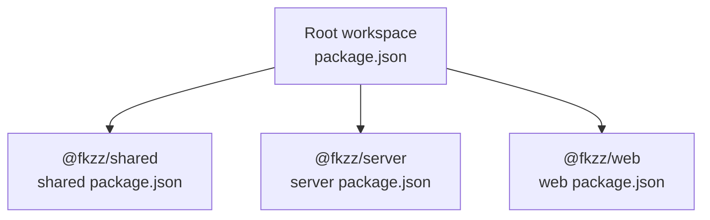

# Getting Started

<cite>
**Referenced Files in This Document**
- [package.json](file://package.json)
- [README.md](file://README.md)
- [server/package.json](file://server/package.json)
- [web/package.json](file://web/package.json)
- [shared/package.json](file://shared/package.json)
- [server/src/index.ts](file://server/src/index.ts)
- [web/vite.config.ts](file://web/vite.config.ts)
- [web/src/net/socket.ts](file://web/src/net/socket.ts)
- [tsconfig.base.json](file://tsconfig.base.json)
- [server/tsconfig.json](file://server/tsconfig.json)
- [web/tsconfig.json](file://web/tsconfig.json)
- [shared/tsconfig.json](file://shared/tsconfig.json)
- [server/src/net/handlers.ts](file://server/src/net/handlers.ts)
- [data/questions.json](file://data/questions.json)
</cite>

## Table of Contents
1. [Introduction](#introduction)
2. [Project Structure](#project-structure)
3. [Prerequisites](#prerequisites)
4. [Installation](#installation)
5. [Development Environment](#development-environment)
6. [Production Deployment](#production-deployment)
7. [Browser Compatibility](#browser-compatibility)
8. [Testing with Multiple Browser Tabs/Windows](#testing-with-multiple-browser-tabswindows)
9. [Verification Checklist](#verification-checklist)
10. [Troubleshooting](#troubleshooting)
11. [Conclusion](#conclusion)

## Introduction
This guide helps you set up and run 导弹飞行棋 (Air Defense Combat Flying Chess), a multiplayer online board game with anti-air, air-to-air, anti-radar, and cruise missile combat. The project uses a monorepo with npm workspaces, a Node.js + Socket.IO server, and a React + Vite web client sharing a TypeScript protocol.

## Project Structure
The repository is organized as a workspace with three packages:
- shared: Shared TypeScript types and protocol definitions
- server: Node.js + Socket.IO authoritative game server
- web: React 18 + Vite client



**Diagram sources**
- [package.json:6](file://package.json#L6)
- [shared/package.json:2](file://shared/package.json#L2)
- [server/package.json:2](file://server/package.json#L2)
- [web/package.json:2](file://web/package.json#L2)

**Section sources**
- [README.md:5-14](file://README.md#L5-L14)
- [package.json:6](file://package.json#L6)

## Prerequisites
- Node.js version ≥ 18 (required for crypto.randomInt and modern Node APIs)
- npm version ≥ 9 (required for workspace support)
- A modern browser for the web client

**Section sources**
- [README.md:16-19](file://README.md#L16-L19)

## Installation
1) Install all workspace dependencies:
```bash
npm install
```

2) Build all packages in the correct order:
```bash
npm run build
```

This command builds shared first, then server, then web, ensuring type-safe cross-package references.

**Section sources**
- [README.md:21-26](file://README.md#L21-L26)
- [package.json:9](file://package.json#L9)

## Development Environment
Run both server and web in development mode concurrently:
```bash
npm run dev
```

This starts:
- Server on port 3001 (watch mode)
- Web on port 5173 (with proxy to server)

Alternatively, run each in separate terminals for better control:
- Terminal 1 (server):
  ```bash
  npm -w @fkzz/server run dev
  ```
- Terminal 2 (web):
  ```bash
  npm -w @fkzz/web run dev
  ```

Open the web client at http://localhost:5173 in multiple browser tabs or windows to test multiplayer.

**Section sources**
- [package.json:8](file://package.json#L8)
- [README.md:28-40](file://README.md#L28-L40)
- [web/vite.config.ts:6-16](file://web/vite.config.ts#L6-L16)
- [server/src/index.ts:14](file://server/src/index.ts#L14)

## Production Deployment
Build all packages:
```bash
npm run build
```

Start the production server:
```bash
npm -w @fkzz/server start
```

The server listens on port 3001 and serves the built web client from the web/dist folder. Open http://localhost:3001 to play.

**Section sources**
- [README.md:42-49](file://README.md#L42-L49)
- [server/src/index.ts:40-80](file://server/src/index.ts#L40-L80)
- [server/package.json:9](file://server/package.json#L9)

## Browser Compatibility
- The web client targets ES2022 with DOM APIs.
- Socket.IO client supports modern browsers and falls back to polling when needed.
- Recommended: latest Chrome, Firefox, Safari, Edge.

**Section sources**
- [tsconfig.base.json:3-14](file://tsconfig.base.json#L3-L14)
- [web/vite.config.ts:6-16](file://web/vite.config.ts#L6-L16)
- [web/src/net/socket.ts:7-10](file://web/src/net/socket.ts#L7-L10)

## Testing with Multiple Browser Tabs/Windows
- Open http://localhost:5173 in two or more browser tabs/windows.
- Create/join rooms and verify seat claiming, readiness, and game start.
- Test interactions like dice rolls, takeoffs, moves, and combat prompts.

**Section sources**
- [README.md:40](file://README.md#L40)

## Verification Checklist
- [ ] Both server and web dev servers start without errors
- [ ] Web client loads at http://localhost:5173
- [ ] Two players can create/join a room and see each other’s seats
- [ ] Takeoff only succeeds on configured numbers (default 6)
- [ ] Rolling 6 grants another roll; three sixes in a row busts
- [ ] Same-color cell triggers a 4-cell jump
- [ ] Shortcut entry warps to shortcut exit; chained jump rule applies
- [ ] Landing on the takeoff cell returns the occupying plane to hangar
- [ ] Stacking on a same-color cell allows the new plane to "perch"
- [ ] Missile factory cell draws a missile into your hand
- [ ] Radar factory cell adds 1 radar (max 3)
- [ ] Library cell triggers Q&A; correct answer rewards, wrong answer punishes
- [ ] AAM duel resolves with counter-attacks
- [ ] SAM auto-prompts when an enemy enters radar zone
- [ ] ARM (5 or 6) destroys one of target's radars
- [ ] Cruise hits a takeoff cell automatically; on landing strip needs 4/5/6
- [ ] Cruise on landing strip pierces immunity
- [ ] Two planes at home ends the game with a winner

**Section sources**
- [README.md:82-100](file://README.md#L82-L100)

## Troubleshooting
Common issues and fixes:

- Port conflicts
  - Problem: Port 3001 or 5173 already in use.
  - Fix: Stop the conflicting process or configure a different port in the server and/or Vite config.

- Missing Q&A bank
  - Symptom: Empty question list in the library cell.
  - Fix: Add questions to data/questions.json in the workspace root following the schema described in the manual.

- Proxy not working in development
  - Symptom: WebSocket or API requests fail from the web client.
  - Fix: Ensure the Vite proxy configuration targets http://localhost:3001 and that the server is running.

- Build errors across packages
  - Symptom: Type errors referencing shared protocol.
  - Fix: Run a clean build of shared first, then server, then web.

- Socket connection issues
  - Symptom: Cannot connect to the server from the web client.
  - Fix: Verify the client connects to http://localhost:3001 in development mode and uses the current origin in production.

**Section sources**
- [web/vite.config.ts:8-14](file://web/vite.config.ts#L8-L14)
- [server/src/index.ts:18-38](file://server/src/index.ts#L18-L38)
- [README.md:60-81](file://README.md#L60-L81)
- [web/src/net/socket.ts:7-10](file://web/src/net/socket.ts#L7-L10)

## Conclusion
You now have a complete setup for developing and running 导弹飞行棋 locally. Use the provided scripts to start both server and web in development, verify functionality with the checklist, and deploy to production by building and starting the server.