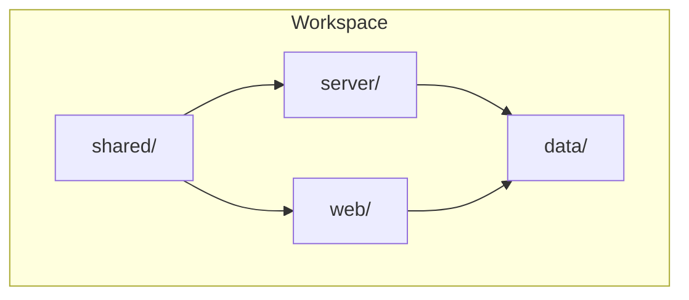
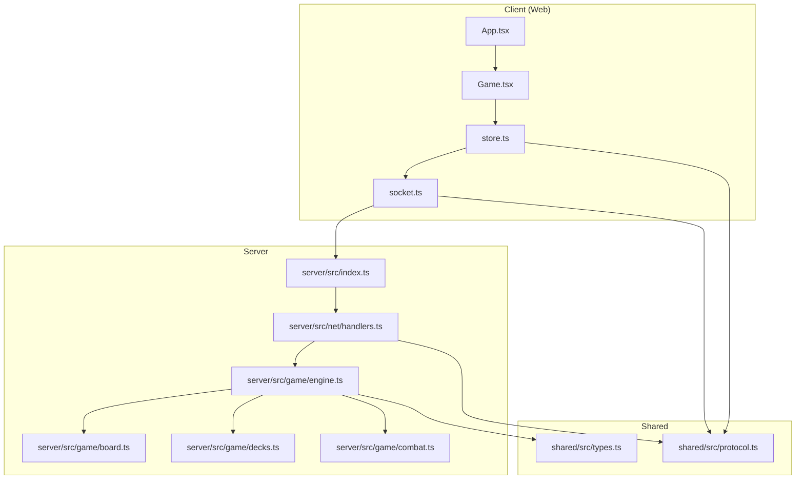
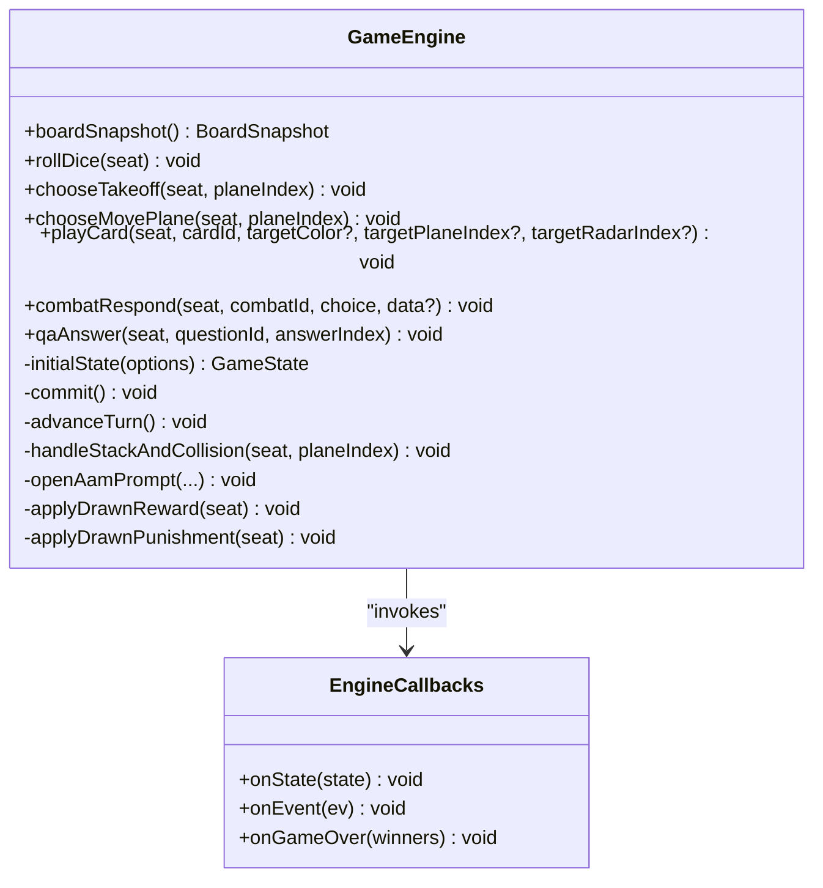
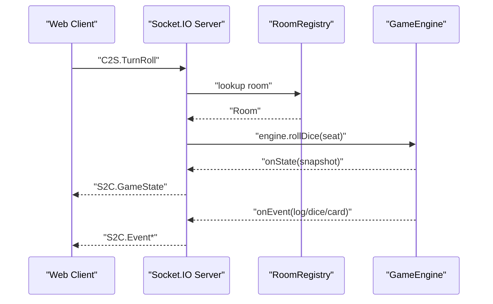
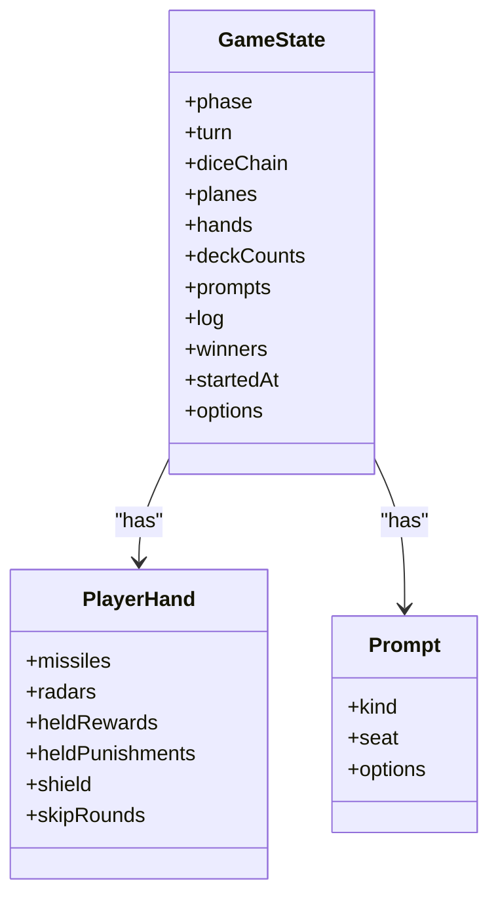
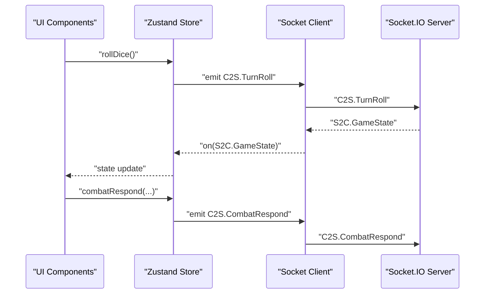
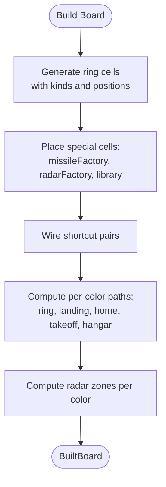
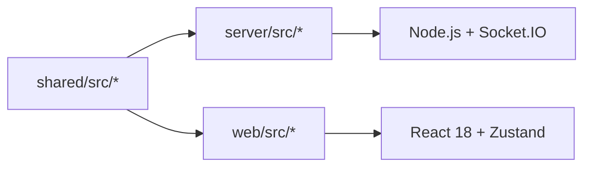

# Project Overview

<cite>
**Referenced Files in This Document**
- [README.md](file://README.md)
- [package.json](file://package.json)
- [server/src/index.ts](file://server/src/index.ts)
- [server/src/net/handlers.ts](file://server/src/net/handlers.ts)
- [server/src/game/engine.ts](file://server/src/game/engine.ts)
- [server/src/game/combat.ts](file://server/src/game/combat.ts)
- [server/src/game/board.ts](file://server/src/game/board.ts)
- [server/src/game/decks.ts](file://server/src/game/decks.ts)
- [shared/src/types.ts](file://shared/src/types.ts)
- [shared/src/protocol.ts](file://shared/src/protocol.ts)
- [web/src/App.tsx](file://web/src/App.tsx)
- [web/src/ui/Game.tsx](file://web/src/ui/Game.tsx)
- [web/src/state/store.ts](file://web/src/state/store.ts)
- [web/src/net/socket.ts](file://web/src/net/socket.ts)
</cite>

## Table of Contents
1. [Introduction](#introduction)
2. [Project Structure](#project-structure)
3. [Core Components](#core-components)
4. [Architecture Overview](#architecture-overview)
5. [Detailed Component Analysis](#detailed-component-analysis)
6. [Dependency Analysis](#dependency-analysis)
7. [Performance Considerations](#performance-considerations)
8. [Troubleshooting Guide](#troubleshooting-guide)
9. [Conclusion](#conclusion)

## Introduction
This project is a multiplayer online flying chess game with a military theme, featuring anti-air combat, air-to-air missile duels, anti-radar systems, and cruise missile attacks. It blends classic board-game mechanics with modern real-time networking to deliver a strategic, interactive experience for 2–4 players. The game emphasizes authoritative server logic, transparent multiplayer state synchronization, and a clean separation of concerns across shared types, server, and web client.

Key value propositions:
- Authoritative gameplay ensures fairness and prevents cheating by centralizing move validation and state transitions.
- Rich military-themed mechanics (AAM duels, SAM auto-triggers, ARM anti-radar, cruise missile targeting) add depth and tactical variety.
- Real-time multiplayer with persistent rooms, turn-based prompts, and live chat.
- Extensible Q&A integration for educational or trivia-driven gameplay.

Target audience:
- Strategy and board-game enthusiasts who enjoy tactical depth and competitive multiplayer.
- Educators and trainers who want to gamify learning with integrated Q&A challenges.
- Developers interested in a modern, modular TypeScript/React/Socket.IO architecture with shared protocols.

## Project Structure
The repository follows a workspace-based monorepo layout with three packages:
- shared: Shared domain types and the Socket.IO protocol schema.
- server: Authoritative game engine, room management, and Socket.IO server.
- web: React 18 client with Zustand state management, UI components, and Socket.IO client.

**Diagram sources**
- [package.json:1-17](file://package.json#L1-L17)
- [README.md:5-14](file://README.md#L5-L14)

**Section sources**
- [README.md:5-14](file://README.md#L5-L14)
- [package.json:1-17](file://package.json#L1-L17)

## Core Components
- Authoritative Game Engine: Implements turn-based state machine, move validation, combat resolution, and special-cell effects. It emits snapshots and events to the network layer.
- Socket.IO Server: Handles connections, room orchestration, and routes client messages to the engine. It enforces payload validation and broadcasts state updates.
- Shared Protocol: Defines typed C2S/S2C events, payloads, and Zod schemas for runtime validation.
- React Web Client: Renders lobby, room, and game screens; manages local state with Zustand; connects via Socket.IO client.
- Q&A Integration: Loads question banks at startup and triggers interactive prompts during gameplay.

Practical examples:
- Anti-air combat: A collision with an enemy plane triggers an AAM duel prompt; the attacker may spend an AAM to fight, with optional defender counter-attacks.
- Anti-radar system: ARM missiles can destroy one of an opponent’s radars when targeting their radar inventory.
- Cruise missile: Can auto-hit a takeoff cell or require a 4/5/6 roll to hit a landing strip; pierces immunity if shielded.
- Library cell: Triggers a Q&A challenge; correct answers grant rewards, incorrect ones incur punishments.

**Section sources**
- [server/src/game/engine.ts:116-178](file://server/src/game/engine.ts#L116-L178)
- [server/src/net/handlers.ts:15-176](file://server/src/net/handlers.ts#L15-L176)
- [shared/src/protocol.ts:4-97](file://shared/src/protocol.ts#L4-L97)
- [web/src/state/store.ts:60-164](file://web/src/state/store.ts#L60-L164)
- [README.md:51-99](file://README.md#L51-L99)

## Architecture Overview
The system uses an authoritative server model: clients submit actions, the server validates and executes them, and then broadcasts snapshots and events to all clients. The shared protocol defines the contract for all interactions.

**Diagram sources**
- [web/src/App.tsx:1-19](file://web/src/App.tsx#L1-L19)
- [web/src/ui/Game.tsx:1-34](file://web/src/ui/Game.tsx#L1-L34)
- [web/src/state/store.ts:60-164](file://web/src/state/store.ts#L60-L164)
- [web/src/net/socket.ts:1-11](file://web/src/net/socket.ts#L1-L11)
- [server/src/index.ts:1-95](file://server/src/index.ts#L1-L95)
- [server/src/net/handlers.ts:15-176](file://server/src/net/handlers.ts#L15-L176)
- [server/src/game/engine.ts:76-114](file://server/src/game/engine.ts#L76-L114)
- [server/src/game/board.ts:107-235](file://server/src/game/board.ts#L107-L235)
- [server/src/game/decks.ts:18-101](file://server/src/game/decks.ts#L18-L101)
- [server/src/game/combat.ts:1-33](file://server/src/game/combat.ts#L1-L33)
- [shared/src/types.ts:1-186](file://shared/src/types.ts#L1-L186)
- [shared/src/protocol.ts:1-97](file://shared/src/protocol.ts#L1-L97)

## Detailed Component Analysis

### Authoritative Game Engine
The engine is a turn-based state machine that:
- Initializes state, hands, and deck counts.
- Validates dice rolls, takeoff conditions, and move legality.
- Resolves collisions, same-color jumps, shortcuts, and special cells.
- Manages combat prompts (AAM, SAM, ARM, cruise) and Q&A prompts.
- Applies reward/punishment cards and tracks logs.

**Diagram sources**
- [server/src/game/engine.ts:76-114](file://server/src/game/engine.ts#L76-L114)
- [server/src/game/engine.ts:116-178](file://server/src/game/engine.ts#L116-L178)

**Section sources**
- [server/src/game/engine.ts:116-178](file://server/src/game/engine.ts#L116-L178)
- [server/src/game/engine.ts:206-255](file://server/src/game/engine.ts#L206-L255)
- [server/src/game/engine.ts:274-343](file://server/src/game/engine.ts#L274-L343)
- [server/src/game/engine.ts:415-528](file://server/src/game/engine.ts#L415-L528)
- [server/src/game/engine.ts:530-584](file://server/src/game/engine.ts#L530-L584)
- [server/src/game/engine.ts:720-760](file://server/src/game/engine.ts#L720-L760)
- [server/src/game/engine.ts:777-809](file://server/src/game/engine.ts#L777-L809)

### Socket.IO Server and Handlers
The server:
- Creates an HTTP server and serves the built web client in production.
- Initializes Socket.IO, binds event handlers, and loads the Q&A bank.
- Routes client actions to the engine and broadcasts state snapshots and events.

**Diagram sources**
- [server/src/net/handlers.ts:91-96](file://server/src/net/handlers.ts#L91-L96)
- [server/src/net/handlers.ts:198-225](file://server/src/net/handlers.ts#L198-L225)
- [server/src/game/engine.ts:175-178](file://server/src/game/engine.ts#L175-L178)

**Section sources**
- [server/src/index.ts:14-95](file://server/src/index.ts#L14-L95)
- [server/src/net/handlers.ts:15-176](file://server/src/net/handlers.ts#L15-L176)
- [server/src/net/handlers.ts:198-225](file://server/src/net/handlers.ts#L198-L225)

### Shared Types and Protocol
Shared definitions include:
- Domain types for board cells, planes, hands, game state, and prompts.
- Card kinds (missile, radar, reward, punishment) and their effects.
- Game options (takeoff numbers, turn timeout, victory conditions).
- Socket.IO event names and Zod schemas for payload validation.

**Diagram sources**
- [shared/src/types.ts:153-166](file://shared/src/types.ts#L153-L166)
- [shared/src/types.ts:109-117](file://shared/src/types.ts#L109-L117)
- [shared/src/types.ts:140-146](file://shared/src/types.ts#L140-L146)

**Section sources**
- [shared/src/types.ts:1-186](file://shared/src/types.ts#L1-L186)
- [shared/src/protocol.ts:1-97](file://shared/src/protocol.ts#L1-L97)

### Web Client: Store, Screens, and Networking
The client:
- Maintains a Zustand store reflecting server snapshots and UI state.
- Navigates between lobby, room, and game screens.
- Emits actions via Socket.IO and renders prompts and UI panels.

**Diagram sources**
- [web/src/state/store.ts:124-141](file://web/src/state/store.ts#L124-L141)
- [web/src/net/socket.ts:5-10](file://web/src/net/socket.ts#L5-L10)
- [server/src/net/handlers.ts:126-133](file://server/src/net/handlers.ts#L126-L133)

**Section sources**
- [web/src/App.tsx:1-19](file://web/src/App.tsx#L1-L19)
- [web/src/ui/Game.tsx:10-33](file://web/src/ui/Game.tsx#L10-L33)
- [web/src/state/store.ts:60-164](file://web/src/state/store.ts#L60-L164)
- [web/src/net/socket.ts:1-11](file://web/src/net/socket.ts#L1-L11)

### Board Construction and Radar Zones
The board is constructed with:
- A 52-cell ring per color, same-color jump cells, shortcuts, and special cells.
- Landing strips and home centers per color.
- Precomputed radar zones sized by radar count.

**Diagram sources**
- [server/src/game/board.ts:107-235](file://server/src/game/board.ts#L107-L235)
- [server/src/game/board.ts:241-257](file://server/src/game/board.ts#L241-L257)

**Section sources**
- [server/src/game/board.ts:107-235](file://server/src/game/board.ts#L107-L235)
- [server/src/game/board.ts:241-257](file://server/src/game/board.ts#L241-L257)

### Deck Management and Randomness
Decks:
- Construct missile, radar, reward, punishment, and question decks with predefined counts.
- Shuffle and manage draw/discard piles; enforce privacy for card draws.

Randomness:
- Server-side crypto-based randomization for deterministic yet unpredictable outcomes.

**Section sources**
- [server/src/game/decks.ts:18-101](file://server/src/game/decks.ts#L18-L101)
- [server/src/game/combat.ts:7-32](file://server/src/game/combat.ts#L7-L32)
- [README.md:109](file://README.md#L109)

## Dependency Analysis
High-level dependencies:
- shared depends on TypeScript and Zod for type-safe protocol definitions.
- server depends on Socket.IO, nanoid, and Node.js APIs; uses shared types and protocol.
- web depends on React 18, Zustand, socket.io-client, and shared protocol.

**Diagram sources**
- [shared/src/types.ts:1-186](file://shared/src/types.ts#L1-L186)
- [shared/src/protocol.ts:1-97](file://shared/src/protocol.ts#L1-L97)
- [server/src/index.ts:1-95](file://server/src/index.ts#L1-L95)
- [web/src/net/socket.ts:1-11](file://web/src/net/socket.ts#L1-L11)

**Section sources**
- [shared/src/types.ts:1-186](file://shared/src/types.ts#L1-L186)
- [shared/src/protocol.ts:1-97](file://shared/src/protocol.ts#L1-L97)
- [server/src/index.ts:1-95](file://server/src/index.ts#L1-L95)
- [web/src/net/socket.ts:1-11](file://web/src/net/socket.ts#L1-L11)

## Performance Considerations
- Authoritative server reduces client-side computation and network chatter by broadcasting snapshots and minimal event updates.
- Client-side state cloning uses structuredClone for deep copies; keep snapshots concise to minimize bandwidth.
- Deck shuffling and card privacy reduce redundant broadcasts; only the drawer sees concrete card details.
- Production mode serves static assets directly from the server to avoid unnecessary overhead.

[No sources needed since this section provides general guidance]

## Troubleshooting Guide
Common issues and checks:
- Room creation/join: Verify two players are ready and the host starts the game.
- Takeoff rules: Only configured takeoff numbers allow planes to take off; three consecutive sixes cancel the turn.
- Movement and stacking: Same-color jumps and shortcuts apply; stacking on same-color cells enables “perch” advancement on a 6.
- Special cells: Missile factory draws missiles; radar factory adds radars; library triggers Q&A with correct/wrong outcomes.
- Combat mechanics: AAM duels resolve with d6 outcomes; SAM auto-prompts when enemies enter radar zones; ARM destroys radars on 5/6; cruise hits takeoff automatically or requires 4/5/6 on landing strips.
- Multiplayer: Ensure both clients connect to the same server port and that the web client proxies /socket.io to the server.

**Section sources**
- [README.md:82-99](file://README.md#L82-L99)
- [server/src/game/engine.ts:206-255](file://server/src/game/engine.ts#L206-L255)
- [server/src/game/engine.ts:274-343](file://server/src/game/engine.ts#L274-L343)
- [server/src/game/engine.ts:415-528](file://server/src/game/engine.ts#L415-L528)
- [server/src/game/engine.ts:530-584](file://server/src/game/engine.ts#L530-L584)
- [server/src/game/engine.ts:777-809](file://server/src/game/engine.ts#L777-L809)

## Conclusion
The 导弹飞行棋 project delivers a robust, multiplayer flying chess experience with rich military-themed mechanics. Its authoritative server architecture, shared protocol, and modular client-server design provide a scalable foundation for future enhancements. The combination of strategic movement, combat resolution, and Q&A integration offers both entertainment and educational value, while the clear separation of concerns makes it approachable for both beginners and experienced developers.

[No sources needed since this section summarizes without analyzing specific files]