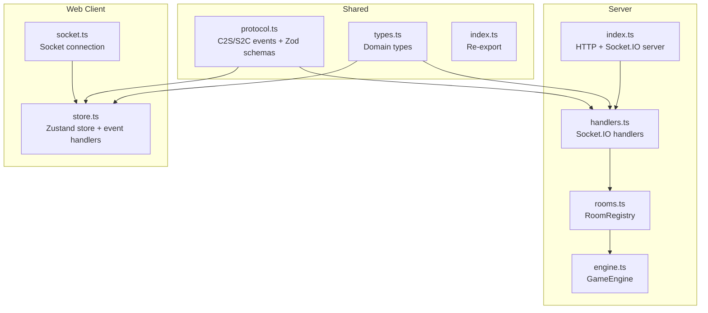
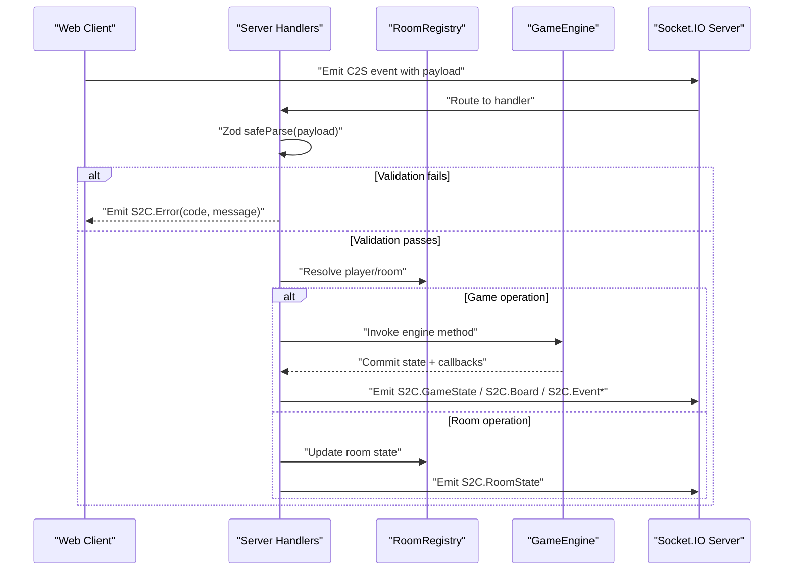
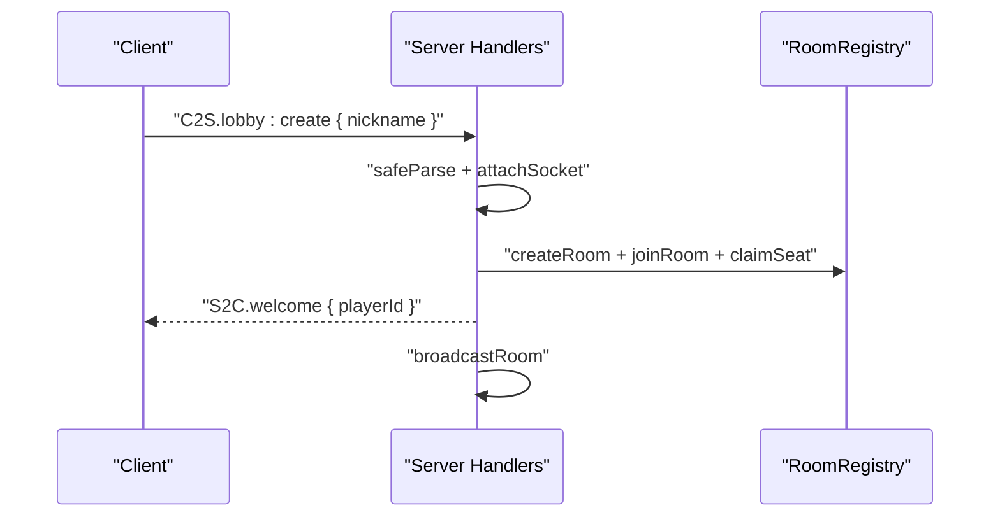
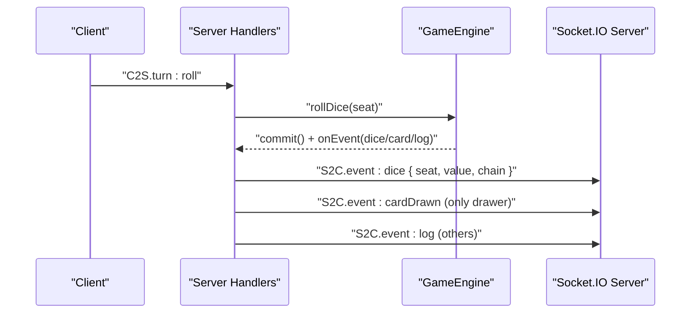
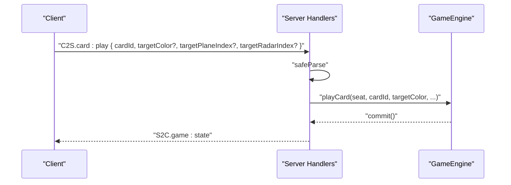
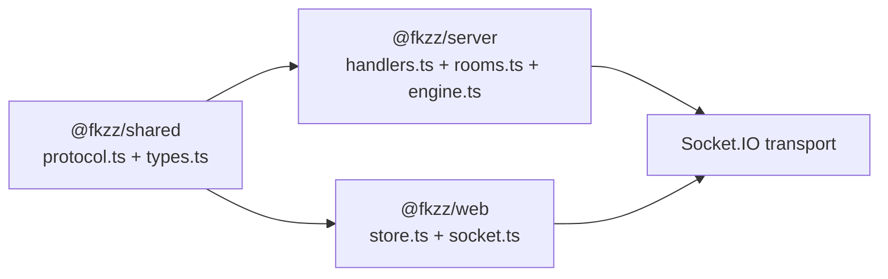

# Shared Protocol

<cite>
**Referenced Files in This Document**
- [protocol.ts](file://shared/src/protocol.ts)
- [types.ts](file://shared/src/types.ts)
- [index.ts](file://shared/src/index.ts)
- [handlers.ts](file://server/src/net/handlers.ts)
- [rooms.ts](file://server/src/rooms.ts)
- [engine.ts](file://server/src/game/engine.ts)
- [socket.ts](file://web/src/net/socket.ts)
- [store.ts](file://web/src/state/store.ts)
- [index.ts](file://server/src/index.ts)
- [package.json](file://shared/package.json)
- [package.json](file://package.json)
- [README.md](file://README.md)
</cite>

## Table of Contents
1. [Introduction](#introduction)
2. [Project Structure](#project-structure)
3. [Core Components](#core-components)
4. [Architecture Overview](#architecture-overview)
5. [Detailed Component Analysis](#detailed-component-analysis)
6. [Dependency Analysis](#dependency-analysis)
7. [Performance Considerations](#performance-considerations)
8. [Troubleshooting Guide](#troubleshooting-guide)
9. [Conclusion](#conclusion)
10. [Appendices](#appendices)

## Introduction
This document describes the shared protocol for the 导弹飞行棋 cross-platform communication layer. It defines Socket.IO event names, payload schemas, and type-safe patterns powered by Zod. It explains event routing, server-side validation, error handling, and the shared TypeScript types that enable compile-time safety across client and server. It also covers protocol evolution, backward compatibility, versioning strategies, security considerations, rate limiting, and optimization techniques.

## Project Structure
The protocol is defined centrally in the shared package and consumed by both server and client.

**Diagram sources**
- [protocol.ts:1-97](file://shared/src/protocol.ts#L1-L97)
- [types.ts:1-186](file://shared/src/types.ts#L1-L186)
- [handlers.ts:1-230](file://server/src/net/handlers.ts#L1-L230)
- [rooms.ts:1-211](file://server/src/rooms.ts#L1-L211)
- [engine.ts:1-920](file://server/src/game/engine.ts#L1-L920)
- [index.ts:1-95](file://server/src/index.ts#L1-L95)
- [socket.ts:1-11](file://web/src/net/socket.ts#L1-L11)
- [store.ts:1-164](file://web/src/state/store.ts#L1-L164)

**Section sources**
- [README.md:1-122](file://README.md#L1-L122)
- [package.json:1-17](file://package.json#L1-L17)

## Core Components
- Shared protocol definitions and Zod schemas for client-to-server and server-to-client events.
- Server-side handlers that parse payloads with Zod, enforce authorization and game-phase rules, and emit typed events.
- Client-side store that subscribes to server events and emits typed client actions.

Key responsibilities:
- Event names and payloads are defined in shared/src/protocol.ts.
- Types are defined in shared/src/types.ts and re-exported via shared/src/index.ts.
- Server routes C2S events to engine operations and emits S2C events.
- Client consumes S2C events and sends C2S events.

**Section sources**
- [protocol.ts:1-97](file://shared/src/protocol.ts#L1-L97)
- [types.ts:1-186](file://shared/src/types.ts#L1-L186)
- [handlers.ts:1-230](file://server/src/net/handlers.ts#L1-L230)
- [store.ts:1-164](file://web/src/state/store.ts#L1-L164)

## Architecture Overview
The protocol is a strict, bidirectional Socket.IO contract with Zod-based runtime validation on the server and typed consumption on the client.

**Diagram sources**
- [handlers.ts:15-230](file://server/src/net/handlers.ts#L15-L230)
- [rooms.ts:39-211](file://server/src/rooms.ts#L39-L211)
- [engine.ts:63-74](file://server/src/game/engine.ts#L63-L74)
- [store.ts:60-164](file://web/src/state/store.ts#L60-L164)

## Detailed Component Analysis

### Event Definitions and Payload Schemas
- Client-to-server (C2S) event names and Zod schemas are defined in shared/src/protocol.ts.
- Server-to-client (S2C) event names and payload interfaces are defined in shared/src/protocol.ts.
- The shared index re-exports both types and protocol definitions.

Examples of event categories:
- Lobby and room: lobby:create, lobby:join, room:leave, room:claimSeat, room:ready, room:setOptions, room:start.
- Turn actions: turn:roll, turn:chooseTakeoff, turn:choosePlane.
- Card play and combat: card:play, combat:respond.
- Q&A: qa:answer.
- Chat: chat:say.

Validation patterns:
- Each C2S event has a corresponding Zod object schema.
- Handlers call safeParse on incoming payloads and return S2C.Error on failure.

**Section sources**
- [protocol.ts:4-21](file://shared/src/protocol.ts#L4-L21)
- [protocol.ts:25-65](file://shared/src/protocol.ts#L25-L65)
- [protocol.ts:67-82](file://shared/src/protocol.ts#L67-L82)
- [protocol.ts:84-97](file://shared/src/protocol.ts#L84-L97)
- [index.ts:1-3](file://shared/src/index.ts#L1-L3)

### Server-Side Handler Routing and Validation
- Handlers subscribe to C2S events and validate payloads with Zod.
- Authorization checks ensure the socket corresponds to a known player and room.
- Game operations are delegated to GameEngine; room operations update RoomRegistry.
- Engine callbacks emit GameState snapshots and event-specific notices.

Key handler behaviors:
- Welcome emission on initial connection.
- Room creation/joining with seat claiming and readiness toggles.
- Starting the game and broadcasting initial board snapshot.
- Turn lifecycle: roll, takeoff, move, card play, combat response, Q&A answer.
- Broadcast of room state and per-room chat messages.

**Section sources**
- [handlers.ts:15-230](file://server/src/net/handlers.ts#L15-L230)
- [rooms.ts:39-211](file://server/src/rooms.ts#L39-L211)
- [engine.ts:63-74](file://server/src/game/engine.ts#L63-L74)

### Client-Side Consumption and Type Safety
- The client connects via socket.io-client and stores the socket instance.
- Zustand store subscribes to S2C events and updates local state.
- Client emits C2S events typed by shared protocol definitions.

Client responsibilities:
- Subscribe to S2C events (Welcome, RoomState, GameState, Board, Event*, Chat, Error).
- Emit C2S events for lobby, room, turn, card play, combat, Q&A, and chat.

**Section sources**
- [socket.ts:1-11](file://web/src/net/socket.ts#L1-L11)
- [store.ts:60-164](file://web/src/state/store.ts#L60-L164)

### Domain Types and State Models
Shared domain types define the game state, board, planes, cards, and prompts. These types are used by both server and client to maintain consistency.

Important types:
- Colors, CellKind, Cell, BoardPath, BoardSnapshot.
- Cards: MissileCard, RadarCard, RewardCard, PunishmentCard, AnyCard.
- Plane, PlayerPublic, PlayerHand, GameOptions, DiceRoll, Phase, Prompt, DeckCounts, GameState, RoomPublic, QuestionRow.

These types are re-exported via shared/src/index.ts for convenient imports.

**Section sources**
- [types.ts:1-186](file://shared/src/types.ts#L1-L186)
- [index.ts:1-3](file://shared/src/index.ts#L1-L3)

### Zod-Based Runtime Validation System
- Each C2S event has a dedicated Zod schema validating shape, min/max lengths, enums, and optional fields.
- Handlers call safeParse and return S2C.Error with code and message on failure.
- Validation ensures robustness against malformed or malicious payloads.

Validation coverage examples:
- String length limits for nicknames and messages.
- Enum constraints for colors and card kinds.
- Numeric bounds for arrays and timeouts.
- Optional fields for targeted card plays and combat responses.

**Section sources**
- [protocol.ts:25-65](file://shared/src/protocol.ts#L25-L65)
- [handlers.ts:19-230](file://server/src/net/handlers.ts#L19-L230)

### Event Routing Mechanisms
- Server routes C2S events to specific handlers based on event names.
- Handlers resolve the player and room, then delegate to RoomRegistry or GameEngine.
- Engine callbacks emit S2C events for state, events, and logs.
- RoomRegistry broadcasts RoomState to the room.

Routing highlights:
- withGame helper ensures the socket is part of an active game.
- makeCallbacks maps engine events to S2C notifications.
- broadcastRoom emits RoomState to the room.

**Section sources**
- [handlers.ts:15-230](file://server/src/net/handlers.ts#L15-L230)
- [rooms.ts:39-211](file://server/src/rooms.ts#L39-L211)
- [engine.ts:63-74](file://server/src/game/engine.ts#L63-L74)

### Error Handling Strategies
- On invalid payloads, handlers emit S2C.Error with a machine-readable code and human-readable message.
- Common error codes include BAD_PAYLOAD, NO_PLAYER, NO_ROOM, CANT_START, and engine-specific errors surfaced via err helpers.
- Clients display lastError and can retry or adjust actions.

**Section sources**
- [handlers.ts:227-230](file://server/src/net/handlers.ts#L227-L230)
- [engine.ts:207-255](file://server/src/game/engine.ts#L207-L255)
- [store.ts:87-87](file://web/src/state/store.ts#L87-L87)

### Practical Examples

#### Example: Room Creation and Seat Claiming
- Client emits lobby:create with nickname.
- Server validates payload, attaches socket to player, creates room, claims red seat, welcomes player, and broadcasts room state.

**Diagram sources**
- [handlers.ts:19-29](file://server/src/net/handlers.ts#L19-L29)
- [rooms.ts:78-121](file://server/src/rooms.ts#L78-L121)

**Section sources**
- [handlers.ts:19-29](file://server/src/net/handlers.ts#L19-L29)
- [rooms.ts:78-121](file://server/src/rooms.ts#L78-L121)

#### Example: Turn Lifecycle and Card Draw Privacy
- Client emits turn:roll; server validates and delegates to engine.
- Engine emits S2C.event:dice and S2C.event:cardDrawn to the drawer only; others receive S2C.event:log.

**Diagram sources**
- [handlers.ts:91-96](file://server/src/net/handlers.ts#L91-L96)
- [engine.ts:207-255](file://server/src/game/engine.ts#L207-L255)
- [handlers.ts:203-220](file://server/src/net/handlers.ts#L203-L220)

**Section sources**
- [handlers.ts:91-96](file://server/src/net/handlers.ts#L91-L96)
- [engine.ts:207-255](file://server/src/game/engine.ts#L207-L255)
- [handlers.ts:203-220](file://server/src/net/handlers.ts#L203-L220)

#### Example: Card Play with Targeting
- Client emits card:play with cardId and optional targeting fields.
- Server validates payload and delegates to engine.playCard with optional targets.

**Diagram sources**
- [handlers.ts:116-124](file://server/src/net/handlers.ts#L116-L124)
- [engine.ts:721-760](file://server/src/game/engine.ts#L721-L760)

**Section sources**
- [handlers.ts:116-124](file://server/src/net/handlers.ts#L116-L124)
- [engine.ts:721-760](file://server/src/game/engine.ts#L721-L760)

### Protocol Evolution, Backward Compatibility, and Versioning

#### Current state
- The protocol is defined in shared/src/protocol.ts and shared/src/types.ts.
- The shared package version is 0.1.0 and exports both types and protocol.

#### Recommended versioning strategy
- Use semantic versioning for the shared package. Major bumps for breaking changes; minor for additive features; patch for bug fixes.
- Maintain backward compatibility by:
  - Adding new events and optional fields rather than removing or renaming.
  - Keeping existing Zod schemas compatible (e.g., adding optional fields, widening ranges).
  - Deprecating old fields with clear migration paths.

#### Migration patterns
- Introduce new S2C events alongside existing ones during transitions.
- Add optional fields to existing payloads to preserve parsing while extending capabilities.
- Provide a deprecation timeline and server-side fallbacks for legacy clients.

**Section sources**
- [package.json:1-24](file://shared/package.json#L1-L24)
- [protocol.ts:1-97](file://shared/src/protocol.ts#L1-L97)
- [types.ts:1-186](file://shared/src/types.ts#L1-L186)

### Security Considerations
- All C2S payloads are validated with Zod before processing.
- Handlers enforce authorization (player must be attached, socket must belong to a room).
- Engine enforces game-phase rules and returns explicit errors for invalid actions.
- Server serves static assets only in production mode and exposes a health endpoint.

Additional recommendations:
- Rate limit per-socket to prevent spam.
- Enforce per-event rate limits (e.g., chat messages, room actions).
- Validate message sizes and enforce per-user quotas.
- Consider authentication tokens for persistent sessions.

**Section sources**
- [handlers.ts:19-230](file://server/src/net/handlers.ts#L19-L230)
- [engine.ts:207-255](file://server/src/game/engine.ts#L207-L255)
- [index.ts:43-80](file://server/src/index.ts#L43-L80)

### Rate Limiting and Protocol Optimization
- Optimize payload sizes by sending only necessary fields (e.g., board snapshot is sent once at game start).
- Use targeted emissions (e.g., cardDrawn to drawer only) to reduce noise.
- Debounce UI-triggered events on the client to minimize redundant requests.
- Consider batching frequent S2C updates (e.g., merging small log entries) when appropriate.

**Section sources**
- [handlers.ts:84-88](file://server/src/net/handlers.ts#L84-L88)
- [handlers.ts:203-220](file://server/src/net/handlers.ts#L203-L220)
- [store.ts:80-87](file://web/src/state/store.ts#L80-L87)

## Dependency Analysis
The shared package is the single source of truth for protocol and types. Server and client depend on it.

**Diagram sources**
- [protocol.ts:1-97](file://shared/src/protocol.ts#L1-L97)
- [types.ts:1-186](file://shared/src/types.ts#L1-L186)
- [handlers.ts:1-230](file://server/src/net/handlers.ts#L1-L230)
- [rooms.ts:1-211](file://server/src/rooms.ts#L1-L211)
- [engine.ts:1-920](file://server/src/game/engine.ts#L1-L920)
- [store.ts:1-164](file://web/src/state/store.ts#L1-L164)
- [socket.ts:1-11](file://web/src/net/socket.ts#L1-L11)

**Section sources**
- [package.json:6-11](file://package.json#L6-L11)
- [package.json:1-24](file://shared/package.json#L1-L24)

## Performance Considerations
- Use structuredClone for state snapshots to avoid deep mutation overhead.
- Emit minimal payloads; avoid redundant state broadcasts.
- Leverage targeted emissions (e.g., per-seat card details) to reduce bandwidth.
- Keep Zod schemas efficient; avoid overly complex validations in hot paths.

[No sources needed since this section provides general guidance]

## Troubleshooting Guide
Common issues and resolutions:
- BAD_PAYLOAD errors indicate malformed or missing fields; verify client payload matches Zod schema.
- NO_PLAYER or NO_ROOM errors suggest disconnect/reconnect issues; ensure socket is attached and player is in a room.
- CANT_START indicates insufficient players or readiness; confirm room has 2+ players and all ready.
- Engine-specific errors (e.g., not your turn, cannot take off now) indicate phase violations; ensure UI reflects current prompts.

Client-side diagnostics:
- Inspect lastError in the store to surface server-reported errors.
- Verify S2C subscriptions are active and payloads are parsed.

**Section sources**
- [handlers.ts:227-230](file://server/src/net/handlers.ts#L227-L230)
- [store.ts:87-87](file://web/src/state/store.ts#L87-L87)

## Conclusion
The 导弹飞行棋 shared protocol establishes a robust, type-safe, and validated communication layer between client and server. By centralizing event definitions and schemas in the shared package, both sides benefit from compile-time safety and runtime validation. The server’s authoritative engine and targeted emissions ensure a smooth, secure, and performant multiplayer experience. Adopting the recommended versioning and security practices will support long-term evolution and reliability.

[No sources needed since this section summarizes without analyzing specific files]

## Appendices

### Appendix A: Event Reference

- Client-to-server (C2S)
  - lobby:create: { nickname }
  - lobby:join: { roomId, nickname }
  - room:leave: {}
  - room:claimSeat: { color }
  - room:ready: { ready }
  - room:setOptions: { takeoffNumbers[], turnTimeoutMs, victory, timeLimitMs?, fillBots }
  - room:start: {}
  - turn:roll: {}
  - turn:chooseTakeoff: { planeIndex }
  - turn:choosePlane: { planeIndex }
  - card:play: { cardId, targetColor?, targetPlaneIndex?, targetRadarIndex? }
  - combat:respond: { combatId, choice, data? }
  - qa:answer: { questionId, answerIndex }
  - chat:say: { message }

- Server-to-client (S2C)
  - welcome: { playerId }
  - room:state: { room }
  - game:state: { state }
  - game:board: { board }
  - prompt: { kind, seat, ... }
  - event:dice: { seat, value, chain }
  - event:cardDrawn: { seat, cardType, cardKind? }
  - event:log: { line }
  - chat: { from, nickname, message, ts }
  - error: { code, message }

**Section sources**
- [protocol.ts:4-21](file://shared/src/protocol.ts#L4-L21)
- [protocol.ts:67-82](file://shared/src/protocol.ts#L67-L82)
- [protocol.ts:84-97](file://shared/src/protocol.ts#L84-L97)